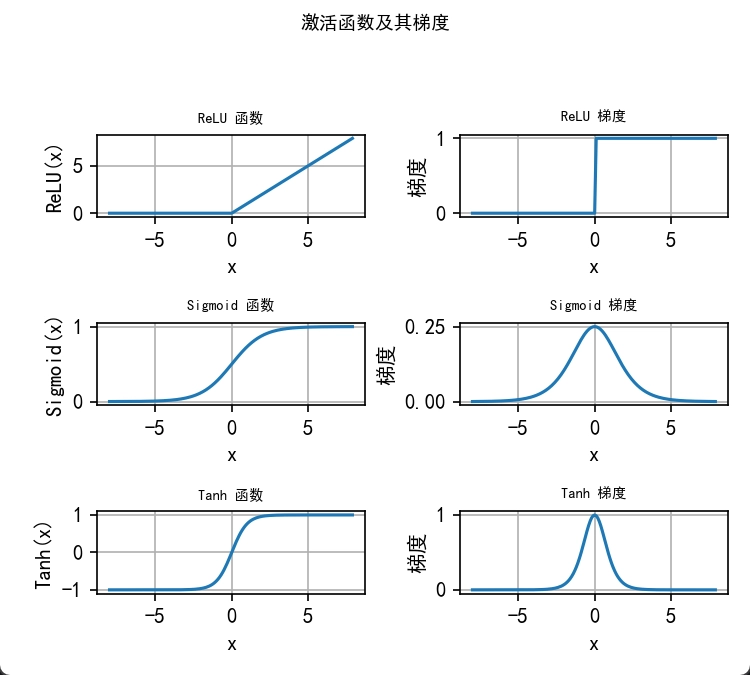

# 激活函数技术文档

## 1. 激活函数概述

激活函数是神经网络中的重要组成部分，用于引入非线性特性，使神经网络能够学习复杂的模式。激活函数应用于神经元的输入，产生输出信号。

## 2. 常用激活函数



### 2.1 Sigmoid函数

**数学表达式：**
$$f(x) = \frac{1}{1 + e^{-x}}$$

**定义域与值域：**
- 定义域：$(-\infty, +\infty)$
- 值域：$(0, 1)$

**优缺点：**
- **优点：** 输出范围在(0,1)之间，适合二分类问题
- **缺点：** 存在梯度消失问题，计算开销较大

**ECharts可视化：**

```js
// --echarts--

const option = {
  title: {
    text: 'Sigmoid函数',
    left: 'center'
  },
  tooltip: {
    trigger: 'axis',
    formatter: function(params) {
      return `x: ${params[0].value[0].toFixed(2)}<br/>y: ${params[0].value[1].toFixed(4)}`;
    }
  },
  xAxis: {
    type: 'value',
    name: 'x',
    min: -10,
    max: 10,
    interval: 2
  },
  yAxis: {
    type: 'value',
    name: 'f(x)',
    min: 0,
    max: 1,
    interval: 0.2
  },
  series: [{
    name: 'Sigmoid',
    type: 'line',
    smooth: true,
    data: (function() {
      const data = [];
      for (let x = -10; x <= 10; x += 0.1) {
        const y = 1 / (1 + Math.exp(-x));
        data.push([x, y]);
      }
      return data;
    })(),
    lineStyle: {
      color: '#5470c6',
      width: 2
    },
    symbol: 'none'
  }]
};

chart.setOption(option, true);
```

### 2.2 Tanh函数

**数学表达式：**
$$f(x) = \tanh(x) = \frac{e^x - e^{-x}}{e^x + e^{-x}}$$

**定义域与值域：**
- 定义域：$(-\infty, +\infty)$
- 值域：$(-1, 1)$

**优缺点：**
- **优点：** 输出范围在(-1,1)之间，零均值
- **缺点：** 同样存在梯度消失问题

**ECharts可视化：**

```js
// --echarts--

const option = {
  title: {
    text: 'Tanh函数',
    left: 'center'
  },
  tooltip: {
    trigger: 'axis',
    formatter: function(params) {
      return `x: ${params[0].value[0].toFixed(2)}<br/>y: ${params[0].value[1].toFixed(4)}`;
    }
  },
  xAxis: {
    type: 'value',
    name: 'x',
    min: -10,
    max: 10,
    interval: 2
  },
  yAxis: {
    type: 'value',
    name: 'f(x)',
    min: -1,
    max: 1,
    interval: 0.2
  },
  series: [{
    name: 'Tanh',
    type: 'line',
    smooth: true,
    data: (function() {
      const data = [];
      for (let x = -10; x <= 10; x += 0.1) {
        const y = Math.tanh(x);
        data.push([x, y]);
      }
      return data;
    })(),
    lineStyle: {
      color: '#91cc75',
      width: 2
    },
    symbol: 'none'
  }]
};

chart.setOption(option, true);
```

### 2.3 ReLU函数

**数学表达式：**
$$f(x) = \max(0, x)$$

**定义域与值域：**
- 定义域：$(-\infty, +\infty)$
- 值域：$[0, +\infty)$

**优缺点：**
- **优点：** 计算简单，缓解梯度消失问题
- **缺点：** 存在"死亡ReLU"问题，负输入时梯度为0

**ECharts可视化：**

```js
// --echarts--

const option = {
  title: {
    text: 'ReLU函数',
    left: 'center'
  },
  tooltip: {
    trigger: 'axis',
    formatter: function(params) {
      return `x: ${params[0].value[0].toFixed(2)}<br/>y: ${params[0].value[1].toFixed(4)}`;
    }
  },
  xAxis: {
    type: 'value',
    name: 'x',
    min: -10,
    max: 10,
    interval: 2
  },
  yAxis: {
    type: 'value',
    name: 'f(x)',
    min: 0,
    max: 10,
    interval: 2
  },
  series: [{
    name: 'ReLU',
    type: 'line',
    smooth: false,
    data: (function() {
      const data = [];
      for (let x = -10; x <= 10; x += 0.1) {
        const y = Math.max(0, x);
        data.push([x, y]);
      }
      return data;
    })(),
    lineStyle: {
      color: '#fac858',
      width: 2
    },
    symbol: 'none'
  }]
};

chart.setOption(option, true);
```

### 2.4 Leaky ReLU函数

**数学表达式：**
$$f(x) = \begin{cases} x, & x \geq 0 \\
\alpha x, & x < 0 \end{cases}$$
其中 $\alpha$ 通常取 0.01

**定义域与值域：**
- 定义域：$(-\infty, +\infty)$
- 值域：$(-\infty, +\infty)$

**优缺点：**
- **优点：** 解决了"死亡ReLU"问题，允许负输入有小的梯度
- **缺点：** 增加了一个超参数

**ECharts可视化：**

```js
// --echarts--

const option = {
  title: {
    text: 'Leaky ReLU函数',
    left: 'center'
  },
  tooltip: {
    trigger: 'axis',
    formatter: function(params) {
      return `x: ${params[0].value[0].toFixed(2)}<br/>y: ${params[0].value[1].toFixed(4)}`;
    }
  },
  xAxis: {
    type: 'value',
    name: 'x',
    min: -10,
    max: 10,
    interval: 2
  },
  yAxis: {
    type: 'value',
    name: 'f(x)',
    min: -1,
    max: 10,
    interval: 2
  },
  series: [{
    name: 'Leaky ReLU',
    type: 'line',
    smooth: false,
    data: (function() {
      const data = [];
      const alpha = 0.01;
      for (let x = -10; x <= 10; x += 0.1) {
        const y = x >= 0 ? x : alpha * x;
        data.push([x, y]);
      }
      return data;
    })(),
    lineStyle: {
      color: '#ee6666',
      width: 2
    },
    symbol: 'none'
  }]
};

chart.setOption(option, true);
```

### 2.5 ELU函数

**数学表达式：**
$$f(x) = \begin{cases} x, & x \geq 0 \\
\alpha (e^x - 1), & x < 0 \end{cases}$$
其中 $\alpha$ 通常取 1

**定义域与值域：**
- 定义域：$(-\infty, +\infty)$
- 值域：$(-\alpha, +\infty)$

**优缺点：**
- **优点：** 解决了"死亡ReLU"问题，输出均值接近0
- **缺点：** 计算开销较大

**ECharts可视化：**

```js
// --echarts--

const option = {
  title: {
    text: 'ELU函数',
    left: 'center'
  },
  tooltip: {
    trigger: 'axis',
    formatter: function(params) {
      return `x: ${params[0].value[0].toFixed(2)}<br/>y: ${params[0].value[1].toFixed(4)}`;
    }
  },
  xAxis: {
    type: 'value',
    name: 'x',
    min: -10,
    max: 10,
    interval: 2
  },
  yAxis: {
    type: 'value',
    name: 'f(x)',
    min: -1,
    max: 10,
    interval: 2
  },
  series: [{
    name: 'ELU',
    type: 'line',
    smooth: true,
    data: (function() {
      const data = [];
      const alpha = 1;
      for (let x = -10; x <= 10; x += 0.1) {
        const y = x >= 0 ? x : alpha * (Math.exp(x) - 1);
        data.push([x, y]);
      }
      return data;
    })(),
    lineStyle: {
      color: '#73c0de',
      width: 2
    },
    symbol: 'none'
  }]
};

chart.setOption(option, true);
```

### 2.6 GELU函数

**数学表达式：**
$$f(x) = x \cdot \Phi(x)$$
其中 $\Phi(x)$ 是标准正态分布的累积分布函数

**定义域与值域：**
- 定义域：$(-\infty, +\infty)$
- 值域：$(-\infty, +\infty)$

**优缺点：**
- **优点：** 在Transformer等模型中表现优异，平滑的非线性特性
- **缺点：** 计算开销较大

**ECharts可视化：**

```js
// --echarts--

const option = {
  title: {
    text: 'GELU函数',
    left: 'center'
  },
  tooltip: {
    trigger: 'axis',
    formatter: function(params) {
      return `x: ${params[0].value[0].toFixed(2)}<br/>y: ${params[0].value[1].toFixed(4)}`;
    }
  },
  xAxis: {
    type: 'value',
    name: 'x',
    min: -10,
    max: 10,
    interval: 2
  },
  yAxis: {
    type: 'value',
    name: 'f(x)',
    min: -3,
    max: 10,
    interval: 2
  },
  series: [{
    name: 'GELU',
    type: 'line',
    smooth: true,
    data: (function() {
      const data = [];
      // 近似计算GELU：0.5 * x * (1 + tanh(sqrt(2/π) * (x + 0.044715 * x^3)))
      for (let x = -10; x <= 10; x += 0.1) {
        const y = 0.5 * x * (1 + Math.tanh(Math.sqrt(2/Math.PI) * (x + 0.044715 * Math.pow(x, 3))));
        data.push([x, y]);
      }
      return data;
    })(),
    lineStyle: {
      color: '#3ba272',
      width: 2
    },
    symbol: 'none'
  }]
};

chart.setOption(option, true);
```

### 2.7 Softmax函数

**数学表达式：**
$$f(x_i) = \frac{e^{x_i}}{\sum_{j=1}^n e^{x_j}}$$

**定义域与值域：**
- 定义域：$\mathbb{R}^n$
- 值域：$(0, 1)^n$，且 $\sum_{i=1}^n f(x_i) = 1$

**优缺点：**
- **优点：** 适合多分类问题，输出概率分布
- **缺点：** 计算开销较大，对输入敏感

**ECharts可视化：**

```js
// --echarts--

const option = {
  title: {
    text: 'Softmax函数（示例：[1, 2, 3]）',
    left: 'center'
  },
  tooltip: {
    trigger: 'item',
    formatter: '{a} <br/>{b}: {c} ({d}%)'
  },
  legend: {
    orient: 'vertical',
    left: 'left',
    data: ['x1', 'x2', 'x3']
  },
  series: [
    {
      name: 'Softmax输出',
      type: 'pie',
      radius: '50%',
      data: (function() {
        const inputs = [1, 2, 3];
        const expInputs = inputs.map(x => Math.exp(x));
        const sumExp = expInputs.reduce((a, b) => a + b, 0);
        const softmaxOutputs = expInputs.map((exp, i) => ({
          value: exp / sumExp,
          name: `x${i+1}`
        }));
        return softmaxOutputs;
      })(),
      emphasis: {
        itemStyle: {
          shadowBlur: 10,
          shadowOffsetX: 0,
          shadowColor: 'rgba(0, 0, 0, 0.5)'
        }
      }
    }
  ]
};

chart.setOption(option, true);
```

## 3. 激活函数选择指南

| 激活函数 | 适用场景 | 不适用场景 |
|---------|---------|-----------|
| Sigmoid | 二分类问题输出层 | 深层网络（梯度消失） |
| Tanh | 循环神经网络 | 深层网络（梯度消失） |
| ReLU | 卷积神经网络、深层网络 | 负输入较多的场景 |
| Leaky ReLU | 解决死亡ReLU问题 | 需要精确控制负斜率的场景 |
| ELU | 深层网络 | 计算资源有限的场景 |
| GELU | Transformer模型 | 计算资源有限的场景 |
| Softmax | 多分类问题输出层 | 回归问题 |

## 4. 总结

激活函数是神经网络的重要组成部分，不同的激活函数具有不同的特性和适用场景。选择合适的激活函数对于模型的性能至关重要。在实际应用中，需要根据具体任务和模型架构选择最合适的激活函数。

### 4.1 关键考虑因素

1. **非线性特性**：确保模型能够学习复杂的模式
2. **梯度特性**：避免梯度消失或爆炸问题
3. **计算效率**：考虑训练速度和推理速度
4. **输出范围**：根据任务需求选择合适的输出范围
5. **实现简单性**：易于在不同框架中实现

### 4.2 未来发展

随着深度学习的发展，新的激活函数不断被提出，如SiLU、Swish等。这些新的激活函数在特定场景下可能表现更好，但ReLU及其变体仍然是最常用的激活函数之一。

在选择激活函数时，建议通过实验验证不同激活函数在具体任务上的表现，以找到最优选择。