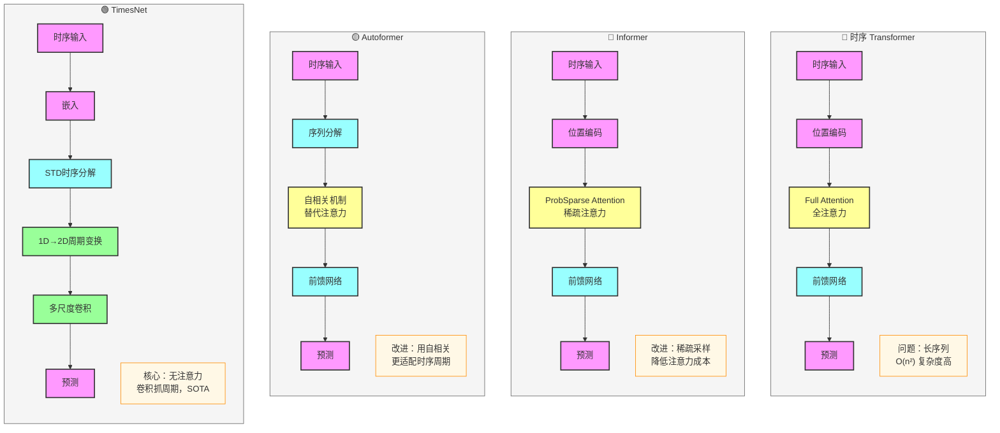

# 模型对比
## 四大时序模型架构对比

```mermaid
flowchart TB
    %% 统一样式
    classDef io fill:#f9f,stroke:#333,stroke-width:2px,rounded:6px
    classDef core fill:#9ff,stroke:#333,stroke-width:2px,rounded:6px
    classDef attn fill:#ff9,stroke:#333,stroke-width:2px,rounded:6px
    classDef conv fill:#9f9,stroke:#333,stroke-width:2px,rounded:6px
    classDef box fill:#f5f5f5,stroke:#666,stroke-width:1px,rounded:10px
    classDef tip fill:#fff8e6,stroke:#ff8c00,stroke-width:1px,rounded:8px

    %% 1. 时序 Transformer
    subgraph Tf ["🔹 时序 Transformer"]
        direction TB
        In1[时序输入]:::io --> PE1[位置编码]:::io
        PE1 --> Attn1[Full Attention\n全注意力]:::attn
        Attn1 --> FFN1[前馈网络]:::core
        FFN1 --> Out1[预测]:::io
        
        Note1["问题：长序列\nO(n²) 复杂度高"]:::tip
    end
    class Tf box

    %% 2. Informer
    subgraph If ["🔸 Informer"]
        direction TB
        In2[时序输入]:::io --> PE2[位置编码]:::io
        PE2 --> Attn2[ProbSparse Attention\n稀疏注意力]:::attn
        Attn2 --> FFN2[前馈网络]:::core
        FFN2 --> Out2[预测]:::io
        
        Note2["改进：稀疏采样\n降低注意力成本"]:::tip
    end
    class If box

    %% 3. Autoformer
    subgraph Af ["🟡 Autoformer"]
        direction TB
        In3[时序输入]:::io --> Decomp3[序列分解]:::core
        Decomp3 --> Autocor3[自相关机制\n替代注意力]:::attn
        Autocor3 --> FFN3[前馈网络]:::core
        FFN3 --> Out3[预测]:::io
        
        Note3["改进：用自相关\n更适配时序周期"]:::tip
    end
    class Af box

    %% 4. TimesNet
    subgraph Tn ["🟢 TimesNet"]
        direction TB
        In4[时序输入]:::io --> Embed4[嵌入]:::io
        Embed4 --> Decomp4[STD时序分解]:::core
        Decomp4 --> Transform[1D→2D周期变换]:::conv
        Transform --> MultiConv[多尺度卷积]:::conv
        MultiConv --> Out4[预测]:::io
        
        Note4["核心：无注意力\n卷积抓周期，SOTA"]:::tip
    end
    class Tn box
```
