**标准 Transformer 架构图**（NLP/时序SOTA模型，严格贴合论文核心：**自注意力机制、编码器-解码器结构、位置编码、多头注意力**），风格和你之前全套深度学习架构完全统一，可直接用于笔记/PPT。

# Transformer 完整架构流程图（基础版）

```mermaid
flowchart LR
    %% 统一样式（和TimesNet/YOLO/SimCLR风格一致）
    classDef inputStyle fill:#f9f,stroke:#333,stroke-width:2px,rounded:8px
    classDef embedStyle fill:#ffd700,stroke:#333,stroke-width:2px,rounded:8px
    classDef blockStyle fill:#9ff,stroke:#333,stroke-width:2px,rounded:8px
    classDef attnStyle fill:#9f9,stroke:#333,stroke-width:2px,rounded:8px
    classDef ffStyle fill:#ff9,stroke:#333,stroke-width:2px,rounded:8px
    classDef headStyle fill:#f2e6ff,stroke:#333,stroke-width:2px,rounded:8px
    classDef subgraphStyle fill:#f5f5f5,stroke:#666,stroke-width:1px,rounded:10px
    classDef coreNoteStyle fill:#fff8e6,stroke:#ffb74d,stroke-width:1px,rounded:8px

    %% 1. 输入层
    subgraph InputLayer["输入层"]
        A["源序列<br/>Source Sequence"]:::inputStyle
        B["目标序列<br/>Target Sequence"]:::inputStyle
    end
    class InputLayer subgraphStyle

    %% 2. 嵌入层
    subgraph EmbedLayer["嵌入层"]
        subgraph SourceEmbed["源序列嵌入"]
            C["Token Embedding<br/>词元嵌入"]:::embedStyle
            D["Positional Embedding<br/>位置编码"]:::embedStyle
            E["Embedding Sum<br/>特征融合"]:::embedStyle
        end
        class SourceEmbed subgraphStyle

        subgraph TargetEmbed["目标序列嵌入"]
            F["Token Embedding<br/>词元嵌入"]:::embedStyle
            G["Positional Embedding<br/>位置编码"]:::embedStyle
            H["Embedding Sum<br/>特征融合"]:::embedStyle
        end
        class TargetEmbed subgraphStyle
    end
    class EmbedLayer subgraphStyle

    %% 3. 编码器
    subgraph Encoder["编码器（N层编码器层堆叠）"]
        %% 单个编码器层
        subgraph EncoderLayer["编码器层"]
            I["多头自注意力<br/>Multi-Head Self-Attention"]:::attnStyle
            J["Add & Norm<br/>残差连接+层归一化"]:::blockStyle
            K["前馈网络<br/>Feed Forward Network"]:::ffStyle
            L["Add & Norm<br/>残差连接+层归一化"]:::blockStyle
        end
        class EncoderLayer subgraphStyle
    end
    class Encoder subgraphStyle

    %% 4. 解码器
    subgraph Decoder["解码器（N层解码器层堆叠）"]
        %% 单个解码器层
        subgraph DecoderLayer["解码器层"]
            M["掩码多头自注意力<br/>Masked Multi-Head Self-Attention"]:::attnStyle
            N["Add & Norm<br/>残差连接+层归一化"]:::blockStyle
            O["多头交叉注意力<br/>Multi-Head Cross-Attention"]:::attnStyle
            P["Add & Norm<br/>残差连接+层归一化"]:::blockStyle
            Q["前馈网络<br/>Feed Forward Network"]:::ffStyle
            R["Add & Norm<br/>残差连接+层归一化"]:::blockStyle
        end
        class DecoderLayer subgraphStyle
    end
    class Decoder subgraphStyle

    %% 5. 输出层
    subgraph OutputLayer["输出层"]
        S["线性层<br/>Linear Layer"]:::headStyle
        T["Softmax<br/>概率分布"]:::headStyle
        U["预测结果<br/>Prediction Output"]:::inputStyle
    end
    class OutputLayer subgraphStyle

    %% 核心注释（Transformer创新点）
    Note["Transformer 核心创新：<br/>1. 自注意力机制捕获全局依赖<br/>2. 编码器-解码器结构<br/>3. 位置编码保留序列顺序<br/>4. 多头注意力学习多维度特征<br/>5. 并行计算提高训练速度"]:::coreNoteStyle

    %% 数据流（修正后的）
    A --> C --> E
    A --> D --> E
    B --> F --> H
    B --> G --> H

    E --> I --> J --> K --> L
    L --> O
    H --> M --> N --> O --> P --> Q --> R
    R --> S --> T --> U

    %% 连接线样式
    linkStyle 0,1,2,3 stroke:#ff7043,stroke-width:1.5px
    linkStyle 4,5,6,7,8,9 stroke:#4299e1,stroke-width:2px
    linkStyle 10,11,12,13,14,15 stroke:#9c27b0,stroke-width:2px

    %% 可选：将注释节点定位到合适位置（提升可读性）
    Note -.-> Encoder
```

---

# Transformer 极简核心总结

1. **定位**：**序列到序列** SOTA 模型，解决长距离依赖建模难题
2. **核心Backbone**：**编码器-解码器**结构，每层包含自注意力和前馈网络
3. **最大创新**
    - **自注意力机制**：直接计算序列中任意两个位置的依赖关系
    - **位置编码**：显式注入序列位置信息
    - **多头注意力**：并行学习多维度特征表示
    - **并行计算**：摆脱RNN的顺序计算限制
4. **结构范式**
输入 → 嵌入+位置编码 → 编码器（自注意力+前馈）→ 解码器（掩码自注意力+交叉注意力+前馈）→ 线性层+Softmax → 输出

