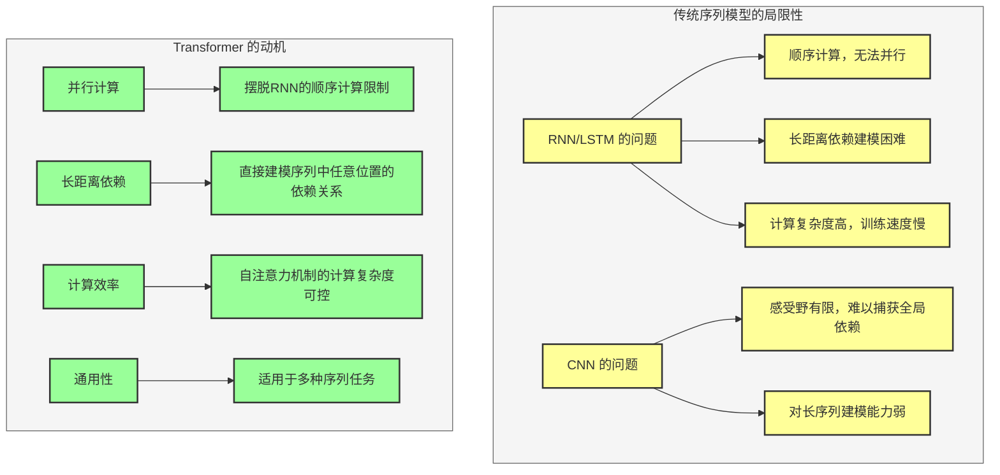
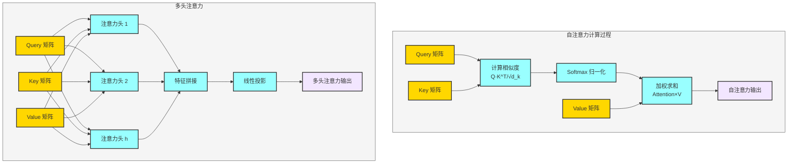
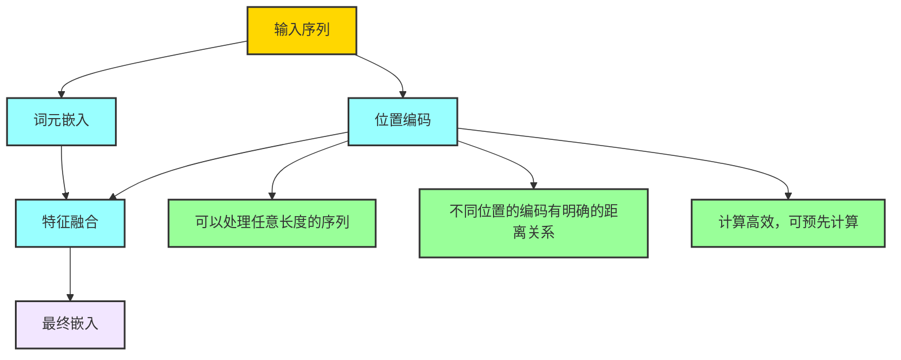
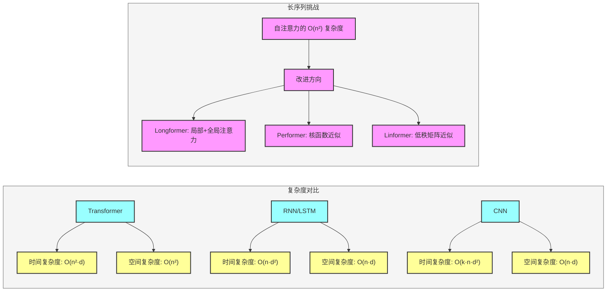

## 一、为什么需要 Transformer？

### 1. 传统序列模型的局限性
- **RNN/LSTM 的问题**：
  - 顺序计算，无法并行
  - 长距离依赖建模困难（梯度消失/爆炸）
  - 计算复杂度高，训练速度慢
- **CNN 的问题**：
  - 感受野有限，难以捕获全局依赖
  - 对长序列建模能力弱

### 2. Transformer 的动机
- **并行计算**：摆脱RNN的顺序计算限制
- **长距离依赖**：直接建模序列中任意位置的依赖关系
- **计算效率**：自注意力机制的计算复杂度可控
- **通用性**：适用于多种序列任务

---

## 二、自注意力机制的理论基础

### 1. 注意力机制的本质
注意力机制是一种资源分配机制，通过计算查询（Query）与键（Key）的相似度，为每个值（Value）分配不同的权重。

### 2. 自注意力的数学表达式

$$
\text{Attention}(Q, K, V) = \text{softmax}\left(\frac{QK^T}{\sqrt{d_k}}\right)V
$$

其中：
- $Q$：查询矩阵（Query）
- $K$：键矩阵（Key）
- $V$：值矩阵（Value）
- $d_k$：键的维度，用于缩放，避免梯度消失

### 3. 多头注意力的优势
多头注意力通过多个并行的注意力头，学习不同子空间的特征表示：

$$
\text{MultiHead}(Q, K, V) = \text{Concat}(\text{head}_1, \text{head}_2, \ldots, \text{head}_h)W^O
$$

其中：
$$
\text{head}_i = \text{Attention}(QW_i^Q, KW_i^K, VW_i^V)
$$

---

## 三、位置编码的理论基础

### 1. 为什么需要位置编码？
自注意力机制本身是位置无关的，无法感知序列的顺序信息，因此需要显式注入位置信息。

### 2. 正弦余弦位置编码

$$
PE_{(pos, 2i)} = \sin\left(pos / 10000^{2i/d_{model}}\right)
$$
$$
PE_{(pos, 2i+1)} = \cos\left(pos / 10000^{2i/d_{model}}\right)
$$

其中：
- $pos$：位置索引
- $i$：维度索引
- $d_{model}$：模型维度

### 3. 位置编码的优势
- 可以处理任意长度的序列
- 不同位置的编码有明确的距离关系
- 计算高效，可预先计算

---

## 四、Transformer 的数学原理

```mermaid
flowchart TD
    %% 统一样式（和TimesNet/YOLO/SimCLR风格一致）
    classDef blockStyle fill:#9ff,stroke:#333,stroke-width:2px,rounded:8px
    classDef inputStyle fill:#ffd700,stroke:#333,stroke-width:2px,rounded:8px
    classDef outputStyle fill:#f2e6ff,stroke:#333,stroke-width:2px,rounded:8px
    classDef stepStyle fill:#ff9,stroke:#333,stroke-width:2px,rounded:8px
    classDef subgraphStyle fill:#f5f5f5,stroke:#666,stroke-width:1px,rounded:10px
    
    subgraph EncoderDecoder["编码器-解码器结构"]
        Input["输入序列"]:::inputStyle
        Encoder["编码器"]:::blockStyle
        Decoder["解码器"]:::blockStyle
        Output["输出序列"]:::outputStyle
        
        Encoder --> Decoder
        Input --> Encoder
        Decoder --> Output
    end
    class EncoderDecoder subgraphStyle
    
    subgraph FFN["前馈网络"]
        X["输入 x"]:::inputStyle
        Linear1["线性变换 1<br/>xW1 + b1"]:::stepStyle
        ReLU["ReLU激活<br/>max(0, x)"]:::stepStyle  
        Linear2["线性变换 2<br/>xW2 + b2"]:::stepStyle
        FFNOutput["输出 FFN(x)"]:::outputStyle
        
        X --> Linear1 --> ReLU --> Linear2 --> FFNOutput
    end
    class FFN subgraphStyle
    
    subgraph LayerNorm["层归一化"]
        LNInput["输入 x"]:::inputStyle
        Mean["计算均值 μ"]:::stepStyle
        Std["计算标准差 σ"]:::stepStyle
        Normalize["归一化<br/>(x-μ)/√(σ²+ε)"]:::stepStyle  
        Scale["缩放 γ"]:::stepStyle
        Shift["平移 β"]:::stepStyle
        LNOutput["输出 LN(x)"]:::outputStyle
        
        LNInput --> Mean
        LNInput --> Std
        Mean --> Normalize
        Std --> Normalize
        Normalize --> Scale --> Shift --> LNOutput
    end
    class LayerNorm subgraphStyle
```

### 1. 编码器-解码器结构
- **编码器**：将输入序列编码为连续的表示
- **解码器**：基于编码器的输出和已生成的序列，生成下一个 token

### 2. 前馈网络
前馈网络由两层线性变换和ReLU激活函数组成：

$$
FFN(x) = \max(0, xW_1 + b_1)W_2 + b_2
$$

### 3. 层归一化
层归一化用于稳定训练过程：

$$
LN(x) = \gamma \cdot \frac{x - \mu}{\sqrt{\sigma^2 + \epsilon}} + \beta
$$

---

## 五、Transformer 的计算复杂度

### 1. 自注意力的复杂度
- 时间复杂度：$O(n^2 \cdot d)$，其中 $n$ 是序列长度，$d$ 是模型维度
- 空间复杂度：$O(n^2)$

### 2. 与其他模型的对比
- RNN：时间复杂度 $O(n \cdot d^2)$，空间复杂度 $O(n \cdot d)$
- CNN：时间复杂度 $O(k \cdot n \cdot d^2)$，空间复杂度 $O(n \cdot d)$（$k$ 是卷积核大小）

### 3. 长序列的挑战
自注意力的 $O(n^2)$ 复杂度限制了其处理超长序列的能力，这也是后续模型（如 Longformer、Performer 等）的改进方向。