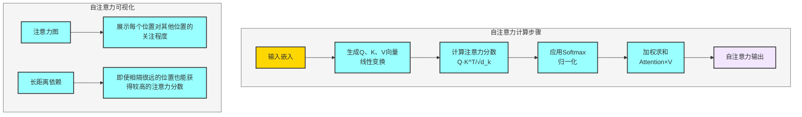
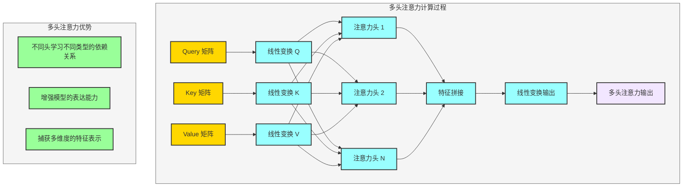
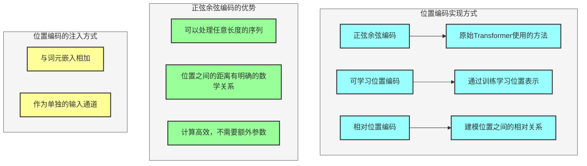
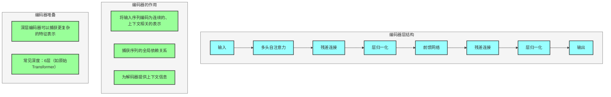
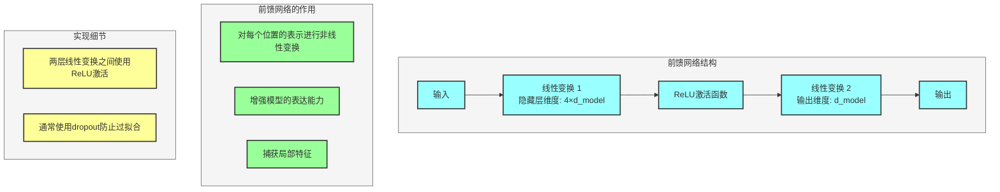
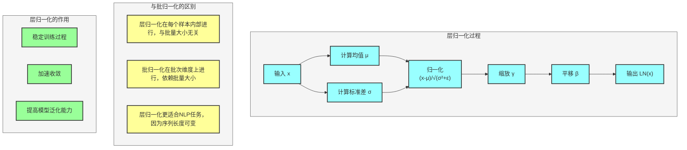
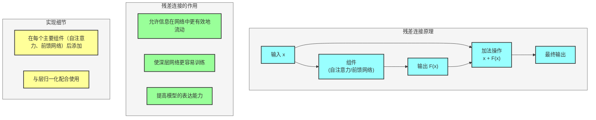

## 一、自注意力机制详解

### 1. 基本原理
自注意力机制通过计算序列中每个位置与其他所有位置的关联程度，为每个位置生成一个加权表示。

### 2. 计算步骤
1. **生成查询、键、值向量**：通过线性变换将输入嵌入转换为Q、K、V
2. **计算注意力分数**：Q与K的点积，除以根号d_k进行缩放
3. **应用softmax**：将注意力分数归一化
4. **加权求和**：用归一化的注意力分数对V进行加权求和

### 3. 自注意力的可视化
- **注意力图**：展示序列中每个位置对其他位置的关注程度
- **长距离依赖**：即使相隔很远的位置也能获得较高的注意力分数

---

## 二、多头注意力机制

### 1. 为什么需要多头注意力？
- 不同头可以学习不同类型的依赖关系
- 增强模型的表达能力
- 捕获多维度的特征表示

### 2. 实现细节
- 将Q、K、V分别通过不同的线性变换投影到不同的子空间
- 每个头独立计算自注意力
- 将所有头的输出拼接后通过线性变换得到最终结果

### 3. 头数的选择
- 常见配置：8头（如原始Transformer）
- 头数过多会增加计算复杂度
- 头数过少会降低模型表达能力

---

## 三、位置编码

### 1. 实现方式
- **正弦余弦编码**：原始Transformer使用的方法
- **可学习位置编码**：通过训练学习位置表示
- **相对位置编码**：建模位置之间的相对关系

### 2. 正弦余弦编码的优势
- 可以处理任意长度的序列
- 位置之间的距离有明确的数学关系
- 计算高效，不需要额外参数

### 3. 位置编码的注入方式
- 与词元嵌入相加
- 作为单独的输入通道

---

## 四、编码器详解

### 1. 编码器层结构
- **多头自注意力**：捕获输入序列内部的依赖关系
- **残差连接**：缓解梯度消失问题
- **层归一化**：稳定训练过程
- **前馈网络**：对每个位置进行非线性变换

### 2. 编码器的作用
- 将输入序列编码为连续的、上下文相关的表示
- 捕获序列的全局依赖关系
- 为解码器提供上下文信息

### 3. 编码器堆叠
- 深层编码器可以捕获更复杂的特征表示
- 常见深度：6层（如原始Transformer）

---

## 五、解码器详解

```mermaid
flowchart TD
    %% 统一样式（和TimesNet/YOLO/SimCLR风格一致）
    classDef componentStyle fill:#9ff,stroke:#333,stroke-width:2px,rounded:8px
    classDef functionStyle fill:#9f9,stroke:#333,stroke-width:2px,rounded:8px
    classDef subgraphStyle fill:#f5f5f5,stroke:#666,stroke-width:1px,rounded:10px
    
    subgraph DecoderLayerStructure["解码器层结构"]
        Input[输入]:::componentStyle
        MaskedAttention[掩码多头自注意力]:::componentStyle
        Residual1[残差连接]:::componentStyle
        LayerNorm1[层归一化]:::componentStyle
        CrossAttention[多头交叉注意力]:::componentStyle
        Residual2[残差连接]:::componentStyle
        LayerNorm2[层归一化]:::componentStyle
        FFN[前馈网络]:::componentStyle
        Residual3[残差连接]:::componentStyle
        LayerNorm3[层归一化]:::componentStyle
        Output[输出]:::componentStyle
    end
    class DecoderLayerStructure subgraphStyle
    
    subgraph DecoderFunctions["解码器的作用"]
        F1[基于编码器的输出和已生成的序列，自回归地生成下一个token]:::functionStyle
        F2[确保生成的序列符合语言规律]:::functionStyle
        F3[处理输出序列的依赖关系]:::functionStyle
    end
    class DecoderFunctions subgraphStyle
    
    subgraph DecoderStacking["解码器堆叠"]
        Stack1[深层解码器可以生成更连贯、更准确的序列]:::functionStyle
        Stack2[常见深度：6层（如原始Transformer）]:::functionStyle
    end
    class DecoderStacking subgraphStyle
    
    Input --> MaskedAttention --> Residual1 --> LayerNorm1 --> CrossAttention --> Residual2 --> LayerNorm2 --> FFN --> Residual3 --> LayerNorm3 --> Output
```

### 1. 解码器层结构
- **掩码多头自注意力**：防止看到未来信息，保证自回归生成
- **多头交叉注意力**：关注编码器的输出，获取上下文信息
- **残差连接**：缓解梯度消失问题
- **层归一化**：稳定训练过程
- **前馈网络**：对每个位置进行非线性变换

### 2. 解码器的作用
- 基于编码器的输出和已生成的序列，自回归地生成下一个token
- 确保生成的序列符合语言规律
- 处理输出序列的依赖关系

### 3. 解码器堆叠
- 深层解码器可以生成更连贯、更准确的序列
- 常见深度：6层（如原始Transformer）

---

## 六、前馈网络

### 1. 结构
- 两层线性变换
- ReLU激活函数
- 隐藏层维度通常是模型维度的4倍

### 2. 作用
- 对每个位置的表示进行非线性变换
- 增强模型的表达能力
- 捕获局部特征

### 3. 实现细节
- 两层线性变换之间使用ReLU激活
- 通常使用dropout防止过拟合

---

## 七、层归一化

### 1. 原理
- 对每个样本的每个特征维度进行归一化
- 计算均值和方差，然后缩放和平移

### 2. 与批归一化的区别
- 层归一化在每个样本内部进行，与批量大小无关
- 批归一化在批次维度上进行，依赖批量大小
- 层归一化更适合NLP任务，因为序列长度可变

### 3. 作用
- 稳定训练过程
- 加速收敛
- 提高模型泛化能力

---

## 八、残差连接

### 1. 原理
- 将输入直接加到输出上
- 形成跳跃连接，缓解梯度消失问题

### 2. 作用
- 允许信息在网络中更有效地流动
- 使深层网络更容易训练
- 提高模型的表达能力

### 3. 实现细节
- 在每个主要组件（自注意力、前馈网络）后添加
- 与层归一化配合使用