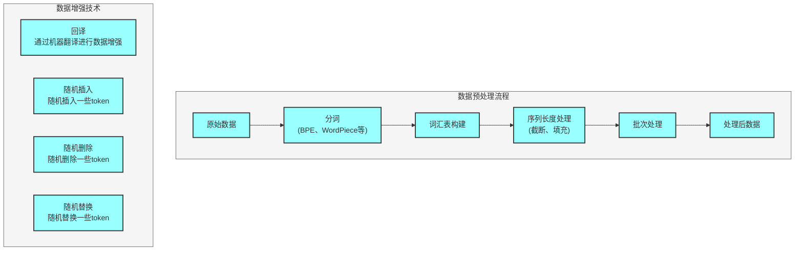
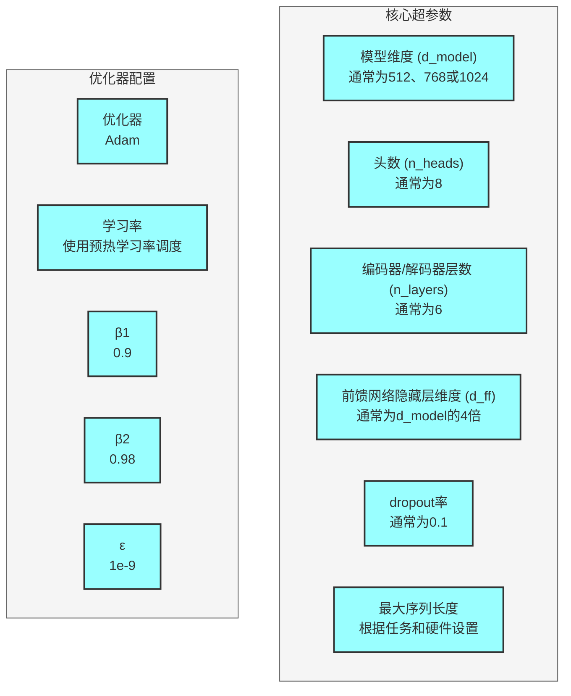
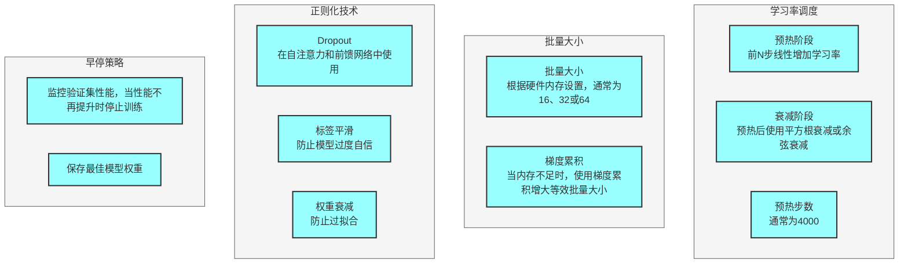
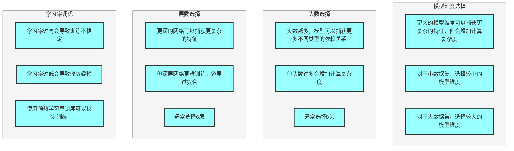
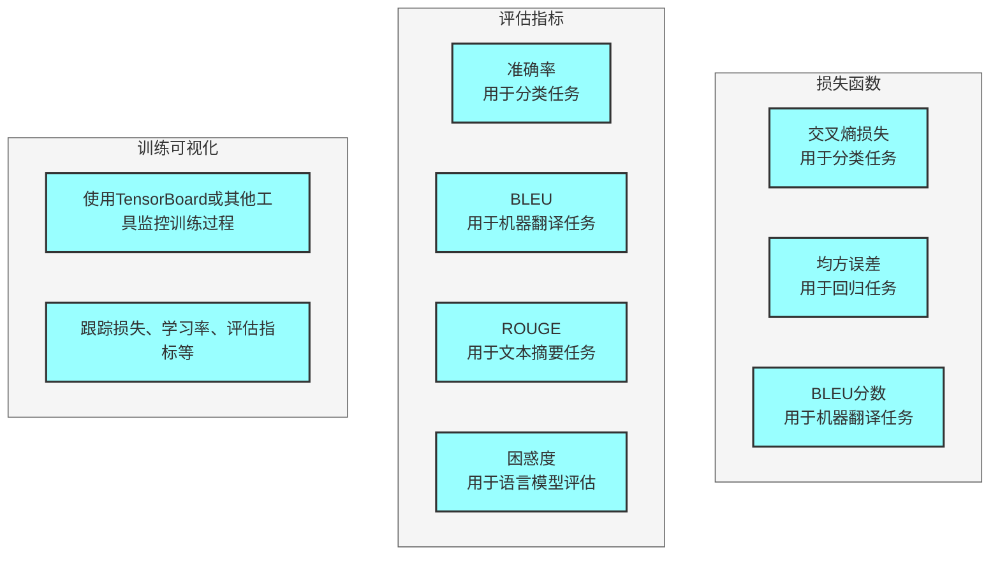
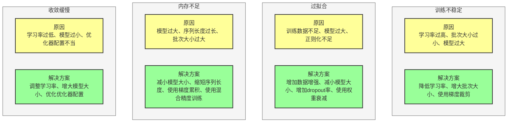
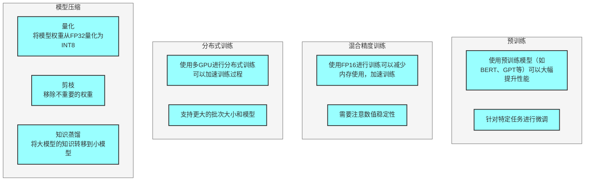

## 一、数据准备



### 1. 数据预处理
- **分词**：使用合适的分词器（如BPE、WordPiece等）
- **词汇表构建**：根据训练数据构建词汇表
- **序列长度处理**：设置最大序列长度，对长序列进行截断，短序列进行填充
- **批次处理**：构建批次，确保批次内序列长度一致

### 2. 数据增强
- **回译**：通过机器翻译进行数据增强
- **随机插入**：随机插入一些token
- **随机删除**：随机删除一些token
- **随机替换**：随机替换一些token

---

## 二、模型配置



### 1. 核心超参数
- **模型维度 (d_model)**：通常为512、768或1024
- **头数 (n_heads)**：通常为8
- **编码器/解码器层数 (n_layers)**：通常为6
- **前馈网络隐藏层维度 (d_ff)**：通常为d_model的4倍
- **dropout率**：通常为0.1
- **最大序列长度**：根据任务和硬件设置

### 2. 优化器配置
- **优化器**：Adam
- **学习率**：使用预热学习率调度
- **β1**：0.9
- **β2**：0.98
- **ε**：1e-9

---

## 三、训练策略



### 1. 学习率调度
- **预热阶段**：前N步线性增加学习率
- **衰减阶段**：预热后使用平方根衰减或余弦衰减
- **预热步数**：通常为4000

### 2. 批量大小
- **批量大小**：根据硬件内存设置，通常为16、32或64
- **梯度累积**：当内存不足时，使用梯度累积增大等效批量大小

### 3. 正则化技术
- **Dropout**：在自注意力和前馈网络中使用
- **标签平滑**：防止模型过度自信
- **权重衰减**：防止过拟合

### 4. 早停策略
- 监控验证集性能，当性能不再提升时停止训练
- 保存最佳模型权重

---

## 四、调参技巧



### 1. 模型维度选择
- 更大的模型维度可以捕获更复杂的特征，但会增加计算复杂度
- 对于小数据集，选择较小的模型维度
- 对于大数据集，选择较大的模型维度

### 2. 头数选择
- 头数越多，模型可以捕获更多不同类型的依赖关系
- 但头数过多会增加计算复杂度
- 通常选择8头

### 3. 层数选择
- 更深的网络可以捕获更复杂的特征
- 但深层网络更难训练，容易过拟合
- 通常选择6层

### 4. 学习率调优
- 学习率过高会导致训练不稳定
- 学习率过低会导致收敛缓慢
- 使用预热学习率调度可以稳定训练

---

## 五、训练监控



### 1. 损失函数
- **交叉熵损失**：用于分类任务
- **均方误差**：用于回归任务
- **BLEU分数**：用于机器翻译任务

### 2. 评估指标
- **准确率**：用于分类任务
- **BLEU**：用于机器翻译任务
- **ROUGE**：用于文本摘要任务
- **困惑度**：用于语言模型评估

### 3. 训练可视化
- 使用TensorBoard或其他工具监控训练过程
- 跟踪损失、学习率、评估指标等

---

## 六、常见问题与解决方案



### 1. 训练不稳定
- **原因**：学习率过高、批次大小过小、模型过大
- **解决方案**：降低学习率、增大批次大小、使用梯度裁剪

### 2. 过拟合
- **原因**：训练数据不足、模型过大、正则化不足
- **解决方案**：增加数据增强、减小模型大小、增加dropout率、使用权重衰减

### 3. 内存不足
- **原因**：模型过大、序列长度过长、批次大小过大
- **解决方案**：减小模型大小、缩短序列长度、使用梯度累积、使用混合精度训练

### 4. 收敛缓慢
- **原因**：学习率过低、模型过小、优化器配置不当
- **解决方案**：调整学习率、增大模型大小、优化优化器配置

---

## 七、最佳实践



### 1. 预训练
- 使用预训练模型（如BERT、GPT等）可以大幅提升性能
- 针对特定任务进行微调

### 2. 混合精度训练
- 使用FP16进行训练可以减少内存使用，加速训练
- 需要注意数值稳定性

### 3. 分布式训练
- 使用多GPU进行分布式训练可以加速训练过程
- 支持更大的批次大小和模型

### 4. 模型压缩
- **量化**：将模型权重从FP32量化为INT8
- **剪枝**：移除不重要的权重
- **知识蒸馏**：将大模型的知识转移到小模型

---

## 八、训练示例代码

```python
# 伪代码示例
def train_transformer(model, train_dataloader, val_dataloader, optimizer, scheduler, epochs):
    best_val_loss = float('inf')
    
    for epoch in range(epochs):
        # 训练阶段
        model.train()
        train_loss = 0
        
        for batch in train_dataloader:
            # 前向传播
            outputs = model(batch['src'], batch['tgt'])
            loss = compute_loss(outputs, batch['tgt_labels'])
            
            # 反向传播
            optimizer.zero_grad()
            loss.backward()
            
            # 梯度裁剪
            torch.nn.utils.clip_grad_norm_(model.parameters(), max_norm=1.0)
            
            # 更新参数
            optimizer.step()
            scheduler.step()
            
            train_loss += loss.item()
        
        # 验证阶段
        model.eval()
        val_loss = 0
        
        with torch.no_grad():
            for batch in val_dataloader:
                outputs = model(batch['src'], batch['tgt'])
                loss = compute_loss(outputs, batch['tgt_labels'])
                val_loss += loss.item()
        
        # 打印结果
        print(f'Epoch {epoch+1}, Train Loss: {train_loss/len(train_dataloader)}, Val Loss: {val_loss/len(val_dataloader)}')
        
        # 保存最佳模型
        if val_loss < best_val_loss:
            best_val_loss = val_loss
            torch.save(model.state_dict(), 'best_model.pt')
    
    return model
```