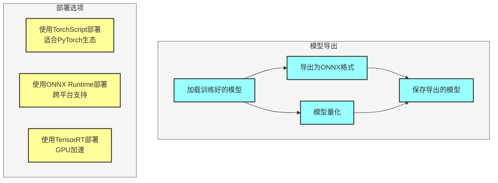

## 一、核心代码实现

### 1. 自注意力机制实现

```python
import torch
import torch.nn as nn
import math

class ScaledDotProductAttention(nn.Module):
    def __init__(self, dropout=0.1):
        super(ScaledDotProductAttention, self).__init__()
        self.dropout = nn.Dropout(dropout)
    
    def forward(self, q, k, v, mask=None):
        # q: [batch_size, n_heads, seq_len_q, d_k]
        # k: [batch_size, n_heads, seq_len_k, d_k]
        # v: [batch_size, n_heads, seq_len_v, d_v]
        # mask: [batch_size, 1, seq_len_q, seq_len_k]
        
        d_k = q.size(-1)
        attention_scores = torch.matmul(q, k.transpose(-2, -1)) / math.sqrt(d_k)
        
        if mask is not None:
            attention_scores = attention_scores.masked_fill(mask == 0, -1e9)
        
        attention_weights = nn.functional.softmax(attention_scores, dim=-1)
        attention_weights = self.dropout(attention_weights)
        
        output = torch.matmul(attention_weights, v)
        
        return output, attention_weights

class MultiHeadAttention(nn.Module):
    def __init__(self, d_model, n_heads, dropout=0.1):
        super(MultiHeadAttention, self).__init__()
        assert d_model % n_heads == 0
        
        self.d_model = d_model
        self.n_heads = n_heads
        self.d_k = d_model // n_heads
        
        self.wq = nn.Linear(d_model, d_model)
        self.wk = nn.Linear(d_model, d_model)
        self.wv = nn.Linear(d_model, d_model)
        self.wo = nn.Linear(d_model, d_model)
        
        self.attention = ScaledDotProductAttention(dropout)
        self.dropout = nn.Dropout(dropout)
        self.layer_norm = nn.LayerNorm(d_model)
    
    def forward(self, q, k, v, mask=None):
        # q: [batch_size, seq_len_q, d_model]
        # k: [batch_size, seq_len_k, d_model]
        # v: [batch_size, seq_len_v, d_model]
        # mask: [batch_size, seq_len_q, seq_len_k]
        
        batch_size = q.size(0)
        residual = q
        
        # 线性变换并分多头
        q = self.wq(q).view(batch_size, -1, self.n_heads, self.d_k).transpose(1, 2)
        k = self.wk(k).view(batch_size, -1, self.n_heads, self.d_k).transpose(1, 2)
        v = self.wv(v).view(batch_size, -1, self.n_heads, self.d_k).transpose(1, 2)
        
        if mask is not None:
            mask = mask.unsqueeze(1)
        
        # 计算注意力
        output, attention_weights = self.attention(q, k, v, mask)
        
        # 合并多头
        output = output.transpose(1, 2).contiguous().view(batch_size, -1, self.d_model)
        output = self.wo(output)
        output = self.dropout(output)
        output = self.layer_norm(output + residual)
        
        return output, attention_weights
```

### 2. 位置编码实现

```python
class PositionalEncoding(nn.Module):
    def __init__(self, d_model, max_seq_len=5000):
        super(PositionalEncoding, self).__init__()
        
        pe = torch.zeros(max_seq_len, d_model)
        position = torch.arange(0, max_seq_len, dtype=torch.float).unsqueeze(1)
        div_term = torch.exp(torch.arange(0, d_model, 2).float() * (-math.log(10000.0) / d_model))
        
        pe[:, 0::2] = torch.sin(position * div_term)
        pe[:, 1::2] = torch.cos(position * div_term)
        
        pe = pe.unsqueeze(0)
        self.register_buffer('pe', pe)
    
    def forward(self, x):
        # x: [batch_size, seq_len, d_model]
        x = x + self.pe[:, :x.size(1), :]
        return x
```

### 3. 前馈网络实现

```python
class FeedForwardNetwork(nn.Module):
    def __init__(self, d_model, d_ff, dropout=0.1):
        super(FeedForwardNetwork, self).__init__()
        self.fc1 = nn.Linear(d_model, d_ff)
        self.fc2 = nn.Linear(d_ff, d_model)
        self.dropout = nn.Dropout(dropout)
        self.layer_norm = nn.LayerNorm(d_model)
    
    def forward(self, x):
        # x: [batch_size, seq_len, d_model]
        residual = x
        output = self.fc1(x)
        output = nn.functional.relu(output)
        output = self.dropout(output)
        output = self.fc2(output)
        output = self.dropout(output)
        output = self.layer_norm(output + residual)
        return output
```

### 4. 编码器层实现

```python
class EncoderLayer(nn.Module):
    def __init__(self, d_model, n_heads, d_ff, dropout=0.1):
        super(EncoderLayer, self).__init__()
        self.self_attention = MultiHeadAttention(d_model, n_heads, dropout)
        self.ffn = FeedForwardNetwork(d_model, d_ff, dropout)
    
    def forward(self, x, mask=None):
        # x: [batch_size, seq_len, d_model]
        # mask: [batch_size, seq_len, seq_len]
        output, _ = self.self_attention(x, x, x, mask)
        output = self.ffn(output)
        return output
```

### 5. 解码器层实现

```python
class DecoderLayer(nn.Module):
    def __init__(self, d_model, n_heads, d_ff, dropout=0.1):
        super(DecoderLayer, self).__init__()
        self.masked_self_attention = MultiHeadAttention(d_model, n_heads, dropout)
        self.cross_attention = MultiHeadAttention(d_model, n_heads, dropout)
        self.ffn = FeedForwardNetwork(d_model, d_ff, dropout)
    
    def forward(self, x, enc_output, src_mask=None, tgt_mask=None):
        # x: [batch_size, tgt_seq_len, d_model]
        # enc_output: [batch_size, src_seq_len, d_model]
        # src_mask: [batch_size, 1, src_seq_len]
        # tgt_mask: [batch_size, tgt_seq_len, tgt_seq_len]
        
        output, _ = self.masked_self_attention(x, x, x, tgt_mask)
        output, _ = self.cross_attention(output, enc_output, enc_output, src_mask)
        output = self.ffn(output)
        return output
```

### 6. 完整Transformer实现

```python
class Transformer(nn.Module):
    def __init__(self, src_vocab_size, tgt_vocab_size, d_model, n_heads, n_layers, d_ff, max_seq_len, dropout=0.1):
        super(Transformer, self).__init__()
        
        self.encoder_embedding = nn.Embedding(src_vocab_size, d_model)
        self.decoder_embedding = nn.Embedding(tgt_vocab_size, d_model)
        self.positional_encoding = PositionalEncoding(d_model, max_seq_len)
        
        self.encoder_layers = nn.ModuleList([
            EncoderLayer(d_model, n_heads, d_ff, dropout) for _ in range(n_layers)
        ])
        
        self.decoder_layers = nn.ModuleList([
            DecoderLayer(d_model, n_heads, d_ff, dropout) for _ in range(n_layers)
        ])
        
        self.fc = nn.Linear(d_model, tgt_vocab_size)
        self.dropout = nn.Dropout(dropout)
    
    def forward(self, src, tgt, src_mask=None, tgt_mask=None):
        # src: [batch_size, src_seq_len]
        # tgt: [batch_size, tgt_seq_len]
        
        src_emb = self.dropout(self.positional_encoding(self.encoder_embedding(src)))
        tgt_emb = self.dropout(self.positional_encoding(self.decoder_embedding(tgt)))
        
        enc_output = src_emb
        for layer in self.encoder_layers:
            enc_output = layer(enc_output, src_mask)
        
        dec_output = tgt_emb
        for layer in self.decoder_layers:
            dec_output = layer(dec_output, enc_output, src_mask, tgt_mask)
        
        output = self.fc(dec_output)
        return output
```

---

## 二、模型部署



### 1. 模型导出

#### PyTorch模型导出为ONNX

```python
import torch

# 加载模型
model = Transformer(src_vocab_size, tgt_vocab_size, d_model, n_heads, n_layers, d_ff, max_seq_len)
model.load_state_dict(torch.load('best_model.pt'))
model.eval()

# 创建示例输入
src = torch.randint(0, src_vocab_size, (1, max_seq_len))
tgt = torch.randint(0, tgt_vocab_size, (1, max_seq_len))

# 导出为ONNX
torch.onnx.export(
    model,
    (src, tgt),
    'transformer.onnx',
    input_names=['src', 'tgt'],
    output_names=['output'],
    dynamic_axes={
        'src': {0: 'batch_size', 1: 'seq_len'},
        'tgt': {0: 'batch_size', 1: 'seq_len'},
        'output': {0: 'batch_size', 1: 'seq_len'}
    }
)
```

#### 模型量化

```python
# 动态量化
quantized_model = torch.quantization.quantize_dynamic(
    model,
    {nn.Linear},  # 指定要量化的层
    dtype=torch.qint8  # 量化类型
)

# 保存量化模型
torch.jit.save(torch.jit.script(quantized_model), 'quantized_transformer.pt')
```

### 2. 部署选项

#### 使用TorchScript部署

```python
# 导出为TorchScript
scripted_model = torch.jit.script(model)
torch.jit.save(scripted_model, 'transformer_scripted.pt')

# 加载TorchScript模型
loaded_model = torch.jit.load('transformer_scripted.pt')
loaded_model.eval()

# 推理
with torch.no_grad():
    output = loaded_model(src, tgt)
```

#### 使用ONNX Runtime部署

```python
import onnxruntime as ort

# 加载ONNX模型
session = ort.InferenceSession('transformer.onnx')

# 准备输入
input_ids = src.numpy()
tgt_ids = tgt.numpy()

# 推理
outputs = session.run(
    ['output'],
    {
        'src': input_ids,
        'tgt': tgt_ids
    }
)
```

#### 使用TensorRT部署

```python
import tensorrt as trt
import numpy as np

# 加载ONNX模型并转换为TensorRT引擎
builder = trt.Builder(trt.Logger(trt.Logger.WARNING))
network = builder.create_network(1 << int(trt.NetworkDefinitionCreationFlag.EXPLICIT_BATCH))
parser = trt.OnnxParser(network, trt.Logger(trt.Logger.WARNING))

with open('transformer.onnx', 'rb') as f:
    parser.parse(f.read())

config = builder.create_builder_config()
config.max_workspace_size = 1 << 30  # 1GB

engine = builder.build_engine(network, config)

# 创建执行上下文
context = engine.create_execution_context()

# 准备输入
input_ids = src.numpy()
tgt_ids = tgt.numpy()

# 分配内存
bindings = []
for binding in range(engine.num_bindings):
    size = trt.volume(engine.get_binding_shape(binding)) * engine.max_batch_size * np.dtype(np.float32).itemsize
    device_mem = cuda.mem_alloc(size)
    bindings.append(int(device_mem))

# 拷贝输入数据到设备
cuda.memcpy_htod(int(bindings[0]), input_ids.ravel())
cuda.memcpy_htod(int(bindings[1]), tgt_ids.ravel())

# 推理
context.execute_v2(bindings)

# 拷贝输出数据到主机
output = np.empty(engine.get_binding_shape(2), dtype=np.float32)
cuda.memcpy_dtoh(output, bindings[2])
```

---

## 三、服务部署

```mermaid
flowchart TD
    %% 统一样式（和TimesNet/YOLO/SimCLR风格一致）
    classDef stepStyle fill:#9ff,stroke:#333,stroke-width:2px,rounded:8px
    classDef subgraphStyle fill:#f5f5f5,stroke:#666,stroke-width:1px,rounded:10px
    
    subgraph FastAPIDeployment["使用FastAPI部署"]
        CreateApp[创建FastAPI应用]:::stepStyle
        LoadModel[加载模型]:::stepStyle
        DefineSchema[定义请求和响应模型]:::stepStyle
        CreateEndpoint[创建预测端点]:::stepStyle
        RunServer[启动服务器]:::stepStyle
    end
    class FastAPIDeployment subgraphStyle
    
    subgraph DockerDeployment["使用Docker部署"]
        CreateDockerfile[创建Dockerfile]:::stepStyle
        BuildImage[构建Docker镜像]:::stepStyle
        RunContainer[运行Docker容器]:::stepStyle
        ExposePort[暴露端口]:::stepStyle
    end
    class DockerDeployment subgraphStyle
    
    CreateApp --> LoadModel --> DefineSchema --> CreateEndpoint --> RunServer
    CreateDockerfile --> BuildImage --> RunContainer --> ExposePort
```



### 1. 使用FastAPI部署

```python
from fastapi import FastAPI, HTTPException
from pydantic import BaseModel
import torch
import numpy as np

app = FastAPI()

# 加载模型
model = torch.jit.load('transformer_scripted.pt')
model.eval()

class TransformerRequest(BaseModel):
    src: list
    tgt: list

class TransformerResponse(BaseModel):
    output: list

@app.post('/predict', response_model=TransformerResponse)
async def predict(request: TransformerRequest):
    try:
        # 转换输入为张量
        src = torch.tensor([request.src])
        tgt = torch.tensor([request.tgt])
        
        # 推理
        with torch.no_grad():
            output = model(src, tgt)
        
        # 转换输出为列表
        output = output.argmax(dim=-1).tolist()[0]
        
        return TransformerResponse(output=output)
    except Exception as e:
        raise HTTPException(status_code=500, detail=str(e))

if __name__ == '__main__':
    import uvicorn
    uvicorn.run(app, host='0.0.0.0', port=8000)
```

### 2. 使用Docker部署

#### Dockerfile

```dockerfile
FROM python:3.8-slim

WORKDIR /app

COPY requirements.txt .
RUN pip install --no-cache-dir -r requirements.txt

COPY . .

EXPOSE 8000

CMD ["uvicorn", "app:app", "--host", "0.0.0.0", "--port", "8000"]