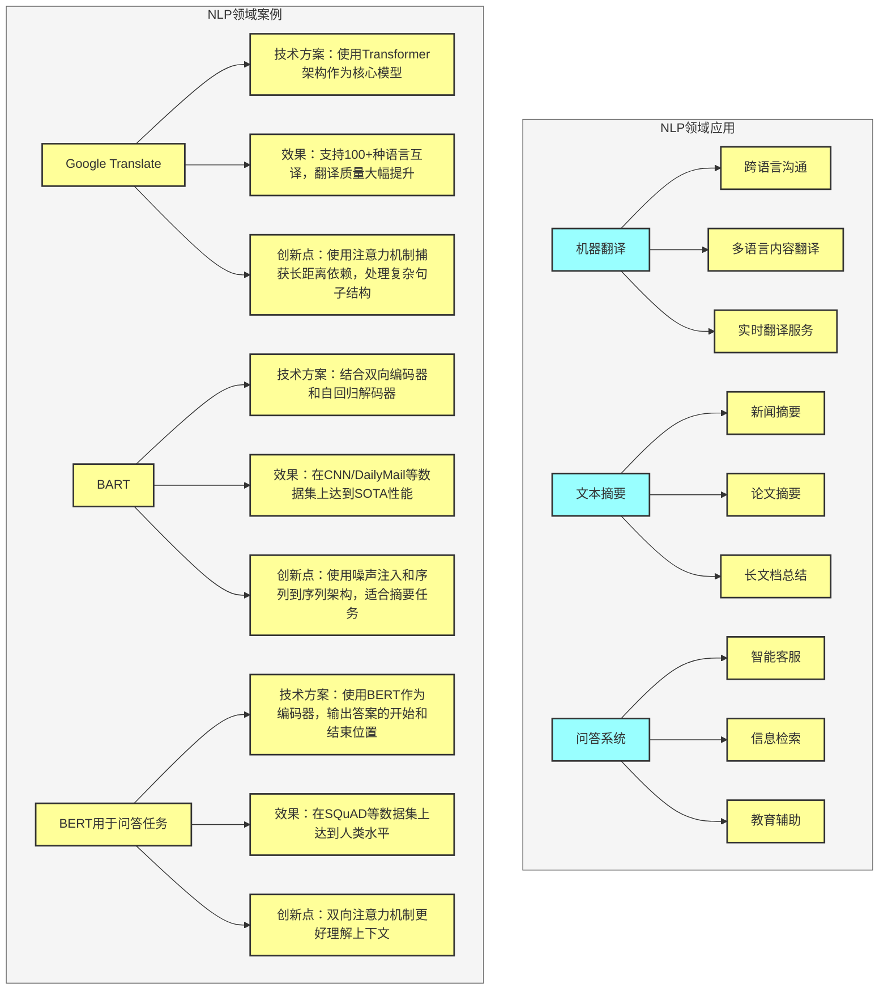
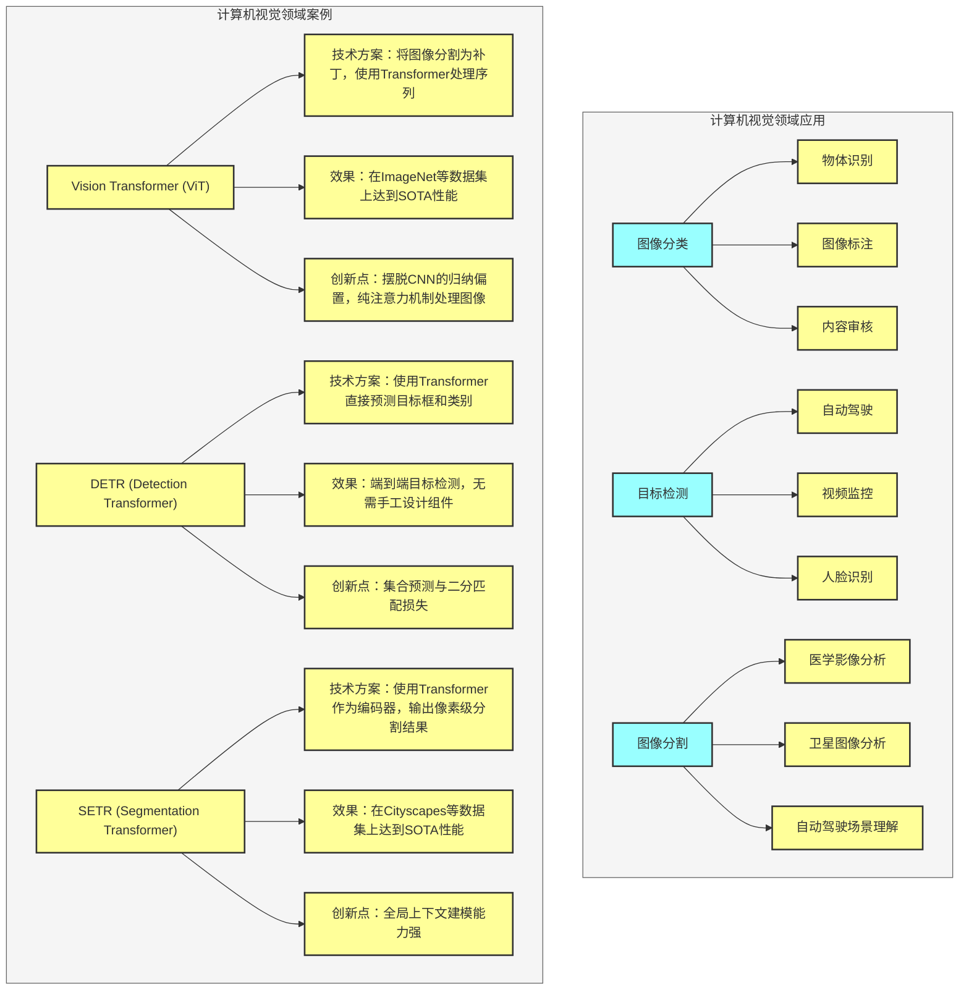
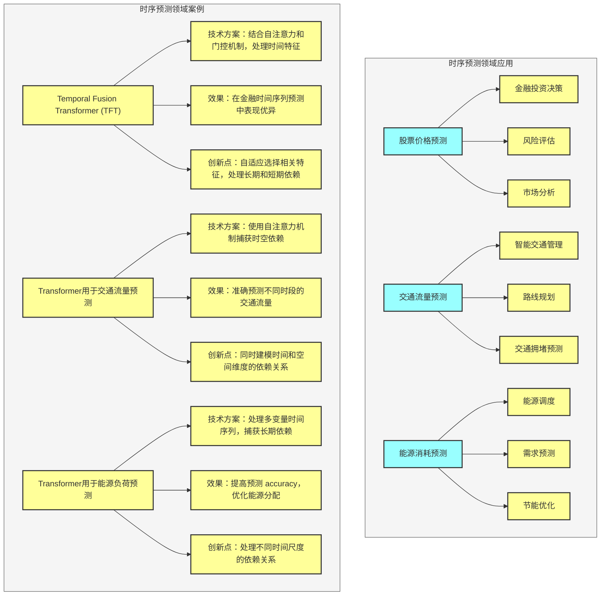
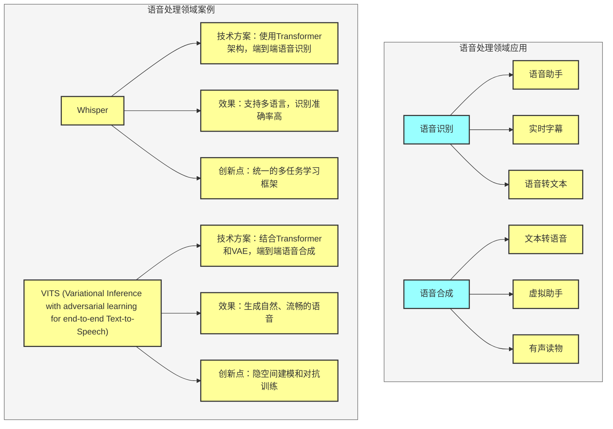
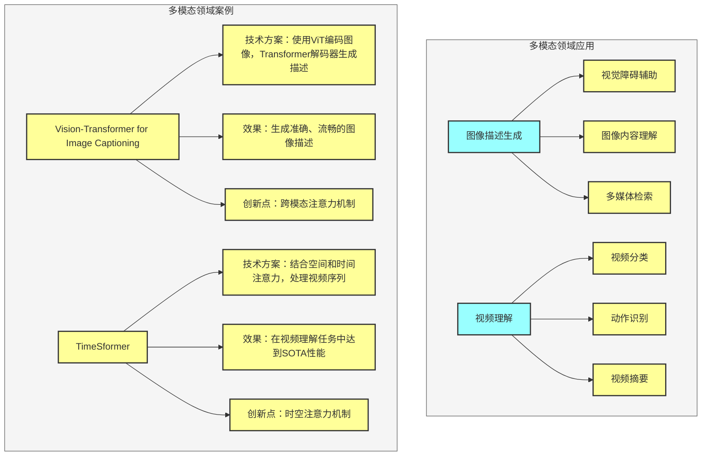
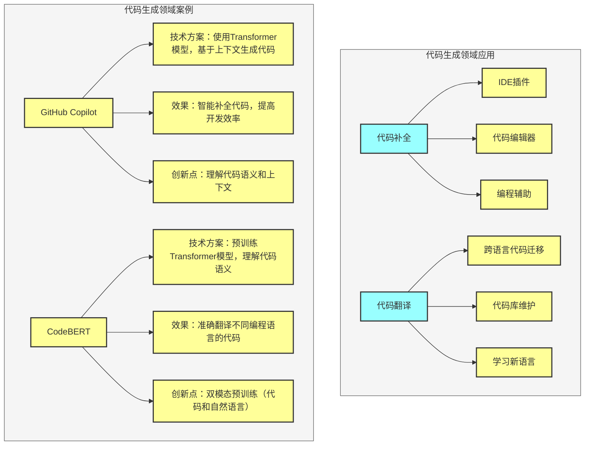
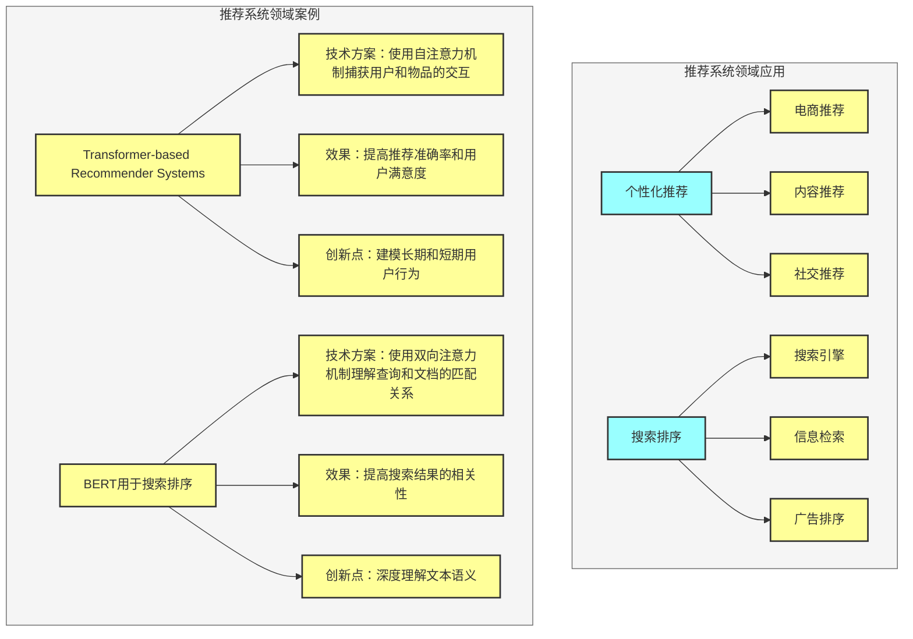

## 一、NLP 领域应用



### 1. 机器翻译

#### 应用场景
- 跨语言沟通
- 多语言内容翻译
- 实时翻译服务

#### 案例分析：Google Translate
- **技术方案**：使用Transformer架构作为核心模型
- **效果**：支持100+种语言互译，翻译质量大幅提升
- **创新点**：使用注意力机制捕获长距离依赖，处理复杂句子结构

#### 代码示例

```python
# 机器翻译模型示例
class TranslationTransformer(nn.Module):
    def __init__(self, src_vocab_size, tgt_vocab_size, d_model=512, n_heads=8, n_layers=6, d_ff=2048, max_seq_len=512, dropout=0.1):
        super(TranslationTransformer, self).__init__()
        self.transformer = Transformer(src_vocab_size, tgt_vocab_size, d_model, n_heads, n_layers, d_ff, max_seq_len, dropout)
    
    def forward(self, src, tgt):
        return self.transformer(src, tgt)
    
    def translate(self, src, max_length=50):
        # 自回归翻译
        batch_size = src.size(0)
        tgt = torch.zeros(batch_size, 1, dtype=torch.long).to(src.device)  # 起始token
        
        for i in range(max_length):
            output = self.transformer(src, tgt)
            next_token = output[:, -1, :].argmax(dim=-1).unsqueeze(1)
            tgt = torch.cat([tgt, next_token], dim=1)
            
            if next_token.item() == EOS_TOKEN_ID:  # 结束token
                break
        
        return tgt
```

### 2. 文本摘要

#### 应用场景
- 新闻摘要
- 论文摘要
- 长文档总结

#### 案例分析：BART (Bidirectional and Auto-Regressive Transformers)
- **技术方案**：结合双向编码器和自回归解码器
- **效果**：在CNN/DailyMail等数据集上达到SOTA性能
- **创新点**：使用噪声注入和序列到序列架构，适合摘要任务

### 3. 问答系统

#### 应用场景
- 智能客服
- 信息检索
- 教育辅助

#### 案例分析：BERT用于问答任务
- **技术方案**：使用BERT作为编码器，输出答案的开始和结束位置
- **效果**：在SQuAD等数据集上达到人类水平
- **创新点**：双向注意力机制更好理解上下文

---

## 二、计算机视觉领域应用



### 1. 图像分类

#### 应用场景
- 物体识别
- 图像标注
- 内容审核

#### 案例分析：Vision Transformer (ViT)
- **技术方案**：将图像分割为补丁，使用Transformer处理序列
- **效果**：在ImageNet等数据集上达到SOTA性能
- **创新点**：摆脱CNN的归纳偏置，纯注意力机制处理图像

### 2. 目标检测

#### 应用场景
- 自动驾驶
- 视频监控
- 人脸识别

#### 案例分析：DETR (Detection Transformer)
- **技术方案**：使用Transformer直接预测目标框和类别
- **效果**：端到端目标检测，无需手工设计组件
- **创新点**：集合预测与二分匹配损失

### 3. 图像分割

#### 应用场景
- 医学影像分析
- 卫星图像分析
- 自动驾驶场景理解

#### 案例分析：SETR (Segmentation Transformer)
- **技术方案**：使用Transformer作为编码器，输出像素级分割结果
- **效果**：在Cityscapes等数据集上达到SOTA性能
- **创新点**：全局上下文建模能力强

---

## 三、时序预测领域应用



### 1. 股票价格预测

#### 应用场景
- 金融投资决策
- 风险评估
- 市场分析

#### 案例分析：Temporal Fusion Transformer (TFT)
- **技术方案**：结合自注意力和门控机制，处理时间特征
- **效果**：在金融时间序列预测中表现优异
- **创新点**：自适应选择相关特征，处理长期和短期依赖

### 2. 交通流量预测

#### 应用场景
- 智能交通管理
- 路线规划
- 交通拥堵预测

#### 案例分析：Transformer用于交通流量预测
- **技术方案**：使用自注意力机制捕获时空依赖
- **效果**：准确预测不同时段的交通流量
- **创新点**：同时建模时间和空间维度的依赖关系

### 3. 能源消耗预测

#### 应用场景
- 能源调度
- 需求预测
- 节能优化

#### 案例分析：Transformer用于能源负荷预测
- **技术方案**：处理多变量时间序列，捕获长期依赖
- **效果**：提高预测 accuracy，优化能源分配
- **创新点**：处理不同时间尺度的依赖关系

---

## 四、语音处理领域应用



### 1. 语音识别

#### 应用场景
- 语音助手
- 实时字幕
- 语音转文本

#### 案例分析：Whisper
- **技术方案**：使用Transformer架构，端到端语音识别
- **效果**：支持多语言，识别准确率高
- **创新点**：统一的多任务学习框架

### 2. 语音合成

#### 应用场景
- 文本转语音
- 虚拟助手
- 有声读物

#### 案例分析：VITS (Variational Inference with adversarial learning for end-to-end Text-to-Speech)
- **技术方案**：结合Transformer和VAE，端到端语音合成
- **效果**：生成自然、流畅的语音
- **创新点**：隐空间建模和对抗训练

---

## 五、多模态领域应用



### 1. 图像描述生成

#### 应用场景
- 视觉障碍辅助
- 图像内容理解
- 多媒体检索

#### 案例分析：Vision-Transformer for Image Captioning
- **技术方案**：使用ViT编码图像，Transformer解码器生成描述
- **效果**：生成准确、流畅的图像描述
- **创新点**：跨模态注意力机制

### 2. 视频理解

#### 应用场景
- 视频分类
- 动作识别
- 视频摘要

#### 案例分析：TimeSformer
- **技术方案**：结合空间和时间注意力，处理视频序列
- **效果**：在视频理解任务中达到SOTA性能
- **创新点**：时空注意力机制

---

## 六、代码生成领域应用



### 1. 代码补全

#### 应用场景
- IDE插件
- 代码编辑器
- 编程辅助

#### 案例分析：GitHub Copilot
- **技术方案**：使用Transformer模型，基于上下文生成代码
- **效果**：智能补全代码，提高开发效率
- **创新点**：理解代码语义和上下文

### 2. 代码翻译

#### 应用场景
- 跨语言代码迁移
- 代码库维护
- 学习新语言

#### 案例分析：CodeBERT
- **技术方案**：预训练Transformer模型，理解代码语义
- **效果**：准确翻译不同编程语言的代码
- **创新点**：双模态预训练（代码和自然语言）

---

## 七、推荐系统领域应用



### 1. 个性化推荐

#### 应用场景
- 电商推荐
- 内容推荐
- 社交推荐

#### 案例分析：Transformer-based Recommender Systems
- **技术方案**：使用自注意力机制捕获用户和物品的交互
- **效果**：提高推荐准确率和用户满意度
- **创新点**：建模长期和短期用户行为

### 2. 搜索排序

#### 应用场景
- 搜索引擎
- 信息检索
- 广告排序

#### 案例分析：BERT用于搜索排序
- **技术方案**：使用双向注意力机制理解查询和文档的匹配关系
- **效果**：提高搜索结果的相关性
- **创新点**：深度理解文本语义

---

## 八、案例总结

### 1. 成功要素
- **自注意力机制**：捕获全局依赖，适合长序列
- **并行计算**：提高训练和推理速度
- **通用性**：适用于多种任务和领域
- **预训练**：利用大规模数据提高性能

### 2. 挑战与解决方案
- **计算复杂度**：使用稀疏注意力、模型压缩等技术
- **长序列处理**：使用局部注意力、记忆机制等
- **数据需求**：使用数据增强、迁移学习等

### 3. 未来趋势
- **多模态融合**：处理文本、图像、语音等多种数据类型
- **小样本学习**：减少对大规模数据的依赖
- **实时推理**：优化模型结构和部署方式
- **可解释性**：提高模型的透明度和可理解性