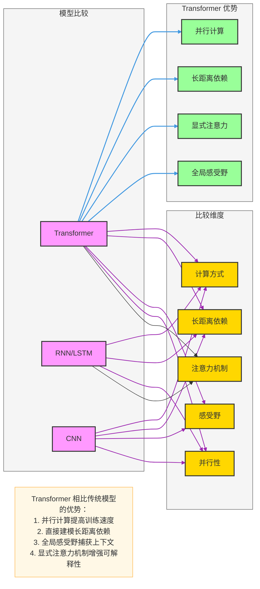
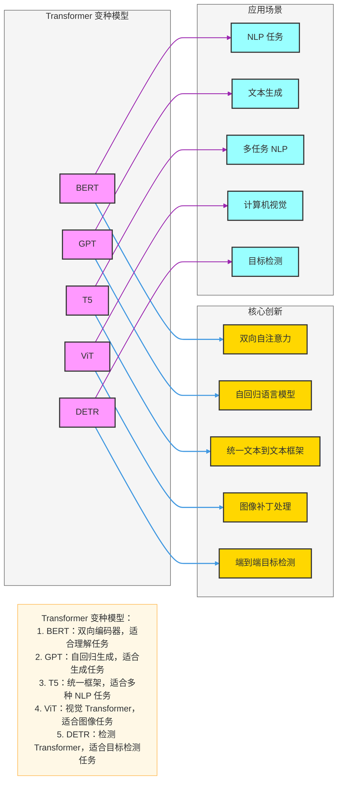
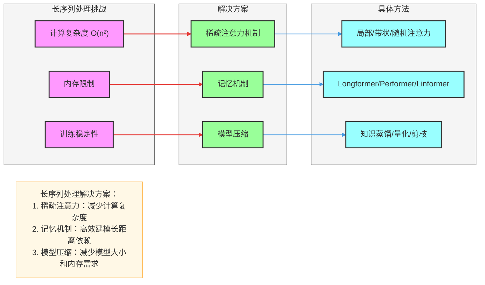
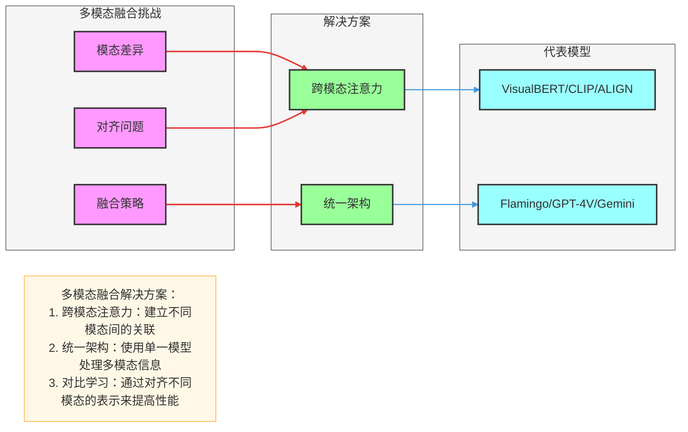
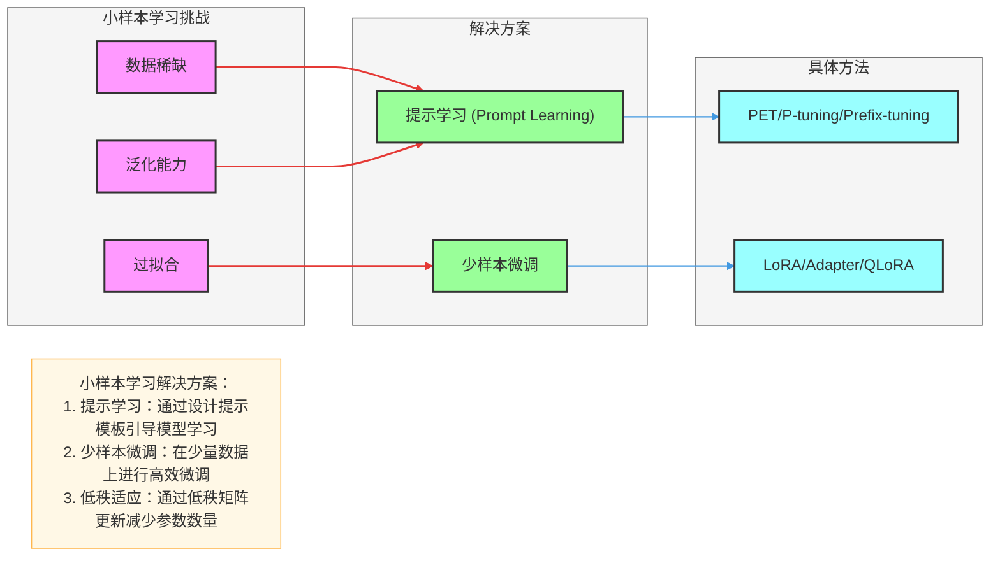
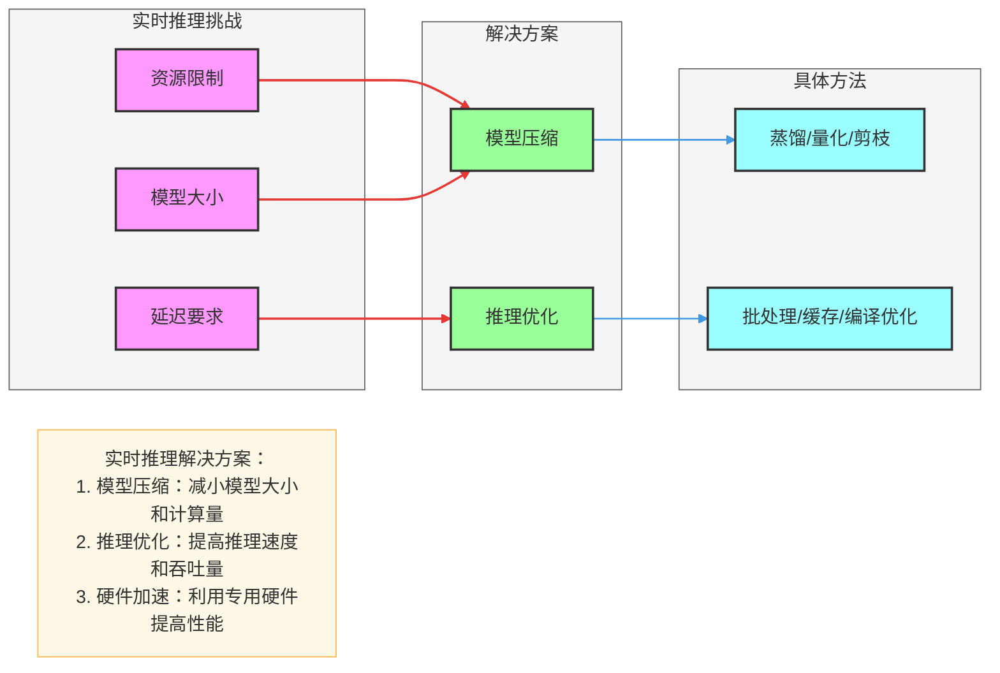
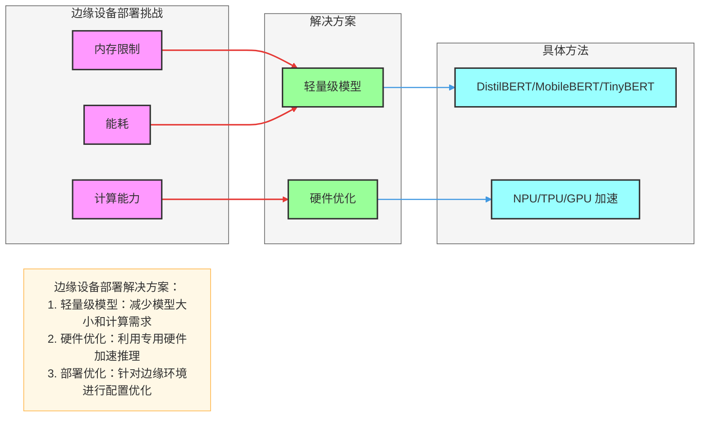
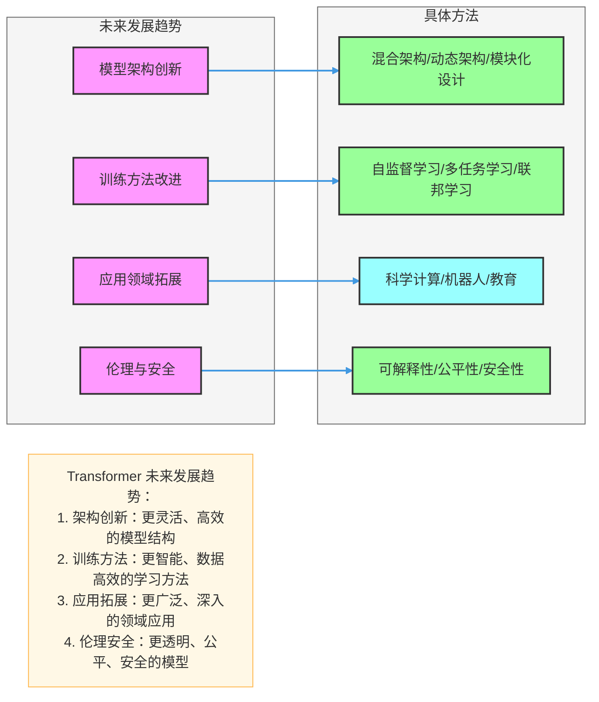
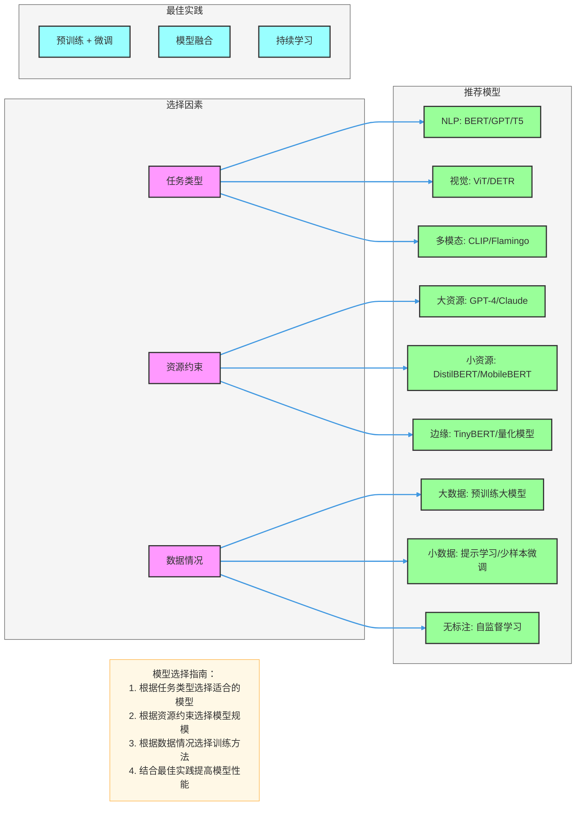

## 一、Transformer 与传统模型比较

### 1. 与 RNN/LSTM 比较

| 特性 | Transformer | RNN/LSTM |
|------|-------------|----------|
| 计算方式 | 并行计算 | 顺序计算 |
| 长距离依赖 | 直接建模 | 梯度消失/爆炸 |
| 训练速度 | 快 | 慢 |
| 并行性 | 高 | 低 |
| 注意力机制 | 显式 | 隐式 |
| 位置信息 | 位置编码 | 循环结构 |

### 2. 与 CNN 比较

| 特性 | Transformer | CNN |
|------|-------------|------|
| 感受野 | 全局 | 局部 |
| 长距离依赖 | 直接建模 | 多层堆叠 |
| 参数效率 | 较低 | 较高 |
| 并行性 | 高 | 高 |
| 结构灵活性 | 高 | 中 |
| 适用任务 | 序列、图像、多模态 | 图像、视频 |

---

## 二、Transformer 变种模型

### 1. BERT (Bidirectional Encoder Representations from Transformers)

- **核心创新**：双向自注意力，掩码语言模型预训练
- **应用场景**：文本分类、命名实体识别、问答系统
- **优势**：深度双向表示，迁移学习能力强
- **代表模型**：BERT-base、BERT-large、RoBERTa、ALBERT

### 2. GPT (Generative Pre-trained Transformer)

- **核心创新**：自回归语言模型，单向注意力
- **应用场景**：文本生成、对话系统、代码生成
- **优势**：生成能力强，上下文理解好
- **代表模型**：GPT-2、GPT-3、GPT-4

### 3. T5 (Text-to-Text Transfer Transformer)

- **核心创新**：统一文本到文本框架
- **应用场景**：机器翻译、文本摘要、问答系统
- **优势**：任务无关架构，迁移能力强
- **代表模型**：T5-base、T5-large、mT5

### 4. ViT (Vision Transformer)

- **核心创新**：将图像分割为补丁，用Transformer处理
- **应用场景**：图像分类、目标检测、图像分割
- **优势**：全局上下文建模，适合大模型
- **代表模型**：ViT-B/16、ViT-L/14、DeiT

### 5. DETR (Detection Transformer)

- **核心创新**：端到端目标检测，集合预测
- **应用场景**：目标检测、实例分割
- **优势**：无需手工设计组件，端到端训练
- **代表模型**：DETR、DETR++、DAB-DETR

---

## 三、进阶应用：长序列处理

### 1. 挑战
- **计算复杂度**：自注意力的 O(n²) 复杂度
- **内存限制**：长序列需要大量内存
- **训练稳定性**：长序列训练容易不稳定

### 2. 解决方案

#### 稀疏注意力机制
- **局部注意力**：只关注相邻位置
- **带状注意力**：关注固定宽度的带状区域
- **随机注意力**：随机选择部分位置关注

#### 记忆机制
- **Longformer**：结合局部和全局注意力
- **Performer**：使用核函数近似注意力
- **Linformer**：使用低秩矩阵近似注意力

#### 模型压缩
- **知识蒸馏**：将大模型知识转移到小模型
- **量化**：减少模型权重精度
- **剪枝**：移除不重要的权重

---

## 四、进阶应用：多模态融合

### 1. 挑战
- **模态差异**：不同模态数据结构差异大
- **对齐问题**：不同模态信息需要对齐
- **融合策略**：如何有效融合多模态信息

### 2. 解决方案

#### 跨模态注意力
- **VisualBERT**：将图像特征与文本特征融合
- **CLIP**：对比学习多模态表示
- **ALIGN**：大规模多模态对齐

#### 统一架构
- **Flamingo**：视觉-语言模型
- **GPT-4V**：多模态大语言模型
- **Gemini**：多模态基础模型

---

## 五、进阶应用：小样本学习

### 1. 挑战
- **数据稀缺**：标注数据不足
- **泛化能力**：模型难以适应新任务
- **过拟合**：小数据容易过拟合

### 2. 解决方案

#### 提示学习 (Prompt Learning)
- **PET**：模式增强训练
- **P-tuning**：可学习提示
- **Prefix-tuning**：前缀调优

#### 少样本微调
- **LoRA**：低秩适应
- **Adapter**：适配器模块
- **QLoRA**：量化低秩适应

---

## 六、进阶应用：实时推理

### 1. 挑战
- **延迟要求**：实时应用需要低延迟
- **资源限制**：边缘设备资源有限
- **模型大小**：大模型难以部署

### 2. 解决方案

#### 模型压缩
- **蒸馏**：知识蒸馏减少模型大小
- **量化**：INT8/INT4 量化
- **剪枝**：结构化剪枝

#### 推理优化
- **批处理**：批量推理提高吞吐量
- **缓存**：缓存中间结果
- **编译优化**：使用 TensorRT、ONNX Runtime 等

---

## 七、Transformer 在边缘设备上的部署

### 1. 挑战
- **内存限制**：边缘设备内存小
- **计算能力**：边缘设备计算能力有限
- **能耗**：边缘设备能耗受限

### 2. 解决方案

#### 轻量级模型
- **DistilBERT**：BERT 的蒸馏版本
- **MobileBERT**：为移动设备优化的 BERT
- **TinyBERT**：超轻量级 BERT

#### 硬件优化
- **NPU**：神经处理单元加速
- **TPU**：张量处理单元加速
- **GPU**：图形处理单元加速

---

## 八、未来发展趋势

### 1. 模型架构创新
- **混合架构**：结合 CNN、RNN 和 Transformer
- **动态架构**：根据输入动态调整模型结构
- **模块化设计**：可组合的模型组件

### 2. 训练方法改进
- **自监督学习**：利用无标注数据
- **多任务学习**：同时学习多个任务
- **联邦学习**：保护隐私的分布式学习

### 3. 应用领域拓展
- **科学计算**：蛋白质结构预测、药物发现
- **机器人**：控制、规划、感知
- **教育**：个性化学习、智能辅导

### 4. 伦理与安全
- **可解释性**：提高模型透明度
- **公平性**：减少偏见
- **安全性**：防止对抗攻击

---

## 九、模型选择指南

### 1. 根据任务选择
- **NLP 任务**：BERT、GPT、T5
- **计算机视觉**：ViT、DETR
- **多模态**：CLIP、Flamingo
- **时序预测**：Temporal Fusion Transformer

### 2. 根据资源选择
- **计算资源充足**：大模型（GPT-4、Claude）
- **计算资源有限**：轻量级模型（DistilBERT、MobileBERT）
- **边缘设备**：TinyBERT、量化模型

### 3. 根据数据选择
- **大数据**：预训练大模型
- **小数据**：提示学习、少样本微调
- **无标注数据**：自监督学习

### 4. 最佳实践
- **预训练 + 微调**：利用预训练模型，针对特定任务微调
- **模型融合**：结合多个模型的预测结果
- **持续学习**：不断更新模型以适应新数据