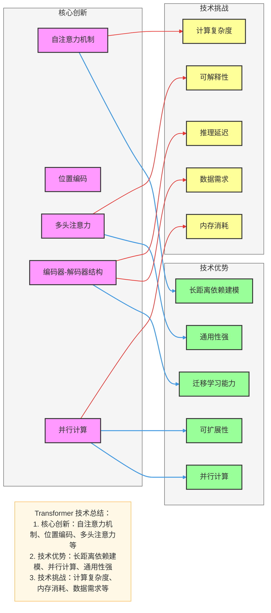
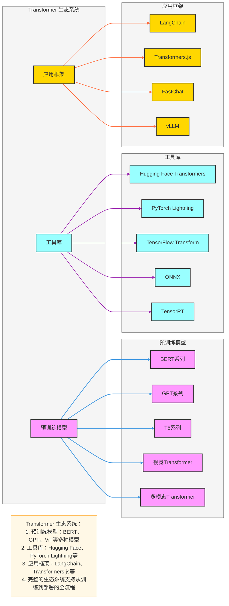
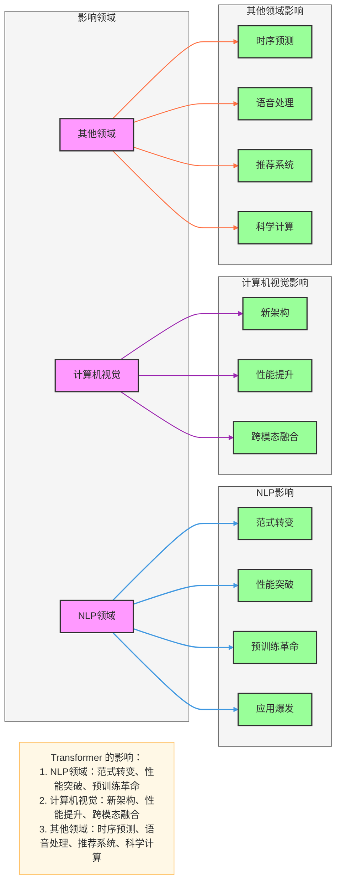
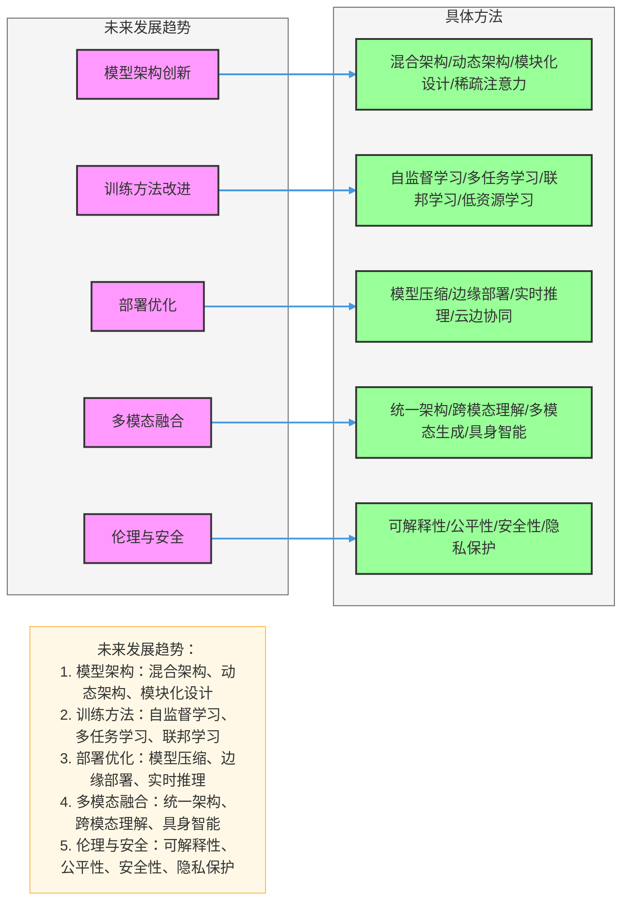
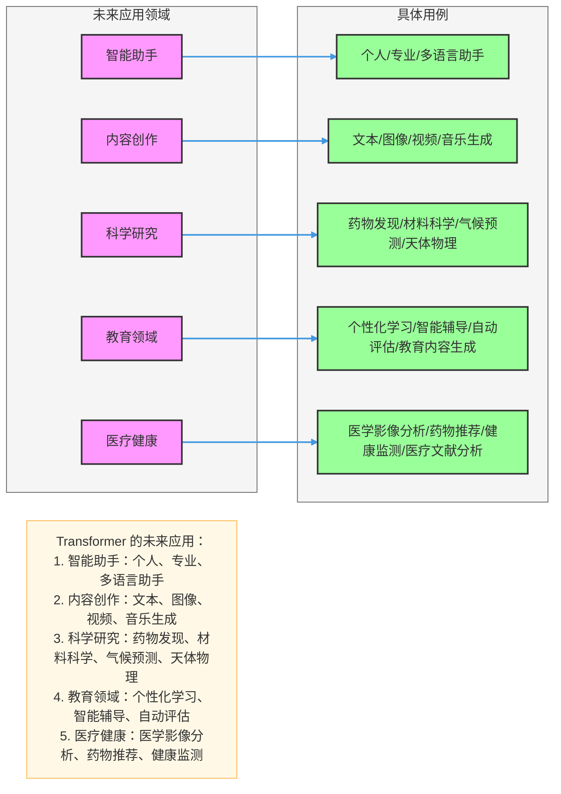

## 一、Transformer 技术总结

### 1. 核心创新
- **自注意力机制**：直接计算序列中任意两个位置的依赖关系，摆脱了RNN的顺序计算限制
- **位置编码**：显式注入序列位置信息，解决自注意力无法感知顺序的问题
- **多头注意力**：并行学习多维度特征表示，捕获不同角度的依赖关系
- **编码器-解码器结构**：分离输入处理和输出生成，更适合序列到序列任务
- **并行计算**：大幅提高训练速度，支持更大规模的模型

### 2. 技术优势
- **长距离依赖建模**：自注意力机制可以直接捕获长距离依赖，无需通过多层网络传递
- **并行计算**：摆脱了RNN的顺序计算限制，训练速度大幅提升
- **通用性强**：适用于NLP、计算机视觉、时序预测等多种任务
- **迁移学习能力**：预训练+微调的范式大幅提高模型性能
- **可扩展性**：模型大小和性能呈正相关，支持大规模模型训练

### 3. 技术挑战
- **计算复杂度**：自注意力的O(n²)复杂度限制了长序列处理能力
- **内存消耗**：大规模模型需要大量内存，限制了部署场景
- **数据需求**：预训练需要大规模数据
- **可解释性**：注意力机制虽然直观，但整体模型仍然是黑盒
- **推理延迟**：大模型推理速度较慢，难以满足实时应用需求

---

## 二、Transformer 生态系统

### 1. 预训练模型
- **BERT系列**：BERT、RoBERTa、ALBERT、DistilBERT
- **GPT系列**：GPT-2、GPT-3、GPT-4
- **T5系列**：T5、mT5、ByT5
- **视觉Transformer**：ViT、DeiT、Swin Transformer
- **多模态Transformer**：CLIP、Flamingo、GPT-4V

### 2. 工具库
- **Hugging Face Transformers**：提供预训练模型和工具
- **PyTorch Lightning**：简化训练流程
- **TensorFlow Transform**：数据预处理
- **ONNX**：模型导出和部署
- **TensorRT**：GPU推理优化

### 3. 应用框架
- **LangChain**：构建语言模型应用
- **Transformers.js**：浏览器和Node.js中的Transformer
- **FastChat**：部署聊天模型
- **vLLM**：高效大语言模型推理

---

## 三、Transformer 的影响

### 1. 对NLP领域的影响
- **范式转变**：从RNN/CNN转向Transformer
- **性能突破**：在各种NLP任务上达到SOTA性能
- **预训练革命**：BERT、GPT等预训练模型成为标准
- **应用爆发**：聊天机器人、机器翻译、文本摘要等应用快速发展

### 2. 对计算机视觉领域的影响
- **新架构**：ViT等模型挑战CNN的主导地位
- **性能提升**：在图像分类、目标检测等任务上取得突破
- **跨模态融合**：视觉-语言模型成为热点

### 3. 对其他领域的影响
- **时序预测**：Temporal Fusion Transformer等模型提高预测精度
- **语音处理**：Whisper等模型提升语音识别和合成质量
- **推荐系统**：提高推荐准确率和用户满意度
- **科学计算**：AlphaFold2等模型在蛋白质结构预测中取得突破

---

## 四、未来发展趋势

### 1. 模型架构创新
- **混合架构**：结合CNN、RNN和Transformer的优势
- **动态架构**：根据输入动态调整模型结构和参数量
- **模块化设计**：可组合的模型组件，提高灵活性
- **稀疏注意力**：减少计算复杂度，支持更长序列

### 2. 训练方法改进
- **自监督学习**：利用更多无标注数据
- **多任务学习**：同时学习多个相关任务，提高泛化能力
- **联邦学习**：保护隐私的分布式学习
- **低资源学习**：减少对大规模数据的依赖

### 3. 部署优化
- **模型压缩**：知识蒸馏、量化、剪枝等技术
- **边缘部署**：在手机、IoT设备等边缘设备上部署
- **实时推理**：优化推理速度，满足实时应用需求
- **云边协同**：结合云端和边缘设备的优势

### 4. 多模态融合
- **统一架构**：处理文本、图像、语音等多种数据类型
- **跨模态理解**：深度理解不同模态之间的关系
- **多模态生成**：生成多模态内容
- **具身智能**：结合感知和行动能力

### 5. 伦理与安全
- **可解释性**：提高模型透明度，解释模型决策
- **公平性**：减少模型偏见，确保公平对待所有用户
- **安全性**：防止对抗攻击，保护模型和数据安全
- **隐私保护**：在保护隐私的前提下利用数据

---

## 五、Transformer 的未来应用

### 1. 智能助手
- **个人助手**：理解用户意图，提供个性化服务
- **专业助手**：在医疗、法律、教育等领域提供专业支持
- **多语言助手**：支持多语言交互，打破语言障碍

### 2. 内容创作
- **文本生成**：自动生成文章、故事、代码等
- **图像生成**：根据文本描述生成图像
- **视频生成**：生成高质量视频内容
- **音乐生成**：创作音乐作品

### 3. 科学研究
- **药物发现**：预测药物分子结构和活性
- **材料科学**：设计新型材料
- **气候预测**：提高气候模型精度
- **天体物理**：分析天文数据

### 4. 教育领域
- **个性化学习**：根据学生特点定制学习计划
- **智能辅导**：提供实时学习支持
- **自动评估**：自动批改作业和考试
- **教育内容生成**：创建定制化教育内容

### 5. 医疗健康
- **医学影像分析**：辅助诊断疾病
- **药物推荐**：根据患者情况推荐药物
- **健康监测**：分析健康数据，预测健康风险
- **医疗文献分析**：快速分析医学文献

---

## 六、总结

Transformer 已经成为深度学习的核心架构之一，其影响力远超NLP领域，扩展到计算机视觉、语音处理、时序预测等多个领域。通过自注意力机制，Transformer 解决了传统序列模型的长距离依赖问题，同时通过并行计算提高了训练效率。

未来，Transformer 将继续演化，在模型架构、训练方法、部署优化、多模态融合等方面不断创新。我们可以期待看到更高效、更智能、更安全的Transformer模型，为各行各业带来更多价值。

Transformer 的成功也启示我们，打破传统思维限制，寻找更有效的计算范式，是推动人工智能发展的重要途径。随着技术的不断进步，Transformer 及其变种将在更多领域发挥重要作用，为人类社会创造更多价值。