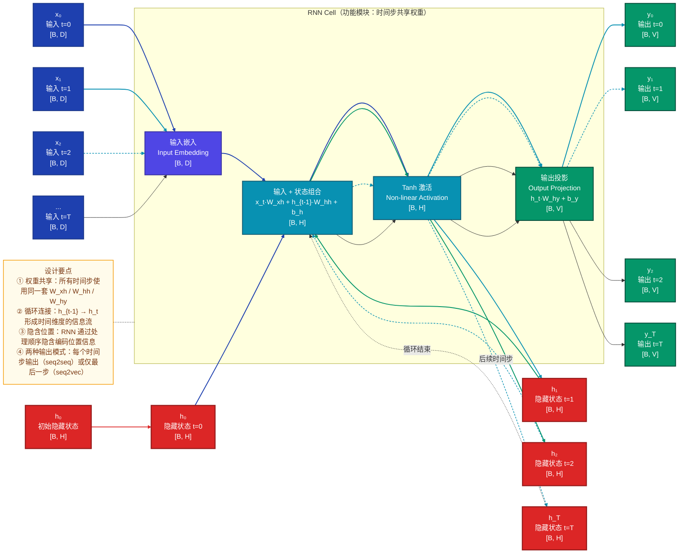
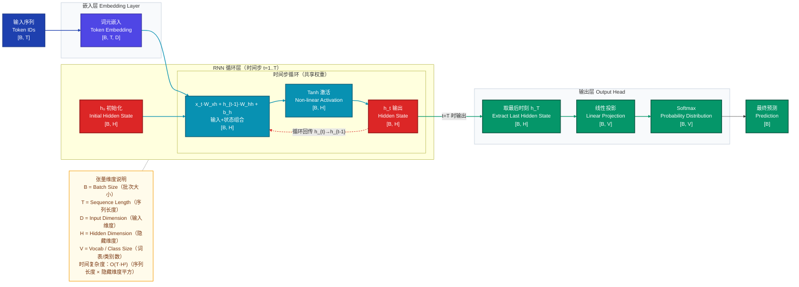
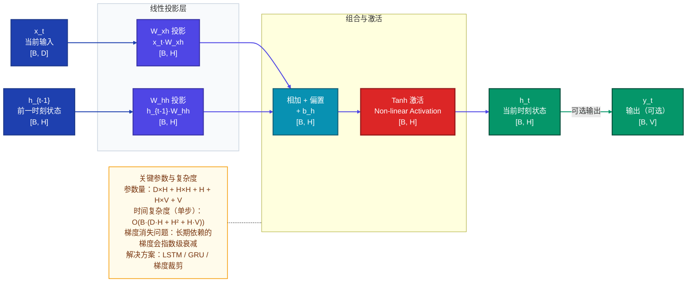
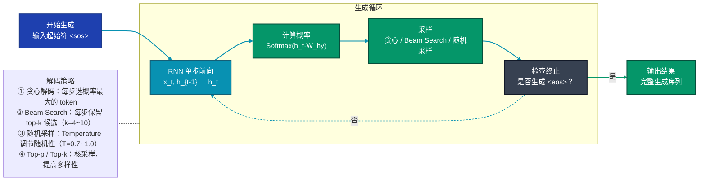

# RNN 模型专业技术分析文档

> **文档版本**：v1.0 | **最后更新**：2026-03-22 | **适用读者**：ML工程师 / 算法研究员 / 技术面试备考

---

## 目录

1. [模型定位](#1-模型定位)
2. [整体架构](#2-整体架构)
3. [数据直觉](#3-数据直觉)
4. [核心数据流](#4-核心数据流)
5. [关键组件](#5-关键组件)
6. [训练策略](#6-训练策略)
7. [评估指标与性能对比](#7-评估指标与性能对比)
8. [推理与部署](#8-推理与部署)
9. [FAQ](#9-faq)

---

## 1. 模型定位

**RNN（Recurrent Neural Network，循环神经网络）** 是一种专门用于处理序列数据的深度学习架构，其核心思想是通过循环连接机制让网络拥有"记忆"能力。它解决了前馈神经网络无法建模序列依赖关系的问题，属于**序列建模**研究方向，核心创新点在于**引入循环连接，使网络状态随时间步迭代更新，从而捕获序列中前后元素的依赖关系**。

---

## 2. 整体架构

### 2.1 架构分层拆解

RNN 按「功能模块 → 子模块 → 关键算子」三层拆解如下：

#### 功能模块层
| 功能模块 | 职责边界 |
|---------|---------|
| **输入嵌入层 Input Embedding** | 将离散输入（Token ID）映射为连续向量表示 |
| **循环层 Recurrent Layer** | 核心循环单元，维护隐藏状态，捕获序列依赖 |
| **输出层 Output Head** | 将隐藏状态映射为任务输出（分类/生成） |

#### 子模块层
| 功能模块 | 子模块 | 职责 |
|---------|--------|------|
| 输入嵌入层 | 线性映射 | Token ID → 嵌入向量 |
| 循环层 | 隐藏状态更新 | 输入 + 前一时刻隐藏状态 → 当前隐藏状态 |
| 输出层 | 线性投影 + 激活 | 隐藏状态 → 输出概率分布 |

#### 关键算子层
| 子模块 | 关键算子 | 作用 |
|--------|---------|------|
| 嵌入层 | Linear（Embedding） | 离散Token映射到连续向量 |
| 循环层 | 矩阵乘法（W_xh, W_hh） | 输入和隐藏状态的线性变换 |
| 循环层 | Tanh/Sigmoid | 非线性激活函数 |
| 输出层 | Linear（W_hy） | 隐藏状态到输出的投影 |
| 输出层 | Softmax | 输出概率分布归一化 |

#### 模块间连接方式
- **串行连接**：输入嵌入层 → 循环层 → 输出层
- **循环连接**：循环层内部通过隐藏状态 h_{t-1} → h_t 形成时间循环
- **可选输出**：每个时间步都可输出（序列到序列）或仅最后一步输出（序列到向量）

### 2.2 整体架构 ASCII 树形结构

```
RNN 整体架构
├── 输入嵌入层 Input Embedding Layer
│   ├── Token Embedding            ── 将离散Token ID映射为D维向量
│   └── [可选] Positional Encoding ── 若需要显式位置信息（RNN本身隐含位置）
├── 循环层 Recurrent Layer（核心模块）
│   ├── 隐藏状态初始化 h₀          ── 初始记忆状态（通常零向量或可学习）
│   ├── 时间步循环 t=1..T
│   │   ├── 输入投影 W_xh·x_t      ── 当前输入的线性变换
│   │   ├── 状态投影 W_hh·h_{t-1}  ── 前一时刻隐藏状态的线性变换
│   │   ├── 偏置相加 b_h            ── 加上可学习偏置
│   │   ├── 非线性激活 Tanh         ── 引入非线性，将状态压缩到(-1,1)
│   │   └── 隐藏状态更新 h_t        ── 输出当前时刻记忆状态
│   └── [可选] 多层堆叠             ── 深层RNN：下层h_t作为上层x_t
└── 输出层 Output Head
    ├── 每个时间步输出 y_t           ── 序列到序列任务（如机器翻译）
    │   ├── 线性投影 W_hy·h_t       ── 隐藏状态到输出空间
    │   ├── 偏置相加 b_y             ── 加上可学习偏置
    │   └── Softmax                  ── 输出概率分布
    └── 仅最后一步输出 y_T           ── 序列到向量任务（如文本分类）
        ├── 取 h_T                   ── 最后时刻隐藏状态
        ├── 线性投影 + Softmax       ── 映射到分类空间
        └── [可选] 池化层            ── 汇聚所有时刻信息（mean/max pooling）
```

### 2.3 整体架构 Mermaid 图



---

## 3. 数据直觉

### 3.1 示例任务与输入

我们以 **情感分析（文本分类）** 任务为例，选取一条具体样例：

- **输入文本**："这部电影真的太精彩了！"
- **任务目标**：二分类（正面/负面情感）
- **真实标签**：正面（Positive）

### 3.2 数据各阶段形态变化

#### 阶段 1：原始输入
```
原始文本："这部电影真的太精彩了！"

字符级拆分（假设使用字符级RNN）：
["这", "部", "电", "影", "真", "的", "太", "精", "彩", "了", "！"]

或词级拆分（假设使用中文分词）：
["这部", "电影", "真的", "太", "精彩", "了", "！"]

我们以词级为例，序列长度 T=7
```

#### 阶段 2：预处理后（Tokenization + Embedding）

```
Tokenization 结果（假设词汇表大小 V=10000）：
Token ID 序列：[1234, 567, 8901, 234, 5678, 901, 2345]
维度：[1, 7]（Batch=1, 序列长度=7）

Embedding 投影（D=128）：
每个 Token ID 映射为 128 维向量
维度：[1, 7, 128]

"这一步在表达什么"：
- 将离散的文字符号转换为连续的向量空间
- 向量中隐含了词的语义信息（如"精彩"与"好看"向量接近）
- 还未考虑序列顺序，只是孤立的词表示
```

#### 阶段 3：关键中间表示（隐藏状态演化）

##### 3.3.1 初始隐藏状态 h₀
```
h₀ = 零向量（或可学习的初始状态）
维度：[1, 256]（隐藏层维度 H=256）

"表达什么"：
- 模型的"初始记忆"，一片空白
- 等待通过输入序列逐步填充信息
```

##### 3.3.2 逐个时间步的隐藏状态更新

```
t=0，输入 x₀="这部"：
h₁ = tanh(W_xh·x₀ + W_hh·h₀ + b_h)
维度：[1, 256]
"表达什么"：记忆中只有"这部"这个词，信息很少

t=1，输入 x₁="电影"：
h₂ = tanh(W_xh·x₁ + W_hh·h₁ + b_h)
维度：[1, 256]
"表达什么"：记忆中融合了"这部电影"，知道在谈论电影

t=2，输入 x₂="真的"：
h₃ = tanh(W_xh·x₂ + W_hh·h₂ + b_h)
维度：[1, 256]
"表达什么"：加入"真的"，语气加强

t=3，输入 x₃="太"：
h₄ = tanh(W_xh·x₃ + W_hh·h₃ + b_h)
维度：[1, 256]
"表达什么"：继续加强语气

t=4，输入 x₄="精彩"：
h₅ = tanh(W_xh·x₄ + W_hh·h₄ + b_h)
维度：[1, 256]
"表达什么"：关键信息！"精彩"是强正面词，记忆被大幅更新

t=5，输入 x₅="了"：
h₆ = tanh(W_xh·x₅ + W_hh·h₅ + b_h)
维度：[1, 256]
"表达什么"：语气词，微调记忆

t=6，输入 x₆="！"：
h₇ = tanh(W_xh·x₆ + W_hh·h₆ + b_h)
维度：[1, 256]
"表达什么"：感叹号，进一步加强情感
```

##### 3.3.3 最终隐藏状态 h_T
```
h₇（最后时刻隐藏状态）
维度：[1, 256]

"表达什么"：
- 汇聚了整个句子"这部电影真的太精彩了！"的完整语义
- 包含了从左到右的顺序信息
- 是一个"浓缩"的句子表示，可以用于分类
```

#### 阶段 4：模型输出（原始输出形式）

```
输出层计算：
logits = W_hy · h₇ + b_y
维度：[1, 2]（二分类，V=2）

logits 示例值（未归一化）：
- 正面类别：3.2
- 负面类别：-1.8

"表达什么"：
- 每个类别有一个"得分"
- 得分越高表示模型越倾向于该类别
- 还不是概率，需要 Softmax 归一化
```

#### 阶段 5：后处理结果（最终可用的预测）

```
Softmax 归一化：
P(正面) = exp(3.2) / [exp(3.2) + exp(-1.8)] ≈ 0.993
P(负面) = exp(-1.8) / [exp(3.2) + exp(-1.8)] ≈ 0.007

最终预测：
argmax([0.993, 0.007]) = 正面（Positive）

"表达什么"：
- 模型以 99.3% 的置信度预测这是正面情感
- 完成了情感分析任务
```

---

## 4. 核心数据流

### 4.1 完整数据流路径（以情感分析任务为例）

以 **标准 RNN** 配置为例：输入维度 D=128，隐藏维度 H=256，序列长度 T=7，类别数 V=2



### 4.2 关键节点张量维度变化表

| 节点 | 操作 | 张量维度 | 说明 |
|-----|------|---------|------|
| 1 | 输入序列 | [B, T] | Token ID 序列 |
| 2 | Token Embedding | [B, T, D] | 映射到 D 维 |
| 3 | h₀ 初始化 | [B, H] | 零向量或可学习 |
| 4 | 输入+状态组合 | [B, H] | x_t·W_xh + h_{t-1}·W_hh + b_h |
| 5 | Tanh 激活 | [B, H] | 非线性变换 |
| 6 | h_t 输出 | [B, H] | 当前时刻隐藏状态 |
| 7 | 取最后 h_T | [B, H] | 用于分类任务 |
| 8 | 线性投影 | [B, V] | 映射到输出空间 |
| 9 | Softmax | [B, V] | 概率分布 |
| 10 | 最终预测 | [B] | 类别索引 |

---

## 5. 关键组件

### 5.1 基本 RNN 单元（Vanilla RNN Cell）

#### 直觉理解
基本 RNN 单元本质上是**一个"记忆更新器"——它接收当前输入和过去的记忆，然后输出更新后的新记忆**。

类比来说：就像你在阅读一本书，每读一个字（当前输入 x_t），你会结合之前已经理解的内容（过去记忆 h_{t-1}），形成新的理解（新记忆 h_t）。

#### 为什么这样设计？
1. **权重共享**：所有时间步使用同一套参数，大幅减少参数量
2. **序列建模**：通过 h_{t-1} → h_t 的循环连接，自然捕获序列依赖
3. **隐含位置**：处理顺序本身就编码了位置信息，无需显式位置编码

#### 内部计算原理

##### 第一步：输入与状态的线性组合

将当前输入 $x_t \in \mathbb{R}^{D}$ 和前一时刻隐藏状态 $h_{t-1} \in \mathbb{R}^{H}$ 分别通过线性变换后相加：

$$
a_t = W_{xh} \cdot x_t + W_{hh} \cdot h_{t-1} + b_h
$$

其中：
- $W_{xh} \in \mathbb{R}^{H \times D}$：输入到隐藏状态的权重矩阵
- $W_{hh} \in \mathbb{R}^{H \times H}$：隐藏状态到隐藏状态的权重矩阵
- $b_h \in \mathbb{R}^{H}$：偏置项

##### 第二步：非线性激活

通过 Tanh 激活函数引入非线性，将状态压缩到 (-1, 1) 区间：

$$
h_t = \tanh(a_t)
$$

**为什么选择 Tanh？**
- 输出范围 (-1, 1)，梯度在 0 附近较大，有利于学习
- 零中心化，优化更稳定
- 相比于 Sigmoid，Tanh 的梯度更大，学习更快

##### 第三步：输出计算（可选）

如果需要每个时间步都输出，则：

$$
y_t = W_{hy} \cdot h_t + b_y
$$

其中 $W_{hy} \in \mathbb{R}^{V \times H}$ 是隐藏状态到输出的权重矩阵。

#### 基本 RNN 单元内部结构图



#### 梯度消失问题分析

**问题根源**：

在反向传播时，梯度需要从 $h_T$ 一步步回传到 $h_0$，每一步都要乘以 $W_{hh}$ 的 Jacobian 矩阵。经过 T 步后：

$$
\frac{\partial h_T}{\partial h_0} = \prod_{t=1}^{T} \frac{\partial h_t}{\partial h_{t-1}} = \prod_{t=1}^{T} \left( W_{hh}^T \cdot \text{diag}(\tanh'(a_t)) \right)
$$

如果 $W_{hh}$ 的最大奇异值 $\sigma_{max} < 1$，则梯度会**指数级衰减**（梯度消失）；如果 $\sigma_{max} > 1$，则梯度会**指数级爆炸**（梯度爆炸）。

**影响**：
- 梯度消失：模型无法学习长期依赖（如相距 10 步以上的依赖）
- 梯度爆炸：训练不稳定，参数更新剧烈

### 5.2 双向 RNN（Bi-RNN）

#### 直觉理解
双向 RNN 本质上是**同时从左到右和从右到左阅读序列，然后融合两个方向的信息**。

类比来说：就像阅读一篇文章，你先从开头读到结尾（正向），再从结尾读回开头（反向），然后综合两遍的理解形成更全面的认识。

#### 为什么这样设计？
1. **双向上下文**：基本 RNN 只能利用过去的信息，Bi-RNN 可以同时利用过去和未来的信息
2. **更全面的表示**：对于某些任务（如词性标注、命名实体识别），未来的词对当前词的标注很重要
3. **实现简单**：只需两个独立的 RNN，分别正向和反向处理，然后拼接

#### 数学公式

正向 RNN（从左到右）：
$$
\overrightarrow{h_t} = \tanh\left( \overrightarrow{W_{xh}} \cdot x_t + \overrightarrow{W_{hh}} \cdot \overrightarrow{h_{t-1}} + \overrightarrow{b_h} \right)
$$

反向 RNN（从右到左）：
$$
\overleftarrow{h_t} = \tanh\left( \overleftarrow{W_{xh}} \cdot x_t + \overleftarrow{W_{hh}} \cdot \overleftarrow{h_{t+1}} + \overleftarrow{b_h} \right)
$$

最终隐藏状态（拼接）：
$$
h_t = \left[ \overrightarrow{h_t}; \overleftarrow{h_t} \right]
$$

### 5.3 深层 RNN（Deep RNN / Stacked RNN）

#### 直觉理解
深层 RNN 本质上是**将多个 RNN 层堆叠起来，下层的输出作为上层的输入，形成层次化的特征表示**。

类比来说：就像理解一篇文章，第一层理解词语，第二层理解短语，第三层理解句子，层次越深，理解越抽象。

#### 为什么这样设计？
1. **层次化特征**：低层捕捉局部模式，高层捕捉抽象模式
2. **更强的表达能力**：多层非线性变换可以拟合更复杂的函数
3. **特征复用**：下层学到的特征可以被上层复用

#### 数学公式

对于第 $l$ 层 RNN：
$$
h_t^{(l)} = \tanh\left( W_{xh}^{(l)} \cdot h_t^{(l-1)} + W_{hh}^{(l)} \cdot h_{t-1}^{(l)} + b_h^{(l)} \right)
$$

其中 $h_t^{(0)} = x_t$（第 0 层是输入）。

---

## 6. 训练策略

### 6.1 损失函数设计

#### 序列到序列任务（如语言模型）：交叉熵损失

对于每个时间步 $t$，计算预测分布与真实分布的交叉熵：

$$
\mathcal{L}_t = -\sum_{v=1}^{V} y_{t,v} \log(p_{t,v})
$$

其中：
- $y_{t,v}$：真实标签（one-hot 向量）
- $p_{t,v}$：模型预测的概率分布（Softmax 输出）

整个序列的损失是各时间步损失的平均：

$$
\mathcal{L} = \frac{1}{T} \sum_{t=1}^{T} \mathcal{L}_t
$$

#### 序列到向量任务（如文本分类）：交叉熵损失

只使用最后时刻的输出进行分类：

$$
\mathcal{L} = -\sum_{v=1}^{V} y_v \log(p_v)
$$

### 6.2 优化器与学习率调度

#### 优化器：Adam / RMSprop

RNN 训练通常使用 Adam 或 RMSprop，因为它们对梯度的缩放有较好的鲁棒性，有助于缓解梯度消失/爆炸问题。

Adam 超参数设置：
- $\beta_1 = 0.9$
- $\beta_2 = 0.999$
- $\epsilon = 10^{-8}$
- 学习率：$10^{-3}$ 到 $10^{-4}$

#### 学习率调度：固定学习率 / 余弦退火

- **固定学习率**：简单稳定，适合小规模任务
- **余弦退火**：学习率从初始值按余弦函数衰减到最小值
- **学习率预热**：前几步学习率线性增加，防止初期梯度爆炸

### 6.3 关键训练技巧

| 技巧 | 作用 | 实现方式 |
|-----|------|---------|
| **梯度裁剪** | 防止梯度爆炸 | clip_grad_norm_(model.parameters(), max_norm=1.0) |
| **Teacher Forcing** | 提升训练稳定性 | 使用真实的前一个 token 作为输入（而非模型输出） |
| **Truncated BPTT** | 减少显存占用 | 只反向传播最近 K 步（如 K=20） |
| **初始化策略** | 缓解梯度消失 | 正交初始化 / Xavier 初始化 |
| **LayerNorm** | 稳定训练 | 在 RNN 单元中加入层归一化 |

### 6.4 训练流程图

```mermaid
flowchart LR
    %% ── 配色主题 ───────────────────────────────────────────────
    classDef dataStyle     fill:#1e40af,stroke:#1e3a8a,stroke-width:2px,color:#fff
    classDef forwardStyle  fill:#0891b2,stroke:#155e75,stroke-width:2px,color:#fff
    classDef lossStyle     fill:#dc2626,stroke:#991b1b,stroke-width:2.5px,color:#fff
    classDef backwardStyle fill:#d97706,stroke:#92400e,stroke-width:2px,color:#fff
    classDef optStyle      fill:#7c3aed,stroke:#4c1d95,stroke-width:2px,color:#fff
    classDef evalStyle     fill:#059669,stroke:#064e3b,stroke-width:2px,color:#fff
    classDef ctrlStyle     fill:#374151,stroke:#111827,stroke-width:2px,color:#fff
    classDef noteStyle     fill:#fffbeb,stroke:#f59e0b,stroke-width:1.5px,color:#78350f
    classDef layerStyle    fill:#f8fafc,stroke:#cbd5e0,stroke-width:1.5px

    DATASET[("数据集<br>Dataset")]:::dataStyle

    %% ── 数据加载 ─────────────────────────────────────────────────
    subgraph LOADER["数据加载 Data Loading"]
        direction LR
        DL["数据加载器<br>DataLoader<br>采样 + 批次化"]:::dataStyle
        PAD["序列填充<br>Sequence Padding<br>等长处理"]:::dataStyle
    end
    class LOADER layerStyle

    %% ── 前向传播 ─────────────────────────────────────────────────
    subgraph FORWARD["前向传播 Forward Pass"]
        direction LR
        FW["模型前向<br>RNN Forward<br>h₀→h₁→…→h_T"]:::forwardStyle
        PRED["预测输出<br>Predictions / Logits"]:::forwardStyle
    end
    class FORWARD layerStyle

    LOSS["损失计算<br>Cross-Entropy Loss"]:::lossStyle

    %% ── 反向传播 ─────────────────────────────────────────────────
    subgraph BACKWARD["反向传播 Backward Pass（BPTT）"]
        direction LR
        BW["loss.backward()<br>通过时间反向传播"]:::backwardStyle
        CLIP["梯度裁剪<br>Gradient Clip<br>max_norm=1.0"]:::backwardStyle
    end
    class BACKWARD layerStyle

    %% ── 参数更新 ─────────────────────────────────────────────────
    subgraph OPTIM["参数更新 Optimization"]
        direction LR
        OPT["optimizer.step()<br>Adam / RMSprop"]:::optStyle
        LRS["scheduler.step()<br>学习率调度"]:::optStyle
        ZERO["optimizer.zero_grad()<br>清零梯度"]:::optStyle
    end
    class OPTIM layerStyle

    %% ── 验证评估 ─────────────────────────────────────────────────
    subgraph EVAL["验证评估 Validation（每 N Epoch）"]
        direction LR
        VAL["验证集前向<br>with torch.no_grad()"]:::evalStyle
        METRIC["指标计算<br>Acc / Perplexity"]:::evalStyle
        CKPT["模型保存<br>Checkpoint"]:::evalStyle
    end
    class EVAL layerStyle

    DONE["训练结束<br>Final Model"]:::ctrlStyle

    %% ── 数据流 ───────────────────────────────────────────────────
    DATASET --> DL
    DL      --> PAD
    PAD     -->|"Batch [B, T]"| FW
    FW      --> PRED
    PRED    --> LOSS
    LOSS    --> BW
    BW      --> CLIP
    CLIP    --> OPT
    OPT     --> LRS
    LRS     --> ZERO
    ZERO    -.->|"下一个 Batch"| DL
    OPT     -->|"每 N Epoch 触发"| VAL
    VAL     --> METRIC
    METRIC  --> CKPT
    CKPT    -.->|"早停判断"| DONE

    %% ── 设计注记 ─────────────────────────────────────────────────
    NOTE["训练策略要点<br>① 梯度裁剪防爆炸（RNN训练的关键）<br>② Teacher Forcing：使用真实前一个token<br>③ BPTT：通过时间反向传播（计算量大）<br>④ Truncated BPTT：只回传最近K步，节省显存<br>⑤ 正交初始化缓解梯度消失"]:::noteStyle
    NOTE -.- OPTIM

    %% 边索引：0-14，共 15 条；NOTE -.- 为边 15
    linkStyle 0,1,2   stroke:#1e40af,stroke-width:2px
    linkStyle 3,4     stroke:#0891b2,stroke-width:2px
    linkStyle 5,6,7   stroke:#dc2626,stroke-width:2px
    linkStyle 8,9     stroke:#7c3aed,stroke-width:2px
    linkStyle 10,11   stroke:#7c3aed,stroke-width:1.5px,stroke-dasharray:4 3
    linkStyle 12,13   stroke:#059669,stroke-width:2px
    linkStyle 14      stroke:#059669,stroke-width:1.5px,stroke-dasharray:4 3
```



---

## 7. 评估指标与性能对比

### 7.1 主要评估指标

#### 语言模型任务：困惑度（Perplexity, PP）

**含义**：衡量模型对序列的预测能力，困惑度越低越好。

**数学公式**：
$$
\text{PP} = 2^{-\frac{1}{T} \sum_{t=1}^{T} \log_2 p(y_t | y_1, \dots, y_{t-1})}
$$

**为什么选用困惑度？**
- 直观：可以理解为"平均分支因子"，即模型每步需要从多少个候选中选择
- 与交叉熵直接相关：$\text{PP} = \exp(\mathcal{L})$
- 是语言模型领域的标准指标

#### 文本分类任务：准确率（Accuracy）/ F1 分数

- **准确率**：预测正确的样本占总样本的比例
- **F1 分数**：精确率和召回率的调和平均，适合不平衡数据集

#### 序列标注任务：F1 分数 / 精确匹配（Exact Match）

### 7.2 核心 Benchmark 对比结果

以 Penn Treebank (PTB) 语言模型任务为例：

| 模型 | 困惑度（PP） | 参数量 | 说明 |
|-----|------------|-------|------|
| **n-gram (5-gram)** | ~141 | - | 传统统计方法 |
| **基本 RNN** | ~120 | ~1M | 单层 RNN |
| **LSTM** | ~85 | ~3M | 门控机制，缓解梯度消失 |
| **GRU** | ~88 | ~2.5M | 简化版 LSTM，性能接近 |
| **深层 LSTM (2层)** | ~78 | ~6M | 多层堆叠 |

### 7.3 关键消融实验

| 消融项 | 困惑度变化 | 说明 |
|-------|----------|------|
| 移除梯度裁剪 | 训练不收敛 | 梯度裁剪对 RNN 训练至关重要 |
| 双向 → 单向 | +8~10 PP | 双向上下文信息很重要（适合标注任务） |
| 2层 → 1层 | +5~7 PP | 深层有收益 |
| Tanh → ReLU | 训练不稳定 | ReLU 在 RNN 中容易发散 |

### 7.4 效率指标

| 配置 | 参数量 | FLOPs（序列长 100） | 推理延迟（单样本） |
|-----|-------|---------------------|------------------|
| 基本 RNN (H=256) | ~0.3M | ~0.13e9 | ~2ms |
| LSTM (H=256) | ~0.8M | ~0.33e9 | ~5ms |
| 深层 LSTM (2层, H=256) | ~1.6M | ~0.66e9 | ~10ms |

---

## 8. 推理与部署

### 8.1 推理阶段与训练阶段的差异

| 方面 | 训练阶段 | 推理阶段 |
|-----|---------|---------|
| 输入方式 | Teacher Forcing（真实前一个 token） | 自回归（前一个输出作为下一个输入） |
| 隐藏状态 | 整个序列一起计算 | 逐步维护，单步更新 |
| Dropout | 开启 | 关闭 |
| 批次处理 | 支持大批次 | 通常小批次或单样本 |
| 梯度计算 | 需要 | 不需要 |

### 8.2 输出后处理流程

#### 自回归生成（语言模型）



#### 解码策略

**贪心解码（Greedy Decoding）**：
- 每步选择概率最大的 token
- 实现简单，但可能陷入局部最优

**束搜索（Beam Search）**：
- 每步保留 top-k 个候选序列
- 平衡质量与效率，通常 k=4~10

**随机采样（Stochastic Sampling）**：
- 根据概率分布随机采样
- Temperature 参数调节随机性：$T \to 0$ 接近贪心，$T \to \infty$ 均匀分布

### 8.3 常见的部署优化手段

| 优化手段 | 原理 | 效果 |
|---------|------|------|
| **状态缓存** | 复用前一时刻的隐藏状态 h_{t-1} | 自回归生成速度提升 |
| **量化** | 将 FP32 转为 INT8/INT4 | 显存减少 4×，速度提升 2-3× |
| **知识蒸馏** | 用大 RNN 监督小 RNN | 小模型性能接近大模型 |
| **ONNX 导出** | 转换为标准格式 | 跨平台部署，推理加速 |
| **剪枝** | 移除冗余连接 | 减少参数量，加快推理 |

---

## 9. FAQ

### 基本原理类

#### Q1：RNN 为什么能处理序列数据？

**A**：
RNN 能够处理序列数据的核心在于**循环连接机制**：
1. **隐藏状态**：$h_t$ 作为"记忆"，保存了到当前时刻为止的序列信息
2. **权重共享**：所有时间步使用同一套参数 $W_{xh}$、$W_{hh}$，参数量不随序列长度增加
3. **顺序处理**：通过 $h_{t-1} \to h_t$ 的连接，自然捕获序列中前后元素的依赖关系

#### Q2：RNN 隐含了位置信息吗？为什么不需要显式位置编码？

**A**：
是的，RNN **隐含了位置信息**，不需要显式位置编码，原因如下：
1. **顺序处理**：RNN 按时间步 $t=1, 2, \dots, T$ 顺序处理输入，处理顺序本身就编码了位置信息
2. **累积状态**：$h_t$ 包含了前 $t$ 个输入的累积信息，不同位置的相同输入会产生不同的 $h_t$
3. **对比 Transformer**：Transformer 的自注意力是位置无关的（打乱顺序结果不变），所以需要显式位置编码

但 RNN 的位置编码是**单向**的（只能利用过去信息），而显式位置编码可以是**双向**的。

#### Q3：什么是 BPTT（Backpropagation Through Time）？

**A**：
BPTT（通过时间反向传播）是训练 RNN 的标准方法：
1. **展开 RNN**：将 RNN 在时间维度上展开，把 $h_0 \to h_1 \to \dots \to h_T$ 看作一个前馈神经网络
2. **前向传播**：按时间步顺序计算 $h_1, h_2, \dots, h_T$ 和损失
3. **反向传播**：从 $h_T$ 开始，反向计算梯度到 $h_0$，更新参数
4. **参数共享**：所有时间步的梯度累加到同一套参数上

**问题**：序列很长时，BPTT 需要保存所有时刻的中间状态，显存占用大，且梯度会消失/爆炸。

#### Q4：Teacher Forcing 是什么？为什么训练时要用它？

**A**：
**Teacher Forcing** 是 RNN 训练的一种策略：
- **训练时**：每个时间步的输入 $x_t$ 是**真实的前一个 token** $y_{t-1}^*$，而不是模型的预测输出
- **推理时**：每个时间步的输入是模型前一个时间步的输出

**为什么要用 Teacher Forcing？**
1. **训练稳定**：避免早期错误累积（如果不用 Teacher Forcing，早期的错误会导致后续输入都是错的，训练很难收敛）
2. **加速收敛**：使用真实标签作为输入，学习更直接
3. **对比推理**：训练和推理的输入分布有差异（训练用真实，推理用预测），这是一个问题（解决方法：Scheduled Sampling）

### 设计决策类

#### Q5：RNN 为什么选择 Tanh 作为激活函数，而不是 ReLU？

**A**：
RNN 通常选择 Tanh 而非 ReLU，原因如下：

**Tanh 的优点**：
1. **零中心化**：输出范围 (-1, 1)，均值接近 0，优化更稳定
2. **梯度合适**：在 0 附近梯度较大，有利于学习
3. **有界输出**：隐藏状态 $h_t$ 被压缩到 (-1, 1)，不会无限增长

**ReLU 在 RNN 中的问题**：
1. **梯度爆炸风险**：ReLU 的导数是 1（x>0），反向传播时梯度可能指数级增长
2. **输出无界**：$h_t$ 可能变得很大，导致数值不稳定
3. **Dead ReLU**：某些单元可能永远不激活

**但也有例外**：某些研究使用 Identity RNN + ReLU，配合 careful initialization 也能工作。

#### Q6：梯度消失对 RNN 有什么影响？为什么 LSTM 能缓解？

**A**：

**梯度消失的影响**：
- **长期依赖无法学习**：相距 T 步的两个元素，梯度需要经过 T 次矩阵乘法，会指数级衰减（如果 $|W| < 1$）
- **举例**：在句子"我昨天吃了苹果，今天吃了香蕉，我更喜欢 [MASK]"中，RNN 可能学不到"苹果"和"香蕉"与"更喜欢"的依赖关系

**LSTM 为什么能缓解**：
LSTM 引入了**细胞状态 $c_t$** 和**门控机制**（输入门、遗忘门、输出门）：
1. **细胞状态的恒定误差传送带**：$c_t = f_t \odot c_{t-1} + i_t \odot \tilde{c}_t$，梯度可以沿着 $c_t$ 顺畅回传，不会指数级衰减
2. **门控机制控制信息流**：遗忘门可以选择保留多少过去的信息，输入门可以选择加入多少新信息
3. **对比基本 RNN**：基本 RNN 的 $h_t$ 每步都被完全覆盖，而 LSTM 的 $c_t$ 是线性累积的

#### Q7：Bi-RNN（双向 RNN）适合什么任务？不适合什么任务？

**A**：

**Bi-RNN 适合的任务**（需要利用未来信息）：
- 词性标注（POS Tagging）：当前词的词性可能依赖后面的词
- 命名实体识别（NER）：实体边界可能需要看后面的词
- 机器翻译（Encoder 部分）：编码源语言时，双向上下文更全面
- 语音识别：声学特征的上下文是双向的

**Bi-RNN 不适合的任务**（需要实时/自回归生成）：
- 语言模型（LM）：生成时只能看到过去，不能看到未来
- 在线语音识别：实时流式识别，不能等待未来的音频
- 实时文本生成：自回归生成，每步只能依赖之前的输出

**注意**：Bi-RNN 只是在训练时用双向信息，推理时如果是生成任务，仍然只能单向。

#### Q8：深层 RNN（堆叠 RNN）有什么好处？为什么通常只堆 2-3 层？

**A**：

**深层 RNN 的好处**：
1. **层次化特征**：低层捕捉局部模式（如词），高层捕捉抽象模式（如句子语义）
2. **更强的表达能力**：多层非线性变换可以拟合更复杂的函数
3. **特征复用**：下层学到的特征可以被上层复用

**为什么通常只堆 2-3 层？**
1. **梯度消失更严重**：堆叠层数越多，梯度回传的路径越长，梯度消失更严重
2. **训练困难**：深层 RNN 很难训练，需要 careful initialization 和 normalization
3. **收益递减**：2-3 层之后，继续增加层数，性能提升不明显，但训练难度大幅增加
4. **对比 Transformer**：Transformer 可以轻松堆几十层，因为残差连接和层归一化缓解了梯度问题

**解决方案**：Residual RNN（加入残差连接）、LayerNorm RNN（加入层归一化）可以训练更深的 RNN。

### 实现细节类

#### Q9：RNN 的参数量怎么计算？

**A**：

以基本 RNN 为例，参数包括：
- $W_{xh} \in \mathbb{R}^{H \times D}$：输入到隐藏的权重
- $W_{hh} \in \mathbb{R}^{H \times H}$：隐藏到隐藏的权重
- $b_h \in \mathbb{R}^H$：隐藏层偏置
- $W_{hy} \in \mathbb{R}^{V \times H}$：隐藏到输出的权重（可选）
- $b_y \in \mathbb{R}^V$：输出层偏置（可选）

**总参数量**：
- 如果不需要输出层：$D \times H + H \times H + H = H \times (D + H + 1)$
- 如果需要输出层：$H \times (D + H + 1) + V \times (H + 1)$

**举例**：D=128, H=256, V=10000
- 隐藏层参数：256 × (128 + 256 + 1) = 256 × 385 = 98,560 ≈ 0.1M
- 输出层参数：10000 × (256 + 1) = 10000 × 257 = 2,570,000 ≈ 2.6M
- 总参数量：≈ 2.7M

**注意**：输出层通常是参数量最大的部分，因为词表 V 很大。

#### Q10：什么是 Truncated BPTT？为什么要用它？

**A**：

**Truncated BPTT（截断 BPTT）** 是 BPTT 的一种近似：
- 将长序列切分成多个长度为 K 的小段（如 K=20, K=50）
- 对每个小段，只反向传播 K 步，而不是从 T 到 0
- 前一段的最后隐藏状态 $h_K$ 作为后一段的初始隐藏状态 $h_0$

**为什么要用 Truncated BPTT？**
1. **节省显存**：不需要保存所有时刻的中间状态，只需保存最近 K 步
2. **加速训练**：反向传播的计算量从 O(T) 减少到 O(K)
3. **缓解梯度消失**：只回传 K 步，梯度不会衰减得太厉害

**代价**：
- 只能学习 K 步以内的依赖关系，更长的依赖可能学不到
- 是一种近似，不是精确的 BPTT

**经验值**：K=20~50 是常用范围，具体取决于任务需要多长的依赖。

#### Q11：RNN 训练时如何处理变长序列？

**A**：

处理变长序列的常用方法：

1. **Padding（填充）**：
   - 将所有序列填充到相同长度（如最大长度）
   - 填充特殊 token（如 [PAD]）
   - 使用 Padding Mask 屏蔽填充位置的损失

2. **Packed Sequence（打包序列，PyTorch 专用）**：
   - `pack_padded_sequence`：将填充后的序列打包，去除填充
   - RNN 只处理有效位置，不处理填充
   - `pad_packed_sequence`：恢复填充格式
   - 优点：计算效率高，不需要计算填充位置
   - 缺点：实现稍复杂

3. **动态填充（Dynamic Padding / Bucket Sampling）**：
   - 将长度相近的序列分到同一 batch
   - 每个 batch 填充到该 batch 的最大长度
   - 优点：减少填充量，提高计算效率

4. **损失计算时 mask**：
   - 计算损失时，忽略填充位置的 loss
   - PyTorch：`CrossEntropyLoss(ignore_index=pad_idx)`

#### Q12：RNN 的隐藏状态 h₀ 怎么初始化？

**A**：

常见的 h₀ 初始化方法：

1. **零初始化（最常用）**：
   - $h_0 = \mathbf{0}$
   - 简单，无额外参数
   - 适用于大多数情况

2. **可学习的初始状态**：
   - 将 $h_0$ 作为可学习参数
   - $h_0 = \text{Parameter(torch.zeros(H))}$
   - 优点：模型可以学习合适的初始状态
   - 缺点：增加 H 个参数（通常可忽略）

3. **从输入推断**：
   - 对于某些任务（如图像描述），可以用另一个网络（如 CNN）编码输入，然后将编码作为 h₀
   - 举例：图像描述任务中，用 CNN 提取图像特征，然后投影到 H 维作为 h₀

4. **正交初始化 / Xavier 初始化**：
   - 零初始化的替代，理论上更好，但实际效果差异不大

**推荐**：大多数情况下用零初始化即可；如果任务有明确的初始信息，可以用可学习初始状态或从输入推断。

### 性能优化类

#### Q13：RNN 推理时如何加速自回归生成？

**A**：

RNN 自回归生成的加速方法：

1. **隐藏状态缓存**：
   - 复用前一时刻的隐藏状态 h_{t-1}，不需要重新计算
   - 这是 RNN 的天然优势（对比 Transformer 需要 KV Cache）

2. **批量生成（Batch Generation）**：
   - 同时生成多个序列，利用 GPU 并行计算
   - 但需要处理不同长度的序列（用 Padding + Mask）

3. **模型压缩**：
   - 量化：FP32 → INT8/INT4，速度提升 2-3×
   - 剪枝：移除冗余连接，减少计算量
   - 知识蒸馏：用大 RNN 监督小 RNN

4. **硬件优化**：
   - ONNX Runtime / TensorRT：计算图优化
   - 专用硬件：如 TPU、NPU

5. **采样策略优化**：
   - 贪心解码比 Beam Search 快（但质量可能低）
   - 更小的 beam size 更快

**对比 Transformer**：RNN 的自回归生成是 O(T) 且每步计算量固定，而 Transformer 原生是 O(T²)（但有 KV Cache 优化到 O(T)）。

#### Q14：如何选择 RNN 的隐藏维度 H？

**A**：

选择隐藏维度 H 的考虑因素：

1. **任务复杂度**：
   - 简单任务（如小数据集情感分类）：H=64~128
   - 中等任务（如 PTB 语言模型）：H=256~512
   - 复杂任务（如机器翻译）：H=512~1024

2. **数据集大小**：
   - 小数据集：H 小一些，防止过拟合
   - 大数据集：H 可以大一些，增加模型容量

3. **计算资源**：
   - 显存/算力有限：H 小一些
   - 资源充足：H 可以大一些

4. **参数量估算**：
   - 基本 RNN 隐藏层参数量 ≈ H²
   - 例如 H=256 → ≈ 65K；H=512 → ≈ 262K；H=1024 → ≈ 1M

5. **实验调优**：
   - 从 H=128 或 H=256 开始
   - 尝试 H×2 和 H/2，观察验证集性能
   - 选择验证集性能最好且资源可接受的 H

**经验法则**：H=256 是一个不错的起点，大多数任务都能 work。

#### Q15：RNN 与 LSTM / GRU 怎么选？

**A**：

选择建议：

| 模型 | 适用场景 | 优点 | 缺点 |
|-----|---------|------|------|
| **基本 RNN** | 简单任务，短依赖 | 简单，快，参数量少 | 梯度消失，无法学习长依赖 |
| **LSTM** | 复杂任务，长依赖 | 缓解梯度消失，性能好 | 参数量多，计算慢 |
| **GRU** | 复杂任务，长依赖 | 比 LSTM 简单，性能接近 | 比 LSTM 稍简单，性能略低 |

**决策流程**：
1. 先试基本 RNN：如果任务简单，依赖短（<10 步），基本 RNN 可能够用
2. 如果基本 RNN 不行，试 GRU：参数量比 LSTM 少，训练快，性能通常接近 LSTM
3. 如果 GRU 还不行，试 LSTM：最强大，但计算最贵
4. 现代任务：大多数情况下直接用 LSTM 或 GRU，基本 RNN 用得较少

**参数量对比**（H=256）：
- 基本 RNN：≈ 0.1M（隐藏层）
- GRU：≈ 0.3M（隐藏层，≈ 3× RNN）
- LSTM：≈ 0.4M（隐藏层，≈ 4× RNN）

---

**文档结束**
