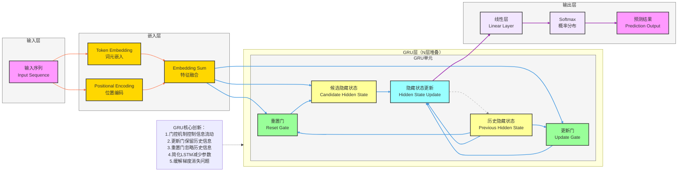

**标准 GRU 模型架构图**（循环神经网络变体，核心：**门控机制、更新门、重置门**），风格和项目全套深度学习架构完全统一，可直接用于笔记/PPT。

# GRU 完整架构流程图（基础版）

---

# GRU 极简核心总结

1. **定位**：**循环神经网络**变体，解决长序列依赖和梯度消失问题
2. **核心Backbone**：**门控循环单元**，包含重置门、更新门和历史隐藏状态
3. **最大创新**
    - **门控机制**：通过更新门和重置门控制信息流动
    - **简化结构**：相比LSTM减少了一个门和记忆单元
    - **参数效率**：参数数量少于LSTM，训练更快
    - **梯度传播**：缓解了RNN的梯度消失问题
    - **循环连接**：隐藏状态的循环更新机制
4. **结构范式**
输入 → 嵌入+位置编码 → GRU层（重置门+更新门+候选隐藏状态+历史隐藏状态）→ 线性层+Softmax → 输出
5. **核心公式**
    - 重置门：r_t = σ(W_r · [h_{t-1}, x_t])
    - 更新门：z_t = σ(W_z · [h_{t-1}, x_t])
    - 候选隐藏状态：ĥ_t = tanh(W_h · [r_t ⊙ h_{t-1}, x_t])
    - 隐藏状态更新：h_t = (1 - z_t) ⊙ h_{t-1} + z_t ⊙ ĥ_t