**详细版 GRU 模型架构图**（循环神经网络变体，完整维度信息标注，核心：**门控机制、更新门、重置门**），风格和项目全套深度学习架构完全统一，可直接用于技术文档/代码实现。

# GRU 完整架构流程图（详细版）

```mermaid
flowchart LR
    %% 统一样式（和Transformer/TimesNet/YOLO/SimCLR风格一致）
    classDef inputStyle fill:#f9f,stroke:#333,stroke-width:2px,rounded:8px
    classDef embedStyle fill:#ffd700,stroke:#333,stroke-width:2px,rounded:8px
    classDef blockStyle fill:#9ff,stroke:#333,stroke-width:2px,rounded:8px
    classDef gateStyle fill:#9f9,stroke:#333,stroke-width:2px,rounded:8px
    classDef hiddenStyle fill:#ff9,stroke:#333,stroke-width:2px,rounded:8px
    classDef activeStyle fill:#aaffaa,stroke:#333,stroke-width:2px,rounded:8px
    classDef headStyle fill:#f2e6ff,stroke:#333,stroke-width:2px,rounded:8px
    classDef subgraphStyle fill:#f5f5f5,stroke:#666,stroke-width:1px,rounded:10px
    classDef coreNoteStyle fill:#fff8e6,stroke:#ffb74d,stroke-width:1px,rounded:8px

    %% 1. 输入层
    subgraph InputLayer["输入层"]
        A["输入序列<br/>Input Sequence [batch, seq_len]"]:::inputStyle
    end
    class InputLayer subgraphStyle

    %% 2. 嵌入层
    subgraph EmbedLayer["嵌入层"]
        B["Token Embedding<br/>词元嵌入 [batch, seq_len, embedding_dim]"]:::embedStyle
        C["Positional Encoding<br/>位置编码 [batch, seq_len, embedding_dim]"]:::embedStyle
        D["Embedding Sum<br/>特征融合 [batch, seq_len, embedding_dim]"]:::embedStyle
    end
    class EmbedLayer subgraphStyle

    %% 3. GRU层
    subgraph GRULayer["GRU层（N层堆叠）"]
        %% 单个GRU单元
        subgraph GRUCell["GRU单元"]
            P["历史隐藏状态<br/>Previous Hidden State [batch, hidden_dim]"]:::hiddenStyle
            subgraph ResetGate["重置门（核心）"]
                E1["Linear<br/>线性变换 [batch, hidden_dim]"]:::gateStyle
                E2["Sigmoid<br/>激活函数 [batch, hidden_dim]"]:::activeStyle
            end
            subgraph UpdateGate["更新门（核心）"]
                F1["Linear<br/>线性变换 [batch, hidden_dim]"]:::gateStyle
                F2["Sigmoid<br/>激活函数 [batch, hidden_dim]"]:::activeStyle
            end
            subgraph CandidateHidden["候选隐藏状态（核心）"]
                G1["Element-wise Multiply<br/>元素级乘法 [batch, hidden_dim]"]:::hiddenStyle
                G2["Linear<br/>线性变换 [batch, hidden_dim]"]:::hiddenStyle
                G3["Tanh<br/>激活函数 [batch, hidden_dim]"]:::activeStyle
            end
            subgraph HiddenUpdate["隐藏状态更新"]
                H1["Element-wise Multiply<br/>元素级乘法 [batch, hidden_dim]"]:::blockStyle
                H2["Element-wise Multiply<br/>元素级乘法 [batch, hidden_dim]"]:::blockStyle
                H3["Add<br/>加法 [batch, hidden_dim]"]:::blockStyle
            end
        end
        class GRUCell subgraphStyle
    end
    class GRULayer subgraphStyle

    %% 4. 输出层
    subgraph OutputLayer["输出层"]
        I["线性层<br/>Linear Layer [batch, seq_len, vocab_size]"]:::headStyle
        J["Softmax<br/>概率分布 [batch, seq_len, vocab_size]"]:::headStyle
        K["预测结果<br/>Prediction Output [batch, seq_len]"]:::inputStyle
    end
    class OutputLayer subgraphStyle

    %% 核心注释（GRU创新点）
    Note["GRU 核心创新：<br/>1. 门控机制控制信息流动<br/>2. 更新门决定保留多少历史信息<br/>3. 重置门决定忽略多少历史信息<br/>4. 简化LSTM结构，减少参数<br/>5. 缓解梯度消失问题<br/><br/>维度说明：batch=批量大小, seq_len=序列长度, embedding_dim=嵌入维度, hidden_dim=隐藏层维度, vocab_size=词表大小"]:::coreNoteStyle

    %% ========== 数据流（拆分为单行，避免语法粘连） ==========
    A --> B
    B --> D
    A --> C
    C --> D

    D --> E1
    P --> E1
    E1 --> E2
    E2 --> G1
    D --> F1
    P --> F1
    F1 --> F2
    F2 --> H1
    G1 --> G2
    P --> G1
    G2 --> G3
    G3 --> H2
    P --> H1
    H1 --> H3
    H2 --> H3
    H3 --> P

    H3 --> I
    I --> J
    J --> K

    %% ========== 注释节点连接（单独成行，避免粘连） ==========
    Note -.-> GRULayer

    %% ========== 连接线样式（重新校准索引，匹配所有单行连接） ==========

    linkStyle 0,1,2,3 stroke:#ff7043,stroke-width:1.5px
    linkStyle 4,5,6,7,8,9,10,11,12,13,14,15,16,17,18,19 stroke:#4299e1,stroke-width:2px
    linkStyle 20,21,22 stroke:#9c27b0,stroke-width:2px
    linkStyle 23 stroke:#888,stroke-width:1px,stroke-dasharray:5,5
```


---

# GRU 详细数据流转逻辑

## 输入层
- **输入格式**：序列输入
  - 输入序列：`[batch, seq_len]`
  - `batch`：批量大小
  - `seq_len`：序列长度
- **输入示例**：文本序列的词索引

## 嵌入层
1. **词元嵌入（Token Embedding）**
   - 将词索引映射到高维嵌入空间
   - 输出形状：`[batch, seq_len, embedding_dim]`
   - `embedding_dim`：嵌入维度（如 128）
2. **位置编码（Positional Encoding）**
   - 显式注入序列位置信息
   - 输出形状：`[batch, seq_len, embedding_dim]`
3. **特征融合（Embedding Sum）**
   - 词元嵌入与位置编码相加
   - 输出形状：`[batch, seq_len, embedding_dim]`

## GRU层（N层堆叠）
### 单个GRU单元
1. **历史隐藏状态（Previous Hidden State）**
   - 输入形状：`[batch, hidden_dim]`
   - 表示：`h_{t-1}`，上一时刻的隐藏状态
2. **重置门（Reset Gate）**
   - 计算：`r_t = sigmoid(W_r · [h_{t-1}, x_t] + b_r)`
   - 输出形状：`[batch, hidden_dim]`
   - `hidden_dim`：隐藏层维度（如 256）
3. **更新门（Update Gate）**
   - 计算：`z_t = sigmoid(W_z · [h_{t-1}, x_t] + b_z)`
   - 输出形状：`[batch, hidden_dim]`
4. **候选隐藏状态（Candidate Hidden State）**
   - 计算：`h_t' = tanh(W_h · [r_t ⊙ h_{t-1}, x_t] + b_h)`
   - 输出形状：`[batch, hidden_dim]`
5. **隐藏状态更新**
   - 计算：`h_t = (1 - z_t) ⊙ h_{t-1} + z_t ⊙ h_t'`
   - 输出形状：`[batch, hidden_dim]`
   - 循环连接：`h_t` 作为下一时刻的历史隐藏状态 `h_{t-1}`

## 输出层
1. **线性层（Linear Layer）**
   - 将隐藏状态映射到词表大小
   - 输出形状：`[batch, seq_len, vocab_size]`
   - `vocab_size`：词表大小
2. **Softmax**
   - 概率归一化（推理时使用）
   - 输出形状：`[batch, seq_len, vocab_size]`
3. **预测结果**
   - 输出最终预测的词索引
   - 输出形状：`[batch, seq_len]`

## 完整数据流转路径（含维度）

### 示例说明
假设我们有一个词表大小为10000的模型：

- 输入：`[32, 10]` （32个样本，每个样本10个词）
- 嵌入层输出：`[32, 10, 128]` （128维嵌入）
- GRU层输出：`[32, 10, 256]` （256维隐藏状态）
- 线性层输出：`[32, 10, 10000]` （10000维词表空间）
- Softmax输出：`[32, 10, 10000]` （概率分布）
- 预测结果：`[32, 10]` （每个位置预测一个词索引）

这样，模型就能完成从输入序列到预测序列的转换，其中vocab_size是连接模型内部表示和最终词预测的关键维度。

### GRU完整路径

> 注：图中GRU单元展示的是单个时间步的处理结构（维度为[batch, hidden_dim]），而GRU层输出是整个序列的隐藏状态序列（维度为[batch, seq_len, hidden_dim]）。

```
输入序列 [batch, seq_len]
    ↓
词元嵌入 [batch, seq_len, embedding_dim] + 位置编码 [batch, seq_len, embedding_dim]
    ↓
特征融合 [batch, seq_len, embedding_dim]
    ↓
GRU层（N层堆叠）
    ├─ 历史隐藏状态 [batch, hidden_dim]  # 单个时间步的隐藏状态
    ├─ 重置门 [batch, hidden_dim]         # 单个时间步的重置门输出
    ├─ 更新门 [batch, hidden_dim]         # 单个时间步的更新门输出
    ├─ 候选隐藏状态 [batch, hidden_dim]   # 单个时间步的候选隐藏状态
    └─ 隐藏状态更新 [batch, hidden_dim]   # 单个时间步的隐藏状态更新
        ↓
        历史隐藏状态 [batch, hidden_dim]（循环连接）  # 传递给下一个时间步
    ↓
GRU输出 [batch, seq_len, hidden_dim]  # 整个序列的隐藏状态序列
    ↓
线性层 [batch, seq_len, vocab_size]
    ↓
Softmax [batch, seq_len, vocab_size]
    ↓
预测结果 [batch, seq_len]
```

---

### 快速预览（一行式）
输入序列 [batch, seq_len] → 嵌入 [batch, seq_len, embedding_dim] → GRU层 [batch, seq_len, hidden_dim] → 线性层 [batch, seq_len, vocab_size] → 预测 [batch, seq_len]

## 关键技术点
- **门控机制**：通过重置门和更新门控制信息流动
- **历史隐藏状态**：存储和传递序列的历史信息，是GRU循环特性的核心
- **重置门**：决定如何组合新输入和之前的隐藏状态
- **更新门**：决定保留多少历史信息和新信息
- **候选隐藏状态**：基于重置门的输出计算新的隐藏状态候选
- **隐藏状态更新**：通过更新门平衡历史信息和新信息
- **循环连接**：隐藏状态的循环更新机制，实现序列信息的传递
- **参数效率**：相比LSTM减少了一个门和记忆单元，参数更少
- **梯度传播**：门控机制有助于缓解梯度消失问题