## seq2seq 模型架构图基础版

### 📍 **定位**
- **领域**：自然语言处理 (NLP)
- **应用场景**：机器翻译、文本摘要、对话系统、问答系统等序列到序列任务
- **核心价值**：解决变长序列到变长序列的映射问题

### 🏗️ **核心 Backbone**
- **编码器 (Encoder)**：RNN/LSTM/GRU 网络，将输入序列编码为隐藏状态序列
- **解码器 (Decoder)**：RNN/LSTM/GRU 网络，根据上下文向量生成目标序列
- **注意力机制 (Attention)**：增强解码器对输入序列不同位置的关注度

### 💡 **最大创新**
- 引入注意力机制，解决长序列建模时的信息丢失问题
- 实现端到端的序列生成，无需传统的对齐步骤
- 支持变长输入和输出序列的灵活处理

### 🔄 **结构范式**

```mermaid
flowchart LR
    %% 统一样式（和Transformer风格一致）
    classDef inputStyle fill:#f9f,stroke:#333,stroke-width:2px,rounded:8px
    classDef embedStyle fill:#ffd700,stroke:#333,stroke-width:2px,rounded:8px
    classDef blockStyle fill:#9ff,stroke:#333,stroke-width:2px,rounded:8px
    classDef attnStyle fill:#9f9,stroke:#333,stroke-width:2px,rounded:8px
    classDef contextStyle fill:#ffd700,stroke:#333,stroke-width:2px,rounded:8px
    classDef decoderStyle fill:#9f9,stroke:#333,stroke-width:2px,rounded:8px
    classDef outputStyle fill:#ff9,stroke:#333,stroke-width:2px,rounded:8px
    classDef subgraphStyle fill:#f5f5f5,stroke:#666,stroke-width:1px,rounded:10px
    classDef coreNoteStyle fill:#fff8e6,stroke:#ffb74d,stroke-width:1px,rounded:8px

    %% 输入层
    subgraph InputLayer["输入层"]
        A["输入序列<br/>X = (x1, x2, ..., xn)"]:::inputStyle
    end
    class InputLayer subgraphStyle

    %% 目标输入层
    subgraph TargetInputLayer["目标输入层"]
        Q["目标序列<br/>Y = (y0, y1, ..., y_{m-1})"]:::inputStyle
    end
    class TargetInputLayer subgraphStyle

    %% 嵌入层
    subgraph EmbedLayer["嵌入层"]
        B["词嵌入<br/>Embedding"]:::embedStyle
        C["输入嵌入向量<br/>x_emb: [n, embedding_dim]"]:::embedStyle
        P["目标嵌入向量<br/>y_emb: [1, embedding_dim]"]:::embedStyle
    end
    class EmbedLayer subgraphStyle

    %% 编码器层
    subgraph EncoderLayer["编码器层"]
        D["RNN/LSTM/GRU<br/>编码器"]:::blockStyle
        E["隐藏状态序列<br/>H: [n, hidden_dim]"]:::blockStyle
    end
    class EncoderLayer subgraphStyle

    %% 注意力机制
    subgraph AttentionLayer["注意力机制"]
        F["注意力计算<br/>α = softmax(Q·K^T)"]:::attnStyle
        G["上下文向量<br/>c_t: [hidden_dim]"]:::contextStyle
    end
    class AttentionLayer subgraphStyle

    %% 解码器层
    subgraph DecoderLayer["解码器层"]
        H["RNN/LSTM/GRU<br/>解码器"]:::decoderStyle
        I["隐藏状态<br/>s_t: [hidden_dim]"]:::decoderStyle
        J["输出概率分布<br/>P(y_t): [vocab_size]"]:::decoderStyle
    end
    class DecoderLayer subgraphStyle

    %% 输出层
    subgraph OutputLayer["输出层"]
        K["输出序列<br/>Y = (y1, y2, ..., ym)"]:::outputStyle
    end
    class OutputLayer subgraphStyle

    %% 核心注释
    Note["seq2seq 核心创新：<br/>1. 注意力机制解决长距离依赖<br/>2. 端到端序列生成<br/>3. 变长序列处理能力<br/>4. 教师强制加速训练"]:::coreNoteStyle

    %% 数据流
    A -->|输入单词索引| B
    B -->|输入词嵌入| C
    C -->|输入序列| D
    D -->|编码特征| E
    E -->|注意力输入| F
    H -->|查询向量| F
    F -->|注意力权重| G
    G -->|上下文信息| H
    Q -->|目标单词索引| B
    B -->|目标词嵌入| P
    P -->|目标嵌入| H
    K -->|教师强制| Q
    H -->|隐藏状态| I
    I -->|输入| H
    H -->|生成概率| J
    J -->|采样/贪婪| K

    %% 连接线样式
    linkStyle 0,1,2,3,4,5,6,7,8,9,10,11,12,13,14,15 stroke:#666,stroke-width:1.5px,arrowheadStyle:filled

    %% 注释连接
    Note -.-> AttentionLayer
```

### 📊 **性能指标**
- **机器翻译**：BLEU 分数
- **文本摘要**：ROUGE 分数
- **对话系统**：困惑度 (Perplexity)、人工评估
- **优势**：端到端训练、无需人工特征工程、适应不同长度的序列
- **局限性**：训练时间长、推理速度较慢、处理长序列仍有挑战