## seq2seq 模型架构图详细版

### 📍 **定位**
- **领域**：自然语言处理 (NLP)
- **应用场景**：机器翻译、文本摘要、对话系统、问答系统等序列到序列任务
- **核心价值**：解决变长序列到变长序列的映射问题，通过注意力机制捕捉长距离依赖

### 🏗️ **核心 Backbone**
- **编码器 (Encoder)**：RNN/LSTM/GRU 网络，将输入序列编码为隐藏状态序列
- **解码器 (Decoder)**：RNN/LSTM/GRU 网络，根据上下文向量生成目标序列
- **注意力机制 (Attention)**：计算解码器对编码器隐藏状态的关注度，生成上下文向量

### 💡 **最大创新**
- 注意力机制的引入，解决了传统seq2seq模型在处理长序列时的信息瓶颈
- 端到端的序列生成框架，无需人工特征工程和对齐步骤
- 灵活的变长序列处理能力，适应不同长度的输入输出

### 🔄 **结构范式（含详细维度）**

```mermaid
flowchart LR
    %% 统一样式（和Transformer风格一致）
    classDef inputStyle fill:#f9f,stroke:#333,stroke-width:2px,rounded:8px
    classDef embedStyle fill:#ffd700,stroke:#333,stroke-width:2px,rounded:8px
    classDef blockStyle fill:#9ff,stroke:#333,stroke-width:2px,rounded:8px
    classDef attnStyle fill:#9f9,stroke:#333,stroke-width:2px,rounded:8px
    classDef contextStyle fill:#ffd700,stroke:#333,stroke-width:2px,rounded:8px
    classDef decoderStyle fill:#9f9,stroke:#333,stroke-width:2px,rounded:8px
    classDef outputStyle fill:#ff9,stroke:#333,stroke-width:2px,rounded:8px
    classDef subgraphStyle fill:#f5f5f5,stroke:#666,stroke-width:1px,rounded:10px
    classDef coreNoteStyle fill:#fff8e6,stroke:#ffb74d,stroke-width:1px,rounded:8px

    %% 输入层
    subgraph InputLayer["输入层"]
        A["输入序列<br/>X = (x1, x2, ..., xn) [n, batch_size]"]:::inputStyle
    end
    class InputLayer subgraphStyle

    %% 目标输入层
    subgraph TargetInputLayer["目标输入层"]
        Q["目标序列<br/>Y = (y0, y1, ..., y_{m-1}) [m, batch_size]"]:::inputStyle
    end
    class TargetInputLayer subgraphStyle

    %% 嵌入层
    subgraph EmbedLayer["嵌入层"]
        B["词嵌入<br/>Embedding"]:::embedStyle
        C["输入嵌入向量<br/>x_emb: [n, batch_size, embedding_dim]"]:::embedStyle
        P["目标嵌入向量<br/>y_emb: [1, batch_size, embedding_dim]"]:::embedStyle
    end
    class EmbedLayer subgraphStyle

    %% 编码器层
    subgraph EncoderLayer["编码器层"]
        D["RNN/LSTM/GRU<br/>编码器"]:::blockStyle
        E["隐藏状态序列<br/>H: [n, batch_size, hidden_dim]"]:::blockStyle
        F["最终隐藏状态<br/>h_n: [n_layers, batch_size, hidden_dim]"]:::blockStyle
        F2["最终细胞状态<br/>c_n: [n_layers, batch_size, hidden_dim]"]:::blockStyle
    end
    class EncoderLayer subgraphStyle

    %% 注意力机制
    subgraph AttentionLayer["注意力机制"]
        G["注意力计算<br/>energy = tanh(W·[s_{t-1}[-1]; h_i])"]:::attnStyle
        H["注意力权重<br/>α: [n, batch_size]"]:::attnStyle
        I["上下文向量<br/>c_t: [batch_size, hidden_dim]"]:::contextStyle
    end
    class AttentionLayer subgraphStyle

    %% 解码器层
    subgraph DecoderLayer["解码器层"]
        J["RNN/LSTM/GRU<br/>解码器"]:::decoderStyle
        K["解码器隐藏状态<br/>s_t: [n_layers, batch_size, hidden_dim]"]:::decoderStyle
        K2["解码器细胞状态<br/>c_cell_t: [n_layers, batch_size, hidden_dim]"]:::decoderStyle
        L["输出投影<br/>Linear Layer"]:::decoderStyle
        M["输出概率分布<br/>P(y_t): [batch_size, vocab_size]"]:::decoderStyle
    end
    class DecoderLayer subgraphStyle

    %% 输出层
    subgraph OutputLayer["输出层"]
        O["输出序列<br/>Y = (y1, y2, ..., ym) [m, batch_size]"]:::outputStyle
    end
    class OutputLayer subgraphStyle

    %% 核心注释
    Note["seq2seq 核心创新：<br/>1. 注意力机制解决长距离依赖<br/>2. 端到端序列生成<br/>3. 变长序列处理能力<br/>4. 教师强制加速训练<br/><br/>维度说明：n=输入序列长度, m=输出序列长度, n_layers=网络层数, embedding_dim=词嵌入维度, hidden_dim=隐藏层维度, vocab_size=词汇表大小, batch_size=批处理大小"]:::coreNoteStyle

    %% 数据流
    A -->|输入单词索引| B
    B -->|输入词嵌入| C
    C -->|输入序列| D
    D -->|编码| E
    D -->|最终隐藏状态| F
    D -->|最终细胞状态| F2
    E -->|隐藏状态序列| G
    F -->|初始隐藏状态| J
    F2 -->|初始细胞状态| J
    G -->|注意力权重| H
    H -->|加权求和| I
    I -->|上下文信息| J
    Q -->|目标单词索引| B
    B -->|目标词嵌入| P
    P -->|目标嵌入| J
    O -->|教师强制| Q
    J -->|隐藏状态| K
    J -->|细胞状态| K2
    K -->|查询向量| G
    K2 -->|细胞状态| J
    K -->|投影| L
    L -->|概率分布| M
    M -->|采样/贪婪| O

    %% 连接线样式
    linkStyle 0,1,2,3,4,5,6,7,8,9,10,11,12,13,14,15,16,17,18,19 stroke:#666,stroke-width:1.5px,arrowheadStyle:filled

    %% 注释连接
    Note -.-> AttentionLayer
```


### 📊 **详细维度变换过程**

#### 1. 输入处理
- **输入序列**：`X = (x1, x2, ..., xn)`，长度为 `n` 的单词索引序列，维度为 `[n, batch_size]`
- **词嵌入**：`x_emb = Embedding(x)`，维度为 `[n, batch_size, embedding_dim]`

#### 2. 编码器处理
- **编码器输入**：`x_emb`，维度为 `[n, batch_size, embedding_dim]`
- **编码器隐藏状态**：`H = (h1, h2, ..., hn)`，每个 `hi` 维度为 `[batch_size, hidden_dim]`，整体维度为 `[n, batch_size, hidden_dim]`
- **最终隐藏状态**：`h_n`，维度为 `[n_layers, batch_size, hidden_dim]`，作为解码器的初始隐藏状态
- **最终细胞状态**：`c_n`，维度为 `[n_layers, batch_size, hidden_dim]`，作为解码器的初始细胞状态

#### 3. 注意力机制计算
对于解码器第 `t` 步：
- **查询向量**：使用解码器上一步的隐藏状态的最后一层 `s_{t-1}[-1]`，维度为 `[batch_size, hidden_dim]`
- **键向量**：使用编码器的隐藏状态序列 `H`，维度为 `[n, batch_size, hidden_dim]`
- **注意力计算**：`energy = tanh(W · [s_{t-1}[-1]; h_i])`，其中 `W` 是可学习参数，结果维度为 `[n, batch_size, hidden_dim]`
- **注意力权重**：`α_t = softmax(energy)`，维度为 `[n, batch_size]`
- **上下文向量**：`c_t = Σ(α_t,i · h_i)`，维度为 `[batch_size, hidden_dim]`

#### 4. 解码器处理
- **目标序列嵌入**：`y_{t-1}_emb = Embedding(y_{t-1})`，维度为 `[batch_size, embedding_dim]`
- **解码器输入**：`[y_{t-1}_emb; c_t]`，维度为 `[batch_size, embedding_dim + hidden_dim]`，扩展为 `[1, batch_size, embedding_dim + hidden_dim]`
- **解码器隐藏状态**：`s_t = RNN([y_{t-1}_emb; c_t], (s_{t-1}, c_{t-1}))`，维度为 `[n_layers, batch_size, hidden_dim]`
- **解码器细胞状态**：`c_t`，维度为 `[n_layers, batch_size, hidden_dim]`
- **输出计算**：`o_t = W_o · s_t[-1]`，维度为 `[batch_size, vocab_size]`
- **概率分布**：`P(y_t) = softmax(o_t)`，维度为 `[batch_size, vocab_size]`

### 🔧 **核心组件详解**

#### 1. 编码器 (Encoder)
- **结构**：多层 RNN/LSTM/GRU 网络
- **输入**：词嵌入序列 `[n, batch_size, embedding_dim]`
- **输出**：隐藏状态序列 `[n, batch_size, hidden_dim]`、最终隐藏状态 `[n_layers, batch_size, hidden_dim]` 和最终细胞状态 `[n_layers, batch_size, hidden_dim]`
- **作用**：将输入序列编码为连续的语义表示

#### 2. 注意力机制 (Attention)
- **计算步骤**：
  1. 计算查询向量（解码器最后一层隐藏状态）与所有键向量（编码器隐藏状态）的相似度
  2. 对相似度进行 softmax 得到注意力权重
  3. 使用权重对值向量（编码器隐藏状态）进行加权求和得到上下文向量
- **优势**：允许解码器动态关注输入序列的不同部分，解决长距离依赖问题

#### 3. 解码器 (Decoder)
- **结构**：多层 RNN/LSTM/GRU 网络
- **输入**：前一步输出 `y_{t-1}` 的嵌入 `[batch_size, embedding_dim]` 和上下文向量 `c_t` `[batch_size, hidden_dim]`，合并后维度为 `[1, batch_size, embedding_dim + hidden_dim]`
- **输出**：当前步的预测概率分布 `P(y_t)` `[batch_size, vocab_size]`
- **训练技巧**：使用教师强制 (Teacher Forcing) 加速训练

### 📈 **性能指标**
- **机器翻译**：BLEU 分数（评估翻译质量）
- **文本摘要**：ROUGE 分数（评估摘要质量）
- **对话系统**：困惑度 (Perplexity)、人工评估（流畅度、相关性）
- **问答系统**：准确率、F1 分数

### 💻 **代码实现示例**

```python
import torch
import torch.nn as nn

class Seq2Seq(nn.Module):
    def __init__(self, input_dim, output_dim, embedding_dim, hidden_dim, n_layers, dropout):
        super().__init__()
        # 编码器
        self.encoder = nn.LSTM(embedding_dim, hidden_dim, n_layers, dropout=dropout)
        # 解码器
        self.decoder = nn.LSTM(embedding_dim + hidden_dim, hidden_dim, n_layers, dropout=dropout)
        # 注意力机制
        self.attention = nn.Linear(hidden_dim * 2, hidden_dim)
        self.v = nn.Linear(hidden_dim, 1, bias=False)
        # 输出层
        self.fc_out = nn.Linear(hidden_dim, output_dim)
        # 词嵌入
        self.embedding = nn.Embedding(input_dim, embedding_dim)
        self.dropout = nn.Dropout(dropout)
    
    def forward(self, src, trg):
        # src: [src_len, batch_size]
        # trg: [trg_len, batch_size]
        batch_size = src.shape[1]
        trg_len = trg.shape[0]
        output_dim = self.fc_out.out_features
        
        # 编码器前向传播
        embedded_src = self.dropout(self.embedding(src))  # [src_len, batch_size, embedding_dim]
        encoder_outputs, (hidden, cell) = self.encoder(embedded_src)  # encoder_outputs: [src_len, batch_size, hidden_dim]
        
        # 解码器前向传播
        outputs = torch.zeros(trg_len, batch_size, output_dim).to(src.device)
        embedded_trg = self.embedding(trg[0, :])  # [batch_size, embedding_dim]
        
        for t in range(1, trg_len):
            # 注意力计算
            hidden_reshaped = hidden[-1].unsqueeze(0).repeat(src.shape[0], 1, 1)  # [src_len, batch_size, hidden_dim]
            energy = torch.tanh(self.attention(torch.cat((hidden_reshaped, encoder_outputs), dim=2)))  # [src_len, batch_size, hidden_dim]
            attention = self.v(energy).squeeze(2)  # [src_len, batch_size]
            weights = torch.softmax(attention, dim=0)  # [src_len, batch_size]
            context = torch.bmm(weights.unsqueeze(1), encoder_outputs.permute(1, 0, 2)).squeeze(1)  # [batch_size, hidden_dim]
            
            # 解码器输入
            decoder_input = torch.cat((embedded_trg, context), dim=1).unsqueeze(0)  # [1, batch_size, embedding_dim + hidden_dim]
            
            # 解码器前向传播
            output, (hidden, cell) = self.decoder(decoder_input, (hidden, cell))  # output: [1, batch_size, hidden_dim]
            
            # 输出预测
            prediction = self.fc_out(output.squeeze(0))  # [batch_size, output_dim]
            outputs[t] = prediction
            
            # 教师强制
            embedded_trg = self.embedding(trg[t])  # [batch_size, embedding_dim]
        
        return outputs
```

### 🎯 **使用场景与限制**

#### **适用场景**
- 机器翻译：将一种语言翻译成另一种语言
- 文本摘要：生成原文的简短摘要
- 对话系统：生成对话回复
- 问答系统：根据问题生成答案
- 代码生成：根据自然语言描述生成代码

#### **局限性**
- 训练时间长，计算资源需求高
- 推理速度较慢，不适合实时应用
- 处理非常长的序列时仍有挑战
- 可能生成重复或不连贯的内容

### 🔍 **模型变体**
- **双向编码器**：BiLSTM/BiGRU 编码器，捕捉双向上下文信息
- **多层注意力**：堆叠多个注意力层，增强建模能力
- **指针网络**：处理OOV（未登录词）问题
- **Transformer**：完全基于注意力机制的seq2seq模型，替代RNN结构