**详细版 TimesNet 架构图**（时序预测SOTA模型，完整维度信息标注，严格贴合论文核心：**1D时序→2D周期变换、时序分解、多尺度时间卷积、TimesBlock堆叠**），风格和你之前全套深度学习架构完全统一，可直接用于技术文档/代码实现。

# TimesNet 完整架构流程图（详细版）

```mermaid
flowchart LR
    %% 统一样式（和Transformer/YOLO/SimCLR风格一致）
    classDef inputStyle fill:#f9f,stroke:#333,stroke-width:2px,rounded:8px
    classDef embedStyle fill:#ffd700,stroke:#333,stroke-width:2px,rounded:8px
    classDef blockStyle fill:#9ff,stroke:#333,stroke-width:2px,rounded:8px
    classDef convStyle fill:#9f9,stroke:#333,stroke-width:2px,rounded:8px
    classDef decompStyle fill:#ff9,stroke:#333,stroke-width:2px,rounded:8px
    classDef headStyle fill:#f2e6ff,stroke:#333,stroke-width:2px,rounded:8px
    classDef activeStyle fill:#aaffaa,stroke:#333,stroke-width:2px,rounded:8px
    classDef subgraphStyle fill:#f5f5f5,stroke:#666,stroke-width:1px,rounded:10px
    classDef coreNoteStyle fill:#fff8e6,stroke:#ffb74d,stroke-width:1px,rounded:8px

    %% 1. 输入层
    subgraph InputLayer["输入层"]
        A["一维时间序列<br/>Input Time Series [batch, seq_len, input_dim]"]:::inputStyle
    end
    class InputLayer subgraphStyle

    %% 2. 嵌入层
    subgraph EmbedLayer["时序嵌入层"]
        B["Value Embedding<br/>数值嵌入 [batch, seq_len, d_model]"]:::embedStyle
        C["Positional Embedding<br/>位置嵌入 [batch, seq_len, d_model]"]:::embedStyle
        D["Embedding Sum<br/>特征融合 [batch, seq_len, d_model]"]:::embedStyle
    end
    class EmbedLayer subgraphStyle

    %% 3. 核心：TimesBlock 堆叠（N层）
    subgraph TimesBlockStack["TimesBlock 堆叠 × N（核心）"]
        %% 单个TimesBlock
        subgraph TimesBlock["单层 TimesBlock"]
            %% 时序分解（趋势+季节+残差）
            subgraph STD["STD 时序分解"]
                E1["Trend 趋势项 [batch, seq_len, d_model]"]:::decompStyle
                E2["Seasonal 季节项 [batch, seq_len, d_model]"]:::decompStyle
                E3["Residual 残差项 [batch, seq_len, d_model]"]:::decompStyle
            end
            class STD subgraphStyle

            %% TimesNet核心创新：1D→2D周期变换
            F1["FFT 周期检测<br/>频域分析确定周期长度"]:::blockStyle
            F["1D→2D 周期变换<br/>按周期展开为二维矩阵 [batch, period, seq_len/period, d_model]"]:::blockStyle

            %% 多尺度时间卷积（Inception结构）
            subgraph MultiScaleConv["多尺度时间卷积"]
                G["Conv1×1<br/>短周期 [batch, period, seq_len/period, d_model]"]:::convStyle
                H["Conv3×3<br/>中周期 [batch, period, seq_len/period, d_model]"]:::convStyle
                I["Conv5×5<br/>长周期 [batch, period, seq_len/period, d_model]"]:::convStyle
            end
            class MultiScaleConv subgraphStyle

            J["Concat 特征拼接 [batch, period, seq_len/period, 3×d_model]"]:::convStyle
            K["Linear 投影<br/>周期特征融合 [batch, period, seq_len/period, d_model]"]:::convStyle
            K1["2D→1D 还原 [batch, seq_len, d_model]"]:::blockStyle

            %% 残差连接+层归一化
            L["Add & Layer Norm<br/>残差连接与层归一化 [batch, seq_len, d_model]"]:::blockStyle
        end
        class TimesBlock subgraphStyle
    end
    class TimesBlockStack subgraphStyle

    %% 4. 预测输出层
    subgraph OutputLayer["预测头"]
        M["Flatten 展平<br/>2D→1D [batch, seq_len, d_model]"]:::headStyle
        N["Linear 预测层<br/>输出预测序列 [batch, pred_len, output_dim]"]:::headStyle
        O["预测结果<br/>Forecasting Output [batch, pred_len, output_dim]"]:::inputStyle
    end
    class OutputLayer subgraphStyle

    %% 核心注释（TimesNet创新点）
    Note["TimesNet 核心创新：<br/>1. FFT 频域分析自动检测周期长度<br/>2. 1D时序转2D周期矩阵，用卷积捕获周期依赖<br/>3. 时序分解(STD)分离趋势/季节/噪声<br/>4. 多尺度卷积适配长短周期<br/>5. 专为长时序预测设计<br/><br/>维度说明：batch=批量大小, seq_len=历史序列长度, input_dim=输入维度, d_model=模型维度, period=周期长度, pred_len=预测长度, output_dim=输出维度"]:::coreNoteStyle

    %% 数据流
    A --> B --> D
    A --> C --> D

    D --> STD
    E2 --> F1 --> F --> G & H & I --> J --> K --> K1 --> L
    E1 --> L
    E3 --> L
    L --> M --> N --> O

    %% 连接线样式
    linkStyle 0,1,2,3 stroke:#ff7043,stroke-width:1.5px
    linkStyle 4,5,6,7,8,9,10,11,12,13,14,15 stroke:#4299e1,stroke-width:2px
    linkStyle 16,17,18,19 stroke:#9c27b0,stroke-width:2px

    %% 可选：将注释节点定位到合适位置（提升可读性）
    Note -.-> TimesBlockStack
```


---

# TimesNet 详细数据流转逻辑

## 输入层
- **输入格式**：一维时间序列数据，形状为 `[batch_size, seq_len, input_dim]`
  - `batch_size`：批量大小
  - `seq_len`：历史序列长度
  - `input_dim`：特征维度（单变量或多变量）
- **输入示例**：股票价格、气象数据、交通流量等时序数据

## 嵌入层
1. **数值嵌入（Value Embedding）**
   - 将原始时序数值映射到高维特征空间
   - 捕获时序数据的数值特征
   - 输出形状：`[batch, seq_len, d_model]`
2. **位置嵌入（Positional Embedding）**
   - 注入时间位置信息，使模型感知时序顺序
   - 避免位置信息丢失
   - 输出形状：`[batch, seq_len, d_model]`
3. **特征融合（Embedding Sum）**
   - 将数值嵌入和位置嵌入相加
   - 输出形状：`[batch, seq_len, d_model]`，其中 `d_model` 为模型维度

## TimesBlock 核心处理流程（N层堆叠）
### 1. 时序分解（STD）
- 将嵌入后的特征分解为三部分：
  - **趋势项（Trend）**：长期变化趋势，形状 `[batch, seq_len, d_model]`
  - **季节项（Seasonal）**：周期性变化模式，形状 `[batch, seq_len, d_model]`
  - **残差项（Residual）**：噪声和随机波动，形状 `[batch, seq_len, d_model]`

### 2. 周期检测与变换
- **FFT 周期检测**：对季节项进行频域分析，自动识别主要周期长度
- **1D→2D 周期变换**：根据检测到的周期长度，将一维时序数据重塑为二维周期矩阵
  - 输入：`[batch, seq_len, d_model]`
  - 输出：`[batch, period, seq_len/period, d_model]`，其中 `period` 为周期长度

### 3. 多尺度时间卷积
- **短周期卷积（Conv1×1）**：捕获短周期模式，保持维度不变 `[batch, period, seq_len/period, d_model]`
- **中周期卷积（Conv3×3）**：捕获中周期模式，保持维度不变 `[batch, period, seq_len/period, d_model]`
- **长周期卷积（Conv5×5）**：捕获长周期模式，保持维度不变 `[batch, period, seq_len/period, d_model]`
- **特征拼接**：将三个尺度的特征沿通道维度拼接，形状 `[batch, period, seq_len/period, 3×d_model]`
- **线性投影**：将拼接后的特征映射回原始维度，形状 `[batch, period, seq_len/period, d_model]`
- **2D→1D 还原**：将二维特征矩阵还原回一维，形状 `[batch, seq_len, d_model]`

### 4. 残差连接与层归一化
- 将趋势项、残差项与处理后的季节项相加
- 应用层归一化，稳定训练过程
- 输出形状：`[batch, seq_len, d_model]`

## 预测输出层
1. **展平（Flatten）**：将处理后的二维特征矩阵展平为一维，保持形状 `[batch, seq_len, d_model]`
2. **线性预测层**：将特征映射到预测目标维度，形状 `[batch, pred_len, output_dim]`
3. **预测结果**：输出未来时序预测值
   - 输出形状：`[batch, pred_len, output_dim]`
   - `pred_len`：预测序列长度
   - `output_dim`：输出特征维度

## 完整数据流转路径（含维度）

### 1. 输入与嵌入阶段
```
输入时序数据 [batch, seq_len, input_dim]
    ↓
数值嵌入 [batch, seq_len, d_model] + 位置嵌入 [batch, seq_len, d_model]
    ↓
特征融合 [batch, seq_len, d_model]
```

### 2. 时序分解阶段
```
时序分解
├─ 趋势项 [batch, seq_len, d_model]
├─ 季节项 [batch, seq_len, d_model]
└─ 残差项 [batch, seq_len, d_model]
```

### 3. 周期变换与卷积阶段（处理季节项）
```
FFT周期检测
    ↓
1D→2D周期变换 [batch, period, seq_len/period, d_model]
    ↓
多尺度卷积（各分支并行）
├─ Conv1×1 [batch, period, seq_len/period, d_model]
├─ Conv3×3 [batch, period, seq_len/period, d_model]
└─ Conv5×5 [batch, period, seq_len/period, d_model]
    ↓
特征拼接 [batch, period, seq_len/period, 3×d_model]
    ↓
线性投影 [batch, period, seq_len/period, d_model]
    ↓
2D→1D还原 [batch, seq_len, d_model]
```

### 4. 残差连接与预测阶段
```
趋势项 + 残差项 + 处理后的季节项
    ↓
残差连接+层归一化 [batch, seq_len, d_model]
    ↓
展平
    ↓
线性预测 [batch, pred_len, output_dim]
    ↓
预测结果 [batch, pred_len, output_dim]
```

---

### 快速预览（一行式）
输入时序数据 [batch, seq_len, input_dim] → 嵌入 [batch, seq_len, d_model] → 分解 → 1D→2D [batch, period, seq_len/period, d_model] → 多尺度卷积 → 拼接 [3×d_model] → 投影 → 2D→1D [batch, seq_len, d_model] → 预测 [batch, pred_len, output_dim]

## 关键技术点
- **自动周期检测**：无需手动指定周期长度，模型自适应学习
- **周期特征提取**：通过2D卷积高效捕获周期依赖关系
- **多尺度建模**：同时捕捉不同时间尺度的模式
- **时序分解**：分离不同成分，提高模型精度
- **端到端学习**：从原始时序到预测结果的端到端训练

