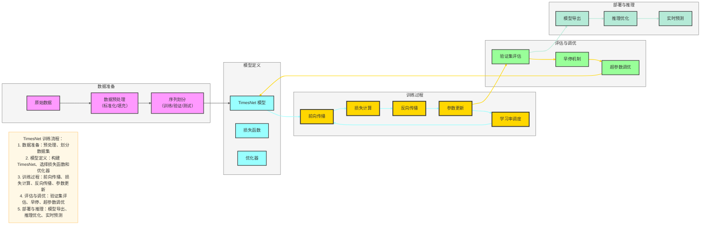

# TimesNet 训练与调参实践

## 一、数据预处理

### 1. 数据格式要求
- **输入形状**：(batch_size, seq_len, n_features)，其中：
  - batch_size：批量大小，通常为 32-128
  - seq_len：输入序列长度，根据任务需求设置（如 96、192、336 等）
  - n_features：特征维度，单变量时序为 1，多变量时序为特征数量

### 2. 预处理步骤
- **标准化**：
  - 方法：使用训练集的均值和标准差对所有数据进行归一化
  - 公式：
    
    $$
    X_{norm} = \frac{X - \mu}{\sigma}
    $$
  - 注意：标准化参数仅从训练集计算，避免数据泄露

- **缺失值处理**：
  - 方法：线性插值、前向填充、后向填充或使用 0 填充
  - 建议：优先使用线性插值，保持数据的连续性

- **异常值处理**：
  - 别名：离群值处理、异常检测与处理
  - 方法：
    - 统计方法：使用 IQR 方法（四分位数范围，Interquartile Range）、Z-score 方法（标准差法）识别异常值
    - 阈值方法：根据业务知识设置合理的阈值范围
    - 模型方法：使用 Isolation Forest（孤立森林）、DBSCAN（密度聚类）、One-Class SVM 等算法检测异常值
  - 处理策略：
    - 移除异常值：当异常值比例较小时
    - 替换异常值：使用均值、中位数或插值方法
    - 保留异常值：当异常值可能包含重要信息时

- **序列划分**：
  - 训练集：通常占 70-80%
  - 验证集：通常占 10-15%
  - 测试集：通常占 10-15%

## 二、损失函数选择

### 1. 回归任务
- **均方误差（MSE）**：
  - 公式：
    
    $$
    MSE = \frac{1}{n} \sum_{i=1}^{n} (y_i - \hat{y}_i)^2
    $$
  - 适用场景：数据分布较为均匀，无明显异常值

- **平均绝对误差（MAE）**：
  - 公式：
    
    $$
    MAE = \frac{1}{n} \sum_{i=1}^{n} |y_i - \hat{y}_i|
    $$
  - 适用场景：数据存在异常值，对离群点不敏感

- **Huber Loss**：
  - 公式：
    
    $$
    L_{\delta}(y, \hat{y}) = \begin{cases}
    \frac{1}{2}(y - \hat{y})^2, & |y - \hat{y}| \leq \delta \\
    \delta(|y - \hat{y}| - \frac{1}{2}\delta), & |y - \hat{y}| > \delta
    \end{cases}
    $$
  - 适用场景：结合 MSE 和 MAE 的优点，对异常值不敏感

### 2. 分类任务
- **交叉熵损失**：适用于时序分类任务

## 三、关键超参数调优

### 1. 模型结构参数
| 参数 | 建议范围 | 说明 |
|------|----------|------|
| TimesBlock 层数 | 3-6 | 层数越多，模型容量越大，但可能过拟合 |
| 隐藏维度 | 64-256 | 维度越高，表达能力越强，但计算成本增加 |
| 多尺度卷积核 | [1, 3, 5] | 固定配置，捕获不同尺度的周期 |
| 周期估计方法 | FFT/自相关 | FFT 适合周期性强的序列，自相关适合复杂序列 |

### 2. 训练参数
| 参数 | 建议范围 | 说明 |
|------|----------|------|
| 批量大小 | 32-128 | 批量越大，并行效率越高，但内存消耗增加 |
| 学习率 | 1e-4 - 1e-3 | 初始学习率，可使用学习率调度 |
| 学习率调度 | 余弦退火 | 逐渐降低学习率，提高模型稳定性 |
| 权重衰减 | 1e-5 - 1e-4 | 防止过拟合 |
|  dropout 率 | 0.1-0.3 | 防止过拟合，增强模型泛化能力 |
| 训练轮数 | 100-300 | 根据验证集性能早停 |

### 3. 调优策略
- **网格搜索**：对关键参数进行组合搜索
- **随机搜索**：在参数空间内随机采样，效率更高
- **贝叶斯优化**：利用历史搜索结果指导后续搜索，更高效

## 四、训练技巧

### 1. 早停（Early Stopping）
- **机制**：监控验证集性能，当性能不再提升时停止训练
- ** patience**：通常设置为 10-30 轮
- **好处**：防止过拟合，节省训练时间

### 2. 学习率调度
- **余弦退火**：学习率从初始值逐渐降低到接近 0
- **warmup**：初始阶段使用较小学习率，逐渐增加到目标值
- **好处**：稳定训练初期，提高模型收敛速度

### 3. 梯度裁剪
- **阈值**：通常设置为 1.0-5.0
- **好处**：防止梯度爆炸，稳定训练过程

### 4. 批量归一化
- **位置**：在卷积层后添加批归一化
- **好处**：加速训练收敛，提高模型稳定性

## 五、常见问题与解决方案

### 1. 过拟合
- **症状**：训练损失低，验证损失高
- **解决方案**：
  - 增加 dropout 率
  - 增加权重衰减：权重衰减是一种正则化方法，通过在损失函数中添加参数范数作为惩罚项来防止过拟合
    - **L1 正则**：添加参数的 L1 范数作为惩罚项，公式为 λΣ|w_i|（λ 是正则化系数，控制惩罚强度；Σ|w_i| 是所有参数绝对值的和），会促使参数趋向于 0，产生稀疏模型，实现特征选择
    - **L2 正则**：添加参数的 L2 范数作为惩罚项，公式为 λΣw_i²（λ 是正则化系数，控制惩罚强度；Σw_i² 是所有参数平方的和），会惩罚大的参数值，使模型更平滑，防止过拟合
  - 减少模型层数或隐藏维度
  - 使用数据增强

### 2. 梯度消失/爆炸
- **症状**：训练过程中梯度接近 0 或非常大
- **解决方案**：
  - 使用残差连接
  - 使用层归一化
  - 使用梯度裁剪
  - 调整学习率
  - 修改激活函数：使用ReLU、LeakyReLU、GELU等激活函数替代Sigmoid、Tanh等容易导致梯度消失的激活函数
  

### 3. 预测偏差
- **症状**：预测值系统性偏高或偏低
- **解决方案**：
  - 检查数据标准化是否正确
  - 调整损失函数
  - 增加模型容量

### 4. 计算效率
- **症状**：训练速度慢，内存不足
- **解决方案**：
  - 减小批量大小
  - 减小模型维度
  - 使用混合精度训练
  - 利用 GPU 加速

## 六、Mermaid 可视化：TimesNet 训练流程

