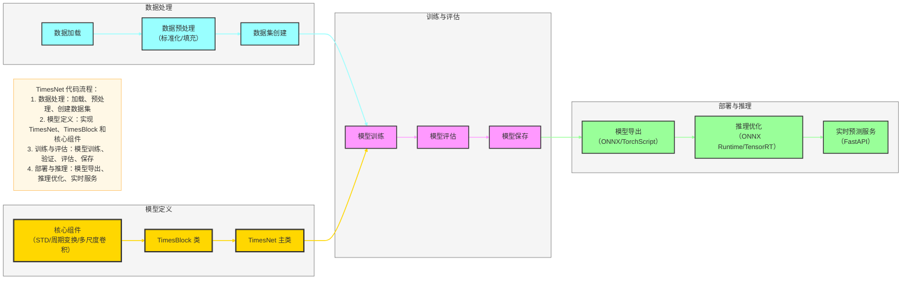
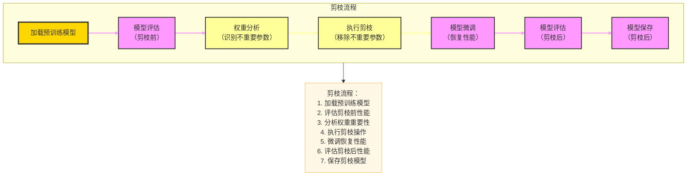
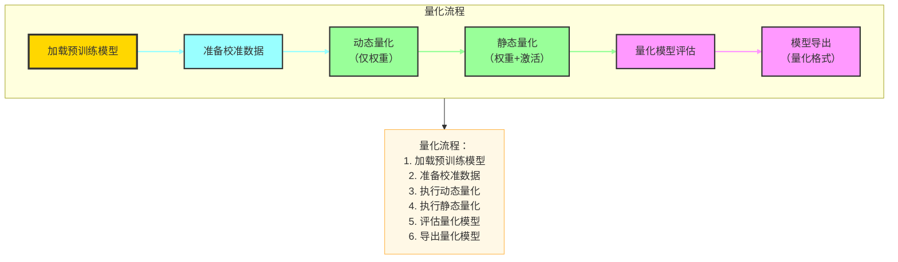
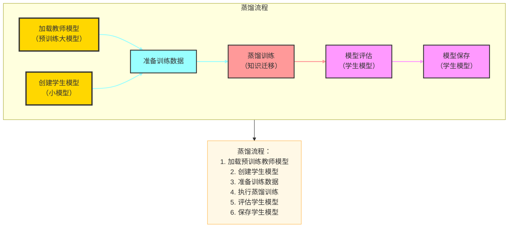

# TimesNet 代码实现与部署

## 一、Mermaid 可视化：TimesNet 代码流程



## 二、核心代码结构

### 1. 模型定义

#### TimesNet 主类
```python
import torch
import torch.nn as nn

class TimesNet(nn.Module):
    def __init__(self, seq_len, pred_len, hidden_dim=64, num_blocks=4):
        super(TimesNet, self).__init__()
        self.seq_len = seq_len
        self.pred_len = pred_len
        self.hidden_dim = hidden_dim
        
        # 嵌入层
        self.value_embedding = nn.Linear(1, hidden_dim)
        self.pos_embedding = nn.Parameter(torch.randn(seq_len, hidden_dim))
        
        # TimesBlock 堆叠
        self.blocks = nn.ModuleList([
            TimesBlock(hidden_dim) for _ in range(num_blocks)
        ])
        
        # 预测头
        self.flatten = nn.Flatten()
        self.linear = nn.Linear(seq_len * hidden_dim, pred_len)
    
    def forward(self, x):
        # 输入形状: (batch_size, seq_len, 1)
        batch_size = x.shape[0]
        
        # 嵌入
        x = self.value_embedding(x)
        x = x + self.pos_embedding
        
        # TimesBlock 处理
        for block in self.blocks:
            x = block(x)
        
        # 预测
        x = self.flatten(x)
        x = self.linear(x)
        
        return x
```

#### TimesBlock 类
```python
class TimesBlock(nn.Module):
    def __init__(self, hidden_dim):
        super(TimesBlock, self).__init__()
        self.hidden_dim = hidden_dim
        
        # STD 时序分解
        self.decompose = STDDecompose()
        
        # 1D→2D 周期变换
        self.transform = PeriodicTransform()
        
        # 多尺度卷积
        self.multi_scale_conv = MultiScaleConv(hidden_dim)
        
        # 残差连接和层归一化
        self.norm = nn.LayerNorm(hidden_dim)
    
    def forward(self, x):
        # 输入形状: (batch_size, seq_len, hidden_dim)
        batch_size, seq_len, hidden_dim = x.shape
        
        # STD 分解
        trend, seasonal = self.decompose(x)
        
        # 1D→2D 变换
        seasonal_2d = self.transform(seasonal)
        
        # 多尺度卷积
        seasonal_out = self.multi_scale_conv(seasonal_2d)
        
        # 残差连接
        out = trend + seasonal_out
        out = self.norm(out)
        
        return out
```

### 2. 核心组件实现

#### STD 时序分解
```python
class STDDecompose(nn.Module):
    def __init__(self, kernel_size=25):
        super(STDDecompose, self).__init__()
        self.kernel_size = kernel_size
        self.avg_pool = nn.AvgPool1d(kernel_size, stride=1, padding=kernel_size//2)
    
    def forward(self, x):
        # 输入形状: (batch_size, seq_len, hidden_dim)
        batch_size, seq_len, hidden_dim = x.shape
        
        # 趋势项：移动平均
        x = x.permute(0, 2, 1)
        trend = self.avg_pool(x)
        trend = trend.permute(0, 2, 1)
        
        # 季节项：原始值 - 趋势项
        seasonal = x.permute(0, 2, 1) - trend.permute(0, 2, 1)
        seasonal = seasonal.permute(0, 2, 1)
        
        return trend, seasonal
```

#### 1D→2D 周期变换
```python
class PeriodicTransform(nn.Module):
    def __init__(self):
        super(PeriodicTransform, self).__init__()
    
    def forward(self, x):
        # 输入形状: (batch_size, seq_len, hidden_dim)
        batch_size, seq_len, hidden_dim = x.shape
        
        # 简化版：假设周期 T=24（如日周期）
        T = 24
        if seq_len % T != 0:
            # 填充到 T 的倍数
            pad = T - (seq_len % T)
            x = nn.functional.pad(x, (0, 0, 0, pad))
            seq_len += pad
        
        # 1D→2D 变换
        x = x.view(batch_size, T, seq_len//T, hidden_dim)
        
        return x
```

#### 多尺度卷积
```python
class MultiScaleConv(nn.Module):
    def __init__(self, hidden_dim):
        super(MultiScaleConv, self).__init__()
        self.hidden_dim = hidden_dim
        
        # 多尺度卷积核
        self.conv1 = nn.Conv2d(hidden_dim, hidden_dim, kernel_size=(1, 1), padding=0)
        self.conv3 = nn.Conv2d(hidden_dim, hidden_dim, kernel_size=(3, 3), padding=1)
        self.conv5 = nn.Conv2d(hidden_dim, hidden_dim, kernel_size=(5, 5), padding=2)
        
        # 特征融合
        self.fusion = nn.Linear(3 * hidden_dim, hidden_dim)
    
    def forward(self, x):
        # 输入形状: (batch_size, T, L/T, hidden_dim)
        batch_size, T, L_div_T, hidden_dim = x.shape
        
        # 调整维度以适应卷积
        x = x.permute(0, 3, 1, 2)
        
        # 多尺度卷积
        out1 = self.conv1(x)
        out3 = self.conv3(x)
        out5 = self.conv5(x)
        
        # 特征拼接
        out = torch.cat([out1, out3, out5], dim=1)
        
        # 特征融合
        out = out.permute(0, 2, 3, 1)
        out = self.fusion(out)
        
        # 2D→1D 变换
        out = out.view(batch_size, T * L_div_T, hidden_dim)
        
        return out
```

## 二、数据加载与预处理

### 1. 数据加载
```python
import numpy as np
import pandas as pd
from torch.utils.data import Dataset, DataLoader

class TimeSeriesDataset(Dataset):
    def __init__(self, data, seq_len, pred_len):
        self.data = data
        self.seq_len = seq_len
        self.pred_len = pred_len
    
    def __len__(self):
        return len(self.data) - self.seq_len - self.pred_len + 1
    
    def __getitem__(self, idx):
        # 输入序列
        x = self.data[idx:idx+self.seq_len]
        # 目标序列
        y = self.data[idx+self.seq_len:idx+self.seq_len+self.pred_len]
        return torch.tensor(x, dtype=torch.float32), torch.tensor(y, dtype=torch.float32)

# 数据加载示例
def load_data(file_path):
    df = pd.read_csv(file_path)
    data = df['value'].values.reshape(-1, 1)
    
    # 标准化
    mean = data.mean()
    std = data.std()
    data = (data - mean) / std
    
    return data, mean, std

# 数据集划分
def split_data(data, train_ratio=0.7, val_ratio=0.15):
    total_len = len(data)
    train_len = int(total_len * train_ratio)
    val_len = int(total_len * val_ratio)
    
    train_data = data[:train_len]
    val_data = data[train_len:train_len+val_len]
    test_data = data[train_len+val_len:]
    
    return train_data, val_data, test_data
```

### 2. 数据加载器
```python
# 超参数
seq_len = 96  # 输入序列长度
pred_len = 24  # 预测序列长度
batch_size = 32

# 加载数据
data, mean, std = load_data('data.csv')
train_data, val_data, test_data = split_data(data)

# 创建数据集
train_dataset = TimeSeriesDataset(train_data, seq_len, pred_len)
val_dataset = TimeSeriesDataset(val_data, seq_len, pred_len)
test_dataset = TimeSeriesDataset(test_data, seq_len, pred_len)

# 创建数据加载器
train_loader = DataLoader(train_dataset, batch_size=batch_size, shuffle=True)
val_loader = DataLoader(val_dataset, batch_size=batch_size, shuffle=False)
test_loader = DataLoader(test_dataset, batch_size=batch_size, shuffle=False)
```

## 三、模型训练

### 1. 训练脚本
```python
def train(model, train_loader, val_loader, epochs=100, lr=1e-3):
    # 损失函数和优化器
    criterion = nn.MSELoss()
    optimizer = torch.optim.Adam(model.parameters(), lr=lr)
    scheduler = torch.optim.lr_scheduler.CosineAnnealingLR(optimizer, T_max=epochs)
    
    best_val_loss = float('inf')
    
    for epoch in range(epochs):
        # 训练
        model.train()
        train_loss = 0
        for x, y in train_loader:
            optimizer.zero_grad()
            output = model(x)
            loss = criterion(output, y.squeeze())
            loss.backward()
            optimizer.step()
            train_loss += loss.item()
        train_loss /= len(train_loader)
        
        # 验证
        model.eval()
        val_loss = 0
        with torch.no_grad():
            for x, y in val_loader:
                output = model(x)
                loss = criterion(output, y.squeeze())
                val_loss += loss.item()
            val_loss /= len(val_loader)
        
        # 学习率调度
        scheduler.step()
        
        # 保存最佳模型
        if val_loss < best_val_loss:
            best_val_loss = val_loss
            torch.save(model.state_dict(), 'best_timesnet.pth')
        
        print(f'Epoch {epoch+1}/{epochs}, Train Loss: {train_loss:.4f}, Val Loss: {val_loss:.4f}')

# 训练模型
model = TimesNet(seq_len, pred_len)
train(model, train_loader, val_loader, epochs=100)
```

### 2. 模型评估
```python
def evaluate(model, test_loader, mean, std):
    model.eval()
    predictions = []
    targets = []
    
    with torch.no_grad():
        for x, y in test_loader:
            output = model(x)
            predictions.extend(output.numpy())
            targets.extend(y.squeeze().numpy())
    
    # 反标准化
    predictions = np.array(predictions) * std + mean
    targets = np.array(targets) * std + mean
    
    # 计算评估指标
    mse = np.mean((predictions - targets) ** 2)
    mae = np.mean(np.abs(predictions - targets))
    
    print(f'MSE: {mse:.4f}, MAE: {mae:.4f}')
    return predictions, targets

# 加载最佳模型
model.load_state_dict(torch.load('best_timesnet.pth'))
# 评估模型
predictions, targets = evaluate(model, test_loader, mean, std)
```

## 四、模型部署

### 1. 模型导出
```python
# 导出为 ONNX 格式
torch.onnx.export(
    model,
    torch.randn(1, seq_len, 1),  # 示例输入
    'timesnet.onnx',
    input_names=['input'],
    output_names=['output'],
    dynamic_axes={'input': {0: 'batch_size'}, 'output': {0: 'batch_size'}}
)

# 导出为 TorchScript 格式
traced_model = torch.jit.trace(model, torch.randn(1, seq_len, 1))
traced_model.save('timesnet.pt')
```

### 2. 推理优化
- **ONNX Runtime**：使用 ONNX Runtime 加速推理
- **TensorRT**：对于 NVIDIA GPU，使用 TensorRT 进行推理优化
- **量化**：对模型进行量化，减少模型大小和推理时间

### 3. 实时预测服务

#### FastAPI 服务
```python
from fastapi import FastAPI, HTTPException
import torch
import numpy as np

app = FastAPI()

# 加载模型
model = TimesNet(seq_len, pred_len)
model.load_state_dict(torch.load('best_timesnet.pth'))
model.eval()

# 加载标准化参数
mean = 0.0  # 实际应用中从文件加载
std = 1.0   # 实际应用中从文件加载

@app.post('/predict')
def predict(data: list):
    try:
        # 转换输入数据
        x = np.array(data).reshape(1, seq_len, 1)
        x = (x - mean) / std
        x = torch.tensor(x, dtype=torch.float32)
        
        # 预测
        with torch.no_grad():
            output = model(x)
        
        # 反标准化
        output = output.numpy().flatten() * std + mean
        
        return {'predictions': output.tolist()}
    except Exception as e:
        raise HTTPException(status_code=400, detail=str(e))

if __name__ == '__main__':
    import uvicorn
    uvicorn.run(app, host='0.0.0.0', port=8000)
```

## 五、模型优化技术

### 1. 剪枝（Pruning）

#### 作用
- **减少模型参数量**：通过移除不重要的权重参数，显著减少模型大小
- **提高推理速度**：减少计算量，加快模型推理时间
- **降低内存占用**：减少模型存储和运行时内存需求

#### 方式
- **L1范数剪枝**：基于权重的L1范数大小，移除绝对值较小的权重，实现简单且效果明显
- **L2范数剪枝**：基于权重的L2范数大小，移除平方和较小的权重，对异常值更鲁棒
- **结构化剪枝**：移除整个神经元或通道，保持模型结构，适合硬件加速
- **非结构化剪枝**：随机移除单个权重，可能破坏模型结构，需要专用硬件支持
- **迭代剪枝**：逐步增加剪枝比例，每次剪枝后进行微调，获得更好的性能
- **通道剪枝**：针对卷积神经网络，移除不重要的通道，减少计算量

#### 使用场景
- **边缘设备部署**：如手机、IoT设备等资源受限环境，需要大幅减少模型大小
- **实时推理需求**：需要低延迟响应的应用场景，如自动驾驶、语音识别
- **模型压缩**：减少模型存储和传输成本，适合云端到边缘的模型部署
- **内存受限场景**：如嵌入式设备，需要减少运行时内存占用
- **计算资源有限场景**：如边缘服务器，需要提高推理吞吐量

#### 优先级：中高
适用于大多数需要模型压缩的场景，效果明显且实现相对简单

#### Mermaid 可视化：剪枝流程



#### 剪枝实现代码

```python
import torch
import torch.nn as nn
from torch.nn.utils import prune

# 剪枝函数
def prune_model(model, pruning_amount=0.3):
    # 对线性层进行剪枝
    for name, module in model.named_modules():
        if isinstance(module, nn.Linear):
            # 对权重进行 L1 范数剪枝
            prune.l1_unstructured(module, name='weight', amount=pruning_amount)
            # 对偏置进行剪枝
            if hasattr(module, 'bias') and module.bias is not None:
                prune.l1_unstructured(module, name='bias', amount=pruning_amount)
        elif isinstance(module, nn.Conv2d):
            # 对卷积层进行剪枝
            prune.l1_unstructured(module, name='weight', amount=pruning_amount)
    
    # 移除剪枝包装器，使剪枝永久化
    for name, module in model.named_modules():
        if isinstance(module, (nn.Linear, nn.Conv2d)):
            prune.remove(module, 'weight')
            if hasattr(module, 'bias') and module.bias is not None:
                prune.remove(module, 'bias')
    
    return model

# 剪枝示例
def pruning_example():
    # 加载预训练模型
    model = TimesNet(seq_len=96, pred_len=24)
    model.load_state_dict(torch.load('best_timesnet.pth'))
    
    # 评估剪枝前性能
    print("剪枝前模型参数数量:", sum(p.numel() for p in model.parameters()))
    
    # 执行剪枝
    pruned_model = prune_model(model, pruning_amount=0.3)
    
    # 评估剪枝后性能
    print("剪枝后模型参数数量:", sum(p.numel() for p in pruned_model.parameters()))
    
    # 保存剪枝模型
    torch.save(pruned_model.state_dict(), 'pruned_timesnet.pth')

# 运行剪枝
pruning_example()
```

### 2. 量化（Quantization）

#### 作用
- **减少内存使用**：将浮点数（32位）转换为整数（8位或更低），减少内存占用
- **提高计算速度**：整数运算比浮点运算更快，特别是在支持SIMD指令的硬件上
- **降低功耗**：整数运算消耗更少的电量，适合移动设备

#### 方式
- **动态量化**：仅量化权重，推理时动态计算激活值，无需校准数据，实现简单
- **静态量化**：同时量化权重和激活值，需要校准数据，性能提升更显著
- **训练后量化**：在训练完成后进行量化，实现简单但精度损失可能较大
- **量化感知训练**：在训练过程中考虑量化影响，获得更好的精度，适合对精度要求较高的场景
- **混合精度量化**：部分层使用高精度（如FP16），部分层使用低精度（如INT8），平衡精度和性能
- **INT4量化**：进一步降低精度到4位整数，适合对精度要求不高的场景

#### 使用场景
- **移动设备部署**：如手机、平板等资源受限设备，需要平衡性能和精度
- **嵌入式系统**：如智能摄像头、工业控制系统，需要低功耗和实时性
- **云端推理加速**：提高服务器端推理吞吐量，降低服务成本
- **边缘计算**：如边缘服务器，需要在有限资源下提供高质量服务
- **IoT设备**：如智能传感器，需要极低的功耗和内存占用
- **实时应用**：如语音识别、实时翻译，需要低延迟响应

#### 优先级：高
量化是最常用的模型优化技术之一，实现简单且效果显著，适合大多数部署场景

#### Mermaid 可视化：量化流程



#### 量化实现代码

```python
import torch
import torch.nn as nn

# 动态量化
def dynamic_quantization(model):
    # 动态量化（仅量化权重）
    quantized_model = torch.quantization.quantize_dynamic(
        model,
        {nn.Linear, nn.Conv2d},
        dtype=torch.qint8
    )
    return quantized_model

# 静态量化
def static_quantization(model, calibration_data):
    # 设置量化配置
    model.qconfig = torch.quantization.get_default_qconfig('fbgemm')
    
    # 准备模型
    model_prepared = torch.quantization.prepare(model)
    
    # 校准模型
    model_prepared.eval()
    with torch.no_grad():
        for x, _ in calibration_data:
            model_prepared(x)
    
    # 转换为量化模型
    quantized_model = torch.quantization.convert(model_prepared)
    return quantized_model

# 量化示例
def quantization_example():
    # 加载预训练模型
    model = TimesNet(seq_len=96, pred_len=24)
    model.load_state_dict(torch.load('best_timesnet.pth'))
    model.eval()
    
    # 准备校准数据
    calibration_data = []
    for i in range(10):
        calibration_data.append((torch.randn(1, 96, 1), torch.randn(1, 24)))
    
    # 动态量化
    dynamic_quantized_model = dynamic_quantization(model)
    torch.save(dynamic_quantized_model.state_dict(), 'dynamic_quantized_timesnet.pth')
    
    # 静态量化
    static_quantized_model = static_quantization(model, calibration_data)
    torch.save(static_quantized_model.state_dict(), 'static_quantized_timesnet.pth')
    
    print("量化完成！")

# 运行量化
quantization_example()
```

### 3. 蒸馏（Distillation）

#### 作用
- **知识迁移**：将大模型（教师）的知识迁移到小模型（学生）
- **保持性能**：小模型在减小规模的同时保持接近大模型的性能
- **提高泛化能力**：学生模型通过学习教师模型的软标签，获得更好的泛化能力

#### 方式
- **基于软标签的蒸馏**：使用教师模型的输出概率分布作为软标签，传递类别间的关系信息
- **基于特征的蒸馏**：使用教师模型中间层的特征作为监督信号，传递更丰富的语义信息
- **多教师蒸馏**：使用多个教师模型共同指导学生模型，融合不同模型的优势
- **自蒸馏**：使用模型自身的不同层或不同版本作为教师，无需额外的大模型
- **提示蒸馏**：将大模型的提示能力蒸馏到小模型中，增强小模型的泛化能力
- **对比蒸馏**：通过对比学习的方式，让学生模型学习教师模型的决策边界

#### 使用场景
- **资源受限环境**：需要小模型但又希望保持较好性能的场景，如移动设备
- **模型压缩**：在显著减小模型规模的同时保持性能，适合边缘部署
- **知识迁移**：将复杂模型的知识迁移到简单模型，加速小模型的学习
- **领域适应**：将预训练模型的知识迁移到特定领域，提高模型在特定任务上的性能
- **模型融合**：通过多教师蒸馏，融合多个模型的优势，提高模型的鲁棒性
- **低数据场景**：在数据有限的情况下，利用教师模型的知识帮助学生模型学习

#### 优先级：中
蒸馏需要额外的训练过程和计算资源，但可以获得性能与大小的最佳平衡

#### Mermaid 可视化：蒸馏流程



#### 蒸馏实现代码

```python
import torch
import torch.nn as nn
import torch.optim as optim

# 学生模型（简化版 TimesNet）
class StudentTimesNet(nn.Module):
    def __init__(self, seq_len, pred_len, hidden_dim=32, num_blocks=2):
        super(StudentTimesNet, self).__init__()
        self.seq_len = seq_len
        self.pred_len = pred_len
        self.hidden_dim = hidden_dim
        
        # 嵌入层
        self.value_embedding = nn.Linear(1, hidden_dim)
        self.pos_embedding = nn.Parameter(torch.randn(seq_len, hidden_dim))
        
        # TimesBlock 堆叠（减少层数）
        self.blocks = nn.ModuleList([
            TimesBlock(hidden_dim) for _ in range(num_blocks)
        ])
        
        # 预测头
        self.flatten = nn.Flatten()
        self.linear = nn.Linear(seq_len * hidden_dim, pred_len)
    
    def forward(self, x):
        # 输入形状: (batch_size, seq_len, 1)
        batch_size = x.shape[0]
        
        # 嵌入
        x = self.value_embedding(x)
        x = x + self.pos_embedding
        
        # TimesBlock 处理
        for block in self.blocks:
            x = block(x)
        
        # 预测
        x = self.flatten(x)
        x = self.linear(x)
        
        return x

# 蒸馏训练函数
def distillation_train(teacher_model, student_model, train_loader, val_loader, 
                     epochs=100, lr=1e-3, temperature=3.0, alpha=0.7):
    # 损失函数
    criterion = nn.MSELoss()
    
    # 优化器
    optimizer = optim.Adam(student_model.parameters(), lr=lr)
    scheduler = optim.lr_scheduler.CosineAnnealingLR(optimizer, T_max=epochs)
    
    best_val_loss = float('inf')
    
    for epoch in range(epochs):
        # 训练
        student_model.train()
        teacher_model.eval()
        train_loss = 0
        
        for x, y in train_loader:
            optimizer.zero_grad()
            
            # 教师模型输出（带温度）
            with torch.no_grad():
                teacher_output = teacher_model(x)
            
            # 学生模型输出（带温度）
            student_output = student_model(x)
            
            # 蒸馏损失
            distillation_loss = nn.KLDivLoss()(
                torch.nn.functional.log_softmax(student_output / temperature, dim=1),
                torch.nn.functional.softmax(teacher_output / temperature, dim=1)
            ) * (temperature ** 2)
            
            # 真实标签损失
            student_loss = criterion(student_output, y.squeeze())
            
            # 总损失
            loss = alpha * distillation_loss + (1 - alpha) * student_loss
            
            loss.backward()
            optimizer.step()
            train_loss += loss.item()
        
        train_loss /= len(train_loader)
        
        # 验证
        student_model.eval()
        val_loss = 0
        with torch.no_grad():
            for x, y in val_loader:
                output = student_model(x)
                loss = criterion(output, y.squeeze())
                val_loss += loss.item()
            val_loss /= len(val_loader)
        
        # 学习率调度
        scheduler.step()
        
        # 保存最佳模型
        if val_loss < best_val_loss:
            best_val_loss = val_loss
            torch.save(student_model.state_dict(), 'student_timesnet.pth')
        
        print(f'Epoch {epoch+1}/{epochs}, Train Loss: {train_loss:.4f}, Val Loss: {val_loss:.4f}')

# 蒸馏示例
def distillation_example():
    # 加载教师模型
    teacher_model = TimesNet(seq_len=96, pred_len=24)
    teacher_model.load_state_dict(torch.load('best_timesnet.pth'))
    teacher_model.eval()
    
    # 创建学生模型
    student_model = StudentTimesNet(seq_len=96, pred_len=24)
    
    # 加载数据
    data, mean, std = load_data('data.csv')
    train_data, val_data, test_data = split_data(data)
    
    # 创建数据集
    train_dataset = TimeSeriesDataset(train_data, seq_len=96, pred_len=24)
    val_dataset = TimeSeriesDataset(val_data, seq_len=96, pred_len=24)
    
    # 创建数据加载器
    train_loader = DataLoader(train_dataset, batch_size=32, shuffle=True)
    val_loader = DataLoader(val_dataset, batch_size=32, shuffle=False)
    
    # 执行蒸馏训练
    distillation_train(teacher_model, student_model, train_loader, val_loader)

# 运行蒸馏
distillation_example()
```

### 4. LoRA（Low-Rank Adaptation）

#### 作用
- **参数高效微调**：通过低秩分解减少可训练参数数量
- **保持预训练模型性能**：在不影响原始模型性能的情况下进行微调
- **内存使用减少**：大幅减少微调过程中的内存需求
- **模型融合简单**：多个LoRA适配器可以轻松融合

#### 方式
- **低秩分解**：将权重更新分解为两个低秩矩阵的乘积
- **适配器插入**：在预训练模型的关键层插入LoRA适配器
- **参数冻结**：冻结预训练模型的大部分参数，只训练LoRA参数
- **秩调整**：通过调整秩的大小平衡性能和参数量

#### 使用场景
- **大模型微调**：如LLM、大型视觉模型的高效微调
- **多任务学习**：为不同任务训练不同的LoRA适配器
- **资源受限环境**：在内存有限的设备上进行模型微调
- **快速原型设计**：快速尝试不同的微调策略和超参数
- **模型个性化**：为特定用户或场景定制模型行为

#### 优先级：中高
LoRA是参数高效微调的主流技术，特别适合大模型的部署和定制

#### LoRA实现代码

```python
import torch
import torch.nn as nn

# LoRA适配器类
class LoRALayer(nn.Module):
    def __init__(self, in_dim, out_dim, rank=8):
        super(LoRALayer, self).__init__()
        self.rank = rank
        self.in_dim = in_dim
        self.out_dim = out_dim
        
        # 初始化低秩矩阵
        self.A = nn.Parameter(torch.randn(in_dim, rank))
        self.B = nn.Parameter(torch.zeros(rank, out_dim))
        
        # 缩放因子
        self.scaling = 1.0 / rank
    
    def forward(self, x):
        # x: (batch_size, seq_len, in_dim)
        return x @ self.A @ self.B * self.scaling

# 向模型添加LoRA适配器
def add_lora_to_model(model, rank=8):
    for name, module in model.named_modules():
        if isinstance(module, nn.Linear):
            # 保存原始权重
            original_weight = module.weight.data.clone()
            
            # 创建LoRA适配器
            lora_layer = LoRALayer(module.in_features, module.out_features, rank)
            
            # 替换原始层为包含LoRA的层
            class LoRAWrapper(nn.Module):
                def __init__(self, original_layer, lora_layer):
                    super(LoRAWrapper, self).__init__()
                    self.original_layer = original_layer
                    self.lora_layer = lora_layer
                
                def forward(self, x):
                    return self.original_layer(x) + self.lora_layer(x)
            
            # 替换模块
            setattr(model, name.split('.')[-1], LoRAWrapper(module, lora_layer))
    
    # 冻结原始模型参数
    for param in model.parameters():
        param.requires_grad = False
    
    # 只训练LoRA参数
    for name, param in model.named_parameters():
        if 'lora_layer' in name:
            param.requires_grad = True
    
    return model

# LoRA微调示例
def lora_fine_tune_example():
    # 加载预训练模型
    model = TimesNet(seq_len=96, pred_len=24)
    model.load_state_dict(torch.load('best_timesnet.pth'))
    
    # 添加LoRA适配器
    lora_model = add_lora_to_model(model, rank=8)
    
    # 查看可训练参数数量
    trainable_params = sum(p.numel() for p in lora_model.parameters() if p.requires_grad)
    total_params = sum(p.numel() for p in lora_model.parameters())
    print(f"可训练参数: {trainable_params}, 总参数: {total_params}")
    print(f"可训练参数比例: {trainable_params/total_params*100:.2f}%")
    
    # 后续可以使用标准的训练流程进行微调
    # ...

# 运行LoRA微调
lora_fine_tune_example()
```

### 5. 其他模型优化技术

#### 知识蒸馏的扩展
- **提示调优（Prompt Tuning）**：通过添加可训练的提示向量来调整模型，适用于大语言模型
- **前缀调优（Prefix Tuning）**：在模型输入前添加可训练的前缀，保持模型主体不变
- **适配器调优（Adapter Tuning）**：在模型层之间插入小型适配器模块，实现参数高效微调

#### 模型架构优化
- **轻量级架构设计**：如MobileNet、EfficientNet等专为移动设备设计的模型
- **神经架构搜索（NAS）**：自动搜索最优的模型架构，平衡性能和计算成本
- **模型剪枝与量化结合**：同时使用剪枝和量化技术，进一步减小模型大小

#### 推理优化
- **批处理优化**：合理设置批处理大小，提高GPU利用率
- **内存优化**：使用梯度检查点、混合精度等技术减少内存使用
- **算子融合**：将多个计算算子融合为一个，减少计算开销
- **缓存优化**：缓存中间计算结果，避免重复计算

#### 使用场景总结
| 优化技术 | 主要优势 | 适用场景 |
|---------|---------|---------|
| 剪枝 | 减少参数量，提高推理速度 | 边缘设备、实时推理 |
| 量化 | 减少内存使用，提高计算速度 | 移动设备、嵌入式系统 |
| 蒸馏 | 知识迁移，保持小模型性能 | 资源受限环境、模型压缩 |
| LoRA | 参数高效微调，内存使用少 | 大模型微调、多任务学习 |
| 提示调优 | 适应新任务，保持模型性能 | 大语言模型、少样本学习 |
| 神经架构搜索 | 自动优化模型结构 | 特定硬件平台、性能优化 |

