**TimesNet 模型评估与应用**（支持分类和回归任务的完整评估体系，严格贴合论文核心：**多任务适配、多指标评估、实践应用指南**），风格和之前全套深度学习架构完全统一，可直接用于笔记/PPT。

# TimesNet 模型评估体系

```mermaid
flowchart LR
    %% 统一样式（和Transformer/YOLO/SimCLR风格一致）
    classDef inputStyle fill:#f9f,stroke:#333,stroke-width:2px,rounded:8px
    classDef embedStyle fill:#ffd700,stroke:#333,stroke-width:2px,rounded:8px
    classDef blockStyle fill:#9ff,stroke:#333,stroke-width:2px,rounded:8px
    classDef convStyle fill:#9f9,stroke:#333,stroke-width:2px,rounded:8px
    classDef decompStyle fill:#ff9,stroke:#333,stroke-width:2px,rounded:8px
    classDef headStyle fill:#f2e6ff,stroke:#333,stroke-width:2px,rounded:8px
    classDef evalStyle fill:#e6f7ff,stroke:#333,stroke-width:2px,rounded:8px
    classDef subgraphStyle fill:#f5f5f5,stroke:#666,stroke-width:1px,rounded:10px
    classDef coreNoteStyle fill:#fff8e6,stroke:#ffb74d,stroke-width:1px,rounded:8px

    %% 1. 输入层
    subgraph InputLayer["输入层"]
        A[一维时间序列<br/>Input Time Series]:::inputStyle
    end
    class InputLayer subgraphStyle

    %% 2. 嵌入层
    subgraph EmbedLayer["时序嵌入层"]
        B[Value Embedding<br/>数值嵌入]:::embedStyle
        C[Positional Embedding<br/>位置嵌入]:::embedStyle
        D[Embedding Sum<br/>特征融合]:::embedStyle
    end
    class EmbedLayer subgraphStyle

    %% 3. 核心：TimesBlock 堆叠（N层）
    subgraph TimesBlockStack["TimesBlock 堆叠 × N（核心）"]
        %% 单个TimesBlock
        subgraph TimesBlock["单层 TimesBlock"]
            %% 时序分解（趋势+季节+残差）
            subgraph STD["STD 时序分解"]
                E1[Trend 趋势项]:::decompStyle
                E2[Seasonal 季节项]:::decompStyle
                E3[Residual 残差项]:::decompStyle
            end
            class STD subgraphStyle

            %% TimesNet核心创新：1D→2D周期变换
            F1[FFT 周期检测<br/>频域分析确定周期长度]:::blockStyle
            F[1D→2D 周期变换<br/>按周期展开为二维矩阵]:::blockStyle

            %% 多尺度时间卷积（Inception结构）
            subgraph MultiScaleConv["多尺度时间卷积"]
                G[Conv1×1<br/>短周期]:::convStyle
                H[Conv3×3<br/>中周期]:::convStyle
                I[Conv5×5<br/>长周期]:::convStyle
            end
            class MultiScaleConv subgraphStyle

            J[Concat 特征拼接]:::convStyle
            K[Linear 投影<br/>周期特征融合]:::convStyle

            %% 残差连接+层归一化
            L[Add & Layer Norm<br/>残差连接与层归一化]:::blockStyle
        end
        class TimesBlock subgraphStyle
    end
    class TimesBlockStack subgraphStyle

    %% 4. 任务头
    subgraph TaskHeads["任务头"]
        M[Flatten 展平<br/>2D→1D]:::headStyle
        N1[分类头<br/>Classification Head]:::headStyle
        N2[回归头<br/>Regression Head]:::headStyle
    end
    class TaskHeads subgraphStyle

    %% 5. 评估层
    subgraph EvaluationLayer["模型评估"]
        O1[分类评估指标<br/>Accuracy/F1/Confusion Matrix]:::evalStyle
        O2[回归评估指标<br/>MSE/RMSE/MAE/MAPE]:::evalStyle
    end
    class EvaluationLayer subgraphStyle

    %% 核心注释（TimesNet评估特点）
    Note["TimesNet 评估特点：<br/>1. 支持分类和回归双任务<br/>2. 多指标综合评估<br/>3. 周期感知的评估策略<br/>4. 适配不同时间尺度的任务"]:::coreNoteStyle

    %% 数据流
    A --> B --> D
    A --> C --> D

    D --> STD
    E2 --> F1 --> F --> G & H & I --> J --> K --> L
    E1 --> L
    E3 --> L
    L --> M --> N1 & N2
    N1 --> O1
    N2 --> O2

    %% 连接线样式
    linkStyle 0,1,2,3 stroke:#ff7043,stroke-width:1.5px
    linkStyle 4,5,6,7,8,9,10,11,12,13 stroke:#4299e1,stroke-width:2px
    linkStyle 14,15 stroke:#9c27b0,stroke-width:2px
    linkStyle 16,17 stroke:#4caf50,stroke-width:2px
```

---

# TimesNet 模型评估详解

## 评估框架概览

TimesNet 支持两种主要任务类型的评估：
1. **分类任务**：预测离散类别标签
2. **回归任务**：预测连续数值输出

## 分类任务评估指标

### 1. 准确率（Accuracy）
- **定义**：正确预测的样本数占总样本数的比例
- **公式**：`Accuracy = (TP + TN) / (TP + TN + FP + FN)`
- **适用场景**：类别分布相对平衡的任务

### 2. 精确率（Precision）
- **定义**：预测为正例的样本中实际为正例的比例
- **公式**：`Precision = TP / (TP + FP)`
- **适用场景**：关注误报成本较高的任务

### 3. 召回率（Recall）
- **定义**：实际为正例的样本中被正确预测的比例
- **公式**：`Recall = TP / (TP + FN)`
- **适用场景**：关注漏报成本较高的任务

### 4. F1 分数（F1-Score）
- **定义**：精确率和召回率的调和平均值
- **公式**：`F1 = 2 * (Precision * Recall) / (Precision + Recall)`
- **适用场景**：需要平衡精确率和召回率的任务

### 5. 混淆矩阵（Confusion Matrix）
- **定义**：展示模型预测结果与实际标签之间对应关系的矩阵
- **作用**：直观展示模型在不同类别上的表现

**混淆矩阵结构**：

|              | 预测正例 | 预测负例 |
|-------------|---------|---------|
| **实际正例** | TP（真阳性） | FN（假阴性） |
| **实际负例** | FP（假阳性） | TN（真阴性） |

其中：
- **TP**（True Positive）：实际为正例，预测为正例
- **TN**（True Negative）：实际为负例，预测为负例
- **FP**（False Positive）：实际为负例，预测为正例
- **FN**（False Negative）：实际为正例，预测为负例

## 回归任务评估指标
| 公式使用文档表示
### 1. 均方误差（MSE）
- **定义**：预测值与真实值差值的平方的平均值
- **公式**：`MSE = (1/n) * Σ(y_pred - y_true)²`
- **特点**：对异常值敏感

### 2. 均方根误差（RMSE）
- **定义**：MSE 的平方根
- **公式**：`RMSE = √(MSE)`
- **特点**：与原始数据单位一致，更直观

### 3. 平均绝对误差（MAE）
- **定义**：预测值与真实值绝对差值的平均值
- **公式**：`MAE = (1/n) * Σ|y_pred - y_true|`
- **特点**：对异常值不敏感

### 4. 平均绝对百分比误差（MAPE）
- **定义**：预测值与真实值绝对百分比误差的平均值
- **公式**：`MAPE = (1/n) * Σ(|y_pred - y_true| / |y_true|) * 100%`
- **特点**：以百分比形式展示误差，便于跨数据集比较

### 5. R² 评分（R-Squared）
- **定义**：模型解释因变量变异的比例
- **公式**：`R² = 1 - (Σ(y_pred - y_true)² / Σ(y_true - y_mean)²)`
- **特点**：衡量模型拟合优度

## TimesNet 多任务适配

### 分类任务适配
1. **输出层设计**：使用 softmax 激活函数的全连接层
2. **损失函数**：交叉熵损失（Cross-Entropy Loss）
3. **任务示例**：
   - 时间序列分类（如活动识别、故障检测）
   - 时序异常检测
   - 多类别时序预测

### 回归任务适配
1. **输出层设计**：线性激活函数的全连接层
2. **损失函数**：均方误差（MSE）或平均绝对误差（MAE）
3. **任务示例**：
   - 股票价格预测
   - 气象数据预测
   - 交通流量预测
   - 能源消耗预测

## 评估实践指南

### 1. 数据划分
- **训练集**：60-80% 的数据，用于模型训练
- **验证集**：10-20% 的数据，用于超参数调优
- **测试集**：10-20% 的数据，用于最终模型评估

### 2. 评估流程
1. **模型训练**：在训练集上训练模型
2. **模型调优**：使用验证集评估模型性能并调整超参数
3. **最终评估**：在测试集上评估模型性能
4. **结果分析**：分析模型在不同指标上的表现

### 3. 评估最佳实践
- **多指标综合评估**：同时考虑多个评估指标，避免单一指标的局限性
- **交叉验证**：使用 k-折交叉验证减少评估误差
- **鲁棒性评估**：在不同数据集和场景下评估模型性能
- **可视化分析**：使用混淆矩阵、ROC曲线、PR曲线等可视化工具分析模型表现
- **模型解释**：分析模型的预测依据，提高模型可解释性

## 案例分析

### 分类任务案例：活动识别
- **数据集**：UCI Human Activity Recognition
- **任务**：根据传感器数据识别用户活动（行走、站立、坐下等）
- **评估指标**：Accuracy、F1-Score、Confusion Matrix
- **TimesNet 优势**：通过周期检测捕捉活动的周期性模式

### 回归任务案例：股票价格预测
- **数据集**：股票历史价格数据
- **任务**：预测未来股票价格
- **评估指标**：MSE、RMSE、MAE、MAPE
- **TimesNet 优势**：通过多尺度卷积捕捉不同时间尺度的市场模式

## 评估结果解读

### 分类任务结果解读
- **高准确率**：模型能够正确识别大多数类别
- **高 F1 分数**：模型在精确率和召回率之间取得良好平衡
- **混淆矩阵分析**：识别模型在哪些类别上表现较差，针对性改进

### 回归任务结果解读
- **低 MSE/RMSE**：模型预测值与真实值接近
- **低 MAE**：模型平均预测误差小
- **低 MAPE**：模型预测误差占真实值的比例小
- **高 R²**：模型能够解释大部分因变量变异

## 模型优化建议

### 基于评估结果的优化策略
1. **分类任务优化**：
   - 类别不平衡问题：使用重采样或类别权重调整
   - 难分样本：增加难分样本的训练权重
   - 模型复杂度：根据验证集性能调整模型深度和宽度

2. **回归任务优化**：
   - 异常值处理：使用鲁棒损失函数或异常值检测
   - 特征工程：增加相关特征，提高模型输入质量
   - 模型集成：结合多个模型的预测结果

3. **通用优化策略**：
   - 超参数调优：使用网格搜索或贝叶斯优化
   - 数据增强：增加训练数据多样性
   - 正则化：防止过拟合
   - 早停：避免模型过拟合

---

# TimesNet 评估流程总结

## 评估流程
1. **任务定义**：明确是分类任务还是回归任务
2. **数据准备**：数据预处理、划分训练/验证/测试集
3. **模型训练**：使用训练集训练模型
4. **模型调优**：使用验证集评估并调整模型
5. **最终评估**：使用测试集评估模型性能
6. **结果分析**：分析评估指标，识别模型优势和不足
7. **模型优化**：基于评估结果优化模型

## 关键评估要点
- **多任务支持**：TimesNet 同时支持分类和回归任务
- **多指标评估**：综合考虑多个评估指标，全面评估模型性能
- **周期感知**：利用 TimesNet 的周期检测能力，针对周期性任务进行评估
- **多尺度评估**：在不同时间尺度上评估模型性能
- **实践导向**：评估结果直接指导模型优化和实际应用

## 应用场景推荐

| 任务类型 | 推荐评估指标 | 适用场景 |
|---------|-------------|----------|
| 分类任务 | Accuracy、F1-Score | 活动识别、故障检测、异常检测 |
| 回归任务 | MSE、RMSE、MAE、MAPE | 股票预测、气象预测、交通预测、能源预测 |

通过系统化的评估体系，TimesNet 能够在各种时序任务中发挥其周期建模优势，为实际应用提供可靠的预测能力。