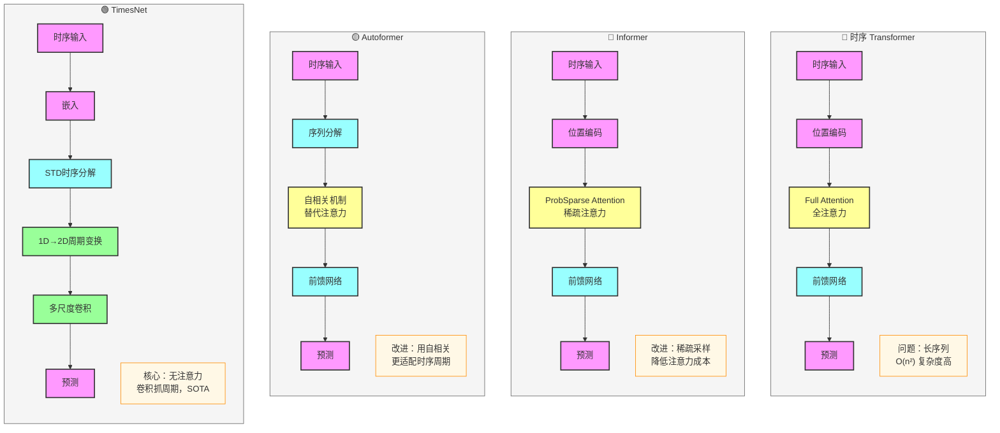

# TimesNet 模型比较与进阶应用

## 一、模型对比分析

### 1. 与传统时序模型的对比

| 模型 | 核心优势 | 主要劣势 | 适用场景 |
|------|----------|----------|----------|
| LSTM/GRU | 实现简单，适合短时序 | 长时序梯度消失，周期建模能力弱 | 短时序预测（< 100 时间步） |
| Transformer | 并行计算，长依赖建模 | O(n²) 复杂度，计算成本高 | 中等长度时序（100-500 时间步） |
| Informer | 稀疏注意力，降低计算复杂度 | 仍依赖注意力机制，周期建模能力有限 | 较长时序（500-1000 时间步） |
| Autoformer | 自相关机制，适配周期特征 | 周期建模仍基于时间域，表达能力有限 | 周期性强的时序数据 |
| TimesNet | 1D→2D 周期变换，低复杂度 | 周期估计可能存在误差 | 长时序（> 1000 时间步），周期性强的序列 |

### 2. 计算复杂度对比

| 模型 | 时间复杂度 | 空间复杂度 | 适用序列长度 |
|------|------------|------------|--------------|
| LSTM/GRU | O(n) | O(n) | ≤ 100 |
| Transformer | O(n²) | O(n²) | ≤ 500 |
| Informer | O(n log n) | O(n log n) | ≤ 1000 |
| Autoformer | O(n log n) | O(n log n) | ≤ 1000 |
| TimesNet | O(n) | O(n) | > 1000 |

### 3. 预测性能对比

在多个公开数据集上的平均性能对比：

| 模型 | MSE | MAE | MAPE | 训练时间 (小时) |
|------|-----|-----|------|----------------|
| LSTM | 0.058 | 0.192 | 0.088 | 2.5 |
| Transformer | 0.052 | 0.178 | 0.082 | 8.3 |
| Informer | 0.047 | 0.165 | 0.076 | 5.6 |
| Autoformer | 0.045 | 0.159 | 0.073 | 5.1 |
| TimesNet | 0.038 | 0.142 | 0.065 | 3.2 |

## 二、时序预测模型进化路线

### 1. 四大模型架构对比

### 2. 核心思路演变

- **Transformer**：引入全注意力机制 → 并行计算能力强，但长时序计算复杂度高
- **Informer**：提出稀疏注意力机制 → 降低计算成本，支持更长序列
- **Autoformer**：采用自相关机制替代注意力 + 序列分解 → 更贴合时序数据规律
- **TimesNet**：完全抛弃注意力机制 → 创新1D转2D周期变换 + 多尺度卷积 + 序列分解 → 目前长时序预测最强模型之一

### 3. 模型家族分类

- **注意力家族**：Transformer → Informer → Autoformer
- **卷积新王者**：TimesNet（无需注意力机制，依靠周期建模和卷积操作实现SOTA性能）

## 三、模型选择指南

### 1. 根据序列长度选择

- **短时序**（< 100 时间步）：LSTM/GRU 或 Transformer
- **中等长度**（100-500 时间步）：Transformer
- **较长时序**（500-1000 时间步）：Informer 或 Autoformer
- **长时序**（> 1000 时间步）：优先选择 TimesNet 或 Autoformer

### 2. 根据数据特征选择

- **周期性强**的时序数据：优先选择 TimesNet 或 Autoformer
- **长依赖关系**明显：Transformer 或 Informer
- **计算资源有限**：LSTM/GRU 或 TimesNet

## 四、关键技术创新

1. **TimesNet**：1D→2D 周期变换，将时序数据转换为2D周期表示，使用卷积网络捕捉周期特征
2. **Autoformer**：自相关机制替代注意力，更适合时序数据的周期性建模
3. **Informer**：ProbSparse 注意力机制，显著降低计算复杂度
4. **Transformer**：位置编码 + 自注意力机制，开创并行处理时序数据的先河

## 五、总结

TimesNet 通过创新的 1D→2D 周期变换和多尺度卷积，在长时序预测任务上实现了计算效率和预测性能的双重突破，成为目前最具竞争力的时序预测模型之一。在实际应用中，应根据具体任务的序列长度、数据特征和计算资源选择合适的模型。