**标准 YOLOv5 架构图**（目标检测SOTA模型，严格贴合官方最新版本实现：**CSPDarknet骨干、FPN+PAN颈部、YOLO检测头**），风格和 TimesNet/Transformer/ViT 架构图完全统一，可直接用于笔记/PPT。

# YOLOv5 完整架构流程图（基础版）

```mermaid
flowchart LR
    %% 统一样式（和TimesNet/Transformer/ViT风格一致）
    classDef inputStyle fill:#f9f,stroke:#333,stroke-width:2px,rounded:8px
    classDef backboneStyle fill:#ffd700,stroke:#333,stroke-width:2px,rounded:8px
    classDef neckStyle fill:#9ff,stroke:#333,stroke-width:2px,rounded:8px
    classDef headStyle fill:#9f9,stroke:#333,stroke-width:2px,rounded:8px
    classDef subgraphStyle fill:#f5f5f5,stroke:#666,stroke-width:1px,rounded:10px
    classDef coreNoteStyle fill:#fff8e6,stroke:#ffb74d,stroke-width:1px,rounded:8px

    %% 1. 输入层
    subgraph InputLayer["输入层"]
        A["图像输入<br/>Input Image [batch, 3, 640, 640]"]:::inputStyle
        B["Mosaic<br/>数据增强"]:::inputStyle
    end
    class InputLayer subgraphStyle

    %% 2. 骨干网络：CSPDarknet
    subgraph Backbone["骨干网络：CSPDarknet"]
        C["Focus<br/>模块"]:::backboneStyle
        D["Conv + BN + SiLU<br/>64通道"]:::backboneStyle
        E["CSP1_1<br/>128通道"]:::backboneStyle
        F["Conv + BN + SiLU<br/>256通道"]:::backboneStyle
        G["CSP1_2<br/>256通道"]:::backboneStyle
        H["Conv + BN + SiLU<br/>512通道"]:::backboneStyle
        I["CSP1_3<br/>512通道"]:::backboneStyle
        J["Conv + BN + SiLU<br/>1024通道"]:::backboneStyle
        K["SPP<br/>模块"]:::backboneStyle
    end
    class Backbone subgraphStyle

    %% 3. 颈部网络：FPN + PAN
    subgraph Neck["颈部网络：FPN + PAN"]
        L["FPN<br/>上采样"]:::neckStyle
        M["CSP2_1<br/>512通道"]:::neckStyle
        N["FPN<br/>上采样"]:::neckStyle
        O["CSP2_2<br/>256通道 [batch, 256, 80, 80]"]:::neckStyle
        P["PAN<br/>下采样"]:::neckStyle
        Q["CSP2_3<br/>512通道 [batch, 512, 40, 40]"]:::neckStyle
        R["PAN<br/>下采样"]:::neckStyle
        S["CSP2_4<br/>1024通道 [batch, 1024, 20, 20]"]:::neckStyle
    end
    class Neck subgraphStyle

    %% 4. 检测头：YOLO Head
    subgraph Head["检测头：YOLO Head"]
        subgraph MultiScaleDet["多尺度检测"]
            T["小目标<br/>检测 80×80"]:::headStyle
            U["中目标<br/>检测 40×40"]:::headStyle
            V["大目标<br/>检测 20×20"]:::headStyle
        end
        class MultiScaleDet subgraphStyle

        W["Conv 1×1<br/>预测层"]:::headStyle
        X["Sigmoid<br/>激活 (边界框/置信度)"]:::headStyle
        Y["Softmax<br/>激活 (类别预测)"]:::headStyle
        Z["NMS<br/>后处理"]:::headStyle
    end
    class Head subgraphStyle

    %% 5. 输出层
    subgraph OutputLayer["输出层"]
        AA["检测<br/>结果"]:::inputStyle
    end
    class OutputLayer subgraphStyle

    %% 核心注释
    Note["YOLOv5 核心创新：<br/>1. Focus模块减少计算量<br/>2. CSP结构增强特征提取<br/>3. SPP模块融合多尺度特征<br/>4. FPN+PAN双向特征融合<br/>5. 多尺度检测适配不同大小目标<br/>6. 自适应锚框计算<br/>7. Mosaic数据增强提升泛化能力"]:::coreNoteStyle

    %% 数据流
    A --> B --> C --> D --> E --> F --> G --> H --> I --> J --> K --> L --> M --> N --> O
    O --> P --> Q --> R --> S
    G -->|跳连| M
    E -->|跳连| O
    Q -->|特征传递| S
    O -->|小目标检测| T
    Q -->|中目标检测| U
    S -->|大目标检测| V
    T & U & V --> W --> X & Y --> Z --> AA

    %% 连接线样式
    linkStyle 0,1,2,3,4,5,6,7,8,9 stroke:#ff7043,stroke-width:1.5px
    linkStyle 10,11,12,13,14,15,16,17,18,19 stroke:#4299e1,stroke-width:2px
    linkStyle 20,21,22,23,24,25 stroke:#9c27b0,stroke-width:2px

    %% 可选：将注释节点定位到合适位置（提升可读性）
    Note -.-> Backbone
```

---

# YOLOv5 极简核心总结

1. **定位**：**实时目标检测** SOTA 模型，平衡精度与速度
2. **核心Backbone**：**CSPDarknet** + **SPP** 特征提取
3. **核心Neck**：**FPN + PAN** 双向特征融合
4. **核心Head**：**YOLO Head** 多尺度检测
5. **最大创新**
    - **Focus模块**：减少计算量，提升特征提取效率
    - **CSP结构**：增强梯度流动，提高模型性能
    - **SPP模块**：融合多尺度特征，提升检测精度
    - **FPN+PAN**：双向特征融合，增强多尺度检测能力
    - **SiLU激活函数**：提高模型性能和收敛速度
    - **Mosaic数据增强**：提升模型泛化能力
    - **自适应锚框**：自动计算最优锚框尺寸
    - **CIoU损失函数**：优化边界框回归精度
6. **结构范式**
输入 → Mosaic增强 → Focus → CSPDarknet → SPP → FPN+PAN → YOLO Head → NMS → 输出

