**详细版 YOLOv5 架构图**（目标检测SOTA模型，完整维度信息标注，严格贴合官方最新版本实现：**CSPDarknet骨干、FPN+PAN颈部、YOLO检测头**），风格和 TimesNet/Transformer/ViT 架构图完全统一，可直接用于技术文档/代码实现。

# YOLOv5 完整架构流程图（详细版）

```mermaid
flowchart LR
    %% 统一样式（和TimesNet/Transformer/ViT风格一致）
    classDef inputStyle fill:#f9f,stroke:#333,stroke-width:2px,rounded:8px
    classDef backboneStyle fill:#ffd700,stroke:#333,stroke-width:2px,rounded:8px
    classDef neckStyle fill:#9ff,stroke:#333,stroke-width:2px,rounded:8px
    classDef headStyle fill:#9f9,stroke:#333,stroke-width:2px,rounded:8px
    classDef activeStyle fill:#aaffaa,stroke:#333,stroke-width:2px,rounded:8px
    classDef subgraphStyle fill:#f5f5f5,stroke:#666,stroke-width:1px,rounded:10px
    classDef coreNoteStyle fill:#fff8e6,stroke:#ffb74d,stroke-width:1px,rounded:8px

    %% 1. 输入层
    subgraph InputLayer["输入层"]
        A["图像输入<br/>Input Image [batch, 3, 640, 640]"]:::inputStyle
        B["Mosaic<br/>数据增强"]:::inputStyle
    end
    class InputLayer subgraphStyle

    %% 2. 骨干网络：CSPDarknet
    subgraph Backbone["骨干网络：CSPDarknet"]
        C["Focus<br/>模块 [batch, 12, 320, 320]"]:::backboneStyle
        D["Conv + BN + SiLU<br/>64通道 [batch, 64, 320, 320]"]:::backboneStyle
        E["CSP1_1<br/>128通道 [batch, 128, 160, 160]"]:::backboneStyle
        F["Conv + BN + SiLU<br/>256通道 [batch, 256, 80, 80]"]:::backboneStyle
        G["CSP1_2<br/>256通道 [batch, 256, 80, 80]"]:::backboneStyle
        H["Conv + BN + SiLU<br/>512通道 [batch, 512, 40, 40]"]:::backboneStyle
        I["CSP1_3<br/>512通道 [batch, 512, 40, 40]"]:::backboneStyle
        J["Conv + BN + SiLU<br/>1024通道 [batch, 1024, 20, 20]"]:::backboneStyle
        K["SPP<br/>模块 [batch, 1024, 20, 20]"]:::backboneStyle
    end
    class Backbone subgraphStyle

    %% 3. 颈部网络：FPN + PAN
    subgraph Neck["颈部网络：FPN + PAN"]
        L["FPN<br/>上采样 [batch, 512, 40, 40]"]:::neckStyle
        M["CSP2_1<br/>512通道 [batch, 512, 40, 40]"]:::neckStyle
        N["FPN<br/>上采样 [batch, 256, 80, 80]"]:::neckStyle
        O["CSP2_2<br/>256通道 [batch, 256, 80, 80]"]:::neckStyle
        P["PAN<br/>下采样 [batch, 512, 40, 40]"]:::neckStyle
        Q["CSP2_3<br/>512通道 [batch, 512, 40, 40]"]:::neckStyle
        R["PAN<br/>下采样 [batch, 1024, 20, 20]"]:::neckStyle
        S["CSP2_4<br/>1024通道 [batch, 1024, 20, 20]"]:::neckStyle
    end
    class Neck subgraphStyle

    %% 4. 检测头：YOLO Head
    subgraph Head["检测头：YOLO Head"]
        subgraph MultiScaleDet["多尺度检测"]
            T["小目标<br/>检测 [batch, 3, 80, 80, 85]"]:::headStyle
            U["中目标<br/>检测 [batch, 3, 40, 40, 85]"]:::headStyle
            V["大目标<br/>检测 [batch, 3, 20, 20, 85]"]:::headStyle
        end
        class MultiScaleDet subgraphStyle

        W["Conv 1×1<br/>预测层"]:::headStyle
        X["Sigmoid<br/>激活 (边界框/置信度)"]:::activeStyle
        Y["Softmax<br/>激活 (类别预测)"]:::activeStyle
        Z["NMS<br/>后处理"]:::headStyle
    end
    class Head subgraphStyle

    %% 5. 输出层
    subgraph OutputLayer["输出层"]
        AA["检测<br/>结果"]:::inputStyle
    end
    class OutputLayer subgraphStyle

    %% 核心注释
    Note["YOLOv5 核心创新：<br/>1. Focus模块减少计算量<br/>2. CSP结构增强特征提取<br/>3. SPP模块融合多尺度特征<br/>4. FPN+PAN双向特征融合<br/>5. 多尺度检测适配不同大小目标<br/>6. 自适应锚框计算<br/>7. Mosaic数据增强提升泛化能力<br/><br/>维度说明：batch=批量大小, 85=4(边界框)+1(置信度)+80(类别)"]:::coreNoteStyle

    %% 数据流
    A --> B --> C --> D --> E --> F --> G --> H --> I --> J --> K --> L --> M --> N --> O
    O --> P --> Q --> R --> S
    G -->|跳连| M
    E -->|跳连| O
    Q -->|特征传递| S
    O -->|小目标检测| T
    Q -->|中目标检测| U
    S -->|大目标检测| V
    T & U & V --> W --> X & Y --> Z --> AA

    %% 连接线样式
    linkStyle 0,1,2,3,4,5,6,7,8,9 stroke:#ff7043,stroke-width:1.5px
    linkStyle 10,11,12,13,14,15,16,17,18,19 stroke:#4299e1,stroke-width:2px
    linkStyle 20,21,22,23,24,25 stroke:#9c27b0,stroke-width:2px

    %% 可选：将注释节点定位到合适位置（提升可读性）
    Note -.-> Backbone
```


---

# YOLOv5 详细数据流转逻辑

## 输入层
- **输入格式**：RGB图像，形状为 `[batch, 3, 640, 640]`
  - `batch`：批量大小
  - `3`：RGB通道
  - `640×640`：图像高度/宽度
- **Mosaic数据增强**：将4张不同图像随机缩放后拼接成1张
  - 作用：丰富训练数据多样性，增强模型对小目标和遮挡目标的检测能力

## 骨干网络：CSPDarknet
### 1. Focus模块
- 将输入图像的宽高各减半，通道数翻倍
- 输入：`[batch, 3, 640, 640]`
- 输出：`[batch, 12, 320, 320]`
- 作用：减少计算量，提升特征提取效率

### 2. Conv + BN + SiLU
- **64通道**：`[batch, 12, 320, 320]` → `[batch, 64, 320, 320]`
- **256通道**：`[batch, 128, 160, 160]` → `[batch, 256, 80, 80]`
- **512通道**：`[batch, 256, 80, 80]` → `[batch, 512, 40, 40]`
- **1024通道**：`[batch, 512, 40, 40]` → `[batch, 1024, 20, 20]`
- 作用：卷积层、批量归一化层和SiLU激活函数的组合，用于提取特征并增强模型性能

### 3. CSP1_X模块
- **CSP1_1**：128通道，`[batch, 64, 320, 320]` → `[batch, 128, 160, 160]`
- **CSP1_2**：256通道，`[batch, 256, 80, 80]` → `[batch, 256, 80, 80]`
- **CSP1_3**：512通道，`[batch, 512, 40, 40]` → `[batch, 512, 40, 40]`
- 作用：采用跨阶段局部网络（CSP）结构，增强梯度流动

### 4. SPP模块
- 空间金字塔池化，融合不同尺度的特征图
- 输入：`[batch, 1024, 20, 20]`
- 输出：`[batch, 1024, 20, 20]`
- 作用：提升模型对不同大小目标的检测能力

## 颈部网络：FPN + PAN
### 1. FPN（特征金字塔网络）
- 自顶向下传递语义特征
- **第一次上采样**：`[batch, 1024, 20, 20]` → `[batch, 512, 40, 40]`
- **第二次上采样**：`[batch, 512, 40, 40]` → `[batch, 256, 80, 80]`

### 2. PAN（路径聚合网络）
- 自底向上传递定位特征
- **第一次下采样**：`[batch, 256, 80, 80]` → `[batch, 512, 40, 40]`
- **第二次下采样**：`[batch, 512, 40, 40]` → `[batch, 1024, 20, 20]`

### 3. CSP2_X模块
- **CSP2_1**：512通道，`[batch, 1024, 40, 40]` → `[batch, 512, 40, 40]`
- **CSP2_2**：256通道，`[batch, 512, 80, 80]` → `[batch, 256, 80, 80]`
- **CSP2_3**：512通道，`[batch, 512, 40, 40]` → `[batch, 512, 40, 40]`
- **CSP2_4**：1024通道，`[batch, 1024, 20, 20]` → `[batch, 1024, 20, 20]`

## 检测头：YOLO Head
### 1. 多尺度检测
- **小目标检测**（大特征图）：`[batch, 256, 80, 80]` → `[batch, 3, 80, 80, 85]`
- **中目标检测**（中等特征图）：`[batch, 512, 40, 40]` → `[batch, 3, 40, 40, 85]`
- **大目标检测**（小特征图）：`[batch, 1024, 20, 20]` → `[batch, 3, 20, 20, 85]`
- 其中 `85 = 4(边界框) + 1(置信度) + 80(类别)`

### 2. Conv 1×1 预测层
- 将多尺度特征映射到预测维度
- 每个尺度使用1×1卷积将特征通道数转换为 `3 × (4 + 1 + 80) = 255`

### 3. 激活函数
- **边界框和置信度**：使用Sigmoid激活函数
- **类别预测**：使用Softmax激活函数

### 4. NMS后处理
- 非极大值抑制
- 过滤冗余检测框
- 输出最终检测结果

## 输出层
- **输出格式**：检测结果，包含目标的位置、类别和置信度
- **输出示例**：`[x, y, w, h, confidence, class_id]`

## 完整数据流转路径（含维度）

### 1. 骨干网络：特征提取，逐步下采样
```
图像输入 [batch, 3, 640, 640]
    ↓
Mosaic数据增强
    ↓
Focus模块 [batch, 12, 320, 320]
    ↓
Conv + BN + SiLU [batch, 64, 320, 320]
    ↓
CSP1_1 [batch, 128, 160, 160]
    ↓
Conv + BN + SiLU [batch, 256, 80, 80]
    ↓
CSP1_2 [batch, 256, 80, 80]
    ↓
Conv + BN + SiLU [batch, 512, 40, 40]
    ↓
CSP1_3 [batch, 512, 40, 40]
    ↓
Conv + BN + SiLU [batch, 1024, 20, 20]
    ↓
SPP模块 [batch, 1024, 20, 20]
```

### 2. 颈部网络：特征融合，形成三个尺度
```
SPP [batch, 1024, 20, 20]
    ↓
FPN上采样 [batch, 512, 40, 40] + 跳连 CSP1_2 [batch, 256, 80, 80]
    ↓
CSP2_1 [batch, 512, 40, 40]
    ↓
FPN上采样 [batch, 256, 80, 80] + 跳连 CSP1_1 [batch, 128, 160, 160]
    ↓
CSP2_2 [batch, 256, 80, 80]  (小目标检测)
    ↓
PAN下采样 [batch, 512, 40, 40]
    ↓
CSP2_3 [batch, 512, 40, 40]  (中目标检测)
    ↓
PAN下采样 [batch, 1024, 20, 20]
    ↓
CSP2_4 [batch, 1024, 20, 20]  (大目标检测)
```

### 3. 检测头：多尺度检测
```
CSP2_2 [batch, 256, 80, 80] → 小目标检测 [batch, 3, 80, 80, 85]
CSP2_3 [batch, 512, 40, 40] → 中目标检测 [batch, 3, 40, 40, 85]
CSP2_4 [batch, 1024, 20, 20] → 大目标检测 [batch, 3, 20, 20, 85]
    ↓
多尺度检测 → Conv 1×1预测层
    ↓
Sigmoid/Softmax激活 → NMS后处理
    ↓
检测结果
```

---

### 快速预览（一行式）
输入图像 [batch, 3, 640, 640] → Mosaic增强 → Focus [batch, 12, 320, 320] → Conv64 [batch, 64, 320, 320] → CSP1_1 [batch, 128, 160, 160] → Conv256 [batch, 256, 80, 80] → CSP1_2 [batch, 256, 80, 80] → Conv512 [batch, 512, 40, 40] → CSP1_3 [batch, 512, 40, 40] → Conv1024 [batch, 1024, 20, 20] → SPP [batch, 1024, 20, 20] → FPN+PAN → CSP2_2 [batch, 256, 80, 80] / CSP2_3 [batch, 512, 40, 40] / CSP2_4 [batch, 1024, 20, 20] → 多尺度检测 [batch, 3, H, W, 85] → 检测结果

## 关键技术点
- **Focus模块**：减少计算量，提升特征提取效率
- **CSP结构**：增强梯度流动，提高模型性能
- **SPP模块**：融合多尺度特征，提升检测精度
- **FPN+PAN**：双向特征融合，增强多尺度检测能力
- **SiLU激活函数**：提高模型性能和收敛速度
- **Mosaic数据增强**：提升模型泛化能力
- **自适应锚框**：自动计算最优锚框尺寸
- **多尺度检测**：同时检测不同大小的目标
- **CIoU损失函数**：优化边界框回归精度
- **端到端学习**：从原始图像到检测结果的端到端训练

