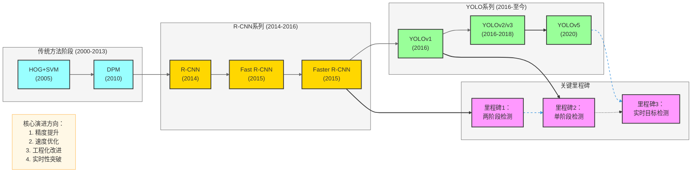
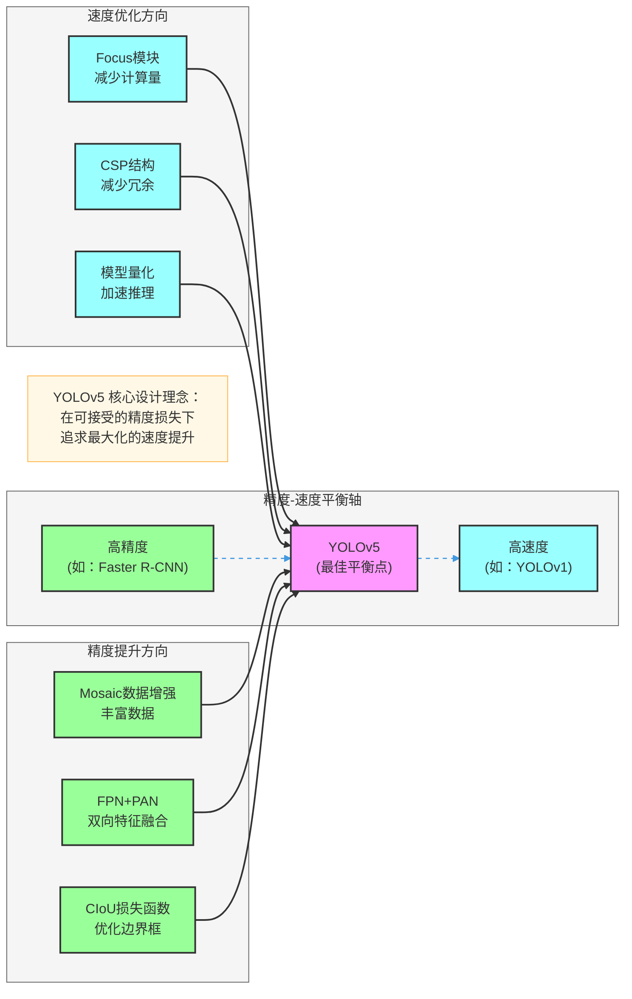
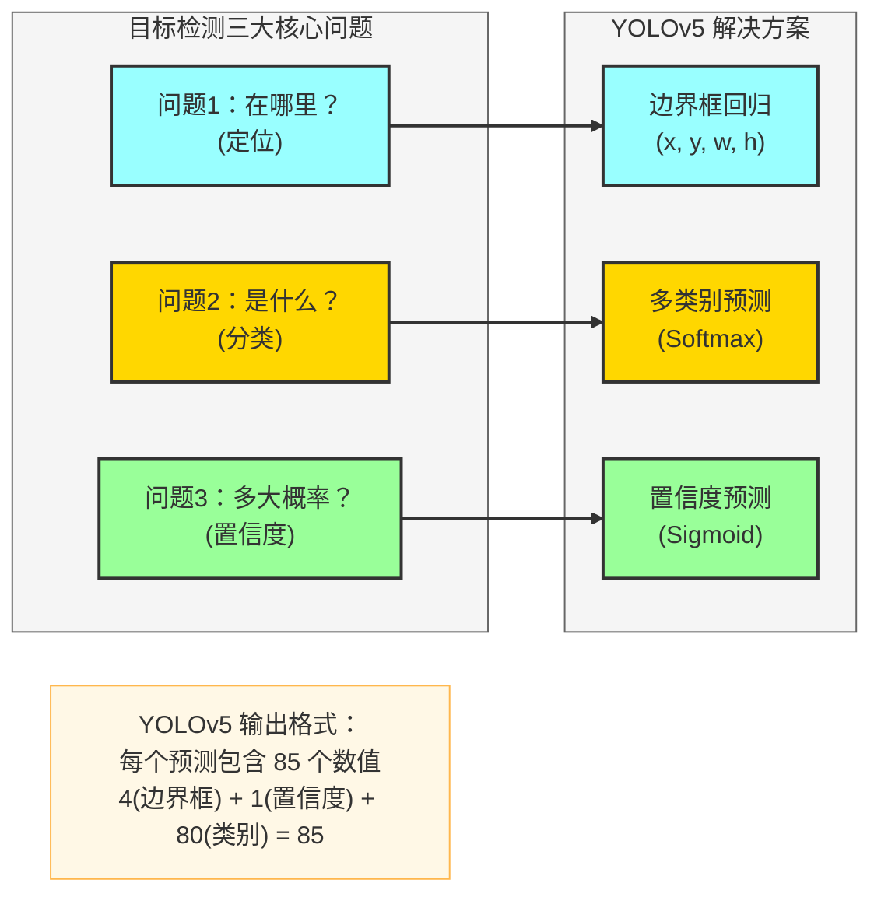
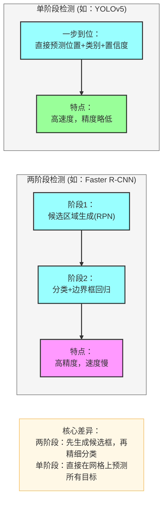

# YOLOv5 理论基础和动机

## 目标检测发展历程

---

## YOLOv5 核心动机

### 1. 精度与速度的平衡

YOLOv5 的核心目标是在**实时性**和**检测精度**之间找到最佳平衡点。

### 2. 工程化改进与易用性

YOLOv5 相比前代的另一个重要动机是**工程化改进**，使其更易于使用和部署。

- **代码重构**：更加清晰的代码结构
- **PyTorch原生实现**：便于研究和修改
- **模型配置化**：通过配置文件定义模型
- **多平台支持**：方便部署到各种环境

---

## 目标检测核心问题

---

## 两阶段 vs 单阶段检测

YOLOv5 属于**单阶段检测**方法，让我们对比一下两种范式的核心差异：

---

## YOLOv5 核心创新点总结

| 创新点 | 解决的问题 | 优势 |
|--------|-----------|------|
| Focus 模块 | 计算量大、特征提取效率低 | 减少计算量，提升特征提取效率 |
| CSP 结构 | 梯度流动不畅、计算冗余 | 增强梯度流动，减少计算冗余 |
| SPP 模块 | 多尺度特征融合不足 | 融合不同尺度特征 |
| FPN + PAN | 特征融合不充分 | 双向特征融合，兼顾语义和定位 |
| Mosaic 数据增强 | 数据多样性不足 | 丰富训练数据，提升泛化能力 |
| 自适应锚框 | 锚框尺寸不匹配 | 自动计算最优锚框 |
| CIoU 损失函数 | 边界框回归不准确 | 优化边界框回归精度 |
| SiLU 激活函数 | 模型收敛慢 | 提高收敛速度和性能 |

