**标准 YOLOv7 架构图**（目标检测SOTA模型，严格贴合官方最新版本实现：**ELAN骨干、FPN+PAN颈部、RepConv检测头**），风格和 TimesNet 架构图完全统一，可直接用于笔记/PPT。

# YOLOv7 完整架构流程图

```mermaid
flowchart LR
    %% 简化样式定义（仅保留基础属性，行尾加分号）
    classDef inputStyle fill:#f9f,stroke:#333,stroke-width:2px,rounded:8px;
    classDef backboneStyle fill:#ffd700,stroke:#333,stroke-width:2px,rounded:8px;
    classDef neckStyle fill:#9ff,stroke:#333,stroke-width:2px,rounded:8px;
    classDef headStyle fill:#9f9,stroke:#333,stroke-width:2px,rounded:8px;
    classDef subgraphStyle fill:#f5f5f5,stroke:#666,stroke-width:1px,rounded:10px;

    %% 1. 输入层
    subgraph InputLayer["输入层"]
        A["图像输入<br/>(Input Image)"]:::inputStyle;
        B["Mosaic<br/>数据增强"]:::inputStyle;
    end
    class InputLayer subgraphStyle;

    %% 2. 骨干网络：ELAN (Efficient Layer Aggregation Network)
    subgraph Backbone["骨干网络：ELAN"]
        C["CBS<br/>(32通道)"]:::backboneStyle;
        D["CBS<br/>(64通道,步长2)"]:::backboneStyle;
        E["CBS<br/>(64通道)"]:::backboneStyle;
        F["CBS<br/>(128通道,步长2)"]:::backboneStyle;
        G["ELAN1-1<br/>模块<br/>(256通道)"]:::backboneStyle;
        H["MP-1<br/>下采样"]:::backboneStyle;
        I["ELAN1-2<br/>模块<br/>(512通道)"]:::backboneStyle;
        J["MP-2<br/>下采样"]:::backboneStyle;
        K["ELAN1-3<br/>模块<br/>(1024通道)"]:::backboneStyle;
        L["MP-3<br/>下采样"]:::backboneStyle;
        M["ELAN1-4<br/>模块<br/>(1024通道)"]:::backboneStyle;
    end
    class Backbone subgraphStyle;

    %% 3. 颈部网络：FPN + PAN
    subgraph Neck["颈部网络：FPN + PAN"]
        N["SPPCSPC<br/>模块<br/>(512通道)"]:::neckStyle;
        O["CBS<br/>(256通道)"]:::neckStyle;
        P["FPN<br/>上采样"]:::neckStyle;
        Q["CBS<br/>(256通道)<br/>跳连层37"]:::neckStyle;
        R["Concat<br/>拼接"]:::neckStyle;
        S["ELAN2-1<br/>模块<br/>(256通道)"]:::neckStyle;
        T["CBS<br/>(128通道)"]:::neckStyle;
        U["FPN<br/>上采样"]:::neckStyle;
        V["CBS<br/>(128通道)<br/>跳连层24"]:::neckStyle;
        W["Concat<br/>拼接"]:::neckStyle;
        X["ELAN2-2<br/>模块<br/>(128通道)"]:::neckStyle;
        Y["MPConv-1<br/>下采样"]:::neckStyle;
        Z["Concat<br/>拼接<br/>(跳连层63)"]:::neckStyle;
        AA["ELAN2-3<br/>模块<br/>(256通道)"]:::neckStyle;
        AB["MPConv-2<br/>下采样"]:::neckStyle;
        AC["Concat<br/>拼接<br/>(跳连层51)"]:::neckStyle;
        AD["ELAN2-4<br/>模块<br/>(512通道)"]:::neckStyle;
    end
    class Neck subgraphStyle;

    %% 4. 检测头：YOLO Head
    subgraph Head["检测头：YOLO Head"]
        subgraph MultiScaleDet["多尺度检测"]
            AE["小目标<br/>检测<br/>(80×80)"]:::headStyle;
            AF["中目标<br/>检测<br/>(40×40)"]:::headStyle;
            AG["大目标<br/>检测<br/>(20×20)"]:::headStyle;
        end
        class MultiScaleDet subgraphStyle;
        
        AH["RepConv<br/>预测层"]:::headStyle;
        AI["Sigmoid<br/>激活<br/>(边界框/置信度)"]:::headStyle;
        AJ["Softmax<br/>激活<br/>(类别预测)"]:::headStyle;
        AK["NMS<br/>后处理"]:::headStyle;
    end
    class Head subgraphStyle;

    %% 5. 输出层
    subgraph OutputLayer["输出层"]
        AL["检测<br/>结果"]:::inputStyle;
    end
    class OutputLayer subgraphStyle;

    %% 核心注释（简化换行）
    Note["YOLOv7 核心创新：<br/>1. ELAN高效层聚合网络<br/>2. ELAN1/ELAN2双模块设计<br/>3. MPConv混合下采样模块<br/>4. SPPCSPC空间金字塔池化CSP<br/>5. RepConv重参化卷积<br/>6. CBS(Conv+BN+SiLU)基础模块<br/>7. FPN+PAN双向特征融合<br/>8. 多尺度检测(P3/P4/P5)"];

    %% 数据流（添加必要的连接信息）
    A -->|输入图像| B -->|数据增强| C -->|特征提取| D -->|特征提取| E -->|特征提取| F -->|特征提取| G -->|特征聚合| H -->|下采样| I -->|特征聚合| J -->|下采样| K -->|特征聚合| L -->|下采样| M -->|特征聚合| N -->|多尺度融合| O --> P --> R;
    K -->|跳连层37| Q --> R;
    R --> S --> T --> U --> W;
    I -->|跳连层24| V --> W;
    W --> X --> Y --> Z;
    S -->|跳连层63| Z;
    Z --> AA --> AB --> AC;
    N -->|跳连层51| AC;
    AC --> AD;
    X -->|小目标检测| AE;
    AA -->|中目标检测| AF;
    AD -->|大目标检测| AG;
    AE & AF & AG -->|多尺度特征| AH -->|预测| AI & AJ -->|激活| AK -->|后处理| AL;
```

---

# YOLOv7 极简核心总结

1. **定位**：**实时目标检测** SOTA 模型，YOLO系列旗舰版，精度与速度全面超越YOLOv5
2. **核心Backbone**：**ELAN** (Efficient Layer Aggregation Network) 高效层聚合网络
3. **核心Neck**：**FPN + PAN** 双向特征融合 + **ELAN2** 特征聚合 + **SPPCSPC**
4. **核心Head**：**YOLO Head** 多尺度检测 + **RepConv** 重参化卷积
5. **最大创新**
    - **ELAN模块**：高效层聚合网络，Backbone用ELAN1（通道扩张），Neck用ELAN2（通道收缩）
    - **CBS基础模块**：Conv + BN + SiLU 组合，所有卷积层的标准配置
    - **MPConv混合下采样**：Max Pool + Conv 组合，Backbone用MP-1（通道不变），Neck用MPConv（通道×2）
    - **SPPCSPC模块**：结合SPP和CSP的空间金字塔池化CSP结构
    - **RepConv重参化卷积**：训练多分支，推理单分支，用于检测头
    - **SiLU激活函数**：提高模型性能和收敛速度
    - **Mosaic数据增强**：丰富训练数据多样性
    - **多尺度检测**：P3(80×80)、P4(40×40)、P5(20×20) 三个尺度
    - **CIoU损失函数**：优化边界框回归精度
6. **结构范式**
输入 → Mosaic增强 → CBS → ELAN1 → MP-1 → ELAN1 → MP-2 → ELAN1 → MP-3 → ELAN1 → SPPCSPC → FPN上采样 → ELAN2 → FPN上采样 → ELAN2 → MPConv → ELAN2 → MPConv → ELAN2 → RepConv → NMS → 输出

## 关键技术点

- **CBS模块** (Conv + BN + SiLU)：卷积+批归一化+SiLU激活组合
  - **工作原理**：标准卷积块，包含Conv2d、BatchNorm2d和SiLU激活函数
  - **实现方法**：`Conv(c1, c2, k, s)`，其中c1=输入通道，c2=输出通道，k=卷积核，s=步长
  - **优势**：标准化的特征提取模块，SiLU激活提升性能
  - **输入输出**：根据具体参数变化

- **ELAN1模块** (Efficient Layer Aggregation Network 1)：Backbone用高效层聚合
  - **工作原理**：多分支并行卷积，最后Concat拼接，通道数扩张
  - **实现方法**：2个1×1 Conv分支 + 4个3×3 Conv分支 → Concat → 1×1 Conv
  - **优势**：高效聚合特征，保持梯度流动，提升特征表达能力
  - **通道变化**：输入通道 → 中间减半 → 输出×2（如128→256）

- **ELAN2模块** (Efficient Layer Aggregation Network 2)：Neck用高效层聚合
  - **工作原理**：与ELAN1类似，但最后通道数收缩
  - **实现方法**：2个1×1 Conv分支 + 4个3×3 Conv分支 → Concat → 1×1 Conv
  - **优势**：高效聚合特征，适配Neck的特征融合需求
  - **通道变化**：输入通道 → 中间减半 → 输出减半（如512→256）

- **MP-1模块** (Max Pool 1)：Backbone用混合下采样，通道数不变
  - **工作原理**：Max Pool分支 + Conv分支并行，然后Concat
  - **实现方法**：MP() + Conv(1×1降维) + Conv(3×3降维+步长2) → Concat
  - **优势**：保留更多特征信息，同时实现下采样
  - **尺寸变化**：H×W → H/2×W/2，通道数不变

- **MPConv模块** (Max Pool + Conv)：Neck用混合下采样，通道数×2
  - **工作原理**：与MP-1类似，但最后拼接额外跳连层，通道数×2
  - **实现方法**：MP() + Conv(1×1降维) + Conv(3×3降维+步长2) → Concat(+跳连)
  - **优势**：结合下采样和特征融合
  - **尺寸变化**：H×W → H/2×W/2，通道数×2

- **SPPCSPC模块** (Spatial Pyramid Pooling Cross Stage Partial Connection)：空间金字塔池化CSP
  - **工作原理**：将SPP模块嵌入到CSP结构中，使用5×5、9×9、13×13池化核
  - **实现方法**：CSP结构 + SPP池化（5×5, 9×9, 13×13）
  - **输入输出**：输入 `[batch_size, 1024, 20, 20]` → 输出 `[batch_size, 512, 20, 20]`
  - **优势**：融合不同尺度特征，提升检测精度，同时保持计算效率

- **RepConv模块** (Reparameterized Convolution)：重参化卷积
  - **工作原理**：训练时使用多分支结构，推理时重参数化为单个3×3卷积
  - **实现方法**：训练多分支，推理单分支
  - **优势**：训练时获得更好的性能，推理时保持高效
  - **应用场景**：用于检测头的预测层

- **SiLU激活函数** (Sigmoid Linear Unit)：提高模型性能和收敛速度
  - **工作原理**：`SiLU(x) = x * sigmoid(x)`，在负值区域有更小的梯度
  - **实现方法**：对输入特征应用 SiLU 激活函数
  - **优势**：相比 ReLU，SiLU 在负值区域有更小的梯度，有助于模型更好地学习

- **Mosaic数据增强**：丰富训练数据多样性
  - **工作原理**：将4张图像拼接成2×2网格
  - **实现方法**：随机选择4张图像，缩放后拼接
  - **优势**：丰富训练数据多样性，增强模型对小目标和遮挡目标的检测能力

- **多尺度检测** (Multi-scale Detection)：同时检测不同大小的目标
  - **工作原理**：在三个不同尺度的特征图上进行检测
  - **实现方法**：
    - P3小目标检测：使用 80×80 的特征图（步长8）
    - P4中目标检测：使用 40×40 的特征图（步长16）
    - P5大目标检测：使用 20×20 的特征图（步长32）
  - **优势**：同时检测不同大小的目标，提高检测精度

- **CIoU损失函数** (Complete Intersection over Union)：优化边界框回归精度
  - **工作原理**：考虑边界框的重叠度、中心点距离和宽高比
  - **实现方法**：`CIoU = IoU - (d²/c²) - αv`
  - **优势**：相比 IoU 和 GIoU，CIoU 考虑了更多因素，提高边界框回归的准确性

---

# YOLOv7 数据流转逻辑详解

## 输入层
- **输入格式**：RGB图像，形状为 `[batch_size, 3, height, width]`
  - `batch_size`：批量大小
  - `3`：RGB通道
  - `height/width`：图像高度/宽度（通常为640x640）
- **Mosaic数据增强**：
  - 将4张不同图像随机缩放后拼接成2×2网格
  - 作用：丰富训练数据多样性，增强模型泛化能力

## 骨干网络：ELAN

1. **CBS模块** (Conv + BN + SiLU)
   - CBS-0：32通道，步长1，`[batch_size, 3, 640, 640]` → `[batch_size, 32, 640, 640]`
   - CBS-1：64通道，步长2，`[batch_size, 32, 640, 640]` → `[batch_size, 64, 320, 320]`
   - CBS-2：64通道，步长1，`[batch_size, 64, 320, 320]` → `[batch_size, 64, 320, 320]`
   - CBS-3：128通道，步长2，`[batch_size, 64, 320, 320]` → `[batch_size, 128, 160, 160]`

2. **ELAN1模块**（Backbone用，通道×2）
   - **ELAN1-1**：128→256通道，`[batch_size, 128, 160, 160]` → `[batch_size, 256, 160, 160]`（层11）
   - **ELAN1-2**：256→512通道，`[batch_size, 256, 80, 80]` → `[batch_size, 512, 80, 80]`（层24）
   - **ELAN1-3**：512→1024通道，`[batch_size, 512, 40, 40]` → `[batch_size, 1024, 40, 40]`（层37）
   - **ELAN1-4**：1024→1024通道，`[batch_size, 1024, 20, 20]` → `[batch_size, 1024, 20, 20]`（层50）

3. **MP-1下采样模块**（Backbone用，通道不变）
   - **MP-1**：`[batch_size, 256, 160, 160]` → `[batch_size, 256, 80, 80]`（层16，P3/8）
   - **MP-2**：`[batch_size, 512, 80, 80]` → `[batch_size, 512, 40, 40]`（层29，P4/16）
   - **MP-3**：`[batch_size, 1024, 40, 40]` → `[batch_size, 1024, 20, 20]`（层42，P5/32）

## 颈部网络：FPN + PAN + ELAN2 + SPPCSPC

1. **SPPCSPC模块**
   - 空间金字塔池化+CSP结构，融合不同尺度的特征图
   - 输入：`[batch_size, 1024, 20, 20]`（层50）
   - 输出：`[batch_size, 512, 20, 20]`（层51）

2. **FPN（特征金字塔网络）- 第一阶段**
   - CBS：`[batch_size, 512, 20, 20]` → `[batch_size, 256, 20, 20]`（层52）
   - Upsample：`[batch_size, 256, 20, 20]` → `[batch_size, 256, 40, 40]`（层53）
   - 跳连层37（P4）CBS：`[batch_size, 1024, 40, 40]` → `[batch_size, 256, 40, 40]`（层54）
   - Concat：`[batch_size, 512, 40, 40]`（层55）

3. **ELAN2-1模块**（Neck用，通道收缩）
   - 输入：`[batch_size, 512, 40, 40]`
   - 输出：`[batch_size, 256, 40, 40]`（层63）

4. **FPN（特征金字塔网络）- 第二阶段**
   - CBS：`[batch_size, 256, 40, 40]` → `[batch_size, 128, 40, 40]`（层64）
   - Upsample：`[batch_size, 128, 40, 40]` → `[batch_size, 128, 80, 80]`（层65）
   - 跳连层24（P3）CBS：`[batch_size, 512, 80, 80]` → `[batch_size, 128, 80, 80]`（层66）
   - Concat：`[batch_size, 256, 80, 80]`（层67）

5. **ELAN2-2模块**（Neck用，通道收缩）
   - 输入：`[batch_size, 256, 80, 80]`
   - 输出：`[batch_size, 128, 80, 80]`（层75）

6. **PAN（路径聚合网络）- 第一阶段**
   - MPConv-1下采样：`[batch_size, 128, 80, 80]` → `[batch_size, 256, 40, 40]`（层80，含跳连层63）
   - ELAN2-3模块：`[batch_size, 512, 40, 40]` → `[batch_size, 256, 40, 40]`（层88）

7. **PAN（路径聚合网络）- 第二阶段**
   - MPConv-2下采样：`[batch_size, 256, 40, 40]` → `[batch_size, 512, 20, 20]`（层93，含跳连层51）
   - ELAN2-4模块：`[batch_size, 1024, 20, 20]` → `[batch_size, 512, 20, 20]`（层101）

## 检测头：YOLO Head

1. **RepConv预测层**
   - 小目标（P3）：`[batch_size, 128, 80, 80]` → `[batch_size, 256, 80, 80]`（层102）
   - 中目标（P4）：`[batch_size, 256, 40, 40]` → `[batch_size, 512, 40, 40]`（层103）
   - 大目标（P5）：`[batch_size, 512, 20, 20]` → `[batch_size, 1024, 20, 20]`（层104）

2. **多尺度检测**
   - **小目标检测**（P3，大特征图）：`[batch_size, 256, 80, 80]` → `[batch_size, 3, 80, 80, 85]`
   - **中目标检测**（P4，中等特征图）：`[batch_size, 512, 40, 40]` → `[batch_size, 3, 40, 40, 85]`
   - **大目标检测**（P5，小特征图）：`[batch_size, 1024, 20, 20]` → `[batch_size, 3, 20, 20, 85]`
   - 其中85 = 4（边界框） + 1（置信度） + 80（类别）

3. **激活函数**
   - **边界框和置信度**：使用Sigmoid激活函数
   - **类别预测**：使用Softmax激活函数

4. **NMS后处理**
   - 非极大值抑制
   - 过滤冗余检测框
   - 输出最终检测结果

## 输出层
- **输出格式**：检测结果，包含目标的位置、类别和置信度
- **输出示例**：`[x, y, w, h, confidence, class_id]`

## 完整数据流转路径（文本描述）
## 1. 骨干网络：特征提取，逐步下采样
- CBS 是 Conv+BN+SiLU 的组合
- 输入 → Mosaic增强 → CBS(32) → CBS(64,步长2) → CBS(64) → CBS(128,步长2) → ELAN1-1(128→256) → MP-1 → ELAN1-2(256→512) → MP-2 → ELAN1-3(512→1024) → MP-3 → ELAN1-4(1024→1024)
- 作用：从原始图像中提取丰富的特征信息，通过ELAN1高效聚合特征
- 关键跳连层：层24（P3）、层37（P4）

## 2. 颈部网络：特征融合，形成三个尺度
- ELAN1-4 → SPPCSPC(1024→512) → CBS(256) → FPN上采样 → Concat(跳连层37) → ELAN2-1(512→256)（层63）
- ELAN2-1 → CBS(128) → FPN上采样 → Concat(跳连层24) → ELAN2-2(256→128)（层75，80×80，小目标P3）
- ELAN2-2 → MPConv-1 → Concat(跳连层63) → ELAN2-3(512→256)（层88，40×40，中目标P4）
- ELAN2-3 → MPConv-2 → Concat(跳连层51) → ELAN2-4(1024→512)（层101，20×20，大目标P5）
- 作用：通过FPN+PAN双向特征融合和ELAN2高效聚合，形成三个优化后的检测尺度

## 3. 检测头：多尺度检测
- ELAN2-2(层75) → RepConv → 小目标检测（80×80，P3）
- ELAN2-3(层88) → RepConv → 中目标检测（40×40，P4）
- ELAN2-4(层101) → RepConv → 大目标检测（20×20，P5）
- 后续处理：多尺度检测 → RepConv预测层 → Sigmoid/Softmax激活 → NMS后处理 → 检测结果
- 作用：基于融合后的特征进行目标检测预测，输出最终检测结果

## 4. 尺度对应关系
- 80×80特征图(P3)：对应小目标检测，由ELAN2-2(层75)输出
- 40×40特征图(P4)：对应中目标检测，由ELAN2-3(层88)输出
- 20×20特征图(P5)：对应大目标检测，由ELAN2-4(层101)输出

## 5. 数据流转总结
输入图像 → Mosaic增强 → CBS(32) → CBS(64,步长2) → CBS(64) → CBS(128,步长2) → ELAN1-1 → MP-1 → ELAN1-2 → MP-2 → ELAN1-3 → MP-3 → ELAN1-4 → SPPCSPC → CBS → FPN上采样 → Concat(跳连37) → ELAN2-1 → CBS → FPN上采样 → Concat(跳连24) → ELAN2-2 → MPConv-1 → Concat(跳连63) → ELAN2-3 → MPConv-2 → Concat(跳连51) → ELAN2-4 → RepConv预测层 → 多尺度检测（小目标+中目标+大目标） → Sigmoid/Softmax激活 → NMS后处理 → 检测结果
