# Transformer 深度学习模型技术分析文档
## 1. 模型定位
Transformer是2017年Google在《Attention Is All You Need》中提出的基于自注意力机制的序列建模架构，隶属于自然语言处理（NLP）序列转换研究方向（涵盖机器翻译、文本生成、语义理解等任务），核心创新是用**自注意力机制**替代循环神经网络（RNN）/卷积神经网络（CNN）的串行特征提取方式，实现序列建模的全并行计算，同时通过多头注意力捕获长距离依赖，解决了RNN难以建模长序列、并行效率低的核心问题。

## 2. 整体架构
### 2.1 三层拆解逻辑
Transformer整体架构遵循「功能模块 → 子模块 → 关键算子」的层级划分，各层职责边界与连接方式如下：

| 层级         | 核心单元                | 职责边界                                                                 | 模块间连接方式       |
|--------------|-------------------------|--------------------------------------------------------------------------|----------------------|
| 功能模块     | Encoder（编码器）、Decoder（解码器） | Encoder：将源序列编码为上下文语义表示；Decoder：基于编码表示自回归生成目标序列 | 串行（Encoder输出馈入Decoder） |
| 子模块       | 嵌入层、编/解码器层（×N）、输出层    | 嵌入层：融合词语义与位置信息；编/解码器层：核心特征变换；输出层：映射到词表空间 | 串行堆叠（编/解码器层×N）|
| 关键算子     | 自注意力、交叉注意力、FFN、LayerNorm、残差连接 | 注意力：捕获序列依赖；FFN：非线性特征变换；归一化+残差：稳定训练           | 串行+并行（注意力多路并行） |

### 2.2 Mermaid 整体架构图

```mermaid
flowchart LR
    %% 配色规范（对齐参考文档）
    classDef inputStyle    fill:#1e40af,stroke:#1e3a8a,stroke-width:2px,color:#fff
    classDef embedStyle    fill:#4f46e5,stroke:#3730a3,stroke-width:2px,color:#fff
    classDef encoderStyle  fill:#0891b2,stroke:#155e75,stroke-width:2px,color:#fff
    classDef attnStyle     fill:#dc2626,stroke:#991b1b,stroke-width:2.5px,color:#fff
    classDef ffnStyle      fill:#d97706,stroke:#92400e,stroke-width:2px,color:#fff
    classDef headStyle     fill:#059669,stroke:#064e3b,stroke-width:2px,color:#fff
    classDef noteStyle     fill:#fffbeb,stroke:#f59e0b,stroke-width:1.5px,color:#78350f
    classDef layerStyle    fill:#f8fafc,stroke:#cbd5e0,stroke-width:1.5px

    %% 输入节点
    SRC["源序列<br>[B, S]"]:::inputStyle
    TGT["目标序列<br>[B, T]"]:::inputStyle

    %% 功能模块1：编码器
    subgraph ENCODER["编码器 Encoder（功能模块：将源序列编码为上下文表示）"]
        direction TB
        subgraph ENC_EMB["① 嵌入层 Embedding Layer（子模块：融合语义+位置）"]
            direction LR
            E_EMB["词元嵌入 + 位置编码<br>[B, S, D]"]:::embedStyle
        end
        subgraph ENC_LAYER["② 编码器层 ×6（子模块：捕获源序列全局依赖）"]
            direction LR
            E_ATTN["多头自注意力<br>[B, S, D]"]:::attnStyle
            E_NORM1["残差 + LayerNorm<br>[B, S, D]"]:::encoderStyle
            E_FFN["前馈网络<br>[B, S, D→4D→D]"]:::ffnStyle
            E_NORM2["残差 + LayerNorm<br>[B, S, D]"]:::encoderStyle
        end
    end
    class ENCODER layerStyle

    %% 功能模块2：解码器
    subgraph DECODER["解码器 Decoder（功能模块：自回归生成目标序列）"]
        direction TB
        subgraph DEC_EMB["① 嵌入层 Embedding Layer（子模块：融合语义+位置）"]
            direction LR
            D_EMB["词元嵌入 + 位置编码<br>[B, T, D]"]:::embedStyle
        end
        subgraph DEC_LAYER["② 解码器层 ×6（子模块：融合源端语义生成输出）"]
            direction LR
            D_ATTN["掩码自注意力<br>[B, T, D]"]:::attnStyle
            D_NORM1["残差 + LayerNorm<br>[B, T, D]"]:::encoderStyle
            D_XATTN["交叉注意力<br>Q←Decoder K/V←Encoder"]:::attnStyle
            D_NORM2["残差 + LayerNorm<br>[B, T, D]"]:::encoderStyle
            D_FFN["前馈网络<br>[B, T, D→4D→D]"]:::ffnStyle
            D_NORM3["残差 + LayerNorm<br>[B, T, D]"]:::encoderStyle
        end
    end
    class DECODER layerStyle

    %% 输出层
    OUT["线性投影 + Softmax<br>[B, T, V]"]:::headStyle

    %% 数据流
    SRC     --> E_EMB
    TGT     --> D_EMB
    E_EMB   --> E_ATTN
    E_ATTN  --> E_NORM1
    E_NORM1 --> E_FFN
    E_FFN   --> E_NORM2
    E_NORM2 -->|"编码表示 [B, S, D]"| D_XATTN
    D_EMB   --> D_ATTN
    D_ATTN  --> D_NORM1
    D_NORM1 --> D_XATTN
    D_XATTN --> D_NORM2
    D_NORM2 --> D_FFN
    D_FFN   --> D_NORM3
    D_NORM3 --> OUT

    %% 设计注记
    NOTE["设计核心：<br>① Encoder/Decoder 职责解耦，可独立替换（如仅用Encoder做分类）<br>② 掩码自注意力防止Decoder看到未来信息（因果约束）<br>③ 残差连接+LayerNorm解决深度网络梯度消失<br>④ 多头注意力并行捕获多维度依赖"]:::noteStyle
    NOTE -.- DECODER

    %% 边样式
    linkStyle 0,1     stroke:#1e40af,stroke-width:2px
    linkStyle 2,3,4,5,6 stroke:#0891b2,stroke-width:2px
    linkStyle 7,8,9   stroke:#d97706,stroke-width:2px
    linkStyle 10,11,12,13 stroke:#059669,stroke-width:2px
```

### 2.3 设计原因分析
- **功能模块解耦**：Encoder专注“理解”源序列，Decoder专注“生成”目标序列，符合人类翻译“先理解、再表达”的认知逻辑，也便于针对不同任务单独修改模块（如分类任务仅用Encoder）；
- **子模块堆叠**：编/解码器层堆叠6层（Base版本），通过多层变换逐步抽象高阶语义特征，而非单层直接映射，平衡表达能力与训练难度；
- **算子组合**：注意力负责“关联”序列元素，FFN负责“变换”特征，归一化+残差负责“稳定”训练，三者组合解决了“长依赖捕获+特征表达+训练稳定”的三重问题。

## 3. 数据直觉
以**机器翻译任务（源序列：“我爱中国” → 目标序列：“I love China”）** 为例，完整展示数据在模型中的形态变化：

### 3.1 阶段1：原始输入
- 源序列：自然语言文本 `我爱中国`（长度S=3）
- 目标序列：自然语言文本 `I love China`（长度T=3）

### 3.2 阶段2：预处理后
1. **Tokenization**：分词+特殊Token添加 → 源序列：`<sos> 我 爱 中国 <eos>`（S=5），目标序列：`<sos> I love China <eos>`（T=5）；
2. **Token ID编码**：映射到词表ID → 源ID：`[1, 100, 200, 300, 2]`，目标ID：`[1, 50, 60, 70, 2]`（B=1时，维度分别为[1,5]、[1,5]）；
3. **归一化/清洗**：无特殊处理（文本任务核心是Token编码）。

### 3.3 阶段3：关键中间表示
1. **嵌入层输出**：词嵌入（语义）+ 正弦位置编码（位置）→ 维度[1,5,512]（D=512），向量含义：每个Token的“语义+位置”复合表示（如“中国”的向量同时包含“国家”语义和“序列第4位”的位置信息）；
2. **Encoder自注意力权重**：`[1, 8, 5, 5]`（8头），含义：“我”对“中国”的注意力权重0.8（强关联），“爱”对“我”的权重0.9（核心动作关联）；
3. **Decoder交叉注意力权重**：`[1,8,5,5]`，含义：生成“China”时，Decoder重点关注Encoder中“中国”的位置（权重0.95）；
4. **FFN输出**：维度[1,5,512]，含义：对注意力输出做非线性变换（如GELU激活），增强特征表达（如区分“中国”作为专有名词的特殊语义）。

### 3.4 阶段4：模型输出
- 原始输出：Logits矩阵 `[1,5,32000]`（V=32000词表大小），含义：每个位置对词表中所有Token的预测得分；
- 数值示例：“China”对应位置的Logits中，ID=70的得分15.2（远高于其他ID）。

### 3.5 阶段5：后处理结果
1. **Softmax**：Logits→概率分布 → “China”位置ID=70的概率0.98；
2. **Beam Search**：选择概率最高的Token序列 → `<sos> I love China <eos>`；
3. **去特殊Token**：最终译文 `I love China`。

## 4. 核心数据流（重点）
### 4.1 数据流路径与维度标注
以Transformer Base版本（D=512，头数h=8，批次B=2）为例，完整数据流维度变化如下：

```mermaid
flowchart LR
    %% 配色规范
    classDef inputStyle    fill:#1e40af,stroke:#1e3a8a,stroke-width:2px,color:#fff
    classDef embedStyle    fill:#4f46e5,stroke:#3730a3,stroke-width:2px,color:#fff
    classDef procStyle     fill:#0891b2,stroke:#155e75,stroke-width:2px,color:#fff
    classDef attnStyle     fill:#dc2626,stroke:#991b1b,stroke-width:2.5px,color:#fff
    classDef headStyle     fill:#059669,stroke:#064e3b,stroke-width:2px,color:#fff
    classDef noteStyle     fill:#fffbeb,stroke:#f59e0b,stroke-width:1.5px,color:#78350f
    classDef layerStyle    fill:#f8fafc,stroke:#cbd5e0,stroke-width:1.5px

    %% 输入
    INPUT_SRC["源Token ID<br>[2, 5]"]:::inputStyle
    INPUT_TGT["目标Token ID<br>[2, 5]"]:::inputStyle

    %% 嵌入层
    subgraph EMB["嵌入层"]
        direction LR
        EMB_SRC["词嵌入+位置编码<br>[2,5,512]"]:::embedStyle
        EMB_TGT["词嵌入+位置编码<br>[2,5,512]"]:::embedStyle
    end
    class EMB layerStyle

    %% Encoder
    subgraph ENC["Encoder ×6"]
        direction LR
        ENC_ATTN["多头自注意力<br>[2,5,512]→[2,5,512]"]:::attnStyle
        ENC_NORM1["残差+LayerNorm<br>[2,5,512]"]:::procStyle
        ENC_FFN["FFN<br>[2,5,512]→[2,5,2048]→[2,5,512]"]:::procStyle
        ENC_NORM2["残差+LayerNorm<br>[2,5,512]"]:::procStyle
    end
    class ENC layerStyle

    %% Decoder
    subgraph DEC["Decoder ×6"]
        direction LR
        DEC_ATTN["掩码自注意力<br>[2,5,512]→[2,5,512]"]:::attnStyle
        DEC_NORM1["残差+LayerNorm<br>[2,5,512]"]:::procStyle
        DEC_XATTN["交叉注意力<br>[2,5,512]→[2,5,512]"]:::attnStyle
        DEC_NORM2["残差+LayerNorm<br>[2,5,512]"]:::procStyle
        DEC_FFN["FFN<br>[2,5,512]→[2,5,2048]→[2,5,512]"]:::procStyle
        DEC_NORM3["残差+LayerNorm<br>[2,5,512]"]:::procStyle
    end
    class DEC layerStyle

    %% 输出
    OUT["线性投影+Softmax<br>[2,5,32000]"]:::headStyle

    %% 数据流
    INPUT_SRC --> EMB_SRC
    INPUT_TGT --> EMB_TGT
    EMB_SRC --> ENC_ATTN
    ENC_ATTN --> ENC_NORM1
    ENC_NORM1 --> ENC_FFN
    ENC_FFN --> ENC_NORM2
    ENC_NORM2 -->|"编码表示 [2,5,512]"| DEC_XATTN
    EMB_TGT --> DEC_ATTN
    DEC_ATTN --> DEC_NORM1
    DEC_NORM1 --> DEC_XATTN
    DEC_XATTN --> DEC_NORM2
    DEC_NORM2 --> DEC_FFN
    DEC_FFN --> DEC_NORM3
    DEC_NORM3 --> OUT

    %% 设计注记
    NOTE["维度核心规律：<br>① 嵌入层后维度固定为[B, L, D]，直至Decoder输出前<br>② FFN内部扩展4倍维度（D→4D），增强非线性表达<br>③ 注意力层维度不变，仅变换特征分布<br>④ 最终输出维度扩展为[B, T, V]，映射到词表"]:::noteStyle
    NOTE -.- DEC

    %% 边样式
    linkStyle 0,1     stroke:#1e40af,stroke-width:2px
    linkStyle 2,3,4,5 stroke:#0891b2,stroke-width:2px
    linkStyle 6,7,8,9,10,11 stroke:#dc2626,stroke-width:2px
    linkStyle 12      stroke:#059669,stroke-width:2.5px
```

### 4.2 关键维度设计原因
- **D=512**：平衡表达能力与计算成本（D过小则语义建模不足，过大则显存/计算量激增）；
- **FFN扩展4倍维度**：实验验证4×D是“非线性表达能力”与“计算效率”的最优trade-off；
- **头数h=8**：8头可捕获多维度依赖（如语法依赖、语义依赖），且512/8=64（每头维度）是注意力计算的高效维度；
- **词表V=32000**：覆盖大部分语言的常用词汇，同时控制输出层参数量（512×32000≈16M）。

## 5. 关键组件
### 5.1 组件1：多头自注意力（Multi-Head Self-Attention）
#### 5.1.1 直觉理解
多头自注意力就像“多个人同时阅读一段文字”：每个人关注文字的不同维度（有人关注语法结构，有人关注语义关联），最后整合所有人的关注点，得到更全面的序列依赖关系。

#### 5.1.2 核心原理
1. **拆分**：将输入X拆分为h个独立的子空间（每头维度d_k=D/h）；
2. **投影**：对每个子空间计算Query（Q）、Key（K）、Value（V）；
3. **缩放点积**：计算Q与K的相似度，缩放后做Softmax得到注意力权重；
4. **加权求和**：用权重对V加权，得到单头注意力输出；
5. **拼接**：整合所有头的输出，得到最终结果。

#### 5.1.3 数学公式
**单头缩放点积注意力**：
$$\text{Attention}(Q, K, V) = \text{Softmax}\left(\frac{QK^T}{\sqrt{d_k}}\right)V$$

**多头注意力**：
$$\text{MultiHead}(Q, K, V) = \text{Concat}(head_1, ..., head_h)W^O$$
$$\text{其中 } head_i = \text{Attention}(QW_i^Q, KW_i^K, VW_i^V)$$
（$W_i^Q/W_i^K/W_i^V \in \mathbb{R}^{D×d_k}$，$W^O \in \mathbb{R}^{D×D}$ 为可学习参数）

#### 5.1.4 设计原因
- **缩放因子$\sqrt{d_k}$**：防止d_k较大时QK^T的数值过大，导致Softmax梯度消失；
- **多头拆分**：单头注意力只能捕获单一维度的依赖，多头可并行学习不同类型的关联（如局部依赖、全局依赖）；
- **拼接后投影**：整合多头特征的同时，通过$W^O$学习头间的关联，避免简单拼接的信息冗余。

### 5.2 组件2：前馈网络（Feed-Forward Network, FFN）
#### 5.2.1 直觉理解
FFN相当于“特征加工器”：注意力层输出的是序列元素的关联特征，FFN通过非线性变换对这些特征做“深加工”，提取更抽象的语义模式（如从“我爱中国”中提取“情感倾向”“语义角色”等高阶特征）。

#### 5.2.2 核心原理
由两层线性变换+非线性激活组成，中间层维度扩展为4×D，输出层还原为D。

#### 5.2.3 数学公式
$$\text{FFN}(x) = \max(0, xW_1 + b_1)W_2 + b_2$$
（原始Transformer用ReLU，后续优化为GELU：$\text{GELU}(x) = x\Phi(x)$，$\Phi$为高斯累积分布函数）

#### 5.2.4 设计原因
- **4×D中间层**：实验验证4倍扩展能最大化非线性表达能力，且不会显著增加计算量；
- **非线性激活**：突破线性变换的表达瓶颈，捕捉复杂的语义映射关系（如“中国”→“专有名词”→“地理实体”的层级特征）；
- **逐位置独立计算**：FFN不依赖序列其他位置的信息，可完全并行计算，契合Transformer的并行设计理念。

### 5.3 组件3：残差连接+层归一化（Residual Connection + LayerNorm）
#### 5.3.1 直觉理解
残差连接像“信息高速公路”，让底层特征直接传递到上层；LayerNorm像“特征校准器”，将每层的输出归一化到稳定分布，两者结合解决深度网络的梯度消失问题。

#### 5.3.2 核心原理
Transformer采用Post-LN结构（原始版本）：先计算算子输出，再做残差+归一化；后续优化为Pre-LN（先归一化，再计算算子），训练更稳定。

#### 5.3.3 数学公式
**Post-LN（原始）**：
$$x_{l+1} = \text{LayerNorm}(x_l + \text{SubLayer}(x_l))$$

**Pre-LN（优化）**：
$$x_{l+1} = x_l + \text{SubLayer}(\text{LayerNorm}(x_l))$$

（$\text{SubLayer}$为注意力层/FFN层，$\text{LayerNorm}(x) = \frac{x - \mu}{\sigma + \epsilon} \gamma + \beta$，$\mu/\sigma$为样本维度的均值/方差，$\gamma/\beta$为可学习参数）

#### 5.3.4 设计原因
- **残差连接**：梯度可通过残差路径直接回传，避免深度堆叠时梯度消失；
- **LayerNorm而非BatchNorm**：NLP任务中批次维度（B）通常较小，BatchNorm效果差；LayerNorm基于单个样本的特征维度归一化，更适配序列数据；
- **Pre-LN优化**：归一化后输入算子，避免算子输出分布漂移，降低训练难度（现代Transformer均采用Pre-LN）。

## 6. 训练策略
### 6.1 Mermaid 训练流程图

```mermaid
flowchart LR
    %% 配色规范
    classDef dataStyle     fill:#1e40af,stroke:#1e3a8a,stroke-width:2px,color:#fff
    classDef forwardStyle  fill:#0891b2,stroke:#155e75,stroke-width:2px,color:#fff
    classDef lossStyle     fill:#dc2626,stroke:#991b1b,stroke-width:2.5px,color:#fff
    classDef backwardStyle fill:#d97706,stroke:#92400e,stroke-width:2px,color:#fff
    classDef optStyle      fill:#7c3aed,stroke:#4c1d95,stroke-width:2px,color:#fff
    classDef evalStyle     fill:#059669,stroke:#064e3b,stroke-width:2px,color:#fff
    classDef noteStyle     fill:#fffbeb,stroke:#f59e0b,stroke-width:1.5px,color:#78350f
    classDef layerStyle    fill:#f8fafc,stroke:#cbd5e0,stroke-width:1.5px

    %% 数据加载
    DATASET[("翻译数据集<br>WMT14 En-De")]:::dataStyle
    subgraph LOADER["数据加载"]
        direction LR
        DL["DataLoader<br>批次化 B=256"]:::dataStyle
        TOKEN["Tokenization<br>添加<sos>/<eos>"]:::dataStyle
    end
    class LOADER layerStyle

    %% 前向传播
    subgraph FORWARD["前向传播"]
        direction LR
        FW["Transformer前向<br>Encoder+Decoder"]:::forwardStyle
        LOGITS["输出Logits<br>[256, T, V]"]:::forwardStyle
    end
    class FORWARD layerStyle

    %% 损失计算
    LOSS["交叉熵损失<br>CE Loss（带标签平滑）"]:::lossStyle

    %% 反向传播
    subgraph BACKWARD["反向传播"]
        direction LR
        BW["loss.backward()<br>计算梯度"]:::backwardStyle
        CLIP["梯度裁剪<br>max_norm=1.0"]:::backwardStyle
    end
    class BACKWARD layerStyle

    %% 优化器
    subgraph OPTIM["参数更新"]
        direction LR
        OPT["Adam优化器<br>β1=0.9, β2=0.98, ε=1e-9"]:::optStyle
        LRS["学习率调度<br>Warmup 4000步+线性衰减"]:::optStyle
        ZERO["optimizer.zero_grad()"]:::optStyle
    end
    class OPTIM layerStyle

    %% 评估
    EVAL["验证集评估<br>BLEU指标计算"]:::evalStyle
    DONE["训练结束<br>保存模型"]:::evalStyle

    %% 数据流
    DATASET --> DL
    DL --> TOKEN
    TOKEN --> FW
    FW --> LOGITS
    LOGITS --> LOSS
    LOSS --> BW
    BW --> CLIP
    CLIP --> OPT
    OPT --> LRS
    LRS --> ZERO
    ZERO -.->|"下一批次"| DL
    OPT -->|"每1000步"| EVAL
    EVAL -.->|"早停判断"| DONE

    %% 设计注记
    NOTE["训练技巧：<br>① 标签平滑（ε=0.1）：缓解过拟合<br>② Warmup：初始学习率从0递增，避免训练初期震荡<br>③ 梯度裁剪：防止Transformer深度堆叠导致梯度爆炸<br>④ 混合精度训练：FP16加速训练，节省显存"]:::noteStyle
    NOTE -.- OPTIM

    %% 边样式
    linkStyle 0,1,2   stroke:#1e40af,stroke-width:2px
    linkStyle 3,4     stroke:#0891b2,stroke-width:2px
    linkStyle 5,6,7   stroke:#dc2626,stroke-width:2px
    linkStyle 8,9     stroke:#7c3aed,stroke-width:2px
    linkStyle 10      stroke:#7c3aed,stroke-width:1.5px,stroke-dasharray:4 3
    linkStyle 11,12   stroke:#059669,stroke-width:2px
```

### 6.2 核心训练策略详解
#### 6.2.1 损失函数设计
- **核心损失**：交叉熵损失（Cross-Entropy, CE），适用于分类式生成任务（每个位置预测词表Token）；
- **优化技巧**：标签平滑（Label Smoothing，ε=0.1），将真实标签的概率从1.0调整为1-ε，其余标签均分ε，缓解模型过自信，提升泛化能力。

#### 6.2.2 优化器与学习率调度
- **优化器**：Adam（β₁=0.9，β₂=0.98，ε=1e-9），适配Transformer的稀疏梯度特性，收敛速度快于SGD；
- **学习率调度**：
  - 预热（Warmup）：前4000步学习率从0线性递增到峰值（5e-4），避免初始学习率过大导致训练震荡；
  - 衰减：预热后线性递减，适配训练后期的梯度收敛特性。

#### 6.2.3 关键训练技巧
1. **梯度裁剪**：max_norm=1.0，防止深度网络的梯度爆炸；
2. **混合精度训练**：FP16（半精度）计算，FP32存储梯度，显存占用减少50%，训练速度提升2-3倍；
3. **梯度累积**：小批次场景下（如B=32），累积8步梯度后再更新参数，等效于B=256，平衡显存与批次效果；
4. **早停**：监控验证集BLEU值，连续5个Epoch无提升则停止训练，避免过拟合。

## 7. 评估指标与性能对比
### 7.1 核心评估指标
| 指标   | 含义                                                                 | 选用原因                                                                 |
|--------|----------------------------------------------------------------------|--------------------------------------------------------------------------|
| BLEU   | 双语评估替换度（Bilingual Evaluation Understudy），衡量译文与参考译文的n-gram重合度 | 机器翻译任务的行业标准，计算高效，可量化生成文本的准确性                 |
| PER    | 位置错误率（Position Error Rate），衡量Token预测的位置偏差             | 补充BLEU的不足，反映序列生成的位置准确性                                 |
| FLOPs  | 浮点运算次数，衡量模型计算复杂度                                     | 评估模型的推理效率，指导部署优化                                         |
| 参数量 | 模型可学习参数的总数                                                 | 衡量模型的存储成本与表达能力                                             |

### 7.2 性能对比（WMT14 En-De翻译任务）
| 模型         | BLEU值 | 参数量（M） | FLOPs（G） | 训练速度（sentences/s） |
|--------------|--------|-------------|------------|-------------------------|
| RNN-Seq2Seq  | 25.1   | 45          | 12         | 1200                    |
| CNN-Seq2Seq  | 26.7   | 60          | 18         | 2500                    |
| Transformer-Base | 28.4 | 65          | 20         | 4000                    |
| Transformer-Large | 29.9 | 213         | 60         | 1500                    |

### 7.3 消融实验（Transformer-Base）
| 组件             | 移除后BLEU变化 | 核心贡献                     |
|------------------|----------------|------------------------------|
| 多头注意力（单头） | -3.2           | 捕获多维度依赖，提升语义关联 |
| 残差连接         | -5.8           | 稳定深度网络训练，避免梯度消失 |
| 位置编码         | -4.5           | 保留序列的位置信息，避免语义混淆 |
| 标签平滑         | -0.8           | 提升泛化能力，降低过拟合     |

### 7.4 效率指标分析
- **参数量**：Base版本65M，Large版本213M，参数量增长主要来自编码器/解码器层的堆叠数（6→12）和维度（512→1024）；
- **推理延迟**：Base版本单句推理延迟≈10ms（GPU），Large版本≈30ms，延迟瓶颈在自注意力的$O(L^2)$计算复杂度。

## 8. 推理与部署
### 8.1 推理阶段与训练阶段的核心差异
| 维度         | 训练阶段                     | 推理阶段                     |
|--------------|------------------------------|------------------------------|
| 梯度计算     | 计算梯度（loss.backward()）| 关闭梯度（torch.no_grad()）|
| 随机算子     | Dropout/随机增强开启         | Dropout关闭，增强仅做基础变换 |
| 归一化层     | 计算批次统计量（BatchNorm）| 使用训练时的滑动平均统计量   |
| 输入方式     | 全序列输入（Teacher Forcing） | 自回归输入（逐Token生成）|
| 计算目标     | 最小化损失                   | 最大化生成文本的概率         |

### 8.2 输出后处理流程（机器翻译任务）
1. **Softmax**：Logits→概率分布，得到每个位置的Token概率；
2. **解码策略**：
   - 贪心解码：每步选概率最高的Token，速度快但易生成重复文本；
   - Beam Search（束宽=4）：维护Top-K个候选序列，平衡速度与生成质量；
   - 采样策略（Top-k/Top-p）：生成式任务（如文本摘要）中使用，提升多样性；
3. **后处理**：移除<sos>/<eos>特殊Token，修正标点/大小写，得到最终译文。

### 8.3 部署优化手段
1. **量化**：
   - INT8量化：将模型权重从FP32转为INT8，显存占用减少75%，推理速度提升2-3倍（精度损失<1%）；
   - 动态量化：仅量化线性层，保留注意力层的FP16精度，平衡速度与精度。
2. **模型蒸馏**：
   - 用Large版本（教师模型）蒸馏Base版本（学生模型），学生模型精度接近Large，速度提升1.5倍；
   - 蒸馏损失：软目标损失（教师模型的Logits）+ 硬目标损失（真实标签）。
3. **ONNX导出与优化**：
   - 将PyTorch模型导出为ONNX格式，适配多框架部署（TensorRT、OpenVINO）；
   - ONNX Runtime优化：算子融合、内存复用，推理速度提升30%-50%。
4. **注意力优化**：
   - FlashAttention：分块计算注意力，显存占用从$O(L^2)$降至$O(L)$，推理速度提升2倍；
   - 稀疏注意力：仅计算关键位置的注意力（如局部窗口、长距离稀疏点），降低$O(L^2)$复杂度。

## 9. FAQ（12+）
### 9.1 基本原理类
#### Q1：Transformer为什么能替代RNN？
A1：RNN是串行计算（需按序列顺序处理Token），难以并行且长序列依赖建模能力弱；Transformer基于自注意力机制实现全并行计算（所有Token同时处理），且通过注意力权重直接建模任意两个Token的依赖（无序列长度限制），同时残差+LayerNorm解决了深度网络的训练问题，在长序列任务（如机器翻译、长文本摘要）中性能远超RNN。

#### Q2：多头注意力的“头数”如何选择？
A2：头数h需满足D%h=0（保证每头维度d_k为整数），核心原则是“平衡表达能力与计算成本”：
- 小模型（D=128）：h=4，d_k=32，避免d_k过小导致注意力计算不稳定；
- 中模型（D=512）：h=8，d_k=64（Transformer Base的最优选择）；
- 大模型（D=1024）：h=16，d_k=64，多头发掘更细粒度的依赖；
- 超大规模模型（如GPT-3，D=12288）：h=96，d_k=128，兼顾多维度依赖与计算效率。

#### Q3：位置编码的作用是什么？为什么不用可学习位置编码？
A3：
- 作用：Transformer的自注意力是“位置无关”的（交换Token顺序，注意力计算结果不变），位置编码为每个Token添加位置信息，让模型区分不同位置的相同Token（如“我爱中国”和“中国爱我”）；
- 正弦位置编码vs可学习位置编码：
  - 正弦编码：无需训练，可扩展到训练时未见过的长序列（如训练序列长度512，推理时可处理1024长度）；
  - 可学习编码：训练时学习位置特征，短序列任务中性能略优，但长序列泛化能力差；
  - 现代Transformer（如GPT系列）多用可学习位置编码，因实际任务中序列长度通常固定，可学习编码的拟合效果更好。

### 9.2 设计决策类
#### Q4：为什么Transformer的FFN选择4倍维度扩展？
A4：4倍扩展是实验驱动的最优选择：
- 从表达能力看：2倍扩展的非线性变换不足，6倍扩展的计算量激增（FFN占Transformer计算量的50%以上）；
- 从工程实现看：4倍是2的幂次，GPU计算时可利用张量核心加速（如2048=4×512），效率更高；
- 从泛化能力看：4倍扩展在不同任务（翻译、分类、生成）中均表现稳定，是“表达能力-计算成本”的最优trade-off。

#### Q5：为什么用LayerNorm而非BatchNorm？
A5：BatchNorm依赖批次维度的统计量（均值/方差），但NLP任务存在以下问题：
- 批次大小受限：显存限制下，NLP任务的批次大小（B=16/32）远小于CV任务（B=128/256），BatchNorm的统计量不稳定；
- 序列长度可变：不同样本的序列长度不同，BatchNorm难以对齐维度；
- LayerNorm基于单个样本的特征维度计算统计量，不依赖批次和序列长度，更适配NLP的序列数据特性，且训练更稳定。

#### Q6：Decoder的掩码自注意力为什么必要？
A6：Decoder采用自回归生成方式（逐Token生成），掩码自注意力通过“因果掩码”（Causal Mask）遮挡当前Token之后的位置，防止模型“看到未来信息”：
- 掩码形式：上三角矩阵（当前Token只能关注自身及之前的Token）；
- 若移除掩码：模型会利用未来Token的信息生成当前Token，训练时看似性能好，但推理时无法获取未来信息，导致生成崩溃；
- 掩码是Transformer自回归生成的核心约束，保证训练与推理的一致性。

### 9.3 实现细节类
#### Q7：Pre-LN和Post-LN哪个更好？
A7：Pre-LN（先归一化，再计算算子）是现代Transformer的主流选择，对比Post-LN（先计算算子，再归一化）的优势：
- 训练稳定性：Pre-LN将归一化后的稳定分布输入算子，避免算子输出分布漂移，梯度更稳定，可堆叠更多层（如GPT-3的96层）；
- 收敛速度：Pre-LN的收敛速度比Post-LN快30%以上，无需复杂的学习率调度；
- 性能：同等层数下，Pre-LN的下游任务性能略优于Post-LN；
- 唯一不足：Pre-LN的残差连接路径更长，需注意初始化策略（如权重初始化缩放）。

#### Q8：自注意力的计算复杂度为什么是$O(L^2D)$？如何优化？
A8：
- 复杂度拆解：QK^T的计算量为$O(L^2D)$（Q∈$\mathbb{R}^{L×D}$，K∈$\mathbb{R}^{L×D}$，矩阵乘法复杂度$O(L×D×L)$），占自注意力总计算量的90%；
- 优化手段：
  1. 稀疏注意力：仅计算局部窗口（如每个Token关注前后128个Token），复杂度降至$O(L×W×D)$（W为窗口大小）；
  2. FlashAttention：分块计算注意力，利用GPU共享内存减少访存开销，显存占用从$O(L^2)$降至$O(L)$，速度提升2倍；
  3. 线性注意力：将QK^T的计算转换为核函数形式，复杂度降至$O(LD)$，但会损失部分性能；
  4. 重构注意力：如Linformer用低秩矩阵近似K/V，复杂度降至$O(LDR)$（R为低秩维度）。

#### Q9：Transformer的初始化策略有什么特殊要求？
A9：Transformer的深度堆叠特性对初始化敏感，核心要求：
- 权重初始化：线性层权重采用Xavier初始化（$\mathcal{U}(-\sqrt{6/(d_{in}+d_{out})}, \sqrt{6/(d_{in}+d_{out})})$），避免梯度消失/爆炸；
- 残差连接初始化：Pre-LN结构下，残差路径的权重需缩放$\frac{1}{\sqrt{2N}}$（N为层数），平衡各层的梯度贡献；
- 偏置初始化：所有偏置初始化为0，避免引入不必要的分布偏移。

### 9.4 性能优化类
#### Q10：如何降低Transformer的推理延迟？
A10：核心优化方向包括：
1. **计算优化**：
   - FlashAttention替换标准注意力，减少访存开销；
   - 算子融合（如将Attention+LayerNorm融合为单个算子），减少GPU kernel调用次数；
2. **模型优化**：
   - 量化（INT8/FP16），提升计算速度，减少显存占用；
   - 模型蒸馏，用小模型逼近大模型性能；
3. **工程优化**：
   - 批处理推理（将多个请求合并为批次），利用GPU并行计算；
   - ONNX Runtime/TensorRT加速，优化算子执行顺序；
4. **算法优化**：
   - 提前终止（Early Stopping），生成序列达到阈值长度或置信度时停止；
   - 缓存注意力权重，重复输入场景下（如对话系统）复用历史计算结果。

#### Q11：Transformer在长序列任务中（如L=4096）的显存瓶颈如何解决？
A11：长序列的显存瓶颈主要来自注意力的$O(L^2)$显存占用（存储Q/K/V和注意力权重），解决方案：
1. **分块注意力**：将序列拆分为多个块（如512长度），仅计算块内和跨块的关键注意力；
2. **FlashAttention**：利用GPU共享内存分块计算，不存储完整的注意力矩阵，显存占用与L线性相关；
3. **梯度检查点（Gradient Checkpointing）**：训练时仅保存部分层的激活值，反向传播时重新计算其他层，显存占用减少50%，训练速度损失10%-20%；
4. **混合精度训练**：FP16/FP8存储激活值，显存占用减少50%-75%，需配合梯度缩放（GradScaler）避免精度损失。

#### Q12：Transformer在小数据集上容易过拟合，如何解决？
A12：小数据集过拟合的核心原因是模型表达能力过强（参数量大），解决方案包括：
1. **正则化**：
   - Dropout（注意力层/FFN层添加Dropout，p=0.1），随机失活部分神经元；
   - 标签平滑，降低模型对真实标签的过拟合；
2. **数据增强**：
   - 文本增强（同义词替换、回译、随机插入/删除Token），扩充训练数据；
   - 混合样本（MixUp），将两个样本的特征和标签加权融合；
3. **模型轻量化**：
   - 减少层数/维度（如D=256，层数=3），降低模型容量；
   - 参数共享（如共享Encoder/Decoder的嵌入层权重），减少参数量；
4. **迁移学习**：
   - 用大规模通用语料（如WikiText）预训练模型，再在小数据集上微调，利用预训练的通用语义特征，提升泛化能力。

#### Q13：Transformer的交叉注意力层中，Q/K/V的来源是什么？为什么这样设计？
A13：
- 来源：Q来自Decoder的前一层输出，K/V来自Encoder的最终输出；
- 设计原因：
  1. Q（Decoder）代表“当前生成位置需要什么信息”，K/V（Encoder）代表“源序列提供了什么信息”，交叉注意力实现“生成端主动查询源端信息”，符合翻译任务的“目标驱动”逻辑；
  2. 若K/V也来自Decoder，模型无法利用源序列的语义信息，退化为纯自回归生成，失去翻译能力；
  3. 固定K/V为Encoder输出，可缓存Encoder的计算结果（推理时仅需计算一次），提升生成效率。

#### Q14：Transformer的学习率预热为什么必要？
A14：训练初期，模型参数随机初始化，梯度值较大，若直接使用高学习率，会导致参数更新幅度过大，训练震荡甚至发散；
- 预热阶段（前4000步）：学习率从0线性递增到峰值，让模型参数逐步收敛到稳定区域；
- 预热后衰减：学习率线性递减，适配训练后期的梯度特性（梯度变小，需更小的学习率精细调整参数）；
- 无预热的问题：训练初期损失值波动大，收敛速度慢，甚至无法收敛到最优解。