# Transformer 深度学习模型技术分析文档

> **论文**：Attention Is All You Need（Vaswani et al., NeurIPS 2017）
> **模型版本**：Transformer Base（d_model=512，h=8，N=6）
> **任务领域**：机器翻译（Machine Translation）、序列到序列（Seq2Seq）
> **分析日期**：2026-03-21

---

## 一、模型定位

**一句话定位**：Transformer 是首个完全基于注意力机制、彻底抛弃递归结构的 Encoder-Decoder 序列到序列模型，核心创新在于用多头自注意力（Multi-Head Self-Attention）同时捕获序列中任意两个位置的全局依赖，打破了 RNN 的时序串行瓶颈，使机器翻译等 Seq2Seq 任务的训练速度与性能同步大幅提升。

| 维度 | 说明 |
|------|------|
| **解决的问题** | 序列到序列映射（机器翻译 EN→DE / EN→FR），兼顾长距离依赖建模与并行训练效率 |
| **研究方向** | NLP → 序列建模 → Seq2Seq → 机器翻译 |
| **对比前驱** | RNN/LSTM（顺序依赖，无法并行）、卷积 Seq2Seq（固定感受野，难以捕获长依赖） |
| **核心创新** | ① 全注意力替代递归；② 多头并行注意力；③ 正弦位置编码；④ 缩放点积防梯度消失 |

---

## 二、整体架构

### 2.1 三层拆解

| 层级 | 名称 | 职责边界 | 关键设计理由 |
|------|------|----------|------------|
| **功能模块** | 编码器 Encoder | 将源语言 Token 序列压缩为稠密上下文表示（K/V 对），供解码器查询 | 编解码分离：编码器只需运行一次，计算结果可重复复用 |
| **功能模块** | 解码器 Decoder | 逐步自回归消费编码器输出，生成目标语言序列 | 因果约束：解码器只能看到已生成的部分，模拟真实生成场景 |
| **子模块** | 嵌入层 Embedding Layer | Token ID → 稠密向量，叠加正弦位置编码注入序列顺序信息 | 离散符号到连续空间的桥梁；位置编码使注意力感知位置 |
| **子模块** | 编码器层 ×6 | 双向自注意力捕获源序列全局依赖，FFN 做非线性特征变换 | 堆叠6层逐步提炼语义，层数是容量与速度的平衡点 |
| **子模块** | 解码器层 ×6 | Masked Self-Attention 建模历史依赖，Cross-Attention 从源端提取对齐信息 | 两种注意力职责分离：前者建模目标语言内部结构，后者实现翻译对齐 |
| **关键算子** | Multi-Head Self-Attention | 在 h=8 个子空间并行计算缩放点积注意力，捕获多粒度依赖 | 单头注意力只建模一种关系；多头允许同时关注语法、语义、位置等不同维度 |
| **关键算子** | Feed-Forward Network | 两层线性变换（512→2048→512）+ ReLU，对每个位置独立变换 | 位置独立的特征非线性变换，弥补注意力本身缺乏非线性的不足 |
| **关键算子** | Add & LayerNorm | 残差连接 + 层归一化，稳定深层网络的梯度传播 | 残差让梯度直通低层；LayerNorm 对序列长度变化鲁棒（不依赖 batch size） |

### 2.2 模块间连接方式

- **编码器内部**：**串行** — Self-Attention → Add&LN → FFN → Add&LN，6 层逐层串联堆叠
- **解码器内部**：**串行** — Masked Self-Attention → Add&LN → Cross-Attention → Add&LN → FFN → Add&LN
- **编解码器间**：**跨模块特征复用** — 编码器最终层输出同时作为所有 6 层解码器 Cross-Attention 的 K、V
- **权重共享**：词嵌入矩阵 $W_E \in \mathbb{R}^{V \times d}$ 与输出投影矩阵转置共享，减少参数量并加速收敛

### 2.3 整体架构图

```mermaid
flowchart LR
    %% ── 配色主题：按模块职责分色 ─────────────────────────────────
    classDef inputStyle    fill:#1e40af,stroke:#1e3a8a,stroke-width:2px,color:#fff
    classDef embedStyle    fill:#4f46e5,stroke:#3730a3,stroke-width:2px,color:#fff
    classDef encoderStyle  fill:#0891b2,stroke:#155e75,stroke-width:2px,color:#fff
    classDef attnStyle     fill:#dc2626,stroke:#991b1b,stroke-width:2.5px,color:#fff
    classDef ffnStyle      fill:#d97706,stroke:#92400e,stroke-width:2px,color:#fff
    classDef headStyle     fill:#059669,stroke:#064e3b,stroke-width:2px,color:#fff
    classDef noteStyle     fill:#fffbeb,stroke:#f59e0b,stroke-width:1.5px,color:#78350f
    classDef layerStyle    fill:#f8fafc,stroke:#cbd5e0,stroke-width:1.5px

    SRC["源序列<br>Source Sequence<br>[B, S]"]:::inputStyle
    TGT["目标序列 (右移一位)<br>Target Sequence (shifted right)<br>[B, T]"]:::inputStyle

    %% ── 功能模块一：编码器 ───────────────────────────────────────
    subgraph ENCODER["编码器 Encoder（功能模块：将源序列编码为上下文表示 K/V）"]
        direction TB
        subgraph ENC_EMB["① 嵌入层 Embedding Layer（子模块：Token ID → 向量 + 位置信息）"]
            direction LR
            E_EMB["词元嵌入 + 正弦位置编码<br>Token Embedding + Sinusoidal PE<br>[B, S, 512]"]:::embedStyle
        end
        subgraph ENC_LAYER["② 编码器层 ×6（子模块：双向自注意力捕获源序列全局依赖）"]
            direction LR
            E_ATTN["多头自注意力<br>Multi-Head Self-Attention<br>h=8, d_k=d_v=64, [B, S, 512]"]:::attnStyle
            E_NORM1["残差连接 + 层归一化<br>Add & LayerNorm<br>[B, S, 512]"]:::encoderStyle
            E_FFN["前馈网络<br>Feed-Forward Network<br>[B, S, 512→2048→512]"]:::ffnStyle
            E_NORM2["残差连接 + 层归一化<br>Add & LayerNorm<br>[B, S, 512]"]:::encoderStyle
        end
    end
    class ENCODER layerStyle

    %% ── 功能模块二：解码器 ───────────────────────────────────────
    subgraph DECODER["解码器 Decoder（功能模块：自回归消费编码表示，生成目标序列）"]
        direction TB
        subgraph DEC_EMB["① 嵌入层 Embedding Layer（子模块：Token ID → 向量 + 位置信息）"]
            direction LR
            D_EMB["词元嵌入 + 正弦位置编码<br>Token Embedding + Sinusoidal PE<br>[B, T, 512]"]:::embedStyle
        end
        subgraph DEC_LAYER["② 解码器层 ×6（子模块：融合源端语义，因果自回归生成）"]
            direction LR
            D_ATTN["掩码多头自注意力<br>Masked Multi-Head Self-Attention<br>因果掩码防未来信息泄露"]:::attnStyle
            D_NORM1["残差连接 + 层归一化<br>Add & LayerNorm<br>[B, T, 512]"]:::encoderStyle
            D_XATTN["交叉注意力<br>Cross-Attention<br>Q←解码器  K/V←编码器输出"]:::attnStyle
            D_NORM2["残差连接 + 层归一化<br>Add & LayerNorm<br>[B, T, 512]"]:::encoderStyle
            D_FFN["前馈网络<br>Feed-Forward Network<br>[B, T, 512→2048→512]"]:::ffnStyle
            D_NORM3["残差连接 + 层归一化<br>Add & LayerNorm<br>[B, T, 512]"]:::encoderStyle
        end
    end
    class DECODER layerStyle

    %% ── 输出头 ───────────────────────────────────────────────────
    OUT["线性投影 + Softmax<br>Linear Projection + Softmax<br>输出词汇概率分布 [B, T, V=37000]"]:::headStyle

    %% ── 数据流 ───────────────────────────────────────────────────
    SRC     --> E_EMB
    TGT     --> D_EMB
    E_EMB   --> E_ATTN
    E_ATTN  --> E_NORM1
    E_NORM1 --> E_FFN
    E_FFN   --> E_NORM2
    E_NORM2 -->|"编码表示 K/V [B, S, 512]"| D_XATTN
    D_EMB   --> D_ATTN
    D_ATTN  --> D_NORM1
    D_NORM1 --> D_XATTN
    D_XATTN --> D_NORM2
    D_NORM2 --> D_FFN
    D_FFN   --> D_NORM3
    D_NORM3 -->|"[B, T, 512]"| OUT

    %% ── 设计注记 ─────────────────────────────────────────────────
    NOTE["设计要点<br>① 编解码器层数均为 6，d_model=512，FFN 内部扩展 4× 到 2048<br>② 原始论文为 Post-LayerNorm（先计算后归一化）；现代变体（GPT/BERT）多改用 Pre-LN<br>③ Cross-Attention 是唯一的跨功能模块连接：Q 来自解码器，K/V 来自编码器最终层<br>④ 词嵌入矩阵与输出投影矩阵权重共享（Weight Tying），有效降低参数量"]:::noteStyle
    NOTE -.- DECODER

    %% 边索引：0-13，共 14 条；NOTE -.- 为边 14
    linkStyle 0,1     stroke:#1e40af,stroke-width:2px
    linkStyle 2,3,4,5,6 stroke:#0891b2,stroke-width:2px
    linkStyle 7,8,9   stroke:#4f46e5,stroke-width:2px
    linkStyle 10,11,12,13 stroke:#059669,stroke-width:2px
```



---

## 三、数据直觉

> 以英语翻译为德语的具体样例，追踪一条完整数据从原始文本到最终翻译的全程形态变化。

### 3.1 原始输入

```
英语源句：The cat sat on the mat .
```

### 3.2 预处理后（Tokenization）

**分词工具**：字节对编码（BPE，Byte Pair Encoding），联合源-目标词表，词表大小 V=37000。

```
源句 Token 化：["The", "cat", "sat", "on", "the", "mat", "."]
→ Token ID 序列：[23, 4821, 1047, 19, 23, 8132, 4]   （长度 S=7）

目标句（训练时右移）：["<BOS>", "Die", "Katze", "saß", "auf", "der", "Matte", "."]
→ Token ID 序列：[2, 871, 12045, 3421, 88, 30, 19832, 4]  （长度 T=8）
```

### 3.3 关键中间表示

| 阶段 | 张量形状 | 这一步在表达什么 |
|------|----------|-----------------|
| **词元嵌入** | `[1, 7, 512]` | 每个 Token 被映射到 512 维连续空间，相似词的向量更接近（如 "cat"/"cats" 距离近） |
| **叠加位置编码** | `[1, 7, 512]` | 在语义向量上叠加正弦波编码，使模型能分辨 "The cat sat" 和 "sat The cat" 的区别；位置 $pos$ 的第 $i$ 维编码为 $\sin(pos/10000^{2i/d})$ 或 $\cos(...)$ |
| **编码器第1层输出** | `[1, 7, 512]` | 每个位置开始感知邻居信息："cat" 的向量已包含 "sat" 动作与 "mat" 位置的一些信号 |
| **编码器第6层输出（K/V）** | `[1, 7, 512]` | 每个位置都聚合了全句的上下文信息，"sat" 的向量同时蕴含了主语"cat"和地点"mat"的语义；这是解码器将要查询的「记忆库」 |
| **解码器 Cross-Attention 权重** | `[1, 8, t, 7]`（第 t 步时） | 8 个注意力头各自关注源句不同位置；在翻译 "Katze"（猫）时，第一个头高度关注 "cat"（权重≈0.85），第三个头可能同时关注 "The"（定冠词对应性） |
| **解码器第6层输出** | `[1, T, 512]` | 每个目标位置的向量融合了对应的源语言信息和已生成词的历史，准备被投影为词汇概率 |

### 3.4 模型输出 → 后处理

```
线性投影：[1, 8, 512] → [1, 8, 37000]   （对词表中每个词打分）
Softmax：转换为概率分布，每个位置上37000个词各有一个概率

贪心解码（training时）：取每步概率最高的词
   位置1: argmax → "Die"（定冠词，女性单数）
   位置2: argmax → "Katze"（猫）
   位置3: argmax → "saß"（sat的德语过去时）
   ...
   位置8: argmax → "."

最终翻译结果："Die Katze saß auf der Matte ."
```

> **直觉理解**：数据在模型内部经历了「词义感知→全局理解→对齐提取→逐词生成」的过程。编码器相当于通读全文，解码器相当于看着「通读笔记」（K/V）边思考已翻译的内容，一个词一个词地写出译文。

---

## 四、核心数据流（重点）

### 4.1 关键节点张量维度汇总

| 节点 | 操作 | 输入形状 | 输出形状 | 维度变化原因 |
|------|------|----------|----------|------------|
| Token Embedding | 查表 | `[B, S]` | `[B, S, 512]` | Token ID → 512维向量 |
| + Positional Encoding | 广播相加 | `[B, S, 512]` + `[1, S, 512]` | `[B, S, 512]` | 维度不变，按位叠加位置信息 |
| Q/K/V Projection | Linear | `[B, S, 512]` | `[B, S, 512]` | $W_Q, W_K, W_V \in \mathbb{R}^{512\times512}$ |
| Reshape to heads | view + transpose | `[B, S, 512]` | `[B, 8, S, 64]` | 拆分为 h=8 头，每头 d_k=64 |
| Q·K^T | MatMul | `[B,8,S,64]` × `[B,8,64,S]` | `[B, 8, S, S]` | 生成注意力分数矩阵 |
| Softmax | 行归一化 | `[B, 8, S, S]` | `[B, 8, S, S]` | 分数→概率权重 |
| Attn × V | MatMul | `[B,8,S,S]` × `[B,8,S,64]` | `[B, 8, S, 64]` | 加权聚合值向量 |
| Concat + W_O | Reshape + Linear | `[B, 8, S, 64]` | `[B, S, 512]` | 合并多头，投影回模型维度 |
| FFN Linear 1 | Linear + ReLU | `[B, S, 512]` | `[B, S, 2048]` | 内部升维 4× 增强非线性表达 |
| FFN Linear 2 | Linear | `[B, S, 2048]` | `[B, S, 512]` | 降回模型维度，保持接口一致 |
| 输出投影 | Linear | `[B, T, 512]` | `[B, T, 37000]` | 映射到词表打分空间 |

### 4.2 完整前向传播张量流图

```mermaid
flowchart LR
    %% ── 配色主题 ───────────────────────────────────────────────
    classDef inputStyle    fill:#1e40af,stroke:#1e3a8a,stroke-width:2px,color:#fff
    classDef embedStyle    fill:#4f46e5,stroke:#3730a3,stroke-width:2px,color:#fff
    classDef encoderStyle  fill:#0891b2,stroke:#155e75,stroke-width:2px,color:#fff
    classDef attnStyle     fill:#dc2626,stroke:#991b1b,stroke-width:2.5px,color:#fff
    classDef ffnStyle      fill:#d97706,stroke:#92400e,stroke-width:2px,color:#fff
    classDef headStyle     fill:#059669,stroke:#064e3b,stroke-width:2px,color:#fff
    classDef noteStyle     fill:#fffbeb,stroke:#f59e0b,stroke-width:1.5px,color:#78350f
    classDef layerStyle    fill:#f8fafc,stroke:#cbd5e0,stroke-width:1.5px

    SRC_IDS["源序列 Token IDs<br>Source Token IDs<br>[B, S]"]:::inputStyle
    TGT_IDS["目标序列 Token IDs<br>Target Token IDs (Teacher Forcing)<br>[B, T]"]:::inputStyle

    %% ── 编码器嵌入 ───────────────────────────────────────────────
    subgraph ENC_EMB["编码器嵌入层 Encoder Embedding"]
        direction LR
        E_EMBED["词元嵌入 × √d_model + 正弦位置编码<br>Token Embedding × √512 + Sinusoidal PE<br>[B, S, 512]"]:::embedStyle
        E_DROP["Dropout (p=0.1)<br>[B, S, 512]"]:::encoderStyle
    end
    class ENC_EMB layerStyle

    %% ── 编码器层 ×6 ──────────────────────────────────────────────
    subgraph ENC_BLOCKS["编码器层 ×6 Encoder Blocks（逐层堆叠）"]
        direction LR
        E_SATTN["多头自注意力<br>Multi-Head Self-Attention<br>h=8, [B, S, 512] → [B, S, 512]"]:::attnStyle
        E_AN1["残差连接 + 层归一化<br>Add & LayerNorm<br>[B, S, 512]"]:::encoderStyle
        E_FFN["前馈网络<br>FFN: 512→2048→512<br>[B, S, 512]"]:::ffnStyle
        E_AN2["残差连接 + 层归一化<br>Add & LayerNorm<br>[B, S, 512]"]:::encoderStyle
    end
    class ENC_BLOCKS layerStyle

    %% ── 解码器嵌入 ───────────────────────────────────────────────
    subgraph DEC_EMB["解码器嵌入层 Decoder Embedding"]
        direction LR
        D_EMBED["词元嵌入 × √d_model + 正弦位置编码<br>Token Embedding × √512 + Sinusoidal PE<br>[B, T, 512]"]:::embedStyle
        D_DROP["Dropout (p=0.1)<br>[B, T, 512]"]:::encoderStyle
    end
    class DEC_EMB layerStyle

    %% ── 解码器层 ×6 ──────────────────────────────────────────────
    subgraph DEC_BLOCKS["解码器层 ×6 Decoder Blocks（逐层堆叠）"]
        direction LR
        D_MATTN["掩码多头自注意力<br>Masked Multi-Head Self-Attention<br>因果掩码, [B, T, 512]"]:::attnStyle
        D_AN1["残差连接 + 层归一化<br>Add & LayerNorm<br>[B, T, 512]"]:::encoderStyle
        D_CATTN["交叉注意力<br>Cross-Attention<br>Q:[B,T,512]  K/V:[B,S,512]"]:::attnStyle
        D_AN2["残差连接 + 层归一化<br>Add & LayerNorm<br>[B, T, 512]"]:::encoderStyle
        D_FFN["前馈网络<br>FFN: 512→2048→512<br>[B, T, 512]"]:::ffnStyle
        D_AN3["残差连接 + 层归一化<br>Add & LayerNorm<br>[B, T, 512]"]:::encoderStyle
    end
    class DEC_BLOCKS layerStyle

    %% ── 输出层 ───────────────────────────────────────────────────
    PROJ["线性投影<br>Linear Projection<br>[B, T, 512] → [B, T, 37000]"]:::headStyle
    SMAX["Softmax<br>[B, T, 37000]"]:::headStyle
    OUT["输出概率分布<br>Output Probabilities<br>[B, T, V=37000]"]:::headStyle

    %% ── 数据流 ───────────────────────────────────────────────────
    SRC_IDS  --> E_EMBED
    E_EMBED  --> E_DROP
    TGT_IDS  --> D_EMBED
    D_EMBED  --> D_DROP
    E_DROP   -->|"[B, S, 512]"| E_SATTN
    E_SATTN  --> E_AN1
    E_AN1    --> E_FFN
    E_FFN    --> E_AN2
    E_AN2    -.->|"×5 层循环"| E_SATTN
    D_DROP   -->|"[B, T, 512]"| D_MATTN
    D_MATTN  --> D_AN1
    D_AN1    --> D_CATTN
    E_AN2    -->|"K, V [B, S, 512]"| D_CATTN
    D_CATTN  --> D_AN2
    D_AN2    --> D_FFN
    D_FFN    --> D_AN3
    D_AN3    -.->|"×5 层循环"| D_MATTN
    D_AN3    -->|"[B, T, 512]"| PROJ
    PROJ     --> SMAX
    SMAX     --> OUT

    %% ── 设计注记 ─────────────────────────────────────────────────
    NOTE["张量流要点<br>① 嵌入向量乘以 √d_model=√512≈22.6，防止与固定幅度位置编码数值悬殊<br>② 编码器双向注意力（无掩码），解码器用因果掩码（上三角遮蔽）防止看到未来词<br>③ 跨注意力连接：E_AN2 的输出同时流向所有 6 层解码器的 Cross-Attention<br>④ 输出投影权重 = 词嵌入矩阵转置（Weight Tying），参数量降低 37000×512≈19M"]:::noteStyle
    NOTE -.- DEC_BLOCKS

    %% 边索引：0-19，共 20 条；NOTE -.- 为边 20
    linkStyle 0,1     stroke:#1e40af,stroke-width:2px
    linkStyle 2,3     stroke:#1e40af,stroke-width:2px
    linkStyle 4,5,6,7 stroke:#0891b2,stroke-width:2px
    linkStyle 8       stroke:#dc2626,stroke-width:1.5px,stroke-dasharray:4 3
    linkStyle 9,10,11 stroke:#4f46e5,stroke-width:2px
    linkStyle 12      stroke:#dc2626,stroke-width:2px
    linkStyle 13,14,15 stroke:#059669,stroke-width:2px
    linkStyle 16      stroke:#dc2626,stroke-width:1.5px,stroke-dasharray:4 3
    linkStyle 17,18,19 stroke:#059669,stroke-width:2.5px
```



---

## 五、关键组件深度分析

### 5.1 多头自注意力机制（Multi-Head Self-Attention）

#### 5.1.1 直觉理解

> **这个机制本质上在做什么**：让序列中的每一个词，「主动询问」所有其他词「你对我有多重要？」，然后按重要程度加权聚合所有词的信息。「多头」的意思是同时从 8 个不同的角度去问这个问题——某个头负责捕捉语法关系（动词←→主语），另一个头捕捉指代关系（"it" ← → "cat"），还有一个头关注局部相邻词。不同角度的答案合并后，每个词都获得了一个富含全局上下文的新表示。

#### 5.1.2 内部结构图

```mermaid
flowchart LR
    %% ── 配色主题 ───────────────────────────────────────────────
    classDef inputStyle    fill:#1e40af,stroke:#1e3a8a,stroke-width:2px,color:#fff
    classDef projStyle     fill:#4f46e5,stroke:#3730a3,stroke-width:2px,color:#fff
    classDef splitStyle    fill:#0891b2,stroke:#155e75,stroke-width:2px,color:#fff
    classDef attnStyle     fill:#dc2626,stroke:#991b1b,stroke-width:2.5px,color:#fff
    classDef mergeStyle    fill:#d97706,stroke:#92400e,stroke-width:2px,color:#fff
    classDef outputStyle   fill:#059669,stroke:#064e3b,stroke-width:2px,color:#fff
    classDef noteStyle     fill:#fffbeb,stroke:#f59e0b,stroke-width:1.5px,color:#78350f
    classDef layerStyle    fill:#f8fafc,stroke:#cbd5e0,stroke-width:1.5px

    IN["输入 X<br>[B, L, D=512]"]:::inputStyle

    %% ── 三路线性投影 ─────────────────────────────────────────────
    subgraph PROJ["线性投影层（可学习参数 W_Q / W_K / W_V ∈ ℝ^{512×512}）"]
        direction LR
        WQ["Q 投影<br>W_Q Linear<br>[B, L, 512] → [B, L, 512]"]:::projStyle
        WK["K 投影<br>W_K Linear<br>[B, L, 512] → [B, L, 512]"]:::projStyle
        WV["V 投影<br>W_V Linear<br>[B, L, 512] → [B, L, 512]"]:::projStyle
    end
    class PROJ layerStyle

    %% ── 多头拆分 ─────────────────────────────────────────────────
    subgraph SPLIT["多头拆分 Reshape + Transpose（按头数切分维度）"]
        direction LR
        SQ["Q: [B, h=8, L, d_k=64]"]:::splitStyle
        SK["K: [B, h=8, L, d_k=64]"]:::splitStyle
        SV["V: [B, h=8, L, d_v=64]"]:::splitStyle
    end
    class SPLIT layerStyle

    %% ── 缩放点积注意力 ───────────────────────────────────────────
    subgraph SDPA["缩放点积注意力 Scaled Dot-Product Attention（×h=8 头并行）"]
        direction LR
        MATMUL1["查询-键点积<br>Q·K^T MatMul<br>[B, 8, L, L]"]:::attnStyle
        SCALE["缩放防数值爆炸<br>Scale ÷ √d_k=√64=8<br>[B, 8, L, L]"]:::attnStyle
        MASK["掩码（可选）<br>Causal Mask / Padding Mask<br>加 -∞ 到被屏蔽位置"]:::attnStyle
        SOFTMAX["注意力权重归一化<br>Softmax（行方向）<br>[B, 8, L, L]"]:::attnStyle
        MATMUL2["加权聚合值向量<br>Attn-Weight × V MatMul<br>[B, 8, L, d_v=64]"]:::attnStyle
    end
    class SDPA layerStyle

    CONCAT["拼接多头 + 重塑<br>Concat Heads + Reshape<br>[B, L, h×d_v] = [B, L, 512]"]:::mergeStyle
    WO["输出线性投影<br>W_O Output Projection ∈ ℝ^{512×512}<br>[B, L, 512] → [B, L, 512]"]:::outputStyle
    OUT["输出<br>[B, L, D=512]"]:::outputStyle

    %% ── 数据流 ───────────────────────────────────────────────────
    IN      --> WQ
    IN      --> WK
    IN      --> WV
    WQ      --> SQ
    WK      --> SK
    WV      --> SV
    SQ      --> MATMUL1
    SK      --> MATMUL1
    MATMUL1 --> SCALE
    SCALE   --> MASK
    MASK    --> SOFTMAX
    SOFTMAX --> MATMUL2
    SV      --> MATMUL2
    MATMUL2 --> CONCAT
    CONCAT  --> WO
    WO      --> OUT

    %% ── 设计注记 ─────────────────────────────────────────────────
    NOTE["关键参数与复杂度<br>D = h × d_k = 8 × 64 = 512（总维度 = 头数 × 每头维度）<br>时间复杂度：O(L² · D)（序列长度平方，长序列的计算瓶颈）<br>空间复杂度：注意力矩阵 [B, h, L, L] 是显存瓶颈（L=512时约64MB/层）<br>FlashAttention 通过分块重计算（Tiling + Recomputation）将显存降至 O(L)"]:::noteStyle
    NOTE -.- SDPA

    %% 边索引：0-15，共 16 条；NOTE -.- 为边 16
    linkStyle 0,1,2   stroke:#1e40af,stroke-width:2px
    linkStyle 3,4,5   stroke:#4f46e5,stroke-width:1.5px
    linkStyle 6,7     stroke:#0891b2,stroke-width:2px
    linkStyle 8,9,10,11 stroke:#dc2626,stroke-width:2px
    linkStyle 12      stroke:#0891b2,stroke-width:1.5px
    linkStyle 13,14   stroke:#d97706,stroke-width:2px
    linkStyle 15      stroke:#059669,stroke-width:2.5px
```



#### 5.1.3 计算原理与公式

**第一步：三路线性投影**

原始输入矩阵 $X \in \mathbb{R}^{B \times L \times D}$ 通过三组可学习参数投影，分别生成查询（Query）、键（Key）、值（Value）：

$$Q = XW_Q, \quad K = XW_K, \quad V = XW_V$$

其中 $W_Q, W_K, W_V \in \mathbb{R}^{D \times D}$。投影的意义：$Q$ 表达「我在找什么」，$K$ 表达「我能提供什么索引」，$V$ 表达「实际携带的信息内容」。

**第二步：缩放点积注意力（Scaled Dot-Product Attention）**

$$\text{Attention}(Q, K, V) = \text{Softmax}\!\left(\frac{QK^\top}{\sqrt{d_k}}\right)V$$

- $QK^\top \in \mathbb{R}^{L \times L}$：计算每对位置的相似度分数（内积越大→越相关）
- $\div \sqrt{d_k}$：防止高维向量内积过大导致 Softmax 进入饱和区（梯度接近零）；$d_k=64$ 时除以 8
- $\text{Softmax}$：将分数归一化为概率，每行和为 1
- 乘以 $V$：按注意力权重加权聚合所有位置的值向量

**第三步：多头并行**

将 $Q, K, V$ 在最后一维拆分为 $h=8$ 份，每份维度 $d_k = D/h = 64$，并行计算 8 个独立的注意力：

$$\text{MultiHead}(Q, K, V) = \text{Concat}(\text{head}_1, \ldots, \text{head}_h) W_O$$

$$\text{head}_i = \text{Attention}(QW_{Q_i}, KW_{K_i}, VW_{V_i})$$

其中 $W_{Q_i}, W_{K_i}, W_{V_i} \in \mathbb{R}^{D \times d_k}$，$W_O \in \mathbb{R}^{D \times D}$。

**为什么多头**：单头注意力将所有位置的信息融合为一种关系；多头让每个头专注于不同语言现象（句法依存、语义相关、局部共现），最后拼接融合，表达力更强。

---

### 5.2 正弦位置编码（Sinusoidal Positional Encoding）

**直觉**：注意力机制对位置是天然无感的——把「猫追鼠」和「鼠追猫」输入模型，如果没有位置信息，注意力计算结果完全一样。位置编码就是给每个 Token 贴上「我在序列第 pos 位」的标签，并以加法的形式叠加到词嵌入上，让模型能区分相同词在不同位置的用途。

**为什么选正弦函数而非学习参数**：
1. **外推能力**：训练时最长序列 512，推理时可外推到更长序列
2. **相对位置可感知**：$PE_{pos+k}$ 可以表示为 $PE_{pos}$ 的线性变换，模型隐式学习相对距离
3. **无额外参数**：完全固定，节省参数量

**公式**：

$$PE_{(pos, 2i)} = \sin\!\left(\frac{pos}{10000^{2i/d_{\text{model}}}}\right)$$

$$PE_{(pos, 2i+1)} = \cos\!\left(\frac{pos}{10000^{2i/d_{\text{model}}}}\right)$$

其中 $pos$ 为序列位置（0-based），$i$ 为维度索引，$d_{\text{model}}=512$。低维度分量频率高（精细位置），高维度分量频率低（粗粒度位置），类似时钟的秒针/分针/时针。

---

### 5.3 前馈网络（Feed-Forward Network）

**直觉**：注意力机制是一种「加权求平均」的操作，本质上是线性的（Softmax后乘V）。FFN 在每个位置独立做两次线性变换加非线性激活，相当于给每个词的表示做一次「深度思考」，引入足够的非线性表达能力。

**公式**：

$$\text{FFN}(x) = \max(0, xW_1 + b_1)W_2 + b_2$$

其中 $W_1 \in \mathbb{R}^{512 \times 2048}$，$W_2 \in \mathbb{R}^{2048 \times 512}$，$b_1, b_2$ 为偏置。

**为什么内部升维 4 倍**：$d_{ff} = 4 \times d_{model} = 2048$ 提供了更大的「记忆容量」，使模型能在压缩回 512 维之前，在更高维空间执行特征变换。实验证明，较大的 FFN 维度对性能增益显著。

---

## 六、训练策略

### 6.1 训练流程图

```mermaid
flowchart LR
    %% ── 配色主题 ───────────────────────────────────────────────
    classDef dataStyle     fill:#1e40af,stroke:#1e3a8a,stroke-width:2px,color:#fff
    classDef forwardStyle  fill:#0891b2,stroke:#155e75,stroke-width:2px,color:#fff
    classDef lossStyle     fill:#dc2626,stroke:#991b1b,stroke-width:2.5px,color:#fff
    classDef backwardStyle fill:#d97706,stroke:#92400e,stroke-width:2px,color:#fff
    classDef optStyle      fill:#7c3aed,stroke:#4c1d95,stroke-width:2px,color:#fff
    classDef evalStyle     fill:#059669,stroke:#064e3b,stroke-width:2px,color:#fff
    classDef ctrlStyle     fill:#374151,stroke:#111827,stroke-width:2px,color:#fff
    classDef noteStyle     fill:#fffbeb,stroke:#f59e0b,stroke-width:1.5px,color:#78350f
    classDef layerStyle    fill:#f8fafc,stroke:#cbd5e0,stroke-width:1.5px

    DATASET[("训练数据集<br>WMT 2014 EN-DE<br>~4.5M 句对")]:::dataStyle

    %% ── 数据加载 ─────────────────────────────────────────────────
    subgraph LOADER["数据加载 Data Loading"]
        direction LR
        DL["数据加载器<br>DataLoader<br>按 Token 数批次化（≤25000 tokens/batch）"]:::dataStyle
        AUG["BPE 分词 + 序列长度排序<br>BPE Tokenization + Length Sorting<br>减少 Padding 浪费"]:::dataStyle
    end
    class LOADER layerStyle

    %% ── 前向传播 ─────────────────────────────────────────────────
    subgraph FORWARD["前向传播 Forward Pass"]
        direction LR
        FW["Transformer 模型前向<br>Teacher Forcing 模式<br>解码器输入为目标序列右移一位"]:::forwardStyle
        PRED["预测 Logits<br>Predictions Logits<br>[B, T, V=37000]"]:::forwardStyle
    end
    class FORWARD layerStyle

    LOSS["损失计算<br>标签平滑交叉熵<br>Label Smoothed Cross-Entropy (ε=0.1)"]:::lossStyle

    %% ── 反向传播 ─────────────────────────────────────────────────
    subgraph BACKWARD["反向传播 Backward Pass"]
        direction LR
        BW["loss.backward()<br>自动微分计算梯度<br>注意力矩阵梯度反向流"]:::backwardStyle
        CLIP["梯度裁剪<br>Gradient Clip<br>按范数裁剪防梯度爆炸"]:::backwardStyle
    end
    class BACKWARD layerStyle

    %% ── 参数更新 ─────────────────────────────────────────────────
    subgraph OPTIM["参数更新 Optimization"]
        direction LR
        OPT["optimizer.step()<br>Adam (β₁=0.9, β₂=0.98, ε=10⁻⁹)<br>自适应学习率"]:::optStyle
        LRS["Warmup + 平方根衰减<br>lrate = d^{-0.5} · min(step^{-0.5}, step·warmup^{-1.5})<br>warmup_steps=4000"]:::optStyle
        ZERO["optimizer.zero_grad()<br>清零梯度<br>准备下一步计算"]:::optStyle
    end
    class OPTIM layerStyle

    %% ── 验证评估 ─────────────────────────────────────────────────
    subgraph EVAL["验证评估 Validation（每 Epoch）"]
        direction LR
        VAL["验证集前向<br>with torch.no_grad()<br>Beam Search 解码（beam=4）"]:::evalStyle
        METRIC["指标计算<br>BLEU Score 计算<br>+ 困惑度 Perplexity"]:::evalStyle
        CKPT["模型检查点<br>Checkpoint<br>保存最优 BLEU 权重"]:::evalStyle
    end
    class EVAL layerStyle

    DONE["训练结束<br>Final Model<br>平均最后 5 个检查点权重"]:::ctrlStyle

    %% ── 数据流 ───────────────────────────────────────────────────
    DATASET --> DL
    DL      --> AUG
    AUG     -->|"批次 [B, S], [B, T]"| FW
    FW      --> PRED
    PRED    --> LOSS
    LOSS    --> BW
    BW      --> CLIP
    CLIP    --> OPT
    OPT     --> LRS
    LRS     --> ZERO
    ZERO    -.->|"下一个 Batch"| DL
    OPT     -->|"每 Epoch 触发"| VAL
    VAL     --> METRIC
    METRIC  --> CKPT
    CKPT    -.->|"早停 / 达到最大步数"| DONE

    %% ── 设计注记 ─────────────────────────────────────────────────
    NOTE["Transformer 训练要点<br>① 按 Token 数批次化（而非句子数）：保证每批 padding 比例均衡<br>② Label Smoothing ε=0.1：将真实标签从 1.0 平滑到 0.9，防止模型对预测过度自信<br>③ Warmup 设计：前 4000 步线性增大 LR，之后按步数平方根衰减，避免训练初期梯度方差大<br>④ Adam 特殊参数 β₂=0.98（比默认 0.999 小）：对梯度方差的历史记忆更短，适配 warmup 调度<br>⑤ 检查点平均（Checkpoint Averaging）：最后 5-10 个检查点取平均，相当于模型集成，提升约 0.5 BLEU"]:::noteStyle
    NOTE -.- OPTIM

    %% 边索引：0-14，共 15 条；NOTE -.- 为边 15
    linkStyle 0,1,2   stroke:#1e40af,stroke-width:2px
    linkStyle 3,4     stroke:#0891b2,stroke-width:2px
    linkStyle 5,6,7   stroke:#dc2626,stroke-width:2px
    linkStyle 8,9     stroke:#7c3aed,stroke-width:2px
    linkStyle 10      stroke:#7c3aed,stroke-width:1.5px,stroke-dasharray:4 3
    linkStyle 11      stroke:#7c3aed,stroke-width:1.5px
    linkStyle 12,13   stroke:#059669,stroke-width:2px
    linkStyle 14      stroke:#059669,stroke-width:1.5px,stroke-dasharray:4 3
```



### 6.2 损失函数设计

**标准交叉熵**：

$$\mathcal{L}_{\text{CE}} = -\sum_{t=1}^{T} \log P(y_t \mid y_{<t}, X)$$

对目标序列中每个词的预测计算负对数似然，忽略 `<PAD>` 位置（Padding Mask）。

**标签平滑交叉熵（Label Smoothing）**：

将真实标签从 one-hot 分布平滑为：

$$q(y) = \begin{cases} 1 - \varepsilon & \text{if } y = y^* \\ \varepsilon / (V-1) & \text{otherwise} \end{cases}$$

其中 $\varepsilon = 0.1$，$V=37000$。

**为什么标签平滑有效**：原始 one-hot 鼓励模型将 softmax 概率推向极端（1.0 和 0.0），导致过拟合。平滑后，模型学会对非正确答案分配少量概率，输出更校准的置信度，BLEU 提升约 0.2~0.4。

### 6.3 学习率调度（Warmup + 平方根衰减）

$$lr = d_{\text{model}}^{-0.5} \cdot \min(\text{step}^{-0.5},\ \text{step} \cdot \text{warmup\_steps}^{-1.5})$$

- **warmup 阶段**（step < 4000）：$lr \propto \text{step}$，线性增大
- **衰减阶段**（step ≥ 4000）：$lr \propto \text{step}^{-0.5}$，平方根衰减
- 峰值出现在第 4000 步：约 $\approx 0.0007$

**设计理由**：训练初期参数随机，梯度方差大，小学习率保证稳定性；待参数进入合理范围后，逐步减小学习率以精细调整。

### 6.4 关键训练技巧

| 技巧 | 配置 | 效果 |
|------|------|------|
| **Dropout** | Attention & FFN 内部 $p=0.1$，嵌入层叠加后 $p=0.1$ | 防止过拟合，Transformer Base 提升约 0.4 BLEU |
| **残差 Dropout** | 每个子层输出在加入残差前 Dropout | 正则化深层网络 |
| **按 Token 数批次化** | 每批约 25000 source tokens | 比按句数批次化减少 Padding，GPU 利用率更高 |
| **检查点平均** | 最后 5~20 个检查点权重平均 | 约等于模型集成，0.5~1.0 BLEU 提升 |
| **共享词嵌入** | 源/目标/输出投影三组权重共享 | 减少约 19M 参数，训练更稳定 |
| **混合精度训练（FP16）** | 实际工程实现中常用 | 显存节省 ~50%，速度提升 ~2× |

---

## 七、评估指标与性能对比

### 7.1 主要评估指标

**BLEU（Bilingual Evaluation Understudy）**

- **定义**：衡量机器翻译输出与人工参考译文之间 n-gram 重叠程度的综合指标
- **公式**：

$$\text{BLEU} = BP \cdot \exp\!\left(\sum_{n=1}^{N} w_n \log p_n\right)$$

其中 $p_n$ 为 n-gram 精确率，$BP$ 为简短惩罚（Brevity Penalty），$N=4$，$w_n = 1/4$。

- **为什么用 BLEU**：自动化、可重复、与人类判断相关性较高，是 MT 领域的事实标准 benchmark
- **局限**：不考虑语义等价性，对词序变化敏感，与人类判断相关性在高质量翻译时下降

**困惑度（Perplexity，PPL）**

$$\text{PPL} = \exp\!\left(-\frac{1}{T}\sum_{t=1}^{T}\log P(y_t \mid y_{<t}, X)\right)$$

衡量模型对目标序列的平均预测置信度，PPL 越低越好，与 BLEU 通常正相关。

### 7.2 核心 Benchmark 性能对比

**WMT 2014 英语-德语（EN→DE）翻译**

| 模型 | BLEU | 训练成本（GPU-天） |
|------|------|-------------------|
| GNMT + RL（Wu et al., 2016） | 24.6 | ~数百 GPU-天 |
| ConvS2S（Gehring et al., 2017） | 25.2 | 9.6 GPU-天 |
| MoE Transformer（Shazeer et al.） | 26.0 | — |
| **Transformer Base（原论文）** | **27.3** | **0.5 GPU-天** |
| **Transformer Big（原论文）** | **28.4** | **3.5 GPU-天** |
| 人类评估上界（参考） | ~35.0 | — |

**WMT 2014 英语-法语（EN→FR）翻译**

| 模型 | BLEU | 训练成本 |
|------|------|---------|
| ConvS2S | 40.5 | 96 GPU-天 |
| **Transformer Big** | **41.0** | **11 GPU-天** |

> Transformer Big 以约 **1/9 的训练成本**超越 ConvS2S，充分体现并行化优势。

### 7.3 关键消融实验

**原论文 Table 3 消融（EN→DE Dev set）**

| 变体 | BLEU | 说明 |
|------|------|------|
| Base | 25.8 | 基准配置 |
| 单头注意力（h=1） | 23.3 | −2.5，多头的重要性 |
| 多头 h=32（d_k=16） | 25.5 | 每头维度过小性能略降 |
| 去掉位置编码 | 24.3 | −1.5，位置编码的重要性 |
| 学习式位置编码 | 25.7 | 与正弦编码相当，但失去外推性 |
| 去掉 Dropout | 25.3 | −0.5，Dropout 有一定正则效果 |
| 标签平滑 ε=0 | 25.4 | −0.4，标签平滑有效 |
| $d_{ff}=1024$（减半） | 24.9 | −0.9，FFN 维度的重要性 |

### 7.4 效率指标

| 指标 | Transformer Base | Transformer Big |
|------|-----------------|-----------------|
| **参数量** | ~65M | ~213M |
| **训练步数** | 100K steps | 300K steps |
| **最大自注意力路径长度** | O(1)（任意两点直接相连） | O(1) |
| **每层计算量** | O(n²·d)（n=序列长度） | O(n²·d) |
| **Beam Search 推理延迟** | ~200ms / 句（CPU） | ~400ms / 句（CPU） |

---

## 八、推理与部署

### 8.1 推理阶段与训练阶段的差异

| 差异点 | 训练阶段 | 推理阶段 | 原因 |
|--------|----------|----------|------|
| **解码器输入** | Teacher Forcing（用真实目标词） | 自回归（用上一步预测词） | 推理时无法获知真实目标序列 |
| **Dropout** | 开启（正则化） | 关闭（`model.eval()`） | 推理要求确定性和最优性能 |
| **BatchNorm** | 用 batch 统计量 | 用运行期统计量 | Transformer 使用 LayerNorm，此差异不适用 |
| **解码策略** | 单步 argmax（或 Scheduled Sampling） | Beam Search / 采样 | 提升译文质量 |
| **注意力掩码** | Padding Mask + 因果 Mask | 仅因果 Mask（逐步生成） | 解码时序列未完成 |

### 8.2 输出后处理：Beam Search 解码

**直觉**：贪心解码每步只保留最高概率的词，可能陷入局部最优。Beam Search 同时维护 $k$ 条最优候选序列（束宽 beam_size=4 或 5），最终选择整体概率最高的完整序列。

**流程**：
1. 初始化：beam = `[<BOS>]`，得分 = 0
2. 每步扩展每条 beam，计算所有词的概率
3. 保留联合概率最高的 top-k 候选
4. 遇到 `<EOS>` 的序列加入完成集合
5. 按长度归一化得分排序，取最优序列

**长度惩罚**（避免 beam search 偏好短句）：

$$\text{score}(Y) = \frac{\log P(Y \mid X)}{\text{lp}(|Y|)}, \quad \text{lp}(|Y|) = \frac{(5 + |Y|)^\alpha}{(5+1)^\alpha}$$

原论文 $\alpha = 0.6$，beam_size = 4。

### 8.3 常见部署优化

| 优化手段 | 说明 | 加速比 |
|----------|------|--------|
| **KV Cache** | 推理时缓存已计算的 Key/Value，避免重复计算 | 2~5× 推理加速 |
| **INT8 量化** | 权重/激活量化到 8 位整数（如 bitsandbytes、TensorRT） | ~2× 加速，~50% 显存节省 |
| **FP16 推理** | 半精度浮点推理（NVIDIA GPU 原生支持） | ~1.5× 加速 |
| **ONNX 导出** | 导出为 ONNX 格式，跨框架部署（TensorRT/ONNX Runtime） | 依赖后端，通常 2~5× |
| **FlashAttention** | 分块重计算注意力，显存 O(L) 而非 O(L²) | 2~4× 注意力计算加速 |
| **知识蒸馏** | 用大模型指导小模型（如 DistilBERT）训练 | 参数减少 40%，性能保留 97% |
| **静态形状优化** | 固定序列长度，消除动态形状开销 | 框架相关，约 10~20% |
| **Batch推理** | 同批多句并行，提升 GPU 利用率 | 线性扩展 |

---

## 九、FAQ（12 题详解）

### 基本原理类

**Q1：Transformer 为什么要完全抛弃 RNN，单靠注意力就能建模序列？**

RNN 的本质是「顺序依赖的状态机」：第 $t$ 步的隐状态 $h_t = f(h_{t-1}, x_t)$，天然串行，无法并行。这带来两个严重问题：① 训练速度与序列长度成正比（无法充分利用现代 GPU 的并行计算能力）；② 长序列中梯度需经过多步传播（梯度消失/爆炸，长距离依赖难以捕获）。

Transformer 用 Self-Attention 直接建立序列中任意两个位置之间的连接，任何一对位置的信息传递只需「一跳」（路径长度 O(1)），彻底消除了长距离依赖问题，同时所有位置的计算完全并行。代价是引入了 $O(L^2)$ 的注意力矩阵计算，在很长的序列（L>1024）时成为瓶颈。

---

**Q2：缩放点积注意力中除以 $\sqrt{d_k}$ 的必要性是什么？**

假设 $Q, K$ 的每个元素均值为 0、方差为 1，则 $Q$ 和 $K$ 的第 $i$ 个向量的内积 $q \cdot k = \sum_{j=1}^{d_k} q_j k_j$，其方差为 $d_k$（独立随机变量之和）。当 $d_k=64$ 时，内积的标准差为 8，数值量级远大于 $d_k=1$ 时。

过大的内积经过 Softmax 后，极大值会趋向 1，其余接近 0，Softmax 进入「梯度死区」（饱和区），反向传播的梯度几乎为零，训练停滞。除以 $\sqrt{d_k}$ 将内积的方差缩回 1，Softmax 输出更「平滑」，梯度可以正常传播。

$$\text{Var}(q \cdot k) = d_k \xrightarrow{\div\sqrt{d_k}} \text{Var}\!\left(\frac{q\cdot k}{\sqrt{d_k}}\right) = 1$$

---

**Q3：解码器中为什么需要两种不同的注意力（Masked Self-Attention 和 Cross-Attention）？**

两种注意力职责完全不同，缺一不可：

- **Masked Self-Attention**：解决「目标语言内部结构建模」问题。生成第 $t$ 个词时，需要参考已经生成的 $y_1, \ldots, y_{t-1}$，但不能看到未来的 $y_{t+1}, \ldots, y_T$（因果约束）。通过上三角因果掩码实现：将注意力分数矩阵的上三角位置设为 $-\infty$，Softmax 后这些位置权重为 0。

- **Cross-Attention**：解决「源-目标对齐」问题。将编码器对源语言的理解（$K$, $V$ 来自编码器）与解码器的当前状态（$Q$ 来自解码器）对接，实现翻译中的词汇对齐——类似人工翻译时「对照原文第 3 个词，生成目标第 5 个词」。

两者分工明确：前者处理「我（目标语言）内部」，后者处理「我（目标语言）与它（源语言）的关系」。

---

### 设计决策类

**Q4：为什么词嵌入向量要乘以 $\sqrt{d_{\text{model}}}$？**

词嵌入矩阵的元素经过初始化和训练后，各维度数值量级较小（通常 $\sim 0.1$~$0.5$）。而位置编码是固定的正弦/余弦函数，其值域在 $[-1, 1]$，量级约为 $\sim 1.0$。

如果直接相加，位置编码的信号会掩盖词义信息（信噪比过低）。乘以 $\sqrt{d_{\text{model}}} = \sqrt{512} \approx 22.6$ 后，词嵌入向量的典型范数放大到与位置编码相当的量级，两者加法后相互不掩盖，模型可以同时利用词义信息和位置信息。

---

**Q5：Post-LayerNorm 和 Pre-LayerNorm 有何区别？为什么现代模型多用 Pre-LN？**

原始 Transformer 使用 **Post-LN**（先计算后归一化）：
$$x_{l+1} = \text{LayerNorm}(x_l + F_l(x_l))$$

后来的 GPT-2、BERT-Large 等改用 **Pre-LN**（先归一化后计算）：
$$x_{l+1} = x_l + F_l(\text{LayerNorm}(x_l))$$

**Post-LN 的问题**：
- 残差分支的梯度经过 LayerNorm，导致靠近输入层的梯度较小（梯度方差随层数不均匀分布）
- 需要精心调节学习率和 Warmup 才能稳定训练；层数增多时容易不稳定

**Pre-LN 的优势**：
- 梯度通过干净的恒等捷径（残差路径）直接传播到浅层，训练更稳定
- 即使不使用 Warmup 也能正常训练（Wang et al., 2019 的工作证明了这点）
- 代价：Pre-LN 模型的最优性能通常略低于充分调参的 Post-LN 模型（约 0.1~0.3 BLEU）

---

**Q6：Transformer 是如何处理不同长度序列的批次（Batch）？**

序列长度不同时，需要将短序列用 `<PAD>` Token 填充到批次内最大长度（Padding）。为避免模型将 Padding 位置纳入注意力计算，需要引入 **Padding Mask**：

1. 构造布尔掩码，形状 `[B, 1, 1, S]`，Padding 位置为 True（或 1）
2. 注意力分数矩阵中，Padding 位置的值设为 $-\infty$（实现上常用 `-1e9` 或 `float('-inf')`）
3. Softmax 后 Padding 位置的权重趋向 0，不参与加权求和

实际工程优化：按序列长度排序后批次化（Length Bucketing），使同批内序列长度尽量接近，减少 Padding 比例，GPU 利用率可提升 20~40%。

---

### 实现细节类

**Q7：多头注意力的参数量是多少？如何计算？**

**单层多头注意力（d_model=512, h=8）**：

| 参数组 | 形状 | 参数量 |
|--------|------|--------|
| $W_Q$ | $512 \times 512$ | 262,144 |
| $W_K$ | $512 \times 512$ | 262,144 |
| $W_V$ | $512 \times 512$ | 262,144 |
| $W_O$ | $512 \times 512$ | 262,144 |
| 各偏置（可选） | $4 \times 512$ | 2,048 |
| **单层合计** | — | **~1.05M** |

**单层 FFN（512→2048→512）**：
- $W_1$: $512 \times 2048 = 1,048,576$
- $W_2$: $2048 \times 512 = 1,048,576$
- 偏置：$2048 + 512 = 2,560$
- 单层合计：**~2.1M**

**Transformer Base 总参数**：
- 编码器：6 × (1.05M MHSA + 2.1M FFN + LayerNorm) ≈ 19M
- 解码器：6 × (1.05M MHSA + 1.05M MHCA + 2.1M FFN) ≈ 25M
- 词嵌入：37000 × 512 ≈ 19M（与输出投影共享）
- **合计**：约 **65M 参数**

---

**Q8：因果掩码（Causal Mask）的具体实现方式是什么？**

因果掩码是一个上三角布尔矩阵，形状 `[T, T]`，用于屏蔽解码器自注意力中的未来位置：

```python
def causal_mask(size):
    # 上三角（不含对角线）为 True，表示需要屏蔽的位置
    mask = torch.triu(torch.ones(size, size), diagonal=1).bool()
    return mask  # shape: [T, T]

# 应用方式：将被屏蔽位置的注意力分数设为 -inf
scores = scores.masked_fill(mask, float('-inf'))
attn_weights = F.softmax(scores, dim=-1)
# mask 位置 softmax 后趋近 0，实际不参与信息聚合
```

位置 $(i, j)$ 为 True 表示「位置 $i$ 不能关注位置 $j$」（即未来的词）。主对角线为 False（词可以关注自身），下三角为 False（词可以关注过去的词）。

---

**Q9：Transformer 训练时的梯度是如何流回嵌入层的？**

梯度路径有两条：
1. **主路径（经过残差连接）**：由于 Add & LayerNorm 中的残差连接 $x_{out} = \text{LN}(x_{in} + F(x_{in}))$，梯度可以沿恒等捷径「跨层直通」，从第 6 层直接流回第 1 层的输入（梯度爆炸/消失被大幅缓解）
2. **FFN/注意力分支路径**：梯度逐层经过 LayerNorm → 注意力计算 → 线性层 → 激活函数反向传播

**LayerNorm 的作用**：对每个样本的特征维度归一化，使梯度在特征维度上的尺度保持一致，防止某些维度梯度极大或极小。与 BatchNorm 不同，LayerNorm 对 batch size=1 同样有效，适合 NLP 场景。

---

### 性能优化类

**Q10：为什么 Transformer 在长序列（L > 1024）时效率大幅下降？如何解决？**

**根本原因**：自注意力的计算复杂度为 $O(L^2 \cdot D)$，空间复杂度为 $O(L^2)$（注意力矩阵）。当 $L=2048$、$h=8$、batch=32 时，注意力矩阵占用约 $32 \times 8 \times 2048^2 \times 4 \text{ bytes} \approx 4\text{GB}$，远超单卡显存。

**主流解决方案**：

| 方案 | 思路 | 代表工作 |
|------|------|---------|
| **稀疏注意力** | 只计算部分位置对（局部 + 全局 stride） | Longformer, BigBird |
| **线性注意力** | 用核函数近似 Softmax，复杂度降至 O(L·D) | Performer, Linear Transformer |
| **分块注意力（FlashAttention）** | 分块计算，避免存储完整 L×L 矩阵，时间 O(L²)，空间 O(L) | FlashAttention-1/2/3 |
| **状态空间模型** | 放弃注意力，用线性递推替代 | Mamba, S4 |
| **分组查询注意力（GQA）** | 多个 Q 头共享 K/V，减少 KV Cache | LLaMA-3, Mistral |

---

**Q11：什么是 KV Cache？推理时如何使用？**

**KV Cache 的必要性**：推理时，解码器每生成一个新词，需要对整个已生成序列重新计算 Self-Attention。对于长度 $t$ 的序列，每步的计算量为 $O(t^2)$，总生成 $T$ 个词需要 $O(T^3)$ 次计算，极其低效。

**KV Cache 原理**：由于因果掩码的性质，历史词的 $K$ 和 $V$ 向量在后续步骤中不会发生改变。因此可以将历史步骤计算的 $(K_1, V_1), (K_2, V_2), \ldots, (K_{t-1}, V_{t-1})$ 缓存起来，第 $t$ 步只需计算新词的 $(K_t, V_t)$ 并追加到缓存，总计算量降至 $O(T^2)$，生成速度提升数倍。

**代价**：KV Cache 占用显存 $\propto \text{batch\_size} \times T \times d \times L_{\text{layers}} \times 2$（2 代表 K 和 V）。对 LLM 来说，KV Cache 可能占用数 GB 显存，是推理成本的主要来源，因此引出 GQA（分组查询注意力）等压缩方案。

---

**Q12：Transformer 与 BERT、GPT 是什么关系？后继模型做了哪些改进？**

原始 Transformer 是完整的 Encoder-Decoder 架构，专为 Seq2Seq 翻译设计。后续模型从中「截取」不同部分，适配不同任务：

| 模型 | 继承部分 | 核心改动 | 擅长任务 |
|------|----------|----------|---------|
| **BERT**（2018） | Encoder-only | 双向注意力 + MLM 预训练 + NSP | 文本理解、分类、NER |
| **GPT 系列** | Decoder-only | 因果自注意力 + 自回归语言建模 | 文本生成、对话、代码 |
| **T5**（2019） | Encoder-Decoder | 统一 Text-to-Text 框架 | 所有 NLP 任务统一处理 |
| **LLaMA/Mistral** | Decoder-only | Pre-LN + RoPE + GQA + SwiGLU | 高效大规模语言模型 |

**现代 LLM 对原始 Transformer 的关键改进**：

1. **Pre-LayerNorm → RMSNorm**：$\text{RMSNorm}(x) = x / \sqrt{\frac{1}{d}\sum x_i^2}$ 去掉了均值中心化，更快速且效果相当
2. **正弦位置编码 → RoPE/ALiBi**：旋转位置编码（RoPE）直接在注意力分数中编码相对位置，外推性更强
3. **ReLU → SwiGLU/GEGLU**：$\text{SwiGLU}(x) = x \cdot \sigma(x) \cdot W_2$，激活后性能显著提升
4. **标准 MHA → GQA/MQA**：多个 Q 头共享 K/V，KV Cache 显存减少 4~8×
5. **Post-LN → Pre-LN**：训练稳定性提升，支持更深网络和更大 batch

---

**Q13：Transformer 的计算复杂度是多少？各部分如何比较？**

**单层 Transformer Encoder 各模块的计算量（FLOPs）**：

| 模块 | 计算量（近似） | 与序列长度的关系 |
|------|--------------|----------------|
| Q/K/V 投影（3个Linear） | $3 \times 2 \times B \times L \times D^2$ | $O(L \cdot D^2)$ |
| 注意力分数 $QK^\top$ | $2 \times B \times h \times L^2 \times d_k = 2BLD^2/D \times L$ | $O(L^2 \cdot D)$ |
| 注意力加权 $\text{Attn} \times V$ | $2 \times B \times h \times L^2 \times d_v$ | $O(L^2 \cdot D)$ |
| 输出投影 $W_O$ | $2 \times B \times L \times D^2$ | $O(L \cdot D^2)$ |
| FFN（两个Linear） | $2 \times 2 \times B \times L \times D \times 4D$ | $O(L \cdot D^2)$ |

**关键结论**：
- 当序列较短（$L < D$，如 $L=512, D=512$）时，注意力的 $O(L^2D)$ 与 FFN 的 $O(LD^2)$ 数量级相当
- 当序列很长（$L \gg D$）时，注意力的 $L^2$ 项主导，成为绝对瓶颈
- 增大模型维度 $D$ 对 FFN 参数量（$\propto D^2$）影响更大，增大序列长度 $L$ 对注意力开销（$\propto L^2$）影响更大

---

**Q14：训练 Transformer 时有哪些常见的坑和调试技巧？**

**常见问题与排查**：

| 问题现象 | 可能原因 | 解决方案 |
|----------|----------|---------|
| 训练初期 Loss 不下降 | 学习率过大 / Warmup 不足 | 检查 LR 调度，增大 warmup_steps |
| 训练后期 Loss 震荡 | 学习率衰减过慢 | 减小最大 LR，增大衰减斜率 |
| 验证集 BLEU 大幅低于训练集 | 过拟合 | 增大 Dropout，减小模型规模，添加数据增强 |
| 输出全部是 `<UNK>` 或重复词 | BPE 词表问题 / 嵌入未正确初始化 | 检查词表构建，验证嵌入层梯度流动 |
| 梯度爆炸（Loss 变为 NaN） | 梯度裁剪不够 / LR 过大 / Post-LN 不稳定 | 添加梯度裁剪（max_norm=1.0），改用 Pre-LN |
| GPU 利用率低 | 序列长度差异大导致 Padding 过多 | 按长度排序批次化，使用动态 Padding |

**调试检查清单**：
1. 验证损失函数是否忽略了 `<PAD>` 位置（`ignore_index=pad_id`）
2. 确认因果掩码和 Padding 掩码均正确应用
3. 检查嵌入层权重是否与输出投影共享（若设计如此）
4. 用小数据集（100 句）先过拟合，确认模型有学习能力
5. 监控各层注意力权重分布（是否过于集中于单一位置）

---

*文档完*
