# Transformer 模型专业技术分析文档

> **文档版本**：v1.0 | **最后更新**：2026-03-21 | **适用读者**：ML工程师 / 算法研究员 / 技术面试备考

---

## 目录

1. [模型定位](#1-模型定位)
2. [整体架构](#2-整体架构)
3. [数据直觉](#3-数据直觉)
4. [核心数据流](#4-核心数据流)
5. [关键组件](#5-关键组件)
6. [训练策略](#6-训练策略)
7. [评估指标与性能对比](#7-评估指标与性能对比)
8. [推理与部署](#8-推理与部署)
9. [FAQ](#9-faq)

---

## 1. 模型定位

**Transformer** 是一种完全基于注意力机制的序列建模架构，由 Vaswani 等人于 2017 年在论文《Attention Is All You Need》中提出。它解决了 RNN/LSTM 难以并行化且长程依赖建模能力有限的问题，属于**NLP序列建模**研究方向，核心创新点在于**完全抛弃循环结构，使用自注意力机制实现任意位置间的全局依赖建模，并支持完全并行化训练**。

---

## 2. 整体架构

### 2.1 架构分层拆解

Transformer 采用经典的 **Encoder-Decoder** 架构，按「功能模块 → 子模块 → 关键算子」三层拆解如下：

#### 功能模块层
| 功能模块 | 职责边界 |
|---------|---------|
| **编码器 Encoder** | 将源序列编码为上下文表示，全双向注意力 |
| **解码器 Decoder** | 自回归生成目标序列，因果单向注意力 + 跨注意力 |
| **输出层 Output Head** | 将解码器输出映射到词表概率分布 |

#### 子模块层
| 功能模块 | 子模块 | 职责 |
|---------|--------|------|
| 编码器 | ① 嵌入层 | Token嵌入 + 位置编码 |
| 编码器 | ② 编码器层 ×N | 多头自注意力 + FFN |
| 解码器 | ① 嵌入层 | Token嵌入 + 位置编码 |
| 解码器 | ② 解码器层 ×N | 掩码自注意力 + 跨注意力 + FFN |
| 输出层 | 线性投影 + Softmax | 生成词表概率分布 |

#### 关键算子层
| 子模块 | 关键算子 | 作用 |
|--------|---------|------|
| 嵌入层 | Linear（Embedding） | 离散Token映射到连续向量 |
| 嵌入层 | Sin/Cos函数 | 生成位置编码 |
| 注意力层 | Linear（Q/K/V投影） | 生成查询/键/值矩阵 |
| 注意力层 | MatMul + Scale + Softmax | 计算注意力权重 |
| FFN层 | Linear + GELU + Linear | 非线性特征变换 |
| 归一化层 | LayerNorm | 稳定训练 |
| 输出层 | Linear + Softmax | 生成概率分布 |

#### 模块间连接方式
- **串行连接**：嵌入层 → 编解码器层 → 输出层
- **跨模块特征复用**：编码器输出作为K/V输入到解码器的Cross-Attention层
- **内部残差连接**：每个子层内部采用 Residual Connection

### 2.2 整体架构 Mermaid 图

```mermaid
flowchart LR
    %% ── 配色主题：按模型阶段职责分色 ─────────────────────────────
    classDef inputStyle    fill:#1e40af,stroke:#1e3a8a,stroke-width:2px,color:#fff
    classDef embedStyle    fill:#4f46e5,stroke:#3730a3,stroke-width:2px,color:#fff
    classDef encoderStyle  fill:#0891b2,stroke:#155e75,stroke-width:2px,color:#fff
    classDef attnStyle     fill:#dc2626,stroke:#991b1b,stroke-width:2.5px,color:#fff
    classDef ffnStyle      fill:#d97706,stroke:#92400e,stroke-width:2px,color:#fff
    classDef headStyle     fill:#059669,stroke:#064e3b,stroke-width:2px,color:#fff
    classDef noteStyle     fill:#fffbeb,stroke:#f59e0b,stroke-width:1.5px,color:#78350f
    classDef layerStyle    fill:#f8fafc,stroke:#cbd5e0,stroke-width:1.5px

    SRC["源序列<br>[B, S]"]:::inputStyle
    TGT["目标序列<br>[B, T]"]:::inputStyle

    %% ── 功能模块一：编码器 ───────────────────────────────────────
    subgraph ENCODER["编码器 Encoder（功能模块：将源序列编码为上下文表示）"]
        direction TB
        subgraph ENC_EMB["① 嵌入层 Embedding Layer"]
            direction LR
            E_EMB["词元嵌入 + 位置编码<br>Token Embedding + Positional Encoding<br>[B, S, D]"]:::embedStyle
        end
        subgraph ENC_LAYER["② 编码器层 ×N_e（子模块：捕获源序列全局依赖）"]
            direction LR
            E_ATTN["多头自注意力<br>Multi-Head Self-Attention<br>[B, S, D]"]:::attnStyle
            E_NORM1["残差连接 + 层归一化<br>Add & LayerNorm<br>[B, S, D]"]:::encoderStyle
            E_FFN["前馈网络<br>Feed-Forward Network<br>[B, S, D→4D→D]"]:::ffnStyle
            E_NORM2["残差连接 + 层归一化<br>Add & LayerNorm<br>[B, S, D]"]:::encoderStyle
        end
    end
    class ENCODER layerStyle

    %% ── 功能模块二：解码器 ───────────────────────────────────────
    subgraph DECODER["解码器 Decoder（功能模块：自回归生成目标序列）"]
        direction TB
        subgraph DEC_EMB["① 嵌入层 Embedding Layer"]
            direction LR
            D_EMB["词元嵌入 + 位置编码<br>Token Embedding + Positional Encoding<br>[B, T, D]"]:::embedStyle
        end
        subgraph DEC_LAYER["② 解码器层 ×N_d（子模块：融合源端语义生成输出）"]
            direction LR
            D_ATTN["掩码自注意力<br>Masked Multi-Head Self-Attention<br>[B, T, D]"]:::attnStyle
            D_NORM1["残差连接 + 层归一化<br>Add & LayerNorm<br>[B, T, D]"]:::encoderStyle
            D_XATTN["交叉注意力<br>Cross-Attention<br>Q←解码器  K/V←编码器"]:::attnStyle
            D_NORM2["残差连接 + 层归一化<br>Add & LayerNorm<br>[B, T, D]"]:::encoderStyle
            D_FFN["前馈网络<br>Feed-Forward Network<br>[B, T, D→4D→D]"]:::ffnStyle
            D_NORM3["残差连接 + 层归一化<br>Add & LayerNorm<br>[B, T, D]"]:::encoderStyle
        end
    end
    class DECODER layerStyle

    %% ── 输出头 ───────────────────────────────────────────────────
    OUT["线性投影 + Softmax<br>Linear Projection + Softmax<br>Output Logits [B, T, V]"]:::headStyle

    %% ── 数据流 ───────────────────────────────────────────────────
    SRC     --> E_EMB
    TGT     --> D_EMB
    E_EMB   --> E_ATTN
    E_ATTN  --> E_NORM1
    E_NORM1 --> E_FFN
    E_FFN   --> E_NORM2
    E_NORM2 -->|"编码表示 [B, S, D]"| D_XATTN
    D_EMB   --> D_ATTN
    D_ATTN  --> D_NORM1
    D_NORM1 --> D_XATTN
    D_XATTN --> D_NORM2
    D_NORM2 --> D_FFN
    D_FFN   --> D_NORM3
    D_NORM3 -->|"[B, T, D]"| OUT

    %% ── 设计注记 ─────────────────────────────────────────────────
    NOTE["设计要点<br>① Encoder / Decoder 是独立功能模块，职责边界清晰，可单独替换<br>② 归一化类型：原始版本用 Post-LayerNorm，后续多数用 Pre-LayerNorm<br>③ Decoder Masked Self-Attn 防未来信息泄露（因果掩码 Causal Mask）<br>④ Cross-Attention 是跨功能模块连接：Q 来自解码器，K/V 来自编码器"]:::noteStyle
    NOTE -.- DECODER

    %% 边索引：0-13，共 14 条；NOTE -.- 为边 14
    linkStyle 0,1     stroke:#1e40af,stroke-width:2px
    linkStyle 2,3,4,5,6 stroke:#0891b2,stroke-width:2px
    linkStyle 7,8,9   stroke:#d97706,stroke-width:2px
    linkStyle 10,11,12,13 stroke:#059669,stroke-width:2px
```



---

## 3. 数据直觉

### 3.1 示例任务与输入

我们以 **英-中机器翻译** 任务为例，选取一条具体样例：

- **源语言（英文）**："The bank is near the river"
- **目标语言（中文）**："银行在河边"

### 3.2 数据各阶段形态变化

#### 阶段 1：原始输入
```
源序列：["The", "bank", "is", "near", "the", "river"]
目标序列：["银行", "在", "河边"]
```

#### 阶段 2：预处理后（Tokenization）

使用 WordPiece 分词器（以 BERT 风格为例）：

```
源序列 Token ID：[101, 1109, 3085, 1110, 1631, 1103, 2309, 102]
目标序列 Token ID：[101, 7360, 1762, 3362, 6814, 102]

维度：
- 源序列：[1, 8]（Batch=1, 序列长度=8）
- 目标序列：[1, 6]（Batch=1, 序列长度=6）

特殊 Token 含义：
- [101] =<[BOS_never_used_51bce0c785ca2f68081bfa7d91973934]>: 序列开始
- [102] = [SEP]: 序列结束
```

#### 阶段 3：关键中间表示

##### 3.3.1 嵌入层输出（Embedding + Positional Encoding）

```
Token Embedding：
- 将每个 Token ID 映射为 512 维向量
- 维度：[1, 8, 512]（源序列）、[1, 6, 512]（目标序列）

Positional Encoding：
- 生成固定的位置编码向量
- 偶数维度用 sin，奇数维度用 cos
- 维度：[1, 8, 512]（源序列）、[1, 6, 512]（目标序列）

最终嵌入表示：
- Token Embedding + Positional Encoding（逐元素相加）
- "bank" 这个位置现在包含了：
  * 词本身的语义（银行 / 河岸）
  * 它在第 2 个位置的位置信息
```

##### 3.3.2 编码器自注意力分布

```
对于 "bank" 这个位置（索引 2），它会计算对所有其他位置的注意力权重：

注意力权重（示例值，归一化后）：
- "The": 0.05
- "bank": 0.20（关注自己）
- "is": 0.08
- "near": 0.12
- "the": 0.15
- "river": 0.40（高度关注 river，消除歧义：bank 指河岸）
- [SEP]: 0.00

"表达什么"：
- 通过注意力权重，"bank" 从 "river" 那里获取了上下文信息
- 消除了 "bank" 的歧义（银行 vs 河岸）
- 最终的上下文表示融合了整个句子的语义
```

##### 3.3.3 解码器交叉注意力分布

```
当解码器生成"银行"这个词时，它会通过 Cross-Attention 关注源序列：

注意力权重（示例值）：
- "The": 0.02
- "bank": 0.85（高度关注源序列的 "bank"）
- "is": 0.03
- "near": 0.05
- "the": 0.03
- "river": 0.02

"表达什么"：
- 解码器从源序列的 "bank" 位置提取语义
- 虽然源序列中 "bank" 靠近 "river"（暗示河岸）
- 但翻译任务中，模型学会了根据整体语境选择合适的译法
```

#### 阶段 4：模型输出（原始输出形式）

```
解码器最终输出（每个位置的 logits）：
维度：[1, 6, V]，其中 V=30000（词表大小）

对于位置 2（目标序列的第二个词）：
logits 是一个 30000 维的向量，每个维度对应词表中的一个词

"表达什么"：
- 每个维度的值表示该词出现的"得分"
- 还未经过 Softmax，不是概率分布
- 数值越大表示模型越倾向于选择该词
```

#### 阶段 5：后处理结果（最终可用的预测）

```
经过 Softmax + 贪心解码（或 Beam Search）：

最终输出序列：["银行", "在", "河边"]
对应 Token ID：[101, 7360, 1762, 3362, 6814, 102]

"表达什么"：
- 模型完成了从英文到中文的翻译
- 虽然源句中的 "bank" 靠近 "river"
- 但模型根据任务语境选择了"银行"这个译法
```

---

## 4. 核心数据流

### 4.1 完整数据流路径（以机器翻译任务为例）

以 **Transformer Base** 配置为例：$d_{model}=512$, $h=8$, $N_e=N_d=6$, $d_{ff}=2048$

```mermaid
flowchart LR
    %% ── 配色主题 ───────────────────────────────────────────────
    classDef inputStyle    fill:#1e40af,stroke:#1e3a8a,stroke-width:2px,color:#fff
    classDef embedStyle    fill:#4f46e5,stroke:#3730a3,stroke-width:2px,color:#fff
    classDef procStyle     fill:#0891b2,stroke:#155e75,stroke-width:2px,color:#fff
    classDef attnStyle     fill:#dc2626,stroke:#991b1b,stroke-width:2.5px,color:#fff
    classDef headStyle     fill:#059669,stroke:#064e3b,stroke-width:2px,color:#fff
    classDef noteStyle     fill:#fffbeb,stroke:#f59e0b,stroke-width:1.5px,color:#78350f
    classDef layerStyle    fill:#f8fafc,stroke:#cbd5e0,stroke-width:1.5px

    %% ── 输入 ─────────────────────────────────────────────────────
    SRC_INPUT["源序列输入<br>Token IDs<br>[B, S]"]:::inputStyle
    TGT_INPUT["目标序列输入<br>Token IDs<br>[B, T]"]:::inputStyle

    %% ── 嵌入层 ───────────────────────────────────────────────────
    subgraph SRC_EMB["源序列嵌入层"]
        direction LR
        SRC_TOK["词元嵌入<br>Token Embedding<br>[B, S, D]"]:::embedStyle
        SRC_POS["位置编码<br>Positional Encoding<br>[1, S, D]"]:::embedStyle
        SRC_SUM["逐元素相加<br>Element-wise Add<br>[B, S, D]"]:::procStyle
    end
    class SRC_EMB layerStyle

    subgraph TGT_EMB["目标序列嵌入层"]
        direction LR
        TGT_TOK["词元嵌入<br>Token Embedding<br>[B, T, D]"]:::embedStyle
        TGT_POS["位置编码<br>Positional Encoding<br>[1, T, D]"]:::embedStyle
        TGT_SUM["逐元素相加<br>Element-wise Add<br>[B, T, D]"]:::procStyle
    end
    class TGT_EMB layerStyle

    %% ── 编码器 ──────────────────────────────────────────────────
    subgraph ENCODER_BLOCK["编码器层 ×6（逐层堆叠）"]
        direction LR
        ENC_ATTN["多头自注意力<br>Multi-Head Self-Attention<br>[B, S, D]"]:::attnStyle
        ENC_NORM1["残差 + 层归一化<br>Add & LayerNorm<br>[B, S, D]"]:::procStyle
        ENC_FFN["前馈网络<br>FFN: D→4D→D<br>[B, S, D]"]:::procStyle
        ENC_NORM2["残差 + 层归一化<br>Add & LayerNorm<br>[B, S, D]"]:::procStyle
    end
    class ENCODER_BLOCK layerStyle

    %% ── 解码器 ──────────────────────────────────────────────────
    subgraph DECODER_BLOCK["解码器层 ×6（逐层堆叠）"]
        direction LR
        DEC_ATTN["掩码自注意力<br>Masked Self-Attention<br>[B, T, D]"]:::attnStyle
        DEC_NORM1["残差 + 层归一化<br>Add & LayerNorm<br>[B, T, D]"]:::procStyle
        DEC_XATTN["交叉注意力<br>Cross-Attention<br>[B, T, D]"]:::attnStyle
        DEC_NORM2["残差 + 层归一化<br>Add & LayerNorm<br>[B, T, D]"]:::procStyle
        DEC_FFN["前馈网络<br>FFN: D→4D→D<br>[B, T, D]"]:::procStyle
        DEC_NORM3["残差 + 层归一化<br>Add & LayerNorm<br>[B, T, D]"]:::procStyle
    end
    class DECODER_BLOCK layerStyle

    %% ── 输出层 ───────────────────────────────────────────────────
    OUT_HEAD["输出头<br>Linear Projection + Softmax<br>[B, T, V]"]:::headStyle
    FINAL_OUT["最终输出<br>Predicted Tokens<br>[B, T]"]:::headStyle

    %% ── 数据流 ───────────────────────────────────────────────────
    SRC_INPUT --> SRC_TOK
    SRC_TOK --> SRC_SUM
    SRC_POS --> SRC_SUM
    SRC_SUM --> ENC_ATTN
    ENC_ATTN --> ENC_NORM1
    ENC_NORM1 --> ENC_FFN
    ENC_FFN --> ENC_NORM2
    ENC_NORM2 -.->|"×(6-1) 层循环"| ENC_ATTN
    ENC_NORM2 -->|"编码器记忆 [B, S, D]"| DEC_XATTN

    TGT_INPUT --> TGT_TOK
    TGT_TOK --> TGT_SUM
    TGT_POS --> TGT_SUM
    TGT_SUM --> DEC_ATTN
    DEC_ATTN --> DEC_NORM1
    DEC_NORM1 --> DEC_XATTN
    DEC_XATTN --> DEC_NORM2
    DEC_NORM2 --> DEC_FFN
    DEC_FFN --> DEC_NORM3
    DEC_NORM3 -.->|"×(6-1) 层循环"| DEC_ATTN
    DEC_NORM3 --> OUT_HEAD
    OUT_HEAD --> FINAL_OUT

    %% ── 设计注记 ─────────────────────────────────────────────────
    NOTE["张量维度说明<br>B = Batch Size（批次大小）<br>S = Source Length（源序列长度）<br>T = Target Length（目标序列长度）<br>D = d_model = 512（模型维度）<br>V = Vocab Size（词表大小）<br>h = 8（注意力头数）<br>d_k = D/h = 64（每头维度）"]:::noteStyle
    NOTE -.- ENCODER_BLOCK

    %% 边索引：0-20，共 21 条；NOTE -.- 为边 21
    linkStyle 0,1,2,3       stroke:#1e40af,stroke-width:2px
    linkStyle 4,5,6,7,8,9   stroke:#4f46e5,stroke-width:2px
    linkStyle 10,11,12,13   stroke:#dc2626,stroke-width:2px
    linkStyle 14,15,16,17,18 stroke:#0891b2,stroke-width:2px
    linkStyle 19,20          stroke:#059669,stroke-width:2px
```



### 4.2 关键节点张量维度变化表

| 节点 | 操作 | 张量维度 | 说明 |
|-----|------|---------|------|
| 1 | 源序列输入 | [B, S] | Token ID 序列 |
| 2 | Token Embedding | [B, S, D] | 映射到 D=512 维 |
| 3 | Positional Encoding | [1, S, D] | 广播到 [B, S, D] |
| 4 | 相加后的嵌入 | [B, S, D] | Token + Position |
| 5 | 编码器 Self-Attn | [B, S, D] | 维度保持不变 |
| 6 | 编码器 FFN | [B, S, D→4D→D] | 内部扩张 4 倍 |
| 7 | 编码器输出 | [B, S, D] | 6 层后的最终表示 |
| 8 | 目标序列输入 | [B, T] | 右移后的输入 |
| 9 | 目标序列嵌入 | [B, T, D] | 同源序列 |
| 10 | 解码器 Masked Attn | [B, T, D] | 因果掩码 |
| 11 | 解码器 Cross-Attn | [B, T, D] | Q来自解码器，K/V来自编码器 |
| 12 | 解码器 FFN | [B, T, D→4D→D] | 同编码器 |
| 13 | 解码器输出 | [B, T, D] | 6 层后的最终表示 |
| 14 | 线性投影 | [B, T, V] | 映射到词表维度 |
| 15 | Softmax | [B, T, V] | 概率分布 |
| 16 | 最终输出 | [B, T] | Token ID 序列 |

---

## 5. 关键组件

### 5.1 多头自注意力机制（Multi-Head Self-Attention）

#### 直觉理解
多头自注意力机制本质上是**在多个不同的语义子空间中，让序列中的每个位置都能"看到"并"关注"其他所有位置，然后将多个视角的信息融合起来**。

类比来说：就像阅读一篇文章时，我们会同时从多个角度理解——有的角度关注句法关系（主谓宾），有的角度关注语义关联（同义词、反义词），有的角度关注共指关系（指代消解），最后综合这些角度形成完整理解。

#### 为什么这样设计？
1. **单头注意力的局限**：单头注意力只能在一个子空间中建模关联，表达能力有限
2. **多头的优势**：不同头可以学习不同类型的依赖关系，增强模型表达能力
3. **可并行计算**：多个头可以同时计算，不增加理论时间复杂度

#### 内部计算原理

##### 第一步：线性投影生成 Q、K、V

将输入 $X \in \mathbb{R}^{B \times L \times D}$ 通过三个独立的线性层投影：

$$
Q = X W_Q, \quad K = X W_K, \quad V = X W_V
$$

其中：
- $W_Q, W_K, W_V \in \mathbb{R}^{D \times D}$：可学习的投影矩阵
- $Q, K, V \in \mathbb{R}^{B \times L \times D}$：查询、键、值矩阵

##### 第二步：多头拆分

将 $Q, K, V$ 拆分为 $h$ 个头，每头维度 $d_k = D / h$：

$$
Q_i = Q[:, :, (i-1)d_k:i d_k], \quad K_i = K[:, :, (i-1)d_k:i d_k], \quad V_i = V[:, :, (i-1)d_k:i d_k]
$$

形状变换：$[B, L, D] \rightarrow [B, h, L, d_k]$

##### 第三步：缩放点积注意力（Scaled Dot-Product Attention）

对每个头独立计算注意力：

$$
\text{Attention}(Q_i, K_i, V_i) = \text{softmax}\left(\frac{Q_i K_i^T}{\sqrt{d_k}}\right) V_i
$$

**缩放因子 $\sqrt{d_k}$ 的作用**：当 $d_k$ 较大时，点积 $QK^T$ 的方差会变大，导致 softmax 进入梯度饱和区（梯度极小）。除以 $\sqrt{d_k}$ 可以将方差恢复到 1 左右。

**数学推导**：假设 $q$ 和 $k$ 是均值为 0、方差为 1 的独立随机变量，则：

$$
\text{Var}(q \cdot k) = \sum_{i=1}^{d_k} \text{Var}(q_i k_i) = d_k \cdot \text{Var}(q_i) \cdot \text{Var}(k_i) = d_k
$$

因此，除以 $\sqrt{d_k}$ 后：

$$
\text{Var}\left(\frac{q \cdot k}{\sqrt{d_k}}\right) = 1
$$

##### 第四步：拼接与输出投影

将 $h$ 个头的输出拼接，再通过一个线性层投影：

$$
\text{MultiHead}(Q, K, V) = \text{Concat}(\text{head}_1, \ldots, \text{head}_h) W_O
$$

其中 $W_O \in \mathbb{R}^{D \times D}$ 是可学习的输出投影矩阵。

#### 多头自注意力内部结构图

```mermaid
flowchart LR
    %% ── 配色主题 ───────────────────────────────────────────────
    classDef inputStyle    fill:#1e40af,stroke:#1e3a8a,stroke-width:2px,color:#fff
    classDef projStyle     fill:#4f46e5,stroke:#3730a3,stroke-width:2px,color:#fff
    classDef splitStyle    fill:#0891b2,stroke:#155e75,stroke-width:2px,color:#fff
    classDef attnStyle     fill:#dc2626,stroke:#991b1b,stroke-width:2.5px,color:#fff
    classDef mergeStyle    fill:#d97706,stroke:#92400e,stroke-width:2px,color:#fff
    classDef outputStyle   fill:#059669,stroke:#064e3b,stroke-width:2px,color:#fff
    classDef noteStyle     fill:#fffbeb,stroke:#f59e0b,stroke-width:1.5px,color:#78350f
    classDef layerStyle    fill:#f8fafc,stroke:#cbd5e0,stroke-width:1.5px

    IN["输入 X<br>[B, L, D]"]:::inputStyle

    %% ── 三路线性投影 ─────────────────────────────────────────────
    subgraph PROJ["线性投影层（可学习参数 W_Q / W_K / W_V）"]
        direction LR
        WQ["W_Q 投影<br>[B, L, D] → [B, L, D]"]:::projStyle
        WK["W_K 投影<br>[B, L, D] → [B, L, D]"]:::projStyle
        WV["W_V 投影<br>[B, L, D] → [B, L, D]"]:::projStyle
    end
    class PROJ layerStyle

    %% ── 多头拆分 ─────────────────────────────────────────────────
    subgraph SPLIT["多头拆分 Reshape + Transpose"]
        direction LR
        SQ["Q: [B, h, L, d_k]"]:::splitStyle
        SK["K: [B, h, L, d_k]"]:::splitStyle
        SV["V: [B, h, L, d_v]"]:::splitStyle
    end
    class SPLIT layerStyle

    %% ── 缩放点积注意力 ───────────────────────────────────────────
    subgraph SDPA["缩放点积注意力 Scaled Dot-Product Attention（×h 头并行）"]
        direction LR
        MATMUL1["矩阵乘法 Q·K^T<br>Query-Key MatMul<br>[B, h, L, L]"]:::attnStyle
        SCALE["缩放防数值溢出<br>Scale ÷ √d_k"]:::attnStyle
        MASK["掩码（可选）<br>Mask<br>因果掩码 / 填充掩码"]:::attnStyle
        SOFTMAX["注意力权重归一化<br>Softmax<br>[B, h, L, L]"]:::attnStyle
        MATMUL2["加权求和<br>Attn-Weight × V<br>[B, h, L, d_v]"]:::attnStyle
    end
    class SDPA layerStyle

    CONCAT["拼接多头 + 重塑<br>Concat Heads + Reshape<br>[B, L, D]"]:::mergeStyle
    WO["输出线性投影<br>W_O Output Projection<br>[B, L, D] → [B, L, D]"]:::outputStyle
    OUT["输出<br>[B, L, D]"]:::outputStyle

    %% ── 数据流 ───────────────────────────────────────────────────
    IN      --> WQ
    IN      --> WK
    IN      --> WV
    WQ      --> SQ
    WK      --> SK
    WV      --> SV
    SQ      --> MATMUL1
    SK      --> MATMUL1
    MATMUL1 --> SCALE
    SCALE   --> MASK
    MASK    --> SOFTMAX
    SOFTMAX --> MATMUL2
    SV      --> MATMUL2
    MATMUL2 --> CONCAT
    CONCAT  --> WO
    WO      --> OUT

    %% ── 设计注记 ─────────────────────────────────────────────────
    NOTE["关键参数与复杂度<br>D = h × d_k（总维度 = 头数 × 每头维度）<br>时间复杂度：O(L² · D)（序列长度平方增长）<br>空间复杂度：注意力矩阵 [B, h, L, L] 是显存瓶颈<br>FlashAttention 通过分块计算规避 L² 显存问题"]:::noteStyle
    NOTE -.- SDPA

    %% 边索引：0-15，共 16 条；NOTE -.- 为边 16
    linkStyle 0,1,2   stroke:#1e40af,stroke-width:2px
    linkStyle 3,4,5   stroke:#4f46e5,stroke-width:1.5px
    linkStyle 6,7     stroke:#0891b2,stroke-width:2px
    linkStyle 8,9,10,11 stroke:#dc2626,stroke-width:2px
    linkStyle 12      stroke:#0891b2,stroke-width:1.5px
    linkStyle 13,14   stroke:#d97706,stroke-width:2px
    linkStyle 15      stroke:#059669,stroke-width:2.5px
```



#### 计算复杂度分析

| 操作 | 时间复杂度 | 空间复杂度 |
|-----|-----------|-----------|
| Q/K/V 投影 | $O(BLD^2)$ | $O(BLD)$ |
| $QK^T$ 矩阵乘法 | $O(BL^2D)$ | $O(BL^2)$ |
| Softmax | $O(BL^2)$ | $O(BL^2)$ |
| 与 V 相乘 | $O(BL^2D)$ | $O(BLD)$ |
| 输出投影 | $O(BLD^2)$ | $O(BLD)$ |
| **总计** | **$O(BL^2D + BLD^2)$** | **$O(BL^2 + BLD)$** |

### 5.2 位置编码（Positional Encoding）

#### 直觉理解
位置编码本质上是**给模型"注入"序列的顺序信息**，因为注意力机制本身对位置不敏感——打乱序列顺序，注意力计算结果不变。

类比来说：就像给一本书的每页都加上页码，即使把书页打乱，我们也能通过页码恢复正确的阅读顺序。

#### 为什么选择正弦/余弦函数？

原始论文使用的是固定的正弦/余弦位置编码，而非可学习的位置编码，原因如下：

1. **外推能力**：可以处理训练时未见过的更长序列
2. **相对位置感知**：任意两位置的 PE 内积仅依赖它们的相对距离
3. **无需训练**：固定函数，不增加参数量
4. **连续可导**：便于梯度传播

#### 数学公式

对于位置 $pos$ 和维度 $i$，位置编码定义为：

$$
PE_{(pos, 2i)} = \sin\left(\frac{pos}{10000^{2i/d_{model}}}\right)
$$

$$
PE_{(pos, 2i+1)} = \cos\left(\frac{pos}{10000^{2i/d_{model}}}\right)
$$

其中：
- $pos$：序列中的位置（0, 1, 2, ..., L-1）
- $i$：维度索引（0, 1, 2, ..., d_model/2 - 1）
- $d_{model}$：模型维度

#### 相对位置感知的证明

考虑位置 $pos$ 和 $pos+k$（相对距离为 $k$），它们的位置编码内积可以表示为相对距离 $k$ 的函数：

$$
PE_{pos+k} = M(k) \cdot PE_{pos}
$$

其中 $M(k)$ 是一个只依赖 $k$ 的线性变换矩阵。这意味着模型可以通过内积学习相对位置关系。

### 5.3 前馈神经网络（Feed-Forward Network, FFN）

#### 直觉理解
FFN 本质上是**对每个位置的表示进行独立的非线性变换**，提供注意力机制之外的表达能力。

类比来说：注意力机制负责"收集信息"（看其他位置），FFN 负责"加工信息"（对收集到的信息进行非线性变换）。

#### 为什么这样设计？

1. **位置无关**：对每个位置独立处理，不考虑位置间的交互（这部分由注意力负责）
2. **非线性变换**：通过两层线性层 + 激活函数，提供强大的非线性表达能力
3. **维度扩张**：中间层维度扩张（通常为 4×），增加模型容量

#### 数学公式

原始论文的 FFN：

$$
\text{FFN}(x) = \max(0, xW_1 + b_1)W_2 + b_2
$$

现代模型（如 GPT、LLaMA）常用 GELU 激活：

$$
\text{FFN}(x) = \text{GELU}(xW_1 + b_1)W_2 + b_2
$$

其中：
- $W_1 \in \mathbb{R}^{D \times 4D}$, $b_1 \in \mathbb{R}^{4D}$：第一层线性层
- $W_2 \in \mathbb{R}^{4D \times D}$, $b_2 \in \mathbb{R}^D$：第二层线性层
- $\text{GELU}(x) = x \cdot \Phi(x)$，其中 $\Phi(x)$ 是标准正态分布的累积分布函数

---

## 6. 训练策略

### 6.1 损失函数设计

#### 标签平滑交叉熵损失（Label Smoothing Cross-Entropy）

**为什么使用标签平滑？**
- 防止模型过于自信（过拟合）
- 改善模型的泛化能力

**数学公式**：

$$
\mathcal{L} = -\sum_{t=1}^{T} \sum_{v=1}^{V} y_{t,v} \log(p_{t,v})
$$

其中，平滑后的标签分布 $y_{t,v}$ 为：

$$
y_{t,v} = 
\begin{cases}
1 - \epsilon & \text{if } v = v_t^* \\
\epsilon / (V - 1) & \text{otherwise}
\end{cases}
$$

通常 $\epsilon = 0.1$。

### 6.2 优化器与学习率调度

#### 优化器：Adam

使用 Adam 优化器，超参数设置：
- $\beta_1 = 0.9$
- $\beta_2 = 0.98$
- $\epsilon = 10^{-9}$

#### 学习率调度：Warmup + 逆平方根衰减

$$
lr = d_{model}^{-0.5} \cdot \min(step^{-0.5}, step \cdot warmup\_steps^{-1.5})
$$

**为什么这样设计？**
1. **Warmup 阶段**（前 warmup_steps 步）：学习率线性增加，防止初期梯度爆炸
2. **衰减阶段**：学习率按 $step^{-0.5}$ 衰减，逐步收敛

通常 warmup_steps = 4000。

### 6.3 关键训练技巧

| 技巧 | 作用 | 实现方式 |
|-----|------|---------|
| **梯度裁剪** | 防止梯度爆炸 | max_norm = 1.0 |
| **Teacher Forcing** | 提升训练稳定性 | 使用真实的前一个 token 作为输入 |
| **Weight Tying** | 减少参数量 | 输入嵌入与输出投影共享权重 |
| **Pre-LN** | 稳定训练 | 先归一化再子层（原始论文是 Post-LN） |

### 6.4 训练流程图

```mermaid
flowchart LR
    %% ── 配色主题 ───────────────────────────────────────────────
    classDef dataStyle     fill:#1e40af,stroke:#1e3a8a,stroke-width:2px,color:#fff
    classDef forwardStyle  fill:#0891b2,stroke:#155e75,stroke-width:2px,color:#fff
    classDef lossStyle     fill:#dc2626,stroke:#991b1b,stroke-width:2.5px,color:#fff
    classDef backwardStyle fill:#d97706,stroke:#92400e,stroke-width:2px,color:#fff
    classDef optStyle      fill:#7c3aed,stroke:#4c1d95,stroke-width:2px,color:#fff
    classDef evalStyle     fill:#059669,stroke:#064e3b,stroke-width:2px,color:#fff
    classDef ctrlStyle     fill:#374151,stroke:#111827,stroke-width:2px,color:#fff
    classDef noteStyle     fill:#fffbeb,stroke:#f59e0b,stroke-width:1.5px,color:#78350f
    classDef layerStyle    fill:#f8fafc,stroke:#cbd5e0,stroke-width:1.5px

    DATASET[("数据集<br>Dataset")]:::dataStyle

    %% ── 数据加载 ─────────────────────────────────────────────────
    subgraph LOADER["数据加载 Data Loading"]
        direction LR
        DL["数据加载器<br>DataLoader<br>采样 + 批次化"]:::dataStyle
        AUG["动态填充<br>Dynamic Padding"]:::dataStyle
    end
    class LOADER layerStyle

    %% ── 前向传播 ─────────────────────────────────────────────────
    subgraph FORWARD["前向传播 Forward Pass"]
        direction LR
        FW["模型前向<br>Model Forward"]:::forwardStyle
        PRED["预测输出<br>Logits [B, T, V]"]:::forwardStyle
    end
    class FORWARD layerStyle

    LOSS["损失计算<br>Label Smoothing CE Loss"]:::lossStyle

    %% ── 反向传播 ─────────────────────────────────────────────────
    subgraph BACKWARD["反向传播 Backward Pass"]
        direction LR
        BW["loss.backward()<br>计算梯度"]:::backwardStyle
        CLIP["梯度裁剪<br>Gradient Clip<br>max_norm=1.0"]:::backwardStyle
    end
    class BACKWARD layerStyle

    %% ── 参数更新 ─────────────────────────────────────────────────
    subgraph OPTIM["参数更新 Optimization"]
        direction LR
        OPT["optimizer.step()<br>Adam Optimizer"]:::optStyle
        LRS["scheduler.step()<br>Warmup + Decay"]:::optStyle
        ZERO["optimizer.zero_grad()<br>清零梯度"]:::optStyle
    end
    class OPTIM layerStyle

    %% ── 验证评估 ─────────────────────────────────────────────────
    subgraph EVAL["验证评估 Validation（每 N Epoch）"]
        direction LR
        VAL["验证集前向<br>with torch.no_grad()"]:::evalStyle
        METRIC["指标计算<br>Val Loss / BLEU"]:::evalStyle
        CKPT["模型保存<br>Checkpoint"]:::evalStyle
    end
    class EVAL layerStyle

    DONE["训练结束<br>Final Model"]:::ctrlStyle

    %% ── 数据流 ───────────────────────────────────────────────────
    DATASET --> DL
    DL      --> AUG
    AUG     -->|"Batch [B, S, T]"| FW
    FW      --> PRED
    PRED    --> LOSS
    LOSS    --> BW
    BW      --> CLIP
    CLIP    --> OPT
    OPT     --> LRS
    LRS     --> ZERO
    ZERO    -.->|"下一个 Batch"| DL
    OPT     -->|"每 N Epoch 触发"| VAL
    VAL     --> METRIC
    METRIC  --> CKPT
    CKPT    -.->|"早停判断"| DONE

    %% ── 设计注记 ─────────────────────────────────────────────────
    NOTE["训练策略要点<br>① Warmup前4000步线性升温<br>② 梯度裁剪防爆炸<br>③ Label Smoothing防过拟合<br>④ Teacher Forcing提升稳定性<br>⑤ Weight Tying减少参数量"]:::noteStyle
    NOTE -.- OPTIM

    %% 边索引：0-14，共 15 条；NOTE -.- 为边 15
    linkStyle 0,1,2   stroke:#1e40af,stroke-width:2px
    linkStyle 3,4     stroke:#0891b2,stroke-width:2px
    linkStyle 5,6,7   stroke:#dc2626,stroke-width:2px
    linkStyle 8,9     stroke:#7c3aed,stroke-width:2px
    linkStyle 10,11   stroke:#7c3aed,stroke-width:1.5px,stroke-dasharray:4 3
    linkStyle 12,13   stroke:#059669,stroke-width:2px
    linkStyle 14      stroke:#059669,stroke-width:1.5px,stroke-dasharray:4 3
```



---

## 7. 评估指标与性能对比

### 7.1 主要评估指标

#### 机器翻译任务：BLEU 分数

**含义**：Bilingual Evaluation Understudy，衡量机器翻译结果与人工翻译的 n-gram 重叠程度

**为什么选用 BLEU？**
- 自动评估，无需人工
- 与人工评分有较好的相关性
- 是机器翻译领域的标准指标

**数学公式**：

$$
\text{BLEU} = BP \cdot \exp\left(\sum_{n=1}^{N} w_n \log p_n\right)
$$

其中：
- $BP$：简短惩罚（Brevity Penalty），防止生成过短的句子
- $p_n$：n-gram 的精确率
- $w_n$：权重，通常 $w_n = 1/N$

### 7.2 核心 Benchmark 对比结果

以 WMT 2014 英-德翻译任务为例：

| 模型 | BLEU | 参数量 | 说明 |
|-----|------|-------|------|
| **RNN + Attention** | 25.4 | ~ | 基线模型 |
| **Transformer Base** | 27.3 | 65M | 6层编码器+6层解码器 |
| **Transformer Big** | 28.4 | 213M | 6层编码器+6层解码器，更大维度 |

Transformer 相比 RNN + Attention，BLEU 提升了约 2 个点。

### 7.3 关键消融实验

| 消融项 | BLEU 变化 | 说明 |
|-------|----------|------|
| 移除位置编码 | -2.5 | 位置信息至关重要 |
| 多头改单头 | -1.3 | 多头注意力有明显收益 |
| 移除 FFN | -1.5 | FFN 提供重要表达能力 |
| 移除残差连接 | 不收敛 | 残差连接是训练稳定的关键 |
| 用可学习 PE 代替正弦 PE | ±0.0 | 两者效果相当 |

### 7.4 效率指标

| 配置 | 参数量 | FLOPs（序列长 512） | 推理延迟（单样本） |
|-----|-------|---------------------|------------------|
| Transformer Base | 65M | ~3.3e9 | ~50ms |
| Transformer Big | 213M | ~10.8e9 | ~150ms |

---

## 8. 推理与部署

### 8.1 推理阶段与训练阶段的差异

| 方面 | 训练阶段 | 推理阶段 |
|-----|---------|---------|
| Dropout | 开启 | 关闭 |
| 输入方式 | Teacher Forcing（真实输入） | 自回归（前一个输出） |
| 批次处理 | 支持大批次 | 通常小批次或单样本 |
| 梯度计算 | 需要 | 不需要 |
| Mask | Padding Mask + Causal Mask | 仅 Causal Mask |

### 8.2 输出后处理流程

#### 解码策略

**贪心解码（Greedy Decoding）**：
- 每步选择概率最大的 token
- 实现简单，但可能陷入局部最优

**束搜索（Beam Search）**：
- 每步保留 top-k 个候选序列
- 平衡质量与效率，通常 k=4~10
- 需要长度惩罚（Length Penalty）防止生成过短句子

#### Beam Search 数学公式

候选序列得分：

$$
\text{score}(y_{1:t}) = \sum_{i=1}^{t} \log P(y_i | y_{1:i-1}, x)
$$

带长度惩罚的得分：

$$
\text{lp}(y_{1:t}) = \frac{(5 + t)^\alpha}{(5 + 1)^\alpha}
$$

$$
\text{final\_score}(y_{1:t}) = \frac{\text{score}(y_{1:t})}{\text{lp}(y_{1:t})}
$$

通常 $\alpha = 0.6$。

### 8.3 常见的部署优化手段

| 优化手段 | 原理 | 效果 |
|---------|------|------|
| **量化** | 将 FP32 转为 INT8/INT4 | 显存减少 4×，速度提升 2-3× |
| **知识蒸馏** | 用大模型监督小模型 | 小模型性能接近大模型 |
| **ONNX 导出** | 转换为标准格式 | 跨平台部署，推理加速 |
| **FlashAttention** | 分块计算注意力 | 显存减少，速度提升 |
| **KV Cache** | 缓存之前的 K/V | 自回归生成速度提升 |
| **TensorRT** | 计算图优化 | GPU 推理加速 |

---

## 9. FAQ

### 基本原理类

#### Q1：为什么 Transformer 可以替代 RNN？

**A**：
1. **并行化能力**：RNN 是顺序计算，无法并行；Transformer 自注意力可以同时计算所有位置，完全并行化
2. **长程依赖**：RNN 梯度消失，长程依赖建模困难；Transformer 任意位置间只有 O(1) 路径
3. **可扩展性**：Transformer 更容易扩展到超大模型（如 GPT-3/4）
4. **表达能力**：自注意力可以显式建模任意位置间的依赖

#### Q2：为什么需要位置编码？

**A**：
因为自注意力机制本身是**位置无关**的——打乱序列顺序，注意力计算结果完全相同。位置编码的作用是给模型注入序列的顺序信息，让模型知道哪个词在前、哪个词在后。

#### Q3：多头注意力的"多头"到底有什么用？

**A**：
1. **多子空间学习**：不同头可以在不同的语义子空间中学习不同类型的依赖关系
2. **表达能力增强**：多头相当于集成了多个单头注意力，模型容量更大
3. **可解释性**：不同头往往学到不同的模式（如有的头关注句法，有的头关注语义）
4. **可并行计算**：多个头可以同时计算，不增加理论时间复杂度

#### Q4：缩放点积注意力中为什么要除以 $\sqrt{d_k}$？

**A**：
当 $d_k$ 较大时，点积 $QK^T$ 的方差会变大（方差为 $d_k$），导致 softmax 进入梯度饱和区（梯度极小）。除以 $\sqrt{d_k}$ 可以将方差恢复到 1 左右，保证梯度能够正常传播。

### 设计决策类

#### Q5：为什么选择正弦/余弦位置编码，而不是可学习的位置编码？

**A**：
原始论文选择正弦/余弦位置编码主要因为：
1. **外推能力**：可以处理训练时未见过的更长序列
2. **相对位置感知**：任意两位置的 PE 内积仅依赖相对距离
3. **无需训练**：固定函数，不增加参数量
4. **效果相当**：实验表明与可学习 PE 效果差不多

但现代大模型（如 GPT、LLaMA）更多使用可学习位置编码，因为更灵活。

#### Q6：为什么 FFN 中间层要扩张 4 倍？

**A**：
这是一个经验性设计，主要考虑：
1. **表达能力**：更多的神经元提供更强的非线性表达能力
2. **计算效率**：4 倍扩张在硬件上计算效率较高
3. **平衡**：在参数量和表达能力之间取得平衡

现代大模型（如 LLaMA）使用 SwiGLU 门控 FFN，扩张比约为 8/3。

#### Q7：Pre-LN 和 Post-LN 有什么区别？为什么现代模型多用 Pre-LN？

**A**：
- **Post-LN**（原始论文）：先子层（注意力/FFN），后归一化 → $x + \text{Sublayer}(\text{LN}(x))$
- **Pre-LN**（现代常用）：先归一化，后子层 → $\text{LN}(x + \text{Sublayer}(x))$

现代模型多用 Pre-LN 因为：
1. **训练更稳定**：梯度流动更好，不需要特殊的学习率预热
2. **收敛更快**：训练初期更容易收敛
3. **效果更好**：深层模型下效果更明显

#### Q8：为什么要使用 Weight Tying（输入嵌入与输出投影共享权重）？

**A**：
1. **减少参数量**：输出层参数量通常很大（$D \times V$），共享后可以节省大量参数
2. **正则化效果**：一定程度上防止过拟合
3. **语义一致性**：输入和输出使用相同的语义空间

代价是输出层的灵活性降低，但通常收益大于代价。

### 实现细节类

#### Q9：Transformer 的注意力掩码有几种？分别有什么用？

**A**：
主要有两种：
1. **Padding Mask（填充掩码）**：
   - 作用：屏蔽掉 [PAD] token，防止模型关注填充位置
   - 形状：[B, 1, 1, L]
   - 适用场景：编码器和解码器都需要

2. **Causal Mask（因果掩码）**：
   - 作用：防止解码器看到未来的信息（自回归生成）
   - 形状：[B, 1, T, T]（下三角矩阵）
   - 适用场景：仅解码器的 Masked Self-Attention

#### Q10：Transformer 的参数量主要分布在哪里？

**A**：
以 Transformer Base（D=512, V=30000）为例：
- **输出投影**：~15M（$D \times V$）
- **FFN 层**：每层 ~2M（$D \times 4D + 4D \times D$），12 层共 ~24M
- **注意力层**：每层 ~1M（$3 \times D \times D + D \times D$），12 层共 ~12M
- **输入嵌入**：~15M（$V \times D$，如果 Weight Tying 则共享）
- **其他**：~1M（LayerNorm、偏置等）

参数量主要在 FFN 层和输出投影层。

#### Q11：自注意力的时间复杂度是 O(L²D)，序列很长时怎么办？

**A**：
当序列很长（如 L>1024）时，O(L²D) 的复杂度会成为瓶颈，常见解决方案：
1. **稀疏注意力**：如 Longformer、BigBird，只计算部分位置的注意力
2. **线性注意力**：如 Performer、Linformer，用低秩近似降低复杂度
3. **分块注意力**：如 Blockwise Transformer，将序列分块后计算
4. **FlashAttention**：通过分块计算和 IO 感知优化，在不改变算法复杂度的情况下大幅提升实际速度
5. **RWKV**：用 RNN 风格的线性复杂度架构

### 性能优化类

#### Q12：训练 Transformer 时遇到显存不足怎么办？

**A**：
1. **减小批次大小**：最直接的方法，配合梯度累积
2. **混合精度训练（AMP）**：FP16/FP8 训练，显存减少一半
3. **梯度检查点（Gradient Checkpointing）**：用时间换空间，显存减少 30-50%
4. **模型并行**：将模型拆分到多个 GPU
5. **ZeRO 优化**：DeepSpeed 的 Zero Redundancy Optimizer，优化器状态分片
6. **LoRA 微调**：只训练少量参数，大幅减少显存需求

#### Q13：推理时如何加速自回归生成？

**A**：
1. **KV Cache**：缓存之前的 K/V，避免重复计算
2. **量化**：INT8/INT4 量化，速度提升 2-3×
3. **TensorRT/ONNX Runtime**：计算图优化
4. **FlashAttention**：注意力计算加速
5. **投机采样（Speculative Decoding）**：用小模型草稿，大模型验证
6. **连续批处理（Continuous Batching）**：vLLM 等框架的优化技术

#### Q14：如何选择 Beam Search 的 beam size？

**A**：
- **beam size = 1**：贪心解码，最快但质量可能最低
- **beam size = 4~10**：常用范围，质量和速度平衡较好
- **beam size > 10**：质量提升有限，但速度大幅下降

选择原则：
1. **质量优先**：beam size 大一些（8~10）
2. **速度优先**：beam size 小一些（2~4）
3. **通常 beam size = 4 是不错的平衡点**

另外需要配合长度惩罚（length penalty）防止生成过短句子。

---

**文档结束**
