# Transformer 模型完整技术文档

> **文档版本**：v1.0 | **适用读者**：ML工程师 / 算法研究员 / 技术面试备考  
> **覆盖范围**：原理剖析 · 架构设计 · 代码实现 · 工程实践 · 面试FAQ

---

## 目录

1. [模型概述与背景](#1-模型概述与背景)
2. [核心原理与工作机制](#2-核心原理与工作机制)
3. [完整架构设计](#3-完整架构设计)
   - 3.1 [输入嵌入与位置编码](#31-输入嵌入与位置编码)
   - 3.2 [多头自注意力机制](#32-多头自注意力机制)
   - 3.3 [前馈神经网络](#33-前馈神经网络)
   - 3.4 [残差连接与层归一化](#34-残差连接与层归一化)
   - 3.5 [编码器与解码器](#35-编码器与解码器)
   - 3.6 [输出层](#36-输出层)
4. [数据集构建与处理](#4-数据集构建与处理)
5. [模型实现（Python代码）](#5-模型实现python代码)
6. [训练方法与策略](#6-训练方法与策略)
7. [评估指标](#7-评估指标)
8. [推理过程](#8-推理过程)
9. [常见技术问题与解决方案](#9-常见技术问题与解决方案)
10. [实际应用注意事项与最佳实践](#10-实际应用注意事项与最佳实践)
11. [面试常见问题 FAQ](#11-面试常见问题-faq)

---

## 1. 模型概述与背景

### 1.1 发展历程

Transformer 模型由 Vaswani 等人在 2017 年论文《Attention Is All You Need》中提出，彻底颠覆了 NLP 领域长期依赖 RNN/LSTM 的格局。其核心创新在于**完全抛弃循环结构**，仅依靠注意力机制建模序列中任意位置间的依赖关系。

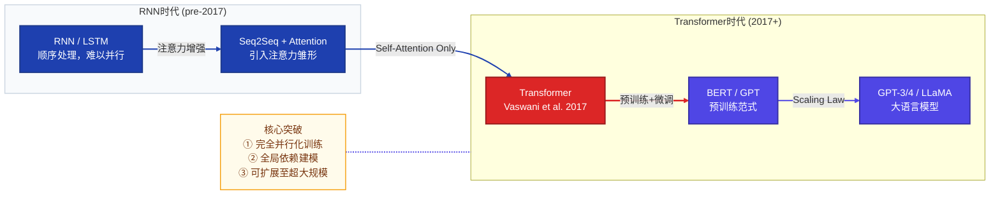

### 1.2 相比RNN的核心优势

| 维度 | RNN/LSTM | Transformer |
|------|----------|-------------|
| **并行化** | 顺序计算，无法并行 | 完全并行，GPU友好 |
| **长程依赖** | 梯度消失，依赖受限 | 任意位置O(1)路径 |
| **计算复杂度** | O(n) 时间步 | O(n²) 注意力矩阵 |
| **可扩展性** | 难以扩展到超长序列 | 支持超大模型规模 |
| **记忆机制** | 隐藏状态隐式记忆 | 显式注意力权重 |

---

## 2. 核心原理与工作机制

### 2.1 注意力机制直觉理解

注意力机制的本质是**动态加权聚合**：对于序列中的每个位置，模型学习"应该关注哪些其他位置"，并按权重汇聚信息。

**类比理解**：在阅读"银行利率上涨"时，"利率"这个词应该高度关注"银行"而非"河岸（bank）"的语义，注意力机制正是实现这种上下文感知的核心手段。

### 2.2 缩放点积注意力（Scaled Dot-Product Attention）

给定查询矩阵 $Q$、键矩阵 $K$、值矩阵 $V$，注意力计算公式为：

$$\text{Attention}(Q, K, V) = \text{softmax}\left(\frac{QK^T}{\sqrt{d_k}}\right)V$$

其中：
- $Q \in \mathbb{R}^{n \times d_k}$：查询矩阵（Query）
- $K \in \mathbb{R}^{m \times d_k}$：键矩阵（Key）
- $V \in \mathbb{R}^{m \times d_v}$：值矩阵（Value）
- $d_k$：键/查询的维度，用于缩放防止梯度消失

**缩放因子 $\sqrt{d_k}$ 的意义**：当 $d_k$ 较大时，点积结果方差增大，softmax 会产生极小梯度（梯度饱和），除以 $\sqrt{d_k}$ 可将方差恢复至合理范围。

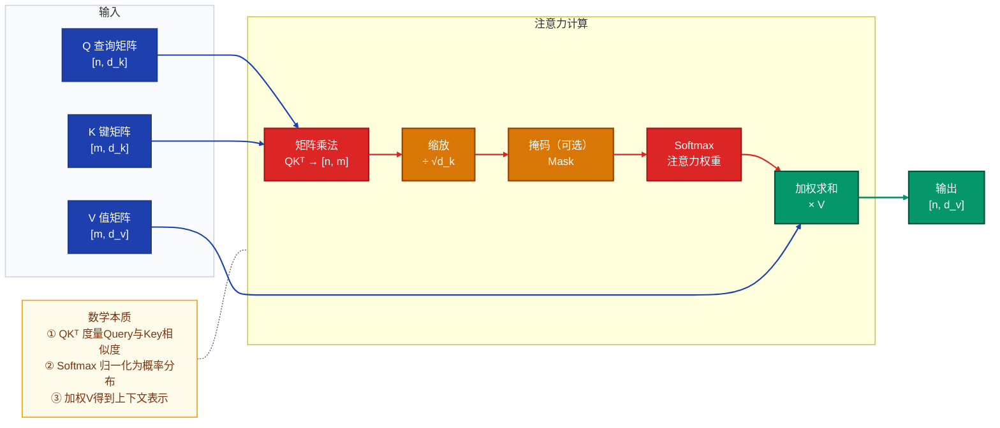

### 2.3 多头注意力的直觉

单头注意力在一个子空间中建模关联，而**多头注意力（Multi-Head Attention）**在多个子空间并行学习不同类型的依赖关系（如句法关系、语义关系、共指关系等），最终拼接融合：

$$\text{MultiHead}(Q, K, V) = \text{Concat}(\text{head}_1, \ldots, \text{head}_h)W^O$$

$$\text{head}_i = \text{Attention}(QW_i^Q, KW_i^K, VW_i^V)$$

---

## 3. 完整架构设计

### 3.1 总体架构概览

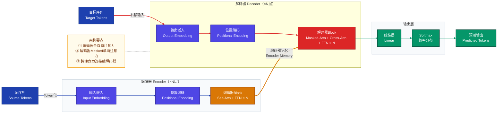

### 3.1 输入嵌入与位置编码

#### Token 嵌入

将离散 Token ID 映射到连续向量空间：

$$\text{Embedding}(x) = x \cdot W_E, \quad W_E \in \mathbb{R}^{|V| \times d_{model}}$$

#### 位置编码（Positional Encoding）

Transformer 本身对位置不感知，需通过位置编码注入序列顺序信息。原始论文使用正弦/余弦函数：

$$PE_{(pos, 2i)} = \sin\left(\frac{pos}{10000^{2i/d_{model}}}\right)$$

$$PE_{(pos, 2i+1)} = \cos\left(\frac{pos}{10000^{2i/d_{model}}}\right)$$

其中 $pos$ 为序列位置，$i$ 为维度索引。该设计的优势：
- **外推能力**：可处理训练时未见过的更长序列
- **相对位置感知**：任意两位置的 PE 内积仅依赖相对距离
- **无需训练**：固定函数，不增加参数量

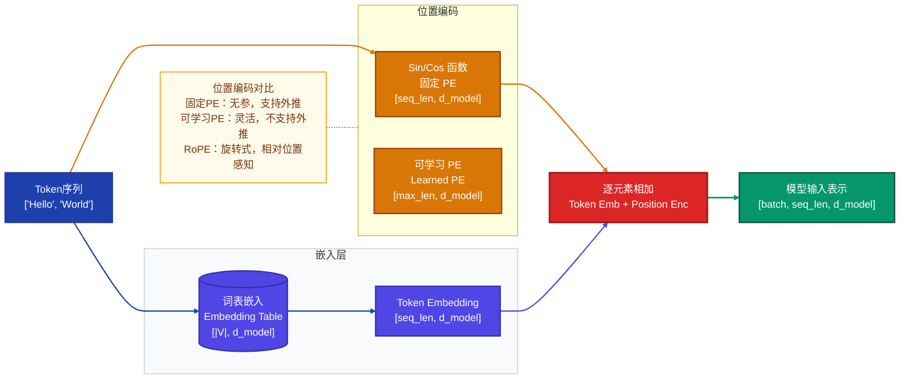

### 3.2 多头自注意力机制

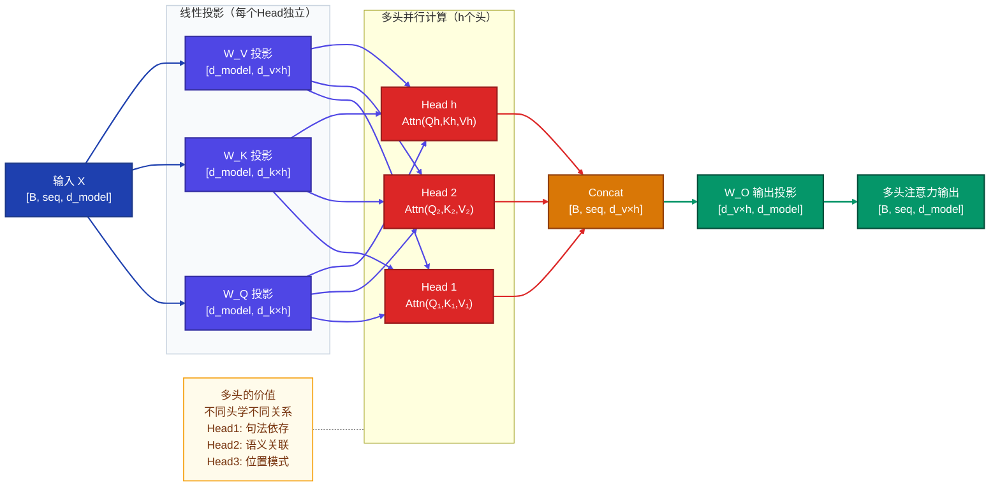

### 3.3 前馈神经网络

每个 Transformer 层包含一个位置无关的前馈网络（FFN），对每个位置独立作用：

$$\text{FFN}(x) = \max(0, xW_1 + b_1)W_2 + b_2$$

或使用 GELU 激活（现代模型常用）：

$$\text{FFN}(x) = \text{GELU}(xW_1 + b_1)W_2 + b_2$$

**典型维度**：$d_{model} = 512$ 时，$d_{ff} = 2048$（4倍扩张比），现代大模型常用 $\frac{8}{3} d_{model}$ 的门控 FFN（SwiGLU）。

### 3.4 残差连接与层归一化

每个子层（注意力/FFN）都采用残差连接和层归一化：

$$\text{LayerNorm}(x + \text{Sublayer}(x))$$

**层归一化公式**：

$$\text{LayerNorm}(x) = \gamma \cdot \frac{x - \mu}{\sqrt{\sigma^2 + \epsilon}} + \beta$$

其中 $\mu, \sigma^2$ 是对特征维度计算的均值和方差，$\gamma, \beta$ 是可学习参数。

> **Pre-LN vs Post-LN**：原始论文使用 Post-LN（先子层后归一化），但现代大模型（GPT-3、LLaMA）普遍使用 Pre-LN（先归一化后子层），训练更稳定，无需特殊学习率预热策略。

### 3.5 编码器与解码器

```mermaid
flowchart LR
    %% ── 配色主题 ─────────────────────────────────────────────
    classDef inputStyle   fill:#1e40af,stroke:#1e3a8a,stroke-width:2px,color:#fff
    classDef attnStyle    fill:#dc2626,stroke:#991b1b,stroke-width:2.5px,color:#fff
    classDef ffnStyle     fill:#d97706,stroke:#92400e,stroke-width:2px,color:#fff
    classDef normStyle    fill:#4f46e5,stroke:#3730a3,stroke-width:2px,color:#fff
    classDef crossStyle   fill:#7c3aed,stroke:#5b21b6,stroke-width:2px,color:#fff
    classDef outStyle     fill:#059669,stroke:#064e3b,stroke-width:2px,color:#fff
    classDef noteStyle    fill:#fffbeb,stroke:#f59e0b,stroke-width:1.5px,color:#78350f
    classDef layerStyle   fill:#f8fafc,stroke:#cbd5e0,stroke-width:1.5px

    subgraph EncoderBlock["编码器 Block（×N）"]
        direction TB
        EIN["输入 x<br>[B, src_len, d]"]:::inputStyle
        ESA["多头自注意力<br>Multi-Head Self-Attention<br>（全双向）"]:::attnStyle
        EAN["Add & LayerNorm"]:::normStyle
        EFFN["前馈网络 FFN"]:::ffnStyle
        EFN["Add & LayerNorm"]:::normStyle
        EOUT["编码器输出<br>Memory [B, src_len, d]"]:::outStyle
    end
    class EncoderBlock layerStyle

    subgraph DecoderBlock["解码器 Block（×N）"]
        direction TB
        DIN["输入 y<br>[B, tgt_len, d]"]:::inputStyle
        DSA["掩码多头自注意力<br>Masked Self-Attention<br>（因果单向）"]:::attnStyle
        DAN["Add & LayerNorm"]:::normStyle
        DCA["跨注意力<br>Cross-Attention<br>Q←Decoder, K/V←Encoder"]:::crossStyle
        DCN["Add & LayerNorm"]:::normStyle
        DFFN["前馈网络 FFN"]:::ffnStyle
        DFN["Add & LayerNorm"]:::normStyle
        DOUT["解码器输出<br>[B, tgt_len, d]"]:::outStyle
    end
    class DecoderBlock layerStyle

    EIN --> ESA
    ESA --> EAN
    EAN --> EFFN
    EFFN --> EFN
    EFN --> EOUT

    DIN --> DSA
    DSA --> DAN
    DAN --> DCA
    EOUT ==>|"Memory<br>K, V"| DCA
    DCA --> DCN
    DCN --> DFFN
    DFFN --> DFN
    DFN --> DOUT

    NOTE1["编码器特点<br>全双向注意力<br>每个位置可看所有位置"]:::noteStyle
    NOTE2["解码器特点<br>因果掩码：只看当前及之前<br>跨注意力融合编码信息"]:::noteStyle
    NOTE1 -.- EncoderBlock
    NOTE2 -.- DecoderBlock

    %% 边索引：0-13，共 14 条
    linkStyle 0,1,2,3,4       stroke:#d97706,stroke-width:2px
    linkStyle 5,6,7           stroke:#dc2626,stroke-width:2px
    linkStyle 8               stroke:#d97706,stroke-width:3px
    linkStyle 9,10,11,12,13   stroke:#dc2626,stroke-width:2px
```

### 3.6 输出层

解码器输出经线性层映射至词表维度，再通过 Softmax 得到概率分布：

$$P(\text{token}) = \text{softmax}(h_t W_{\text{vocab}}^T + b)$$

其中 $W_{\text{vocab}} \in \mathbb{R}^{|V| \times d_{model}}$，通常与输入嵌入矩阵共享权重（Weight Tying），可显著减少参数量。

---

## 4. 数据集构建与处理

### 4.1 数据集格式

以机器翻译任务（英→中）为例，数据集格式如下：

#### 原始数据格式（JSON Lines）

```json
{"src": "Hello, how are you?", "tgt": "你好，你怎么样？"}
{"src": "The weather is nice today.", "tgt": "今天天气很好。"}
{"src": "I love deep learning.", "tgt": "我热爱深度学习。"}
```

#### 数据处理流程

```mermaid
flowchart LR
    %% ── 配色主题 ─────────────────────────────────────────────
    classDef rawStyle    fill:#1e40af,stroke:#1e3a8a,stroke-width:2px,color:#fff
    classDef cleanStyle  fill:#4f46e5,stroke:#3730a3,stroke-width:2px,color:#fff
    classDef tokenStyle  fill:#d97706,stroke:#92400e,stroke-width:2px,color:#fff
    classDef vocabStyle  fill:#dc2626,stroke:#991b1b,stroke-width:2px,color:#fff
    classDef encodeStyle fill:#7c3aed,stroke:#5b21b6,stroke-width:2px,color:#fff
    classDef batchStyle  fill:#059669,stroke:#064e3b,stroke-width:2px,color:#fff
    classDef noteStyle   fill:#fffbeb,stroke:#f59e0b,stroke-width:1.5px,color:#78350f
    classDef layerStyle  fill:#f8fafc,stroke:#cbd5e0,stroke-width:1.5px

    RAW["原始语料<br>Raw Corpus"]:::rawStyle

    subgraph Clean["数据清洗"]
        direction LR
        C1["去重去噪<br>Dedup & Denoise"]:::cleanStyle
        C2["长度过滤<br>Length Filter"]:::cleanStyle
        C3["质量过滤<br>Quality Filter"]:::cleanStyle
    end
    class Clean layerStyle

    subgraph Tokenize["分词处理"]
        direction LR
        T1["BPE / WordPiece<br>子词分词"]:::tokenStyle
        T2["特殊Token添加<br>[BOS] [EOS] [PAD]"]:::tokenStyle
    end
    class Tokenize layerStyle

    subgraph VocabBuild["词表构建"]
        direction LR
        V1[("词表文件<br>vocab.json<br>|V| = 32K~64K")]:::vocabStyle
        V2["Token→ID 映射"]:::vocabStyle
    end
    class VocabBuild layerStyle

    subgraph Encode["编码与存储"]
        direction LR
        E1["Token ID 序列<br>[101, 3456, 102, ...]"]:::encodeStyle
        E2["存储为 .bin / .arrow<br>高效读取"]:::encodeStyle
    end
    class Encode layerStyle

    subgraph Batch["批处理"]
        direction LR
        B1["动态填充<br>Dynamic Padding"]:::batchStyle
        B2["注意力掩码<br>Attention Mask"]:::batchStyle
        B3["批次采样<br>Batch Sampler"]:::batchStyle
    end
    class Batch layerStyle

    RAW --> C1
    C1 --> C2
    C2 --> C3
    C3 --> T1
    T1 --> T2
    T2 --> V1
    V1 --> V2
    V2 --> E1
    E1 --> E2
    E2 --> B1
    B1 --> B2
    B2 --> B3

    NOTE["处理关键点<br>① BPE平衡词表大小与覆盖率<br>② 动态Padding减少无效计算<br>③ 长文本截断策略影响性能"]:::noteStyle
    NOTE -.- Batch

    %% 边索引：0-11，共 12 条
    linkStyle 0,1,2       stroke:#1e40af,stroke-width:2px
    linkStyle 3,4         stroke:#d97706,stroke-width:2px
    linkStyle 5,6         stroke:#dc2626,stroke-width:2px
    linkStyle 7,8         stroke:#7c3aed,stroke-width:2px
    linkStyle 9,10,11     stroke:#059669,stroke-width:2px
```

### 4.2 分词器详解

| 分词算法 | 核心思路 | 代表模型 | 词表大小 |
|---------|---------|---------|---------|
| **BPE** | 合并高频字节对 | GPT系列 | 50K |
| **WordPiece** | 最大化语言模型概率 | BERT | 30K |
| **SentencePiece** | 无语言假设，直接处理原始文本 | T5/LLaMA | 32K |
| **Unigram** | 概率语言模型剪枝 | ALBERT | 32K |

---

## 5. 模型实现（Python代码）

### 5.1 完整 Transformer 实现

```python
"""
Transformer 完整实现
支持机器翻译任务（Encoder-Decoder架构）
环境要求：torch>=2.0, numpy>=1.24
"""

import math
import copy
import numpy as np
import torch
import torch.nn as nn
import torch.nn.functional as F
from torch.utils.data import Dataset, DataLoader
from typing import Optional, Tuple


# ─────────────────────────────────────────────────────────
# 1. 缩放点积注意力
# ─────────────────────────────────────────────────────────
class ScaledDotProductAttention(nn.Module):
    """
    缩放点积注意力机制
    Attention(Q, K, V) = softmax(QK^T / sqrt(d_k)) * V
    """

    def __init__(self, dropout: float = 0.1):
        super().__init__()
        self.dropout = nn.Dropout(p=dropout)

    def forward(
        self,
        q: torch.Tensor,           # [B, h, seq_q, d_k]
        k: torch.Tensor,           # [B, h, seq_k, d_k]
        v: torch.Tensor,           # [B, h, seq_v, d_v]
        mask: Optional[torch.Tensor] = None  # [B, 1, 1, seq_k] 或 [B, 1, seq_q, seq_k]
    ) -> Tuple[torch.Tensor, torch.Tensor]:

        d_k = q.size(-1)
        # 计算注意力分数 [B, h, seq_q, seq_k]
        scores = torch.matmul(q, k.transpose(-2, -1)) / math.sqrt(d_k)

        # 应用掩码（将掩码位置设为极小值）
        if mask is not None:
            scores = scores.masked_fill(mask == 0, float('-inf'))

        # Softmax + Dropout
        attn_weights = F.softmax(scores, dim=-1)
        attn_weights = self.dropout(attn_weights)

        # 加权求和
        output = torch.matmul(attn_weights, v)  # [B, h, seq_q, d_v]
        return output, attn_weights


# ─────────────────────────────────────────────────────────
# 2. 多头注意力
# ─────────────────────────────────────────────────────────
class MultiHeadAttention(nn.Module):
    """
    多头注意力机制
    将d_model维度分割为h个头，每头维度d_k = d_model // h
    """

    def __init__(self, d_model: int, num_heads: int, dropout: float = 0.1):
        super().__init__()
        assert d_model % num_heads == 0, "d_model必须能被num_heads整除"

        self.d_model = d_model
        self.num_heads = num_heads
        self.d_k = d_model // num_heads

        # Q/K/V 投影矩阵
        self.w_q = nn.Linear(d_model, d_model, bias=False)
        self.w_k = nn.Linear(d_model, d_model, bias=False)
        self.w_v = nn.Linear(d_model, d_model, bias=False)
        # 输出投影
        self.w_o = nn.Linear(d_model, d_model, bias=False)

        self.attention = ScaledDotProductAttention(dropout=dropout)
        self.dropout = nn.Dropout(p=dropout)

    def split_heads(self, x: torch.Tensor) -> torch.Tensor:
        """[B, seq, d_model] → [B, h, seq, d_k]"""
        B, seq, _ = x.size()
        x = x.view(B, seq, self.num_heads, self.d_k)
        return x.transpose(1, 2)

    def forward(
        self,
        query: torch.Tensor,       # [B, seq_q, d_model]
        key: torch.Tensor,         # [B, seq_k, d_model]
        value: torch.Tensor,       # [B, seq_v, d_model]
        mask: Optional[torch.Tensor] = None
    ) -> Tuple[torch.Tensor, torch.Tensor]:

        # 线性投影 + 分头
        q = self.split_heads(self.w_q(query))  # [B, h, seq_q, d_k]
        k = self.split_heads(self.w_k(key))    # [B, h, seq_k, d_k]
        v = self.split_heads(self.w_v(value))  # [B, h, seq_v, d_k]

        # 注意力计算
        attn_output, attn_weights = self.attention(q, k, v, mask)

        # 合并多头 [B, h, seq_q, d_k] → [B, seq_q, d_model]
        B, _, seq_q, _ = attn_output.size()
        attn_output = attn_output.transpose(1, 2).contiguous()
        attn_output = attn_output.view(B, seq_q, self.d_model)

        # 输出投影
        output = self.w_o(attn_output)
        return output, attn_weights


# ─────────────────────────────────────────────────────────
# 3. 前馈网络
# ─────────────────────────────────────────────────────────
class PositionwiseFeedForward(nn.Module):
    """
    位置无关前馈网络
    FFN(x) = GELU(xW1 + b1)W2 + b2
    """

    def __init__(self, d_model: int, d_ff: int, dropout: float = 0.1):
        super().__init__()
        self.linear1 = nn.Linear(d_model, d_ff)
        self.linear2 = nn.Linear(d_ff, d_model)
        self.dropout = nn.Dropout(p=dropout)
        self.activation = nn.GELU()

    def forward(self, x: torch.Tensor) -> torch.Tensor:
        return self.linear2(self.dropout(self.activation(self.linear1(x))))


# ─────────────────────────────────────────────────────────
# 4. 位置编码
# ─────────────────────────────────────────────────────────
class PositionalEncoding(nn.Module):
    """
    正弦余弦位置编码（固定，不可学习）
    PE(pos, 2i)   = sin(pos / 10000^(2i/d_model))
    PE(pos, 2i+1) = cos(pos / 10000^(2i/d_model))
    """

    def __init__(self, d_model: int, max_len: int = 5000, dropout: float = 0.1):
        super().__init__()
        self.dropout = nn.Dropout(p=dropout)

        # 预计算位置编码矩阵
        pe = torch.zeros(max_len, d_model)
        position = torch.arange(0, max_len, dtype=torch.float).unsqueeze(1)
        div_term = torch.exp(
            torch.arange(0, d_model, 2).float() * (-math.log(10000.0) / d_model)
        )

        pe[:, 0::2] = torch.sin(position * div_term)  # 偶数维度
        pe[:, 1::2] = torch.cos(position * div_term)  # 奇数维度
        pe = pe.unsqueeze(0)  # [1, max_len, d_model]

        # 注册为buffer（不参与梯度更新，但会保存到state_dict）
        self.register_buffer('pe', pe)

    def forward(self, x: torch.Tensor) -> torch.Tensor:
        """x: [B, seq_len, d_model]"""
        x = x + self.pe[:, :x.size(1), :]
        return self.dropout(x)


# ─────────────────────────────────────────────────────────
# 5. 编码器层
# ─────────────────────────────────────────────────────────
class EncoderLayer(nn.Module):
    """
    单个编码器层：
    x → Self-Attn → Add&Norm → FFN → Add&Norm
    使用 Pre-LN 结构（更稳定）
    """

    def __init__(self, d_model: int, num_heads: int, d_ff: int, dropout: float = 0.1):
        super().__init__()
        self.self_attn = MultiHeadAttention(d_model, num_heads, dropout)
        self.ffn = PositionwiseFeedForward(d_model, d_ff, dropout)
        self.norm1 = nn.LayerNorm(d_model)
        self.norm2 = nn.LayerNorm(d_model)
        self.dropout = nn.Dropout(p=dropout)

    def forward(
        self,
        x: torch.Tensor,
        src_mask: Optional[torch.Tensor] = None
    ) -> torch.Tensor:
        # Pre-LN: 先归一化，再注意力
        normed = self.norm1(x)
        attn_out, _ = self.self_attn(normed, normed, normed, src_mask)
        x = x + self.dropout(attn_out)

        # Pre-LN: 先归一化，再FFN
        normed = self.norm2(x)
        ffn_out = self.ffn(normed)
        x = x + self.dropout(ffn_out)
        return x


# ─────────────────────────────────────────────────────────
# 6. 解码器层
# ─────────────────────────────────────────────────────────
class DecoderLayer(nn.Module):
    """
    单个解码器层：
    y → Masked-Self-Attn → Add&Norm
      → Cross-Attn(K,V来自编码器) → Add&Norm
      → FFN → Add&Norm
    """

    def __init__(self, d_model: int, num_heads: int, d_ff: int, dropout: float = 0.1):
        super().__init__()
        self.self_attn  = MultiHeadAttention(d_model, num_heads, dropout)
        self.cross_attn = MultiHeadAttention(d_model, num_heads, dropout)
        self.ffn        = PositionwiseFeedForward(d_model, d_ff, dropout)
        self.norm1 = nn.LayerNorm(d_model)
        self.norm2 = nn.LayerNorm(d_model)
        self.norm3 = nn.LayerNorm(d_model)
        self.dropout = nn.Dropout(p=dropout)

    def forward(
        self,
        y: torch.Tensor,             # [B, tgt_len, d_model]
        memory: torch.Tensor,        # [B, src_len, d_model] 编码器输出
        tgt_mask: Optional[torch.Tensor] = None,  # 因果掩码
        memory_mask: Optional[torch.Tensor] = None
    ) -> torch.Tensor:
        # Masked Self-Attention
        normed = self.norm1(y)
        attn1, _ = self.self_attn(normed, normed, normed, tgt_mask)
        y = y + self.dropout(attn1)

        # Cross-Attention: Q来自解码器，K/V来自编码器
        normed = self.norm2(y)
        attn2, _ = self.cross_attn(normed, memory, memory, memory_mask)
        y = y + self.dropout(attn2)

        # FFN
        normed = self.norm3(y)
        ffn_out = self.ffn(normed)
        y = y + self.dropout(ffn_out)
        return y


# ─────────────────────────────────────────────────────────
# 7. 完整 Transformer 模型
# ─────────────────────────────────────────────────────────
class Transformer(nn.Module):
    """
    完整 Encoder-Decoder Transformer
    参数规模：base版约 65M 参数
    """

    def __init__(
        self,
        src_vocab_size: int,
        tgt_vocab_size: int,
        d_model: int = 512,
        num_heads: int = 8,
        num_encoder_layers: int = 6,
        num_decoder_layers: int = 6,
        d_ff: int = 2048,
        max_len: int = 512,
        dropout: float = 0.1,
        pad_idx: int = 0
    ):
        super().__init__()
        self.pad_idx = pad_idx
        self.d_model = d_model

        # 嵌入层
        self.src_embed = nn.Embedding(src_vocab_size, d_model, padding_idx=pad_idx)
        self.tgt_embed = nn.Embedding(tgt_vocab_size, d_model, padding_idx=pad_idx)
        self.pos_enc = PositionalEncoding(d_model, max_len, dropout)

        # 编码器/解码器堆叠
        enc_layer = EncoderLayer(d_model, num_heads, d_ff, dropout)
        dec_layer = DecoderLayer(d_model, num_heads, d_ff, dropout)
        self.encoder_layers = nn.ModuleList([copy.deepcopy(enc_layer) for _ in range(num_encoder_layers)])
        self.decoder_layers = nn.ModuleList([copy.deepcopy(dec_layer) for _ in range(num_decoder_layers)])

        # 最终归一化
        self.enc_norm = nn.LayerNorm(d_model)
        self.dec_norm = nn.LayerNorm(d_model)

        # 输出投影（与目标嵌入共享权重）
        self.output_proj = nn.Linear(d_model, tgt_vocab_size, bias=False)
        self.output_proj.weight = self.tgt_embed.weight  # Weight Tying

        self._init_weights()

    def _init_weights(self):
        """Xavier均匀初始化"""
        for p in self.parameters():
            if p.dim() > 1:
                nn.init.xavier_uniform_(p)

    def make_src_mask(self, src: torch.Tensor) -> torch.Tensor:
        """padding掩码：[B, 1, 1, src_len]"""
        return (src != self.pad_idx).unsqueeze(1).unsqueeze(2)

    def make_tgt_mask(self, tgt: torch.Tensor) -> torch.Tensor:
        """因果掩码 + padding掩码：[B, 1, tgt_len, tgt_len]"""
        tgt_len = tgt.size(1)
        # 下三角矩阵（因果掩码）
        causal_mask = torch.tril(torch.ones(tgt_len, tgt_len, device=tgt.device)).bool()
        # padding掩码
        pad_mask = (tgt != self.pad_idx).unsqueeze(1).unsqueeze(2)
        return causal_mask.unsqueeze(0) & pad_mask

    def encode(self, src: torch.Tensor, src_mask: torch.Tensor) -> torch.Tensor:
        x = self.pos_enc(self.src_embed(src) * math.sqrt(self.d_model))
        for layer in self.encoder_layers:
            x = layer(x, src_mask)
        return self.enc_norm(x)

    def decode(
        self,
        tgt: torch.Tensor,
        memory: torch.Tensor,
        tgt_mask: torch.Tensor,
        src_mask: torch.Tensor
    ) -> torch.Tensor:
        y = self.pos_enc(self.tgt_embed(tgt) * math.sqrt(self.d_model))
        for layer in self.decoder_layers:
            y = layer(y, memory, tgt_mask, src_mask)
        return self.dec_norm(y)

    def forward(
        self,
        src: torch.Tensor,
        tgt: torch.Tensor
    ) -> torch.Tensor:
        src_mask = self.make_src_mask(src)
        tgt_mask = self.make_tgt_mask(tgt)

        memory = self.encode(src, src_mask)
        dec_out = self.decode(tgt, memory, tgt_mask, src_mask)

        return self.output_proj(dec_out)  # [B, tgt_len, tgt_vocab_size]
```

### 5.2 数据集类实现

```python
# ─────────────────────────────────────────────────────────
# 数据集与分词器
# ─────────────────────────────────────────────────────────
class SimpleVocab:
    """简单词表（实际项目请使用 sentencepiece 或 tiktoken）"""

    def __init__(self):
        self.PAD_TOKEN = '[PAD]'
        self.BOS_TOKEN = '[BOS]'
        self.EOS_TOKEN = '[EOS]'
        self.UNK_TOKEN = '[UNK]'
        self.token2id = {
            self.PAD_TOKEN: 0,
            self.BOS_TOKEN: 1,
            self.EOS_TOKEN: 2,
            self.UNK_TOKEN: 3
        }
        self.id2token = {v: k for k, v in self.token2id.items()}

    def build_from_corpus(self, sentences, min_freq: int = 2):
        from collections import Counter
        counter = Counter()
        for sent in sentences:
            counter.update(sent.split())
        for word, freq in counter.items():
            if freq >= min_freq and word not in self.token2id:
                idx = len(self.token2id)
                self.token2id[word] = idx
                self.id2token[idx] = word

    def encode(self, sentence: str, add_bos: bool = True, add_eos: bool = True):
        tokens = [self.token2id.get(w, self.token2id[self.UNK_TOKEN])
                  for w in sentence.split()]
        if add_bos:
            tokens = [self.token2id[self.BOS_TOKEN]] + tokens
        if add_eos:
            tokens = tokens + [self.token2id[self.EOS_TOKEN]]
        return tokens

    def decode(self, ids):
        tokens = [self.id2token.get(i, self.UNK_TOKEN) for i in ids]
        tokens = [t for t in tokens if t not in {self.BOS_TOKEN, self.EOS_TOKEN, self.PAD_TOKEN}]
        return ' '.join(tokens)

    def __len__(self):
        return len(self.token2id)


class TranslationDataset(Dataset):
    """机器翻译数据集"""

    def __init__(self, src_sentences, tgt_sentences, src_vocab, tgt_vocab, max_len: int = 128):
        self.data = []
        for src, tgt in zip(src_sentences, tgt_sentences):
            src_ids = src_vocab.encode(src)[:max_len]
            tgt_ids = tgt_vocab.encode(tgt)[:max_len]
            self.data.append((src_ids, tgt_ids))

    def __len__(self):
        return len(self.data)

    def __getitem__(self, idx):
        return self.data[idx]


def collate_fn(batch, pad_idx: int = 0):
    """动态填充至批次最大长度"""
    src_batch, tgt_batch = zip(*batch)
    src_max = max(len(s) for s in src_batch)
    tgt_max = max(len(t) for t in tgt_batch)

    src_padded = torch.tensor(
        [s + [pad_idx] * (src_max - len(s)) for s in src_batch], dtype=torch.long
    )
    tgt_padded = torch.tensor(
        [t + [pad_idx] * (tgt_max - len(t)) for t in tgt_batch], dtype=torch.long
    )
    return src_padded, tgt_padded
```

### 5.3 训练循环实现

```python
# ─────────────────────────────────────────────────────────
# 训练器
# ─────────────────────────────────────────────────────────
class LabelSmoothingLoss(nn.Module):
    """标签平滑交叉熵损失，防止模型过于自信"""

    def __init__(self, vocab_size: int, padding_idx: int = 0, smoothing: float = 0.1):
        super().__init__()
        self.criterion = nn.KLDivLoss(reduction='sum')
        self.padding_idx = padding_idx
        self.smoothing = smoothing
        self.vocab_size = vocab_size

    def forward(self, logits: torch.Tensor, target: torch.Tensor) -> torch.Tensor:
        # logits: [B*seq, vocab_size]  target: [B*seq]
        log_probs = F.log_softmax(logits, dim=-1)

        with torch.no_grad():
            smooth_dist = torch.full_like(log_probs, self.smoothing / (self.vocab_size - 2))
            smooth_dist.scatter_(1, target.unsqueeze(1), 1.0 - self.smoothing)
            smooth_dist[:, self.padding_idx] = 0
            non_pad_mask = (target != self.padding_idx)
            smooth_dist[~non_pad_mask] = 0

        loss = self.criterion(log_probs, smooth_dist)
        n_tokens = non_pad_mask.sum().item()
        return loss / n_tokens if n_tokens > 0 else loss


class WarmupScheduler:
    """Transformer 原始论文的 Warmup 学习率调度器"""

    def __init__(self, optimizer, d_model: int, warmup_steps: int = 4000):
        self.optimizer = optimizer
        self.d_model = d_model
        self.warmup_steps = warmup_steps
        self.step_num = 0

    def step(self):
        self.step_num += 1
        lr = self._get_lr()
        for param_group in self.optimizer.param_groups:
            param_group['lr'] = lr
        return lr

    def _get_lr(self) -> float:
        step = self.step_num
        warmup = self.warmup_steps
        return self.d_model ** (-0.5) * min(step ** (-0.5), step * warmup ** (-1.5))


def train_epoch(model, dataloader, optimizer, scheduler, criterion, device):
    model.train()
    total_loss = 0
    total_tokens = 0

    for batch_idx, (src, tgt) in enumerate(dataloader):
        src, tgt = src.to(device), tgt.to(device)

        # 解码器输入：去掉最后一个token（[EOS]）
        tgt_input  = tgt[:, :-1]
        # 目标标签：去掉第一个token（[BOS]）
        tgt_labels = tgt[:, 1:]

        # 前向传播
        logits = model(src, tgt_input)  # [B, tgt_len, vocab]

        # 计算损失
        B, T, V = logits.size()
        loss = criterion(logits.reshape(B * T, V), tgt_labels.reshape(-1))

        # 反向传播
        optimizer.zero_grad()
        loss.backward()
        nn.utils.clip_grad_norm_(model.parameters(), max_norm=1.0)  # 梯度裁剪
        optimizer.step()
        scheduler.step()

        total_loss += loss.item() * (tgt_labels != 0).sum().item()
        total_tokens += (tgt_labels != 0).sum().item()

        if batch_idx % 100 == 0:
            print(f"  Batch {batch_idx}, Loss: {loss.item():.4f}, LR: {scheduler._get_lr():.6f}")

    return total_loss / total_tokens if total_tokens > 0 else float('inf')


def train(
    model,
    train_loader,
    val_loader,
    num_epochs: int = 20,
    device: str = 'cuda'
):
    model = model.to(device)
    criterion = LabelSmoothingLoss(
        vocab_size=model.output_proj.out_features,
        padding_idx=model.pad_idx,
        smoothing=0.1
    )
    optimizer = torch.optim.Adam(
        model.parameters(),
        lr=0,  # 由 scheduler 控制
        betas=(0.9, 0.98),
        eps=1e-9
    )
    scheduler = WarmupScheduler(optimizer, d_model=model.d_model, warmup_steps=4000)

    best_val_loss = float('inf')
    for epoch in range(num_epochs):
        train_loss = train_epoch(model, train_loader, optimizer, scheduler, criterion, device)
        val_loss = evaluate(model, val_loader, criterion, device)

        print(f"Epoch {epoch+1}/{num_epochs} | Train Loss: {train_loss:.4f} | Val Loss: {val_loss:.4f}")

        if val_loss < best_val_loss:
            best_val_loss = val_loss
            torch.save(model.state_dict(), 'best_transformer.pt')
            print(f"  ✓ 保存最优模型 (val_loss={val_loss:.4f})")


@torch.no_grad()
def evaluate(model, dataloader, criterion, device):
    model.eval()
    total_loss = 0
    total_tokens = 0

    for src, tgt in dataloader:
        src, tgt = src.to(device), tgt.to(device)
        tgt_input  = tgt[:, :-1]
        tgt_labels = tgt[:, 1:]

        logits = model(src, tgt_input)
        B, T, V = logits.size()
        loss = criterion(logits.reshape(B * T, V), tgt_labels.reshape(-1))

        total_loss += loss.item() * (tgt_labels != 0).sum().item()
        total_tokens += (tgt_labels != 0).sum().item()

    return total_loss / total_tokens if total_tokens > 0 else float('inf')
```

### 5.4 推理（贪心解码与束搜索）

```python
# ─────────────────────────────────────────────────────────
# 推理：贪心解码
# ─────────────────────────────────────────────────────────
@torch.no_grad()
def greedy_decode(
    model,
    src: torch.Tensor,         # [1, src_len]
    bos_idx: int,
    eos_idx: int,
    max_len: int = 100,
    device: str = 'cuda'
) -> list:
    model.eval()
    src = src.to(device)
    src_mask = model.make_src_mask(src)
    memory = model.encode(src, src_mask)

    # 初始化解码器输入为 [BOS]
    tgt = torch.tensor([[bos_idx]], dtype=torch.long, device=device)

    for _ in range(max_len):
        tgt_mask = model.make_tgt_mask(tgt)
        dec_out = model.decode(tgt, memory, tgt_mask, src_mask)
        logits  = model.output_proj(dec_out[:, -1, :])   # [1, vocab]
        next_id = logits.argmax(dim=-1, keepdim=True)    # [1, 1]
        tgt = torch.cat([tgt, next_id], dim=1)

        if next_id.item() == eos_idx:
            break

    return tgt[0].tolist()


# ─────────────────────────────────────────────────────────
# 推理：束搜索（Beam Search）
# ─────────────────────────────────────────────────────────
@torch.no_grad()
def beam_search(
    model,
    src: torch.Tensor,
    bos_idx: int,
    eos_idx: int,
    beam_size: int = 4,
    max_len: int = 100,
    length_penalty: float = 0.6,
    device: str = 'cuda'
) -> list:
    model.eval()
    src = src.to(device)
    src_mask = model.make_src_mask(src)
    memory = model.encode(src, src_mask)

    # 扩展为 beam_size 份
    memory   = memory.expand(beam_size, -1, -1)
    src_mask = src_mask.expand(beam_size, -1, -1, -1)

    # 候选序列：(累积log概率, token序列)
    beams = [(0.0, [bos_idx])]
    completed = []

    for step in range(max_len):
        all_candidates = []
        for score, seq in beams:
            tgt = torch.tensor([seq], dtype=torch.long, device=device)
            tgt = tgt.expand(beam_size, -1)[:len(beams)]  # 调整大小
            tgt_single = torch.tensor([seq], dtype=torch.long, device=device)
            mem_single  = memory[:1]
            mask_single = src_mask[:1]

            tgt_mask = model.make_tgt_mask(tgt_single)
            dec_out  = model.decode(tgt_single, mem_single, tgt_mask, mask_single)
            log_probs = F.log_softmax(model.output_proj(dec_out[:, -1, :]), dim=-1)

            top_log_probs, top_ids = log_probs[0].topk(beam_size)
            for log_p, tok_id in zip(top_log_probs.tolist(), top_ids.tolist()):
                new_score = score + log_p
                new_seq   = seq + [tok_id]
                if tok_id == eos_idx:
                    lp = ((5 + len(new_seq)) / 6) ** length_penalty  # 长度惩罚
                    completed.append((new_score / lp, new_seq))
                else:
                    all_candidates.append((new_score, new_seq))

        if not all_candidates:
            break
        beams = sorted(all_candidates, key=lambda x: x[0], reverse=True)[:beam_size]

    if not completed:
        completed = beams
    best_seq = sorted(completed, key=lambda x: x[0], reverse=True)[0][1]
    return best_seq


# ─────────────────────────────────────────────────────────
# 快速验证
# ─────────────────────────────────────────────────────────
if __name__ == '__main__':
    device = 'cuda' if torch.cuda.is_available() else 'cpu'
    print(f"使用设备: {device}")

    # 构建小型模型用于验证
    model = Transformer(
        src_vocab_size=1000,
        tgt_vocab_size=1000,
        d_model=128,
        num_heads=4,
        num_encoder_layers=2,
        num_decoder_layers=2,
        d_ff=512,
        dropout=0.1
    )

    total_params = sum(p.numel() for p in model.parameters())
    print(f"模型参数量: {total_params:,}")

    # 前向传播测试
    src = torch.randint(1, 1000, (2, 20))  # [B=2, src_len=20]
    tgt = torch.randint(1, 1000, (2, 15))  # [B=2, tgt_len=15]
    logits = model(src, tgt)
    print(f"输出形状: {logits.shape}")  # 期望: [2, 15, 1000]
```

---

## 6. 训练方法与策略

### 6.1 训练流程总览

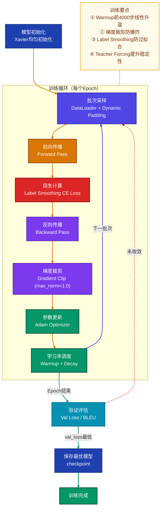

### 6.2 关键训练超参数

| 超参数 | 原始论文(Base) | 推荐范围 | 影响 |
|--------|--------------|---------|------|
| `d_model` | 512 | 128~1024 | 模型容量 |
| `num_heads` | 8 | 4~16 | 注意力多样性 |
| `num_layers` | 6 | 3~12 | 模型深度 |
| `d_ff` | 2048 | 4×d_model | FFN容量 |
| `dropout` | 0.1 | 0.0~0.3 | 正则化强度 |
| `warmup_steps` | 4000 | 1000~10000 | 训练稳定性 |
| `label_smoothing` | 0.1 | 0.0~0.2 | 防过拟合 |
| `batch_size` | 25000 tokens | 视显存 | 训练效率 |

### 6.3 学习率调度策略

Transformer 原始论文使用**先升后降**的学习率调度：

$$lr = d_{\text{model}}^{-0.5} \cdot \min\left(\text{step}^{-0.5},\ \text{step} \cdot \text{warmup\_steps}^{-1.5}\right)$$

- **Warmup 阶段**（step < warmup_steps）：线性增长，稳定初始训练
- **Decay 阶段**（step ≥ warmup_steps）：按 $\frac{1}{\sqrt{\text{step}}}$ 衰减

---

## 7. 评估指标

### 7.1 核心指标一览

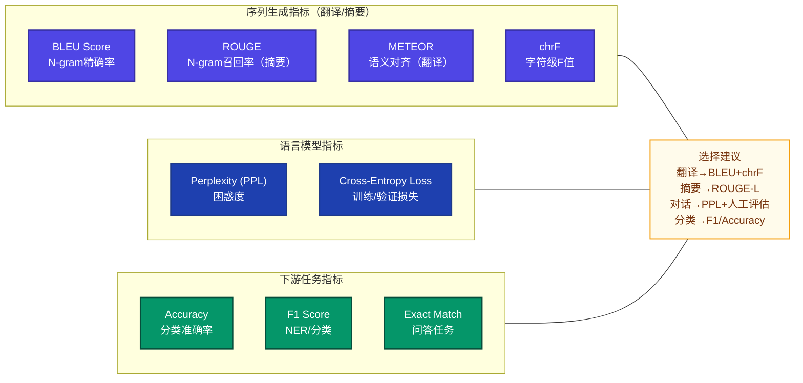

### 7.2 BLEU 分数计算

BLEU（Bilingual Evaluation Understudy）是机器翻译最常用的自动评估指标：

$$\text{BLEU} = BP \cdot \exp\left(\sum_{n=1}^{N} w_n \log p_n\right)$$

其中：
- $p_n$：n-gram 精确率
- $BP$：简短惩罚因子（Brevity Penalty）
- $w_n = 1/N$：各阶权重（通常取 N=4）

```python
import math
from collections import Counter

def compute_bleu(references, hypotheses, max_n=4):
    """计算语料级BLEU分数"""
    clipped_counts = Counter()
    total_counts = Counter()
    ref_len = 0
    hyp_len = 0

    for ref, hyp in zip(references, hypotheses):
        ref_tokens = ref.split()
        hyp_tokens = hyp.split()
        ref_len += len(ref_tokens)
        hyp_len += len(hyp_tokens)

        for n in range(1, max_n + 1):
            ref_ngrams = Counter(
                tuple(ref_tokens[i:i+n]) for i in range(len(ref_tokens)-n+1)
            )
            hyp_ngrams = Counter(
                tuple(hyp_tokens[i:i+n]) for i in range(len(hyp_tokens)-n+1)
            )
            clipped = {k: min(v, ref_ngrams[k]) for k, v in hyp_ngrams.items()}
            clipped_counts[n] += sum(clipped.values())
            total_counts[n]   += sum(hyp_ngrams.values())

    bp = 1.0 if hyp_len >= ref_len else math.exp(1 - ref_len / hyp_len)
    weights = [1.0 / max_n] * max_n

    log_avg = sum(
        w * math.log(clipped_counts[n] / total_counts[n] + 1e-10)
        for n, w in enumerate(weights, 1)
    )
    return bp * math.exp(log_avg)
```

### 7.3 困惑度（Perplexity）

$$PPL = \exp\left(-\frac{1}{N}\sum_{i=1}^{N} \log P(w_i | w_{<i})\right)$$

PPL 越低表示模型对语言的建模能力越强。GPT-2 在 WikiText-103 上约 16-20，GPT-3 约 10-12。

---

## 8. 推理过程

### 8.1 推理流程

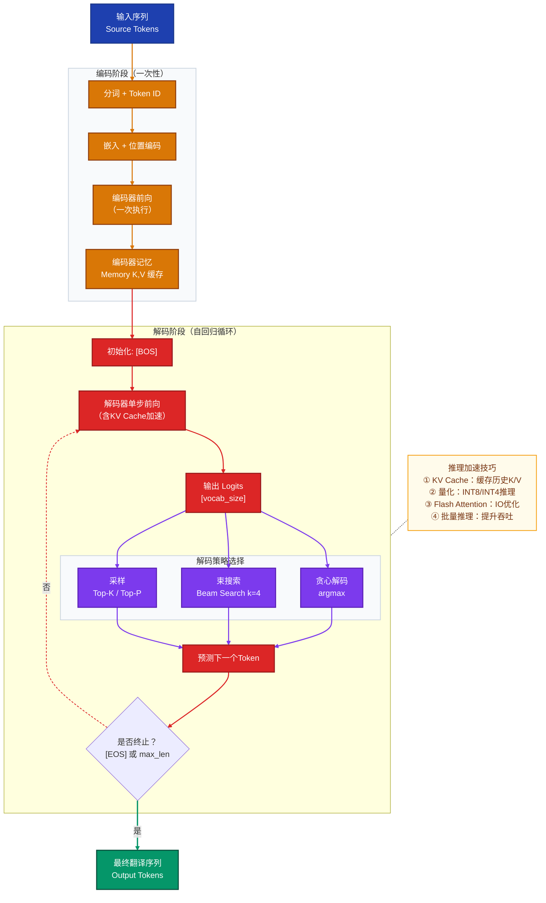

### 8.2 解码策略对比

| 策略 | 方法 | 优点 | 缺点 | 适用场景 |
|------|------|------|------|---------|
| **贪心解码** | 每步取最高概率 | 速度快 | 局部最优，质量差 | 快速原型 |
| **束搜索** | 保留k条最优路径 | 质量较高 | 速度慢，重复 | 翻译/摘要 |
| **Top-K 采样** | 从前K个token采样 | 多样性高 | 可能不连贯 | 创意写作 |
| **Top-P (核采样)** | 累积概率≥p的token集合中采样 | 动态词表 | 超参敏感 | 对话/文本生成 |
| **温度采样** | softmax(logits/T) | 控制随机性 | T需调节 | 配合其他策略 |

---

## 9. 常见技术问题与解决方案

### 9.1 问题与解决方案汇总

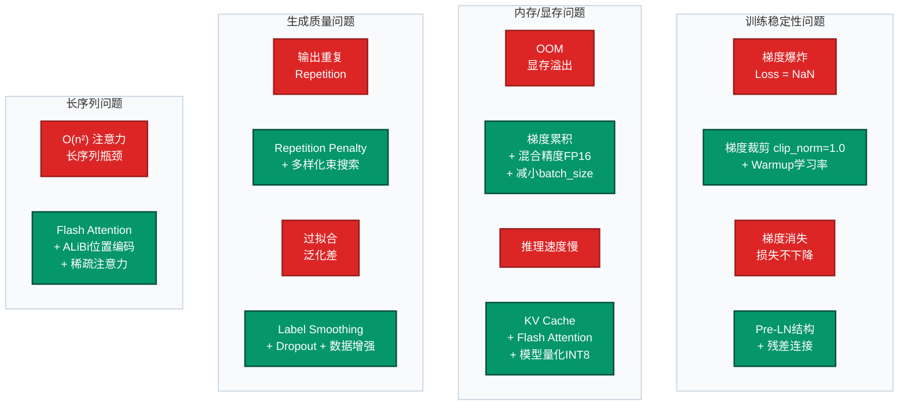

### 9.2 详细解决方案

#### 问题1：训练损失 NaN（梯度爆炸）

**原因**：初始学习率过高、未使用 Warmup、注意力分数溢出

**解决**：
```python
# 方案1：梯度裁剪
nn.utils.clip_grad_norm_(model.parameters(), max_norm=1.0)

# 方案2：数值稳定的注意力（使用 float32 计算）
with torch.autocast(device_type='cuda', dtype=torch.float16):
    # 注意力计算在 float32 下执行
    scores = scores.float()
    attn = F.softmax(scores, dim=-1).half()

# 方案3：检查嵌入初始化
nn.init.normal_(embedding.weight, mean=0, std=d_model**-0.5)
```

#### 问题2：显存不足（OOM）

```python
# 方案1：梯度累积（等效增大 batch_size）
accumulation_steps = 4
for i, batch in enumerate(dataloader):
    loss = model(batch) / accumulation_steps
    loss.backward()
    if (i + 1) % accumulation_steps == 0:
        optimizer.step()
        optimizer.zero_grad()

# 方案2：混合精度训练（约节省40%显存）
scaler = torch.cuda.amp.GradScaler()
with torch.autocast(device_type='cuda', dtype=torch.float16):
    output = model(src, tgt)
    loss = criterion(output, labels)
scaler.scale(loss).backward()
scaler.step(optimizer)
scaler.update()

# 方案3：激活检查点（节省70%激活内存，增加约30%计算）
from torch.utils.checkpoint import checkpoint
def forward_with_checkpoint(layer, x, mask):
    return checkpoint(layer, x, mask)
```

#### 问题3：推理速度慢（KV Cache 优化）

```python
class TransformerWithKVCache(nn.Module):
    """带KV Cache的推理优化版本"""

    def decode_step(
        self,
        tgt_token: torch.Tensor,  # [B, 1] 当前token
        memory: torch.Tensor,
        kv_cache: dict             # 存储历史K/V
    ) -> torch.Tensor:
        # 从cache获取历史K/V，仅对当前token计算Q
        # 拼接后得到完整K/V序列
        # 显著减少重复计算
        pass
```

#### 问题4：生成重复（Repetition Penalty）

```python
def apply_repetition_penalty(logits, generated_ids, penalty=1.2):
    """对已生成token的概率进行惩罚"""
    for token_id in set(generated_ids):
        if logits[token_id] > 0:
            logits[token_id] /= penalty
        else:
            logits[token_id] *= penalty
    return logits
```

---

## 10. 实际应用注意事项与最佳实践

### 10.1 工程实践清单


### 10.2 关键注意事项

#### 位置编码选择
- **NLP短序列**：原始正弦PE或可学习PE
- **长上下文（>2K）**：ALiBi 或 RoPE（支持外推）
- **视觉Transformer**：2D正弦PE或可学习的patch位置嵌入

#### 归一化位置
- **Post-LN（原始论文）**：需要仔细的学习率Warmup，大模型训练不稳定
- **Pre-LN（推荐）**：训练更稳定，但最终层表示可能次优
- **RMSNorm（现代大模型）**：比LayerNorm更快，效果相当

#### 注意力优化
```python
# 使用 PyTorch 2.0+ 内置 Flash Attention（自动调用）
with torch.backends.cuda.sdp_kernel(enable_flash=True):
    output = F.scaled_dot_product_attention(q, k, v, attn_mask=mask)

# 等效于手动实现，但：
# ① 内存效率: O(n) 而非 O(n²)
# ② 速度: 2-4x faster on A100
```

#### 批次大小与学习率的关系
- 批次大小翻倍时，可按平方根缩放学习率（Linear Scaling Rule）
- 极大批次（>32K tokens）时需要特殊的优化器设置（LAMB等）

### 10.3 预训练 vs 从头训练

| 场景 | 推荐方案 | 原因 |
|------|---------|------|
| 数据 < 10M tokens | 使用预训练模型微调 | 数据不足，从头训练效果差 |
| 特定领域（医疗/法律） | 领域继续预训练 + 微调 | 通用模型领域知识不足 |
| 特殊语言/任务 | 从头训练 | 预训练模型无法覆盖 |
| 计算资源有限 | LoRA/Adapter微调 | 仅训练少量参数 |

---

## 11. 面试常见问题 FAQ

### 基本原理类

---

**Q1：Transformer 为什么要使用缩放因子 $\sqrt{d_k}$？不缩放会有什么问题？**

**A：** 当 $d_k$ 较大时（如 64），$Q$ 和 $K$ 的点积结果的方差约为 $d_k$，导致 softmax 输入进入梯度接近零的饱和区（极大的正数/负数区域），从而产生梯度消失。

**数学推导**：假设 $q_i, k_i \sim \mathcal{N}(0, 1)$ i.i.d.，则 $q \cdot k = \sum_{i=1}^{d_k} q_i k_i$ 的均值为 0，方差为 $d_k$。除以 $\sqrt{d_k}$ 后，方差恢复为 1，softmax 梯度正常流动。

**代码验证**：
```python
import torch
d_k = 64
q = torch.randn(1, d_k)
k = torch.randn(1, d_k)
dot = (q * k).sum()       # 方差 ≈ 64
scaled = dot / (d_k**0.5) # 方差 ≈ 1
print(f"未缩放: {dot.item():.2f}, 缩放后: {scaled.item():.2f}")
```

---

**Q2：Transformer 中的 self-attention 与 cross-attention 有何区别？**

**A：**

| 维度 | Self-Attention | Cross-Attention |
|------|---------------|-----------------|
| **Q/K/V来源** | Q=K=V=同一序列 | Q来自一个序列，K/V来自另一序列 |
| **用途** | 序列内部关系建模 | 两序列间的信息交互 |
| **出现位置** | 编码器 & 解码器 | 仅解码器（连接编解码器） |
| **典型应用** | BERT的上下文表示 | 翻译时关注源语言 |

解码器中的 cross-attention 使解码器的每个位置能够"查询"编码器的全部输出，实现信息对齐，类似于传统 Seq2Seq 中的 Bahdanau 注意力。

---

**Q3：解码器中的 Masked Self-Attention 是如何实现的？为什么需要掩码？**

**A：** 训练阶段使用 **Teacher Forcing**（将真实目标序列作为解码器输入），如果不加掩码，位置 $t$ 的解码就能看到位置 $t+1, t+2...$ 的信息，造成"数据泄露"，模型会学到"抄答案"而非真正的序列生成能力。

**实现方式**：创建下三角布尔矩阵，将上三角（未来位置）设为 `-inf`，softmax 后这些位置权重变为 0：

```python
def make_causal_mask(seq_len, device):
    # 下三角为 True（可见），上三角为 False（遮盖）
    mask = torch.tril(torch.ones(seq_len, seq_len, device=device)).bool()
    return mask  # [seq_len, seq_len]

# 在注意力中应用
scores = scores.masked_fill(~mask, float('-inf'))
attn_weights = F.softmax(scores, dim=-1)
```

---

**Q4：位置编码为什么使用正弦/余弦函数？有哪些替代方案？**

**A：** 选择正弦余弦 PE 的三个理由：

1. **外推能力**：可以处理比训练序列更长的位置，函数值有界
2. **相对位置表达**：$PE_{pos+k}$ 可表示为 $PE_{pos}$ 的线性变换，便于模型学习相对距离
3. **无额外参数**：固定函数，不增加参数量

**替代方案对比**：

| 方案 | 参数量 | 外推 | 相对位置 | 代表模型 |
|------|--------|------|---------|---------|
| 正弦PE（原始） | 0 | 有限 | 隐式 | Transformer |
| 可学习PE | max_len×d | 不支持 | 否 | BERT/GPT-2 |
| **RoPE** | 0 | 可扩展 | 显式旋转 | LLaMA/GPT-NeoX |
| **ALiBi** | 0 | 强 | 线性偏差 | BLOOM |
| NTK-aware RoPE | 0 | 强 | 频率缩放 | Code LLaMA |

---

**Q5：LayerNorm 和 BatchNorm 有什么区别？Transformer 为什么选 LayerNorm？**

**A：**

| 维度 | BatchNorm | LayerNorm |
|------|-----------|-----------|
| **归一化维度** | 对 batch 维度归一化（特征均值/方差） | 对特征维度归一化（样本均值/方差） |
| **依赖 batch size** | 是，小batch效果差 | 否，每个样本独立 |
| **序列变长** | 不适用（长度不一） | 适用 |
| **推理行为** | 需要运行时统计 | 与训练一致 |

Transformer 使用 LayerNorm 的原因：
1. NLP 序列长度各异，BatchNorm 在 padding 处理上存在困难
2. 文本 batch 通常较小（显存限制），BatchNorm 统计不稳定
3. 语言模型的自回归推理中，batch 可能为 1，BatchNorm 退化

---

### 实际应用类

---

**Q6：BERT 和 GPT 在 Transformer 架构上有什么核心区别？**

**A：**

| 维度 | BERT | GPT |
|------|------|-----|
| **架构** | 仅编码器（Encoder-Only） | 仅解码器（Decoder-Only） |
| **注意力** | 全双向 Self-Attention | 因果单向（Masked）Self-Attention |
| **预训练目标** | MLM（完形填空） + NSP | 自回归语言模型（下一词预测） |
| **适用任务** | 理解型（分类/NER/QA） | 生成型（翻译/摘要/对话） |
| **输入** | 双向上下文可见 | 只能看左侧上下文 |
| **代表模型** | BERT/RoBERTa/ALBERT | GPT-2/3/4/LLaMA |

**本质差异**：BERT 是"理解型"模型，通过还原被遮蔽词学习上下文表示；GPT 是"生成型"模型，通过预测下一个词学习自回归分布。

---

**Q7：Transformer 模型的计算复杂度是多少？如何处理长序列？**

**A：** 标准 Self-Attention 的时间复杂度为 $O(n^2 \cdot d)$，空间复杂度为 $O(n^2)$，其中 $n$ 是序列长度，$d$ 是模型维度。

对于长序列（n > 2048），$O(n^2)$ 的注意力矩阵会成为瓶颈。主要解决方案：

| 方案 | 复杂度 | 核心思路 |
|------|--------|---------|
| **Flash Attention** | $O(n^2)$ 但IO优化 | 分块计算，减少HBM访问 |
| **稀疏注意力** | $O(n\sqrt{n})$ | 只关注局部+全局token |
| **线性注意力** | $O(n)$ | 近似注意力核函数 |
| **滑动窗口** | $O(n \cdot w)$ | 局部窗口注意力（Longformer） |
| **ALiBi/RoPE外推** | $O(n^2)$ | 训练短推理长 |

**Flash Attention 核心思路**：将 Q/K/V 分成小块（tile），在 SRAM 中完成注意力计算，避免将完整的 $n \times n$ 注意力矩阵写回 HBM，内存复杂度从 $O(n^2)$ 降至 $O(n)$。

---

**Q8：什么是 Weight Tying（权重绑定）？为什么有效？**

**A：** 将**输入嵌入矩阵**和**输出投影矩阵**共享同一组参数：

```python
# 输入嵌入：vocab_size × d_model
self.embedding = nn.Embedding(vocab_size, d_model)
# 输出投影：d_model × vocab_size（与嵌入转置共享）
self.output_proj.weight = self.embedding.weight
```

**为什么有效**：
1. **语义一致性**：相似词在嵌入空间中接近，解码时也应产生相似的输出概率
2. **参数效率**：词表大小 ×  d_model 的参数量不需存储两份（对 GPT-2 节省约 156M 参数）
3. **正则化效果**：共享权重相当于一种隐式正则化，改善泛化能力

---

### 性能优化类

---

**Q9：什么是 KV Cache？它如何加速推理？**

**A：** 在自回归推理中，每生成一个新 token，需要对所有历史 token 重新计算 K 和 V。**KV Cache** 将每一层已计算的 K/V 矩阵缓存起来，新 token 只需计算自身的 Q，并与缓存的历史 K/V 做注意力，大幅减少重复计算。

**加速效果**：
- 无 Cache：生成第 $t$ 个 token 需要 $O(t \cdot n)$ 计算
- 有 Cache：每步仅需 $O(1)$ 新 K/V 计算（追加到 cache）
- 实际加速：约 $t$ 倍（在长序列生成场景下显著）

**代价**：KV Cache 占用显存 = `2 × num_layers × num_heads × head_dim × seq_len × dtype_size`，对 LLaMA-70B 生成 4K token 约需 ~80GB 额外显存。

---

**Q10：什么是混合精度训练（Mixed Precision Training）？如何实现？**

**A：** 用 FP16/BF16 进行前向和反向计算（速度快、显存少），同时维护 FP32 的主参数副本用于参数更新（精度高）：

```
前向传播：FP32参数 → 转为FP16 → FP16计算 → FP16损失
反向传播：FP16梯度 → 损失缩放防下溢 → 转为FP32 → FP32更新参数
```

**PyTorch 实现**：
```python
scaler = torch.cuda.amp.GradScaler()  # 自动损失缩放

for batch in dataloader:
    with torch.autocast(device_type='cuda', dtype=torch.bfloat16):
        output = model(batch)
        loss   = criterion(output, labels)

    scaler.scale(loss).backward()
    scaler.unscale_(optimizer)
    torch.nn.utils.clip_grad_norm_(model.parameters(), 1.0)
    scaler.step(optimizer)
    scaler.update()
```

**BF16 vs FP16**：BF16 与 FP32 共享相同的指数范围（8位指数），不易溢出，大模型训练首选 BF16；FP16 动态范围小，需要损失缩放。

---

**Q11：解释 Transformer 中的残差连接（Residual Connection）的作用**

**A：** 残差连接通过将输入直接加到子层输出上，形成 $y = x + \text{Sublayer}(x)$：

**主要作用**：
1. **缓解梯度消失**：梯度可以直接通过恒等映射路径回传，深层网络训练成为可能
2. **学习增量**：子层只需学习"残差"（输入到输出的变化量），而非从零学习完整映射，更容易优化
3. **支持深层叠加**：使 Transformer 可稳定训练到数百层（PaLM等）
4. **保留低层特征**：底层的词法/句法信息可以通过残差直接传播到高层

**数学角度**：对于 $L$ 层深的网络，梯度：
$$\frac{\partial \mathcal{L}}{\partial x_0} = \prod_{l=0}^{L-1}\frac{\partial x_{l+1}}{\partial x_l} = \prod_{l=0}^{L-1}\left(1 + \frac{\partial F_l}{\partial x_l}\right)$$

乘积中有常数项 1，即使某些 $\frac{\partial F_l}{\partial x_l}$ 接近 0，梯度仍不会消失。

---

**Q12：如何对 Transformer 进行微调（Fine-tuning）？LoRA 是什么原理？**

**A：**

**全参数微调（Full Fine-tuning）**：在预训练权重基础上，用任务数据更新全部参数。效果最好，但计算/存储成本高（每个任务需存一份完整模型）。

**LoRA（Low-Rank Adaptation）**：冻结预训练权重，对每个权重矩阵注入低秩分解矩阵：

$$W' = W_0 + \Delta W = W_0 + BA$$

其中 $B \in \mathbb{R}^{d \times r}$，$A \in \mathbb{R}^{r \times k}$，秩 $r \ll \min(d, k)$（通常 r=4~64）。

```python
import torch.nn as nn

class LoRALinear(nn.Module):
    def __init__(self, in_features, out_features, rank=4, alpha=32):
        super().__init__()
        self.linear = nn.Linear(in_features, out_features, bias=False)
        self.linear.requires_grad_(False)  # 冻结原始权重

        # 低秩矩阵（可训练）
        self.lora_A = nn.Parameter(torch.randn(rank, in_features) * 0.01)
        self.lora_B = nn.Parameter(torch.zeros(out_features, rank))
        self.scale = alpha / rank

    def forward(self, x):
        return self.linear(x) + (x @ self.lora_A.T @ self.lora_B.T) * self.scale
```

**LoRA 优势**：
- 可训练参数减少 99%（r=4时，7B模型约 4M vs 7B）
- 多任务时只需存储不同的 LoRA 权重，基础模型共享
- 推理时可将 $BA$ 合并回 $W_0$，无额外推理延迟

---

**Q13：解释 Label Smoothing（标签平滑）的作用和实现**

**A：** 标准训练使用硬标签（one-hot），模型被鼓励输出极端概率（如 0.999）。标签平滑将真实标签的概率从 1 降低到 $1 - \epsilon$，将 $\epsilon$ 均匀分配到其他类别：

$$q'(k|x) = \begin{cases} 1 - \epsilon & \text{if } k = y \\ \epsilon / (K-1) & \text{otherwise} \end{cases}$$

**作用**：
1. **防止过拟合**：模型不会对特定词产生过度自信，泛化能力更强
2. **校准概率**：输出概率更接近真实置信度
3. **改善BLEU**：原始论文报告 +0.5~1.0 BLEU 提升

**注意**：$\epsilon = 0.1$ 是常用值；过大的 $\epsilon$ 会让训练信号太弱，导致模型无法有效学习。

---

**Q14：Transformer 相比 RNN 在训练效率上有哪些优势？又有哪些劣势？**

**A：**

**优势（为什么更快）**：
1. **完全并行**：所有位置同时计算，不依赖前一步结果，可充分利用GPU的矩阵并行能力
2. **路径长度 O(1)**：任意两位置的最短路径为1步，梯度反传高效
3. **矩阵运算友好**：注意力计算本质是大矩阵乘法，GPU/TPU专为此设计

**劣势（性能瓶颈）**：
1. **$O(n^2)$ 复杂度**：注意力矩阵随序列长度平方增长，长序列是主要瓶颈
2. **位置感知需额外设计**：需要显式位置编码，而 RNN 天然具有顺序归纳偏置
3. **小数据效果差**：Transformer 归纳偏置弱，需要大量数据学习结构，RNN 在小数据上往往更稳健
4. **自回归推理是顺序的**：尽管训练并行，推理时仍需逐 token 生成（无法并行）

---

## 附录：Transformer 参数规模参考

| 模型 | d_model | 层数 | 注意力头 | 参数量 | 数据量 |
|------|---------|------|---------|-------|-------|
| Transformer-Base | 512 | 6 | 8 | ~65M | WMT |
| BERT-Base | 768 | 12 | 12 | 110M | 16GB |
| GPT-2 | 768 | 12 | 12 | 117M | 40GB |
| GPT-3 | 12288 | 96 | 96 | 175B | 570GB |
| LLaMA-7B | 4096 | 32 | 32 | 7B | 1T tokens |
| LLaMA-70B | 8192 | 80 | 64 | 70B | 2T tokens |

---

*文档结束 | 如有疑问欢迎进一步探讨*
