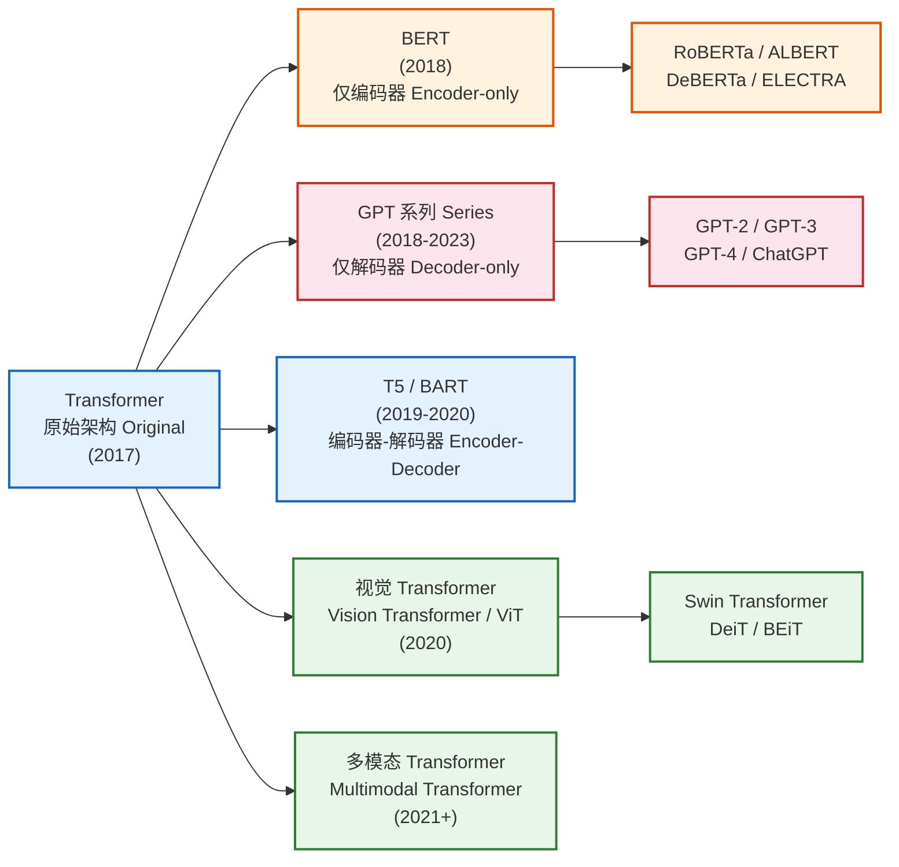
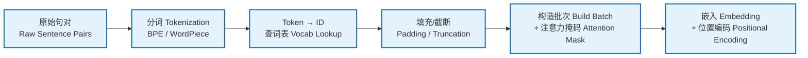
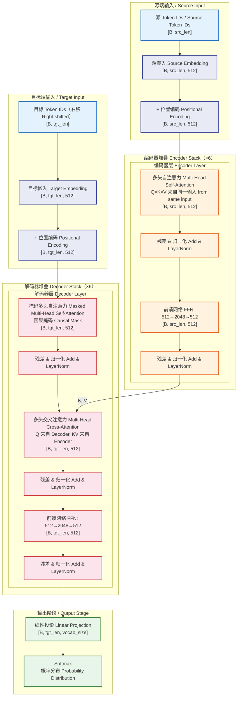
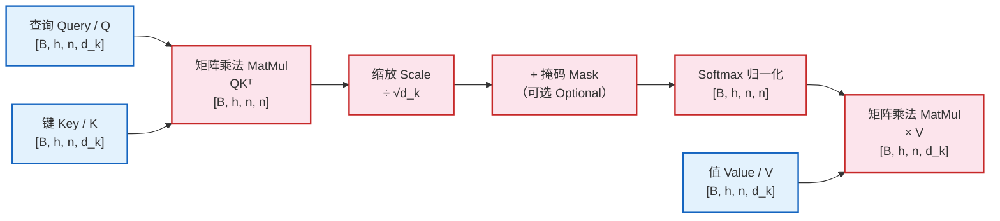
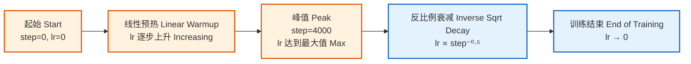
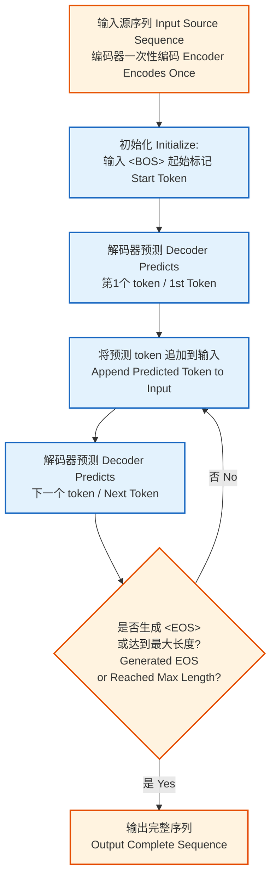
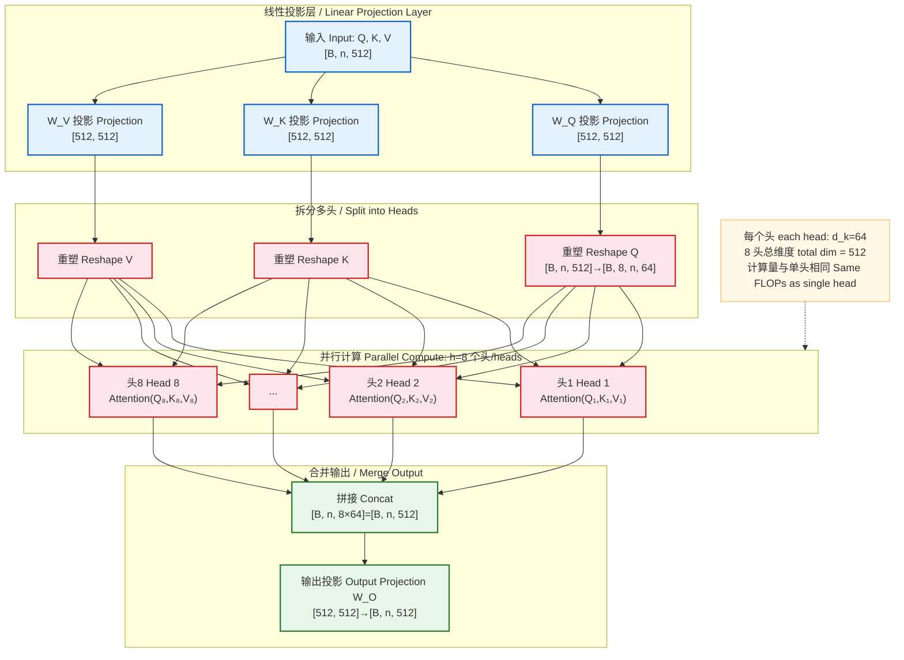
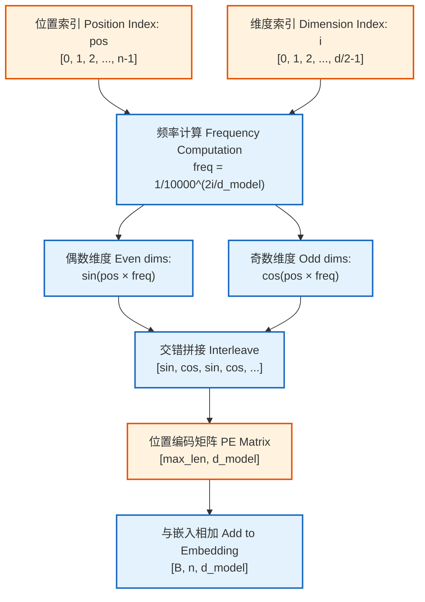
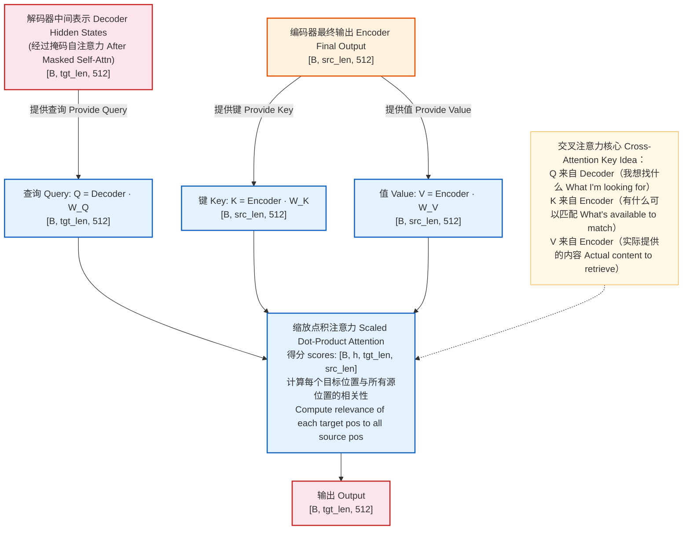

# Transformer 模型架构深度解析

> 基于论文 *"Attention Is All You Need"*（Vaswani et al., 2017）
> 本文档涵盖：模型架构概览 → 架构详情 → 关键组件深度拆解 → 面试常见问题

***

## 一、模型架构概览

### 1. 模型定位

| 维度       | 说明                                            |
| -------- | --------------------------------------------- |
| **研究领域** | 自然语言处理（NLP）/ 序列到序列建模                          |
| **解决问题** | 序列转换任务（Sequence-to-Sequence），如机器翻译、文本摘要、问答系统等 |
| **核心价值** | 完全基于注意力机制，摒弃循环和卷积结构，实现高度并行化的序列建模              |
| **典型应用** | 机器翻译、文本生成、语言理解、代码生成、多模态融合等                    |

**与同领域模型对比**：

| 模型              | 结构基础     | 并行能力       | 长距离依赖      | 计算复杂度             |
| --------------- | -------- | ---------- | ---------- | ----------------- |
| RNN/LSTM        | 循环结构     | ❌ 序列依赖     | 较弱（梯度消失）   | O(n) 步序列计算        |
| CNN (ConvS2S)   | 卷积结构     | ✅ 部分并行     | 受限于感受野     | O(n/k) 层级堆叠       |
| **Transformer** | **纯注意力** | **✅ 完全并行** | **✅ 一步直达** | **O(n²·d) 但高度并行** |

### 2. 核心思想与创新点

**核心突破——"Attention Is All You Need"**：

1. **自注意力机制（Self-Attention）**：序列中每个位置可以直接"关注"所有其他位置，一步建立全局依赖关系，路径长度为 O(1)
2. **多头注意力（Multi-Head Attention）**：将注意力空间分为多个子空间并行计算，捕获不同层次和类型的依赖模式
3. **位置编码（Positional Encoding）**：通过正弦/余弦函数注入位置信息，弥补注意力机制本身不具备顺序感知的缺陷
4. **完全并行化训练**：摆脱 RNN 的序列依赖，所有位置的计算可以同时进行，极大提高训练效率

**解决的痛点**：

- RNN 的**顺序计算瓶颈**：无法并行处理序列，训练缓慢
- RNN 的**长距离依赖衰减**：信息需要逐步传递，距离越远信号越弱
- CNN 的**有限感受野**：需要堆叠多层才能覆盖长距离，且卷积核大小固定

### 3. 整体架构概览

Transformer 采用经典的 **Encoder-Decoder** 架构：

- **Encoder**：将输入序列映射为连续的上下文表示（6 层堆叠）
- **Decoder**：基于编码表示和已生成的部分序列，自回归地生成输出序列（6 层堆叠）
- **学习范式**：监督学习（序列到序列的条件概率建模）

**输入**：源语言 Token 序列，形状 `[B, src_len]`
**输出**：目标语言 Token 概率分布，形状 `[B, tgt_len, vocab_size]`

```mermaid
flowchart LR
    classDef inputStyle fill:#e3f2fd,stroke:#1565c0,stroke-width:2px
    classDef encoderStyle fill:#fff3e0,stroke:#e65100,stroke-width:2px
    classDef decoderStyle fill:#fce4ec,stroke:#c62828,stroke-width:2px
    classDef outputStyle fill:#e8f5e9,stroke:#2e7d32,stroke-width:2px
    classDef noteStyle fill:#fff8e6,stroke:#ffb74d,stroke-width:1px

    subgraph Input["输入阶段 / Input Stage"]
        A1["源序列 Source Tokens<br/>[B, src_len]"]:::inputStyle
        A2["输入嵌入 Input Embedding<br/>+ 位置编码 Positional Encoding<br/>[B, src_len, d_model]"]:::inputStyle
        A3["目标序列 Target Tokens<br/>[B, tgt_len]"]:::inputStyle
        A4["输出嵌入 Output Embedding<br/>+ 位置编码 Positional Encoding<br/>[B, tgt_len, d_model]"]:::inputStyle
    end

    subgraph Encoder["编码器 Encoder（×6 层/layers）"]
        B1["多头自注意力<br/>Multi-Head Self-Attention"]:::encoderStyle
        B2["残差连接 & 层归一化<br/>Add & LayerNorm"]:::encoderStyle
        B3["前馈网络<br/>Feed-Forward Network"]:::encoderStyle
        B4["残差连接 & 层归一化<br/>Add & LayerNorm"]:::encoderStyle
    end

    subgraph Decoder["解码器 Decoder（×6 层/layers）"]
        C1["掩码多头自注意力<br/>Masked Multi-Head Self-Attention"]:::decoderStyle
        C2["残差连接 & 层归一化<br/>Add & LayerNorm"]:::decoderStyle
        C3["多头交叉注意力<br/>Multi-Head Cross-Attention"]:::decoderStyle
        C4["残差连接 & 层归一化<br/>Add & LayerNorm"]:::decoderStyle
        C5["前馈网络<br/>Feed-Forward Network"]:::decoderStyle
        C6["残差连接 & 层归一化<br/>Add & LayerNorm"]:::decoderStyle
    end

    subgraph Output["输出阶段 / Output Stage"]
        D1["线性投影 Linear Projection<br/>[B, tgt_len, vocab_size]"]:::outputStyle
        D2["Softmax<br/>概率分布 Probability Distribution"]:::outputStyle
    end

    A1 --> A2 --> B1
    B1 --> B2 --> B3 --> B4
    B4 -->|"编码器输出 Encoder Output"| C3

    A3 --> A4 --> C1
    C1 --> C2 --> C3
    C3 --> C4 --> C5 --> C6
    C6 --> D1 --> D2

    Note["核心设计 Key Design：<br/>1. Encoder 使用双向自注意力 Bidirectional Self-Attention<br/>2. Decoder 使用因果掩码 Causal Mask 防止未来信息泄露<br/>3. Cross-Attention 连接 Encoder 和 Decoder"]:::noteStyle
    Note -.-> Decoder
```



### 4. 输入输出示例

**输入示例（英德翻译）**：

```
源语言（英语）: "The cat sits on the mat"
Token 化后:    ["The", "cat", "sits", "on", "the", "mat", "<EOS>"]
Token IDs:     [45, 312, 678, 23, 45, 891, 2]
形状:          [1, 7]  （batch_size=1, src_len=7）
```

**输出示例**：

```
目标语言（德语）: "Die Katze sitzt auf der Matte"
Token 化后:      ["Die", "Katze", "sitzt", "auf", "der", "Matte", "<EOS>"]
Token IDs:       [67, 445, 823, 34, 56, 912, 2]

模型实际输出: 每个位置的词表概率分布
形状: [1, 7, 37000]  （batch_size=1, tgt_len=7, vocab_size=37000）
每个位置取 argmax 后得到对应的 Token ID
```

### 5. 关键模块一览

| 模块                            | 职责                             | 数据流转                                  |
| ----------------------------- | ------------------------------ | ------------------------------------- |
| **Input Embedding**           | 将离散 Token 映射为 d\_model 维连续向量   | Token ID → 嵌入向量                       |
| **Positional Encoding**       | 注入位置信息，使模型感知序列顺序               | 嵌入向量 + 位置向量                           |
| **Multi-Head Self-Attention** | 计算序列内部元素间的相互关系                 | \[B, n, d] → \[B, n, d]               |
| **Masked Self-Attention**     | Decoder 中的因果注意力，防止看到未来         | \[B, n, d] → \[B, n, d]               |
| **Cross-Attention**           | Decoder 关注 Encoder 输出，建立源-目标对齐 | Decoder Q + Encoder KV → \[B, n, d]   |
| **Feed-Forward Network**      | 逐位置的非线性变换，增加模型容量               | \[B, n, d] → \[B, n, 4d] → \[B, n, d] |
| **Add & Norm**                | 残差连接 + 层归一化，稳定训练               | x + sublayer(x) → LayerNorm           |
| **Linear + Softmax**          | 将隐状态映射为词表概率分布                  | \[B, n, d] → \[B, n, vocab\_size]     |

### 6. 性能表现与评估概览

**机器翻译基准测试（论文原始结果）**：

| 任务            | 模型                  | BLEU     | 训练成本           |
| ------------- | ------------------- | -------- | -------------- |
| WMT 2014 英德翻译 | Transformer (base)  | 27.3     | 12h × 8 P100   |
| WMT 2014 英德翻译 | Transformer (big)   | **28.4** | 3.5 天 × 8 P100 |
| WMT 2014 英法翻译 | Transformer (big)   | **41.0** | 3.5 天 × 8 P100 |
| WMT 2014 英德翻译 | 此前 SOTA (ConvS2S 等) | 25.8     | 更高             |

**模型规模**：

| 配置   | 层数 N | d\_model | d\_ff | heads h | d\_k | 参数量    |
| ---- | ---- | -------- | ----- | ------- | ---- | ------ |
| base | 6    | 512      | 2048  | 8       | 64   | \~65M  |
| big  | 6    | 1024     | 4096  | 16      | 64   | \~213M |

### 7. 模型家族与演进脉络



**关键演进路线**：

- **Encoder-only（BERT 系列）**：双向编码，适合自然语言理解任务（分类、NER、QA）
- **Decoder-only（GPT 系列）**：单向自回归生成，适合文本生成任务，成为大语言模型的主流架构
- **Encoder-Decoder（T5/BART）**：保持原始结构，统一文本到文本的范式
- **跨领域扩展**：ViT 将 Transformer 引入视觉领域，开启了 Transformer 统一各模态的时代

***

## 二、模型架构详情

### 1. 数据集构成与数据示例

#### 训练数据集

| 数据集         | 语言对              | 规模         | 类型   |
| ----------- | ---------------- | ---------- | ---- |
| WMT 2014 英德 | English ↔ German | \~450 万句对  | 平行语料 |
| WMT 2014 英法 | English ↔ French | \~3600 万句对 | 平行语料 |

#### 数据处理方式

- **分词方式**：Byte Pair Encoding (BPE)
  - 英德：共享词表约 37,000 个 token
  - 英法：使用 word piece，词表约 32,000 个 token
- **数据划分**：按 WMT 标准划分，newstest2014 作为测试集

#### 数据样例与形态变化

```
阶段1 - 原始数据（句对）:
  源: "The agreement on the European Economic Area was signed in August 1992."
  目标: "Das Abkommen über den Europäischen Wirtschaftsraum wurde im August 1992 unterzeichnet."

阶段2 - BPE 分词后:
  源: ["The", "agree", "ment", "on", "the", "European", "Economic", "Area", "was", "signed", "in", "August", "1992", "."]
  目标: ["Das", "Ab", "kommen", "über", "den", "Europäischen", "Wirt", "schafts", "raum", "wurde", "im", "August", "1992", "unter", "zeichnet", "."]

阶段3 - Token ID 序列 + 填充:
  源 IDs:  [142, 3891, 452, 18, 5, 1823, 967, 334, 27, 4521, 11, 893, 7832, 4, 0, 0]
  目标 IDs: [231, 892, 4561, 723, 89, 12893, 3421, 8923, 561, 234, 45, 893, 7832, 2341, 8923, 4]
  形状: [1, 16] （padding 至最大长度）

阶段4 - Embedding + Positional Encoding:
  形状: [1, 16, 512]  （d_model=512）

阶段5 - Encoder 输出:
  形状: [1, 16, 512]  （每个位置的上下文表示）

阶段6 - Decoder 输出 → Linear → Softmax:
  形状: [1, 16, 37000] （每个位置的词表概率分布）
```

### 2. 数据处理与输入规范

**预处理流程**：



**批处理策略**：

- 按句子长度近似分组（Bucketing），减少无效 padding
- 每个 batch 包含约 25,000 个源 token 和 25,000 个目标 token
- 使用 Attention Mask 标记 padding 位置（padding 位置的注意力权重置为 -∞）

**目标序列处理**：

- 训练时使用 **Teacher Forcing**：Decoder 输入为右移一位的目标序列
- 输入 `[<BOS>, w1, w2, ..., wn]`，标签 `[w1, w2, ..., wn, <EOS>]`

### 3. 架构全景与数据流



### 4. 核心模块深入分析

#### 4.1 Scaled Dot-Product Attention

这是 Transformer 最基础的注意力计算单元。

$$\text{Attention}(Q, K, V) = \text{softmax}\left(\frac{QK^T}{\sqrt{d\_k}}\right)V$$

**计算流程**：



**缩放因子 $\sqrt{d\_k}$ 的作用**：当 $d\_k$ 较大时，$QK^T$ 的点积值的方差为 $d\_k$，会导致 softmax 进入梯度极小的饱和区。除以 $\sqrt{d\_k}$ 将方差归一化为 1，保持 softmax 输出的梯度在合理范围内。

#### 4.2 Multi-Head Attention

将 d\_model 维的特征空间拆分为 h 个子空间，各自独立计算注意力后拼接。

$$\text{MultiHead}(Q, K, V) = \text{Concat}(\text{head}\_1, ..., \text{head}\_h)W^O$$

其中每个头：

$$\text{head}\_i = \text{Attention}(QW\_i^Q, KW\_i^K, VW\_i^V)$$

**参数维度**（base 配置）：

- $W\_i^Q, W\_i^K, W\_i^V \in \mathbb{R}^{512 \times 64}$（$d\_{model} \times d\_k$，$d\_k = d\_{model}/h = 512/8 = 64$）
- $W^O \in \mathbb{R}^{512 \times 512}$（$hd\_k \times d\_{model}$）
- 总参数量与单头注意力相同，但表达能力更强

**多头注意力的意义**：

- 不同的头可以关注不同类型的依赖关系（如语法关系、语义关系、位置关系）
- 类似于 CNN 中多个卷积核捕获不同特征模式
- 实验表明 8 头和 16 头效果优于单头

#### 4.3 三种注意力的使用方式

| 注意力类型                         | Q 来源    | K, V 来源 | Mask                   | 用途           |
| ----------------------------- | ------- | ------- | ---------------------- | ------------ |
| Encoder Self-Attention        | 编码器输入   | 编码器输入   | 仅 padding mask         | 建立源序列内部全局依赖  |
| Decoder Masked Self-Attention | 解码器输入   | 解码器输入   | 因果 mask + padding mask | 防止看到未来 token |
| Decoder Cross-Attention       | 解码器中间表示 | 编码器输出   | 仅 padding mask         | 建立源-目标对齐关系   |

#### 4.4 Position-wise Feed-Forward Network (FFN)

对每个位置独立应用相同的两层全连接网络：

$$\text{FFN}(x) = \text{ReLU}(xW\_1 + b\_1)W\_2 + b\_2$$

- $W\_1 \in \mathbb{R}^{512 \times 2048}$，$W\_2 \in \mathbb{R}^{2048 \times 512}$
- 先扩展到 4 倍维度（2048），再压缩回原维度（512）
- 不同位置共享参数，但不同层的 FFN 参数不同
- 本质上等价于两个 1×1 卷积核

#### 4.5 残差连接与层归一化

每个子层（Self-Attention 或 FFN）的输出为：

$$\text{output} = \text{LayerNorm}(x + \text{Sublayer}(x))$$

**残差连接的作用**：

- 缓解深层网络的梯度消失问题
- 允许信息直接跳过子层传播
- 要求子层的输入输出维度一致（均为 d\_model=512）

**层归一化（Layer Normalization）**：

- 对每个样本的每个位置的特征维度进行归一化
- 与 Batch Normalization 不同，不依赖 batch 维度，更适合序列任务
- 归一化公式：$\text{LN}(x) = \gamma \cdot \frac{x - \mu}{\sqrt{\sigma^2 + \epsilon}} + \beta$

#### 4.6 Positional Encoding

由于注意力机制本身是置换不变的（permutation invariant），必须额外注入位置信息。

$$PE\_{(pos, 2i)} = \sin\left(\frac{pos}{10000^{2i/d\_{model}}}\right)$$

$$PE\_{(pos, 2i+1)} = \cos\left(\frac{pos}{10000^{2i/d\_{model}}}\right)$$

**设计动机**：

- 每个位置得到唯一的编码向量
- 相对位置信息可以通过线性变换捕获：$PE\_{pos+k}$ 可以表示为 $PE\_{pos}$ 的线性函数
- 不含可学习参数，可以泛化到训练时未见过的序列长度
- 论文实验表明，可学习的位置嵌入与正弦编码效果相当

### 5. 维度变换路径

以 base 配置为例（d\_model=512, h=8, d\_k=64, d\_ff=2048, vocab\_size=37000）：

| 步骤 | 操作                     | 维度变化                                            | 说明                  |
| -- | ---------------------- | ----------------------------------------------- | ------------------- |
| 1  | Token → Embedding      | \[B, n] → \[B, n, 512]                          | 查嵌入表，× √d\_model 缩放 |
| 2  | + Positional Encoding  | \[B, n, 512] → \[B, n, 512]                     | 逐元素加法               |
| 3  | Q/K/V 线性投影             | \[B, n, 512] → \[B, n, 512]                     | 三次线性变换              |
| 4  | 拆分多头                   | \[B, n, 512] → \[B, 8, n, 64]                   | reshape + transpose |
| 5  | QKᵀ                    | \[B, 8, n, 64] × \[B, 8, 64, n] → \[B, 8, n, n] | 注意力得分矩阵             |
| 6  | Scale + Mask + Softmax | \[B, 8, n, n] → \[B, 8, n, n]                   | 归一化注意力权重            |
| 7  | × V                    | \[B, 8, n, n] × \[B, 8, n, 64] → \[B, 8, n, 64] | 加权聚合                |
| 8  | 合并多头                   | \[B, 8, n, 64] → \[B, n, 512]                   | transpose + reshape |
| 9  | 输出投影 Wᴼ                | \[B, n, 512] → \[B, n, 512]                     | 线性变换                |
| 10 | Add & LayerNorm        | \[B, n, 512] → \[B, n, 512]                     | 残差 + 归一化            |
| 11 | FFN 第一层                | \[B, n, 512] → \[B, n, 2048]                    | 线性 + ReLU           |
| 12 | FFN 第二层                | \[B, n, 2048] → \[B, n, 512]                    | 线性压缩                |
| 13 | Add & LayerNorm        | \[B, n, 512] → \[B, n, 512]                     | 残差 + 归一化            |
| 14 | 最终线性层                  | \[B, n, 512] → \[B, n, 37000]                   | 映射到词表               |
| 15 | Softmax                | \[B, n, 37000] → \[B, n, 37000]                 | 概率分布                |

### 6. 数学表达与关键公式

#### 核心公式汇总

**1. 缩放点积注意力**：

$$\text{Attention}(Q, K, V) = \text{softmax}\left(\frac{QK^T}{\sqrt{d\_k}}\right)V$$

**2. 多头注意力**：

$$\text{MultiHead}(Q, K, V) = \[\text{head}\_1; ...; \text{head}\_h]W^O$$

$$\text{head}\_i = \text{Attention}(QW\_i^Q, KW\_i^K, VW\_i^V)$$

**3. 前馈网络**：

$$\text{FFN}(x) = \max(0, xW\_1 + b\_1)W\_2 + b\_2$$

**4. 位置编码**：

$$PE\_{(pos, 2i)} = \sin\left(\frac{pos}{10000^{2i/d\_{model}}}\right), \quad PE\_{(pos, 2i+1)} = \cos\left(\frac{pos}{10000^{2i/d\_{model}}}\right)$$

**5. 层归一化**：

$$\text{LayerNorm}(x) = \gamma \odot \frac{x - \mu}{\sqrt{\sigma^2 + \epsilon}} + \beta$$

**6. 标签平滑交叉熵损失**：

$$\mathcal{L} = -\sum\_{i} q\_i \log p\_i, \quad q\_i = (1 - \epsilon)\cdot\mathbb{1}\_{i=y} + \frac{\epsilon}{K}$$

其中 $\epsilon = 0.1$ 为平滑系数，$K$ 为词表大小。

### 7. 损失函数与优化策略

#### 损失函数

- **交叉熵损失**：逐 token 计算预测概率分布与目标分布的交叉熵
- **标签平滑**（Label Smoothing, $\epsilon = 0.1$）：将 one-hot 标签平滑为软标签，防止模型过度自信，提升泛化性能。牺牲少量困惑度（perplexity），但提高 BLEU 分数和准确率

#### 优化器

- **Adam 优化器**：$\beta\_1 = 0.9$，$\beta\_2 = 0.98$，$\epsilon = 10^{-9}$

#### 学习率调度（Warmup + 衰减）

$$lr = d\_{model}^{-0.5} \cdot \min(step^{-0.5}, step \cdot warmup\_steps^{-1.5})$$



- warmup\_steps = 4000：前 4000 步线性增长，之后按步数的 -0.5 次方衰减
- 这种调度在训练初期避免过大的梯度更新，后期稳步收敛

### 8. 训练流程与策略

#### 训练范式

- **监督学习**：基于平行语料的条件语言建模
- **训练目标**：最大化 $P(y\_1, y\_2, ..., y\_T | x\_1, x\_2, ..., x\_S)$
- **Teacher Forcing**：训练时 Decoder 使用真实目标序列作为输入

#### 正则化手段

| 手段              | 配置                                           | 作用         |
| --------------- | -------------------------------------------- | ---------- |
| Dropout         | $P\_{drop} = 0.1$（应用于每个子层输出、注意力权重、嵌入+位置编码之和） | 防止过拟合      |
| Label Smoothing | $\epsilon = 0.1$                             | 防止模型过度自信   |
| 权重共享            | Encoder/Decoder 嵌入层与最终 Linear 层共享权重          | 减少参数量，提升效果 |

#### 关键超参数

| 超参数           | base 模型 | big 模型 |
| ------------- | ------- | ------ |
| N (层数)        | 6       | 6      |
| d\_model      | 512     | 1024   |
| d\_ff         | 2048    | 4096   |
| h (头数)        | 8       | 16     |
| d\_k = d\_v   | 64      | 64     |
| P\_drop       | 0.1     | 0.3    |
| warmup\_steps | 4000    | 4000   |
| 训练步数          | 100K    | 300K   |

#### 训练基础设施

- 8 块 NVIDIA P100 GPU
- base 模型训练约 12 小时（100K 步）
- big 模型训练约 3.5 天（300K 步）
- 使用 half-precision (FP16) 训练加速

### 9. 推理与预测流程

#### 自回归生成过程

推理时 Decoder **逐步生成**，无法并行（与训练时的差异）：



#### Beam Search 解码

- 推理时通常使用 **Beam Search** 而非贪心解码
- beam size = 4，length penalty α = 0.6
- 每步保留概率最高的 beam\_size 个候选序列
- 最终选择总得分最高的完整序列

**得分计算**：

$$\text{score}(Y) = \frac{\log P(Y|X)}{|Y|^\alpha}$$

其中 $|Y|^\alpha$ 是长度惩罚，防止模型偏好生成短序列。

#### 推理与训练的关键差异

| 方面         | 训练                      | 推理                            |
| ---------- | ----------------------- | ----------------------------- |
| Decoder 输入 | 真实目标序列（Teacher Forcing） | 自回归：前一步生成的结果                  |
| 并行性        | Decoder 所有位置并行计算        | 逐 token 生成                    |
| Dropout    | 开启                      | 关闭                            |
| Encoder    | 每个训练样本计算一次              | 只计算一次，缓存结果                    |
| 解码策略       | -                       | Beam Search / Top-k / Top-p 等 |

#### 完整推理示例

```
输入: "I love machine learning"

Step 1: Encoder 编码源序列 → [1, 5, 512] 的上下文表示

Step 2: Decoder 初始输入 <BOS>
  → 预测: "Ich" (概率 0.92)

Step 3: Decoder 输入 [<BOS>, "Ich"]
  → 预测: "liebe" (概率 0.87)

Step 4: Decoder 输入 [<BOS>, "Ich", "liebe"]
  → 预测: "maschinelles" (概率 0.78)

Step 5: Decoder 输入 [<BOS>, "Ich", "liebe", "maschinelles"]
  → 预测: "Lernen" (概率 0.85)

Step 6: Decoder 输入 [<BOS>, "Ich", "liebe", "maschinelles", "Lernen"]
  → 预测: <EOS> (概率 0.95)

最终输出: "Ich liebe maschinelles Lernen"
```

### 10. 评估指标与实验分析

#### 主要评估指标

| 指标                | 含义                      | 选用理由        |
| ----------------- | ----------------------- | ----------- |
| **BLEU**          | 衡量生成文本与参考文本的 n-gram 重合度 | 机器翻译领域标准指标  |
| **Perplexity**    | 模型对数据的困惑度，越低越好          | 语言模型本身质量的衡量 |
| **Training Cost** | 训练所需的 FLOPs             | 衡量模型效率      |

#### 与 SOTA 模型的详细对比

**WMT 2014 英德翻译**：

| 模型                    | BLEU     | 训练成本 (FLOPs)   |
| --------------------- | -------- | -------------- |
| GNMT + RL             | 24.6     | 1.4 × 10²⁰     |
| ConvS2S               | 25.2     | 1.5 × 10²⁰     |
| MoE                   | 26.0     | 1.2 × 10²⁰     |
| Transformer (base)    | 27.3     | 3.3 × 10¹⁸     |
| **Transformer (big)** | **28.4** | **2.3 × 10¹⁹** |

**关键发现**：Transformer big 模型在 BLEU 上超越所有先前模型，且训练成本仅为前作的一小部分。

#### 消融实验结果（论文 Table 3）

| 变化项           | BLEU | PPL  | 结论             |
| ------------- | ---- | ---- | -------------- |
| base 配置       | 25.8 | 4.92 | 基准             |
| h=1（单头）       | 24.9 | 5.16 | 多头优于单头         |
| h=16          | 25.5 | 5.01 | 头数过多导致 d\_k 太小 |
| h=32          | 25.0 | 5.10 | 验证上述观点         |
| d\_k=16（减小）   | 24.8 | 5.24 | d\_k 太小会损害性能   |
| d\_model=1024 | 25.5 | 5.00 | 模型增大但训练不足      |
| d\_ff=512     | 24.5 | 5.49 | FFN 宽度很重要      |
| d\_ff=4096    | 25.9 | 4.88 | 更宽的 FFN 有帮助    |
| 去掉位置编码        | 24.5 | 5.41 | 位置信息至关重要       |
| 可学习位置编码       | 25.7 | 4.92 | 与正弦编码效果相近      |

### 11. 设计亮点与思考

#### 值得学习的设计思路

1. **"注意力即一切"的极简主义**：用统一的注意力机制替代复杂的循环/卷积结构，架构简洁而强大
2. **残差 + 层归一化的组合**：成为后续深度模型的标准配置
3. **多头机制**：在不增加计算量的前提下增强表达能力
4. **权重共享**：Encoder/Decoder 嵌入层与输出层共享权重，减少参数量
5. **学习率 Warmup**：解决 Adam 优化器在训练初期的不稳定问题

#### 设计权衡

| 权衡            | 选择              | 代价           |
| ------------- | --------------- | ------------ |
| 并行性 vs 自回归    | 训练并行，推理自回归      | 推理无法并行加速     |
| 全局注意力 vs 计算量  | O(n²) 复杂度换取全局依赖 | 长序列计算代价高     |
| 模型深度 vs 宽度    | 6 层 × 512 维     | 权衡了模型容量和训练效率 |
| 固定位置编码 vs 可学习 | 正弦函数            | 效果相当，但泛化性更好  |

#### 已知局限性

1. **O(n²) 复杂度**：自注意力的计算和内存复杂度为序列长度的平方，限制了处理超长序列的能力
2. **推理效率低**：自回归解码时每个 token 都需要完整的 Decoder 前向传播
3. **缺乏归纳偏置**：不像 CNN 的平移不变性和 RNN 的序列偏置，需要更多数据才能学好
4. **位置编码的局限**：正弦位置编码难以很好地处理相对位置信息（后续 RoPE、ALiBi 等工作改进了这一点）

***

## 三、关键组件深度拆解

### 组件一：Multi-Head Attention（多头注意力机制）

#### 1. 组件定位与职责

Multi-Head Attention 是 Transformer 的**核心计算引擎**，在模型中出现三次：

- Encoder 的自注意力层
- Decoder 的掩码自注意力层
- Decoder 的交叉注意力层

它解决的核心问题是：**如何高效地建模序列元素之间的全局依赖关系**。

#### 2. 内部结构拆解



#### 3. 计算流程与维度变换

**完整的逐步维度变化（base 配置, h=8, d\_k=64）**：

```
输入: X ∈ [B, n, 512]

Step 1 — 线性投影:
  Q = X · W_Q    [B, n, 512] × [512, 512] → [B, n, 512]
  K = X · W_K    [B, n, 512] × [512, 512] → [B, n, 512]
  V = X · W_V    [B, n, 512] × [512, 512] → [B, n, 512]

Step 2 — 拆分多头 (reshape + transpose):
  Q: [B, n, 512] → [B, n, 8, 64] → [B, 8, n, 64]
  K: [B, n, 512] → [B, n, 8, 64] → [B, 8, n, 64]
  V: [B, n, 512] → [B, n, 8, 64] → [B, 8, n, 64]

Step 3 — 计算注意力得分:
  scores = Q · Kᵀ / √64
  [B, 8, n, 64] × [B, 8, 64, n] → [B, 8, n, n]
  ÷ 8.0 → [B, 8, n, n]

Step 4 — 应用 Mask（如因果掩码）:
  scores[mask] = -∞
  [B, 8, n, n]

Step 5 — Softmax 归一化:
  weights = softmax(scores, dim=-1)
  [B, 8, n, n]  （每行和为 1）

Step 6 — Dropout（训练时）:
  weights = dropout(weights, p=0.1)
  [B, 8, n, n]

Step 7 — 加权聚合:
  context = weights · V
  [B, 8, n, n] × [B, 8, n, 64] → [B, 8, n, 64]

Step 8 — 合并多头 (transpose + reshape):
  [B, 8, n, 64] → [B, n, 8, 64] → [B, n, 512]

Step 9 — 输出投影:
  output = context · W_O
  [B, n, 512] × [512, 512] → [B, n, 512]
```

#### 4. 设计细节与技巧

**因果掩码（Causal Mask）**：Decoder 自注意力中使用上三角掩码，将未来位置的注意力得分置为 $-\infty$，使得 softmax 后权重为 0。

```
掩码矩阵（n=5 的示例）:
     pos1  pos2  pos3  pos4  pos5
pos1 [  0   -∞   -∞   -∞   -∞  ]
pos2 [  0    0   -∞   -∞   -∞  ]
pos3 [  0    0    0   -∞   -∞  ]
pos4 [  0    0    0    0   -∞  ]
pos5 [  0    0    0    0    0  ]
```

**KV Cache 推理优化**：自回归推理时，已生成 token 的 K、V 无需重算，缓存后直接复用。每步只需计算新 token 对应的 Q、K、V。

#### 5. 代码级参考

```python
class MultiHeadAttention(nn.Module):
    def __init__(self, d_model=512, n_heads=8, dropout=0.1):
        super().__init__()
        self.d_k = d_model // n_heads
        self.n_heads = n_heads

        self.W_Q = nn.Linear(d_model, d_model)
        self.W_K = nn.Linear(d_model, d_model)
        self.W_V = nn.Linear(d_model, d_model)
        self.W_O = nn.Linear(d_model, d_model)
        self.dropout = nn.Dropout(dropout)

    def forward(self, query, key, value, mask=None):
        B = query.size(0)

        Q = self.W_Q(query).view(B, -1, self.n_heads, self.d_k).transpose(1, 2)
        K = self.W_K(key).view(B, -1, self.n_heads, self.d_k).transpose(1, 2)
        V = self.W_V(value).view(B, -1, self.n_heads, self.d_k).transpose(1, 2)

        scores = torch.matmul(Q, K.transpose(-2, -1)) / math.sqrt(self.d_k)
        if mask is not None:
            scores = scores.masked_fill(mask == 0, float('-inf'))
        weights = F.softmax(scores, dim=-1)
        weights = self.dropout(weights)

        context = torch.matmul(weights, V)
        context = context.transpose(1, 2).contiguous().view(B, -1, self.n_heads * self.d_k)
        return self.W_O(context)
```

***

### 组件二：Positional Encoding（位置编码）

#### 1. 组件定位与职责

Self-Attention 机制是**置换等变的（permutation equivariant）**——对输入序列重新排列顺序，输出也相应重排，但值不变。这意味着它天生**不感知位置信息**。

位置编码的职责就是**为每个位置注入唯一的位置标识**，使模型能够区分 "I love you" 和 "you love I"。

#### 2. 内部结构拆解



#### 3. 正弦位置编码的数学性质

**为什么选择正弦/余弦函数？**

核心性质：对于任意固定偏移 $k$，存在线性变换 $M$ 使得：

$$PE\_{pos+k} = M\_k \cdot PE\_{pos}$$

具体来说，对于第 $i$ 对维度：

$$\begin{bmatrix} PE\_{pos+k, 2i} \ PE\_{pos+k, 2i+1} \end{bmatrix} = \begin{bmatrix} \cos(k\omega\_i) & \sin(k\omega\_i) \ -\sin(k\omega\_i) & \cos(k\omega\_i) \end{bmatrix} \begin{bmatrix} PE\_{pos, 2i} \ PE\_{pos, 2i+1} \end{bmatrix}$$

其中 $\omega\_i = 1/10000^{2i/d\_{model}}$。

这意味着相对位置信息可以通过线性变换从绝对位置编码中提取，使模型有能力学习相对位置依赖。

**不同维度频率的直觉**：

- 低频维度（$i$ 较大）：变化缓慢，捕获**长距离**位置关系
- 高频维度（$i$ 较小）：变化快速，区分**相邻**位置

```
示例（d_model=8 的简化版，4个位置）:

pos=0: [sin(0), cos(0), sin(0),   cos(0),   sin(0),    cos(0),    sin(0),     cos(0)    ]
     = [0.000,  1.000,  0.000,    1.000,    0.000,     1.000,     0.000,      1.000     ]

pos=1: [sin(1), cos(1), sin(0.01),cos(0.01),sin(0.0001),cos(0.0001),sin(1e-6),cos(1e-6)]
     = [0.841,  0.540,  0.010,    1.000,    0.000,      1.000,      0.000,     1.000    ]

pos=2: [sin(2), cos(2), sin(0.02),cos(0.02),sin(0.0002),cos(0.0002),sin(2e-6),cos(2e-6)]
     = [0.909, -0.416,  0.020,    1.000,    0.000,      1.000,      0.000,     1.000    ]
```

可见高频维度变化剧烈，低频维度变化缓慢。

#### 4. 代码级参考

```python
class PositionalEncoding(nn.Module):
    def __init__(self, d_model=512, max_len=5000, dropout=0.1):
        super().__init__()
        self.dropout = nn.Dropout(dropout)

        pe = torch.zeros(max_len, d_model)
        position = torch.arange(0, max_len).unsqueeze(1).float()
        div_term = torch.exp(
            torch.arange(0, d_model, 2).float() * (-math.log(10000.0) / d_model)
        )

        pe[:, 0::2] = torch.sin(position * div_term)
        pe[:, 1::2] = torch.cos(position * div_term)
        pe = pe.unsqueeze(0)  # [1, max_len, d_model]
        self.register_buffer('pe', pe)

    def forward(self, x):
        # x: [B, seq_len, d_model]
        x = x + self.pe[:, :x.size(1)]
        return self.dropout(x)
```

#### 5. 变体与演进

| 位置编码方式       | 代表模型               | 特点              |
| ------------ | ------------------ | --------------- |
| 正弦位置编码       | Transformer 原始     | 无需学习，可外推        |
| 可学习位置编码      | BERT, GPT          | 效果略好，但长度受限      |
| 相对位置编码       | Transformer-XL, T5 | 直接编码相对距离        |
| RoPE（旋转位置编码） | LLaMA, PaLM        | 将位置融入注意力计算，外推性好 |
| ALiBi        | BLOOM              | 无参数线性偏置，简单高效    |

***

### 组件三：Encoder-Decoder Cross-Attention（交叉注意力）

#### 1. 组件定位与职责

Cross-Attention 是连接 Encoder 和 Decoder 的**桥梁**，位于每个 Decoder 层的中间位置（在 Masked Self-Attention 之后，FFN 之前）。

它解决的核心问题：**让 Decoder 在生成每个目标 token 时，能够"回顾"并选择性关注源序列的相关部分**，实现源-目标的动态对齐。

#### 2. 内部结构拆解



#### 3. 与传统 Attention 的对比

| 特性     | Bahdanau Attention (2014) | Transformer Cross-Attention |
| ------ | ------------------------- | --------------------------- |
| 得分函数   | 加性（MLP）                   | 缩放点积                        |
| 并行性    | 逐步计算                      | 完全并行（训练时）                   |
| 头数     | 单头                        | 多头（8/16）                    |
| K/V 来源 | 每步来自 Encoder 隐状态          | 来自 Encoder 最终输出，所有层共享同一编码   |
| 表达能力   | 受限                        | 多头多子空间捕获多种对齐模式              |

#### 4. Cross-Attention 学到了什么？

通过可视化注意力权重可以观察到：

- 某些头学习了**词级对齐**（如 "cat" → "Katze"）
- 某些头学习了**短语级对齐**（如 "on the mat" → "auf der Matte"）
- 某些头学习了**语序调整**模式（如英语 SVO → 德语 SOV 的调整）
- 不同层的 Cross-Attention 关注的粒度不同：低层偏向词级，高层偏向语义级

***

## 四、面试常见问题（FAQ）

### Q1: 为什么要除以 √d\_k ？不除会怎样？

**答**：当 $d\_k$ 较大时，$Q$ 和 $K$ 的点积结果的方差约为 $d\_k$（假设 $Q$、$K$ 的每个元素均值为 0、方差为 1）。过大的数值会导致 softmax 函数进入**梯度饱和区**——即概率分布趋近于 one-hot，梯度接近于零，模型难以学习。除以 $\sqrt{d\_k}$ 将方差归一化为 1，使 softmax 保持在梯度有效区间内。

实验验证：论文中指出，当 $d\_k = 64$ 时，不缩放的点积注意力性能显著差于加性注意力，而缩放后两者表现相当。

***

### Q2: Multi-Head Attention 比 Single-Head Attention 好在哪里？参数量相同吗？

**答**：

**参数量确实相同**。Single-Head 使用 $W^Q, W^K, W^V \in \mathbb{R}^{d\_{model} \times d\_{model}}$；Multi-Head 使用 $h$ 个 $W\_i^Q, W\_i^K, W\_i^V \in \mathbb{R}^{d\_{model} \times d\_k}$（$d\_k = d\_{model}/h$），再加一个 $W^O \in \mathbb{R}^{d\_{model} \times d\_{model}}$，总参数量为 $4 d\_{model}^2$，与 Single-Head 的 $3 d\_{model}^2$ 相比多了一个输出投影。

**多头的优势**：

1. 不同头在不同的**表示子空间**中独立计算注意力，能同时捕获多种类型的依赖关系
2. 类似于 CNN 的多通道机制，增加了特征表达的多样性
3. 论文消融实验显示，h=8 比 h=1 高出约 0.9 BLEU

***

### Q3: Transformer 为什么需要位置编码？去掉会怎样？

**答**：Self-Attention 本质上是一个**集合操作**（set operation），对输入序列做任意排列，输出只是相应排列，但每个位置的值不变。这意味着如果没有位置编码，模型无法区分 "dog bites man" 和 "man bites dog"。

论文消融实验表明，去掉位置编码后 BLEU 下降 1.3（从 25.8 降至 24.5），证实位置信息不可或缺。

***

### Q4: Transformer 的自注意力复杂度为 O(n²)，如何处理长序列？

**答**：原始 Transformer 的自注意力在序列长度 $n$ 上的时间和空间复杂度均为 $O(n^2)$，这在长序列场景下成为瓶颈。学术界提出了多种改进方案：

| 方案              | 代表工作                          | 核心思想                     | 复杂度            |
| --------------- | ----------------------------- | ------------------------ | -------------- |
| 稀疏注意力           | Sparse Transformer, BigBird   | 只关注部分位置（局部窗口 + 全局 token） | O(n√n) 或 O(n)  |
| 线性注意力           | Linear Transformer, Performer | 用核函数近似 softmax，避免 n×n 矩阵 | O(n)           |
| 分块注意力           | Longformer, LongNet           | 局部窗口 + 全局注意力组合           | O(n)           |
| Flash Attention | FlashAttention v1/v2          | IO 感知的精确注意力实现            | O(n²) 但实际速度快数倍 |
| 滑动窗口            | Mistral                       | 每个 token 只关注固定窗口内        | O(n·w)         |

***

### Q5: Pre-Norm 和 Post-Norm 有什么区别？Transformer 原文用的哪个？

**答**：

- **Post-Norm（原始 Transformer）**：$\text{output} = \text{LayerNorm}(x + \text{Sublayer}(x))$
  - 先做残差连接，再做归一化
  - 需要 Warmup 才能稳定训练
- **Pre-Norm（后续改进）**：$\text{output} = x + \text{Sublayer}(\text{LayerNorm}(x))$
  - 先做归一化，再通过子层，再做残差连接
  - 训练更稳定，不一定需要 Warmup
  - 缺点是最终性能可能略低于调参良好的 Post-Norm

现代大语言模型（如 GPT 系列、LLaMA 等）普遍使用 **Pre-Norm + RMSNorm** 的组合。

***

### Q6: Transformer 的训练和推理有什么区别？为什么推理慢？

**答**：

| 方面         | 训练                                   | 推理                       |
| ---------- | ------------------------------------ | ------------------------ |
| Decoder 输入 | 完整目标序列（Teacher Forcing），所有位置**并行**计算 | 自回归逐 token 生成，**无法并行**   |
| 因果性保证      | 通过上三角掩码（mask）实现                      | 天然保证，每次只输入已生成的部分         |
| 计算利用率      | GPU 利用率高，大 batch 并行                  | 每步只产生 1 个 token，GPU 利用率低 |

推理慢的根本原因是**自回归**——生成长度为 $T$ 的序列需要 $T$ 次前向传播。加速方法包括：

- **KV Cache**：缓存已计算的 K、V，避免重复计算
- **投机解码（Speculative Decoding）**：用小模型快速草拟，大模型验证
- **并行解码**：Non-Autoregressive Transformer 一次生成全部 token（牺牲质量）

***

### Q7: Encoder-Decoder 架构、Encoder-only、Decoder-only 分别适合什么任务？

**答**：

| 架构              | 代表模型            | 适合任务              | 原因                      |
| --------------- | --------------- | ----------------- | ----------------------- |
| Encoder-Decoder | T5, BART, mBART | 序列到序列：翻译、摘要、问答    | 源和目标是不同序列，需要先编码再生成      |
| Encoder-only    | BERT, RoBERTa   | 自然语言理解：分类、NER、相似度 | 双向注意力提供更好的语境表示          |
| Decoder-only    | GPT 系列, LLaMA   | 文本生成、对话、通用 AI     | 统一生成范式，scaling law 表现最好 |

当前大语言模型的主流趋势是 **Decoder-only**，因为它在 scaling 时展现出最佳的性能-效率权衡，并且可以通过 in-context learning 处理几乎所有 NLP 任务。

***

### Q8: Transformer 中的 FFN 层有什么作用？可以去掉吗？

**答**：

FFN 层的作用是提供**逐位置的非线性变换**，增强模型的表达能力。Self-Attention 本质上是对 Value 的**加权求和**（线性操作），如果没有 FFN，多层 Attention 的堆叠仍然是线性的。

研究表明：

- FFN 占据了 Transformer 约 **2/3 的参数**（在 base 配置中，FFN 参数为 512×2048×2 = 2M，远大于注意力的参数）
- 去掉 FFN 会导致性能严重下降（消融实验：d\_ff=512 时 BLEU 从 25.8 降至 24.5）
- FFN 可以被视为一种**键值记忆网络**（Geva et al., 2021），存储了模型学到的知识

后续工作中，FFN 的 ReLU 激活被替换为 **GELU**（GPT 系列）或 **SwiGLU**（LLaMA），以提升效果。

***

### Q9: 注意力权重矩阵的含义是什么？如何解读注意力可视化？

**答**：

注意力权重矩阵 $A \in \mathbb{R}^{n \times n}$ 中，$A\_{ij}$ 表示位置 $i$ 对位置 $j$ 的"关注程度"。每一行是一个概率分布（softmax 归一化），表示位置 $i$ 的输出是所有位置 Value 向量的**加权组合**。

**可视化解读注意事项**：

- 注意力权重 ≠ 重要性归因。高注意力权重不一定意味着该位置对最终预测贡献大（Jain & Wallace, 2019）
- 不同层、不同头的注意力模式差异很大
- 低层的头倾向于关注相邻位置或特定语法模式
- 高层的头更关注语义层面的依赖关系
- 某些头可能出现"退化"的注意力模式（如总是关注 \[CLS] 或 \[SEP]）

***

### Q10: Transformer 与 RNN/LSTM 在实践中如何选择？

**答**：

在 2024 年以后的实践中，**Transformer 几乎在所有场景下都优于 RNN/LSTM**。但某些特殊场景下 RNN 仍有价值：

| 场景                 | 推荐                 | 原因                        |
| ------------------ | ------------------ | ------------------------- |
| 大规模预训练             | Transformer        | Scaling law 更好，并行效率高      |
| 资源极度受限的边缘设备        | RNN/LSTM           | 内存开销更小，适合流式处理             |
| 实时流式处理（逐帧）         | RNN 或 SSM (Mamba)  | 无需存储完整序列                  |
| 短序列分类（<128 tokens） | 两者都可               | 性能差距较小                    |
| 超长序列 (>100K)       | SSM (Mamba) 或线性注意力 | O(n²) 复杂度限制原始 Transformer |

值得关注的新趋势是 **SSM（State Space Model）**，如 Mamba（2023），它结合了 RNN 的线性复杂度和 Transformer 的并行训练能力。

***

### Q11: Label Smoothing 对 Transformer 有什么影响？

**答**：

Label Smoothing 将 one-hot 标签 $\[0, ..., 1, ..., 0]$ 替换为软标签 $\[\epsilon/K, ..., 1-\epsilon+\epsilon/K, ..., \epsilon/K]$（$\epsilon=0.1$）。

**效果**：

- **Perplexity 上升**：模型不再尝试将正确 token 的概率推到 1.0
- **BLEU 提升**：模型的预测分布更平滑，泛化能力更强
- **防止过度自信**：避免模型在训练数据上产生过于极端的概率分布

这是一个典型的"**牺牲训练指标，换取泛化性能**"的例子。

***

### Q12: 如何从零实现一个 Transformer？关键注意点是什么？

**答**：

从零实现 Transformer 的关键注意点：

1. **Embedding 缩放**：嵌入向量需要乘以 $\sqrt{d\_{model}}$，使其与位置编码处于同一量级
2. **Mask 处理**：区分 padding mask 和因果 mask，确保两者正确组合
3. **参数初始化**：Xavier 初始化对稳定训练至关重要
4. **学习率 Warmup**：不使用 Warmup 几乎无法收敛
5. **权重共享**：Encoder 嵌入、Decoder 嵌入和最终线性层共享权重矩阵
6. **数值稳定性**：softmax 前减去最大值防止溢出；LayerNorm 中的 $\epsilon$ 防止除零
7. **因果掩码的正确性**：确保 Decoder 在训练时看不到未来 token

推荐参考实现：Harvard NLP 的 [The Annotated Transformer](https://nlp.seas.harvard.edu/annotated-transformer/)，这是最经典的逐行注释实现。

***

### Q13: 什么是 KV Cache？它是如何加速推理的？有什么代价？

**答**：

**KV Cache** 是推理阶段的关键优化技术。在自回归生成中，每生成一个新 token，模型都需要对**所有历史 token** 重新计算 Key 和 Value。KV Cache 将这些已计算的 K、V 矩阵缓存起来，新 token 只需计算自己的 Q、K、V，然后将 K、V 拼接到缓存中即可。

**加速原理**：

| 步骤               | 无 KV Cache                | 有 KV Cache                          |
| ---------------- | ------------------------- | ----------------------------------- |
| 第 $t$ 步的 K/V 计算量 | $O(t \cdot d\_{model})$   | $O(1 \cdot d\_{model})$（只算当前 token） |
| 总推理复杂度           | $O(T^2 \cdot d\_{model})$ | $O(T \cdot d\_{model})$             |

**代价**：

- **显存开销大**：KV Cache 大小为 $2 \times L \times H \times d\_k \times T$（层数 × 头数 × 头维度 × 序列长度），长序列下可占用数十 GB
- **批大小受限**：多请求并发时每个请求独占 KV Cache，限制了 batch size

**工程优化**：PagedAttention（vLLM）将 KV Cache 分块管理，大幅提升内存利用率和吞吐量。

***

### Q14: Transformer 为什么使用 LayerNorm 而不是 BatchNorm？

**答**：

| 特性               | BatchNorm             | LayerNorm      |
| ---------------- | --------------------- | -------------- |
| 归一化维度            | 在 batch 维度上对每个特征位置归一化 | 在特征维度上对每个样本归一化 |
| 对 batch size 的依赖 | 依赖（小 batch 时统计量不稳定）   | 不依赖（每个样本独立计算）  |
| 推理时是否需要维护统计量     | 需要（running mean/var）  | 不需要            |
| 变长序列支持           | 困难（不同位置的 token 数量不同）  | 天然支持           |

**Transformer 选择 LayerNorm 的核心原因**：

1. NLP 任务中序列长度可变，batch 内不同样本的 token 数量不同，BatchNorm 无法直接处理变长序列
2. Transformer 的 batch size 通常较小（受显存限制），BatchNorm 统计量不稳定
3. LayerNorm 在训练和推理时行为完全一致，无需维护额外状态

现代 LLM 进一步将 LayerNorm 替换为 **RMSNorm**（去掉均值中心化步骤），计算更高效，实验表明性能相当。

***

### Q15: 什么是 Flash Attention？它解决了什么问题？

**答**：

标准 Self-Attention 的瓶颈不仅是计算量 $O(n^2)$，更是**显存 IO**：需要将完整的 $n \times n$ 注意力矩阵 $QK^T$ 写入 HBM（高带宽显存），再读回进行 softmax，再写入，极大浪费带宽。

**Flash Attention（Dao et al., 2022）** 的核心思想是 **IO 感知的分块计算（Tiling）**：

1. 将 Q、K、V 分块加载进 SRAM（片上高速缓存，速度远快于 HBM）
2. 在 SRAM 内完成分块的注意力计算（结合 online softmax 技巧，无需存储完整 $n \times n$ 矩阵）
3. 只将最终输出写回 HBM

**效果**：

- 显存从 $O(n^2)$ 降至 $O(n)$（不需要存中间矩阵）
- 实际速度提升 2-4x（A100 上），支持更长序列
- 结果与标准 Attention **完全等价**（精确计算，不是近似）

Flash Attention v2（2023）进一步优化了并行策略，成为目前几乎所有主流 LLM 框架（PyTorch、vLLM、HuggingFace）的默认实现。

***

### Q16: BERT 和 GPT 的预训练目标有何本质区别？各自适合什么任务？

**答**：

| 维度    | BERT                                                      | GPT                                       |
| ----- | --------------------------------------------------------- | ----------------------------------------- |
| 架构    | Encoder-only（双向注意力）                                       | Decoder-only（单向因果注意力）                     |
| 预训练目标 | MLM（Masked Language Modeling）：随机遮掩 15% token，预测被遮掩的 token | CLM（Causal Language Modeling）：预测下一个 token |
| 上下文感知 | 双向（同时看到左右上下文）                                             | 单向（只看到左侧上下文）                              |
| 擅长任务  | 理解类：分类、NER、STS、问答（抽取式）                                    | 生成类：文本续写、摘要、翻译、对话                         |
| 微调方式  | 在 \[CLS] 或 token 级表示上接分类头                                 | Prompt + 自回归生成                            |

**深层差异**：BERT 的双向注意力使其获得更丰富的语境表示，但无法直接生成文本（输出是表示向量而非 token）；GPT 的自回归范式天然支持生成，且在 scaling 时展现出更好的涌现能力，这也是现代 LLM 普遍采用 Decoder-only 架构的原因。

***

### Q17: Transformer 中的 Padding Mask 和 Causal Mask 分别是什么？如何实现？

**答**：

Transformer 中存在两种不同用途的掩码：

**Padding Mask（填充掩码）**：

- 作用：屏蔽 batch 中不同长度序列的填充 token（`[PAD]`），防止它们参与注意力计算
- 应用位置：Encoder Self-Attention、Decoder Cross-Attention
- 实现：将 padding 位置的注意力得分设为 $-\infty$，softmax 后对应权重趋近于 0

**Causal Mask（因果掩码 / 上三角掩码）**：

- 作用：确保 Decoder 在预测第 $t$ 个 token 时，只能看到位置 $1, ..., t-1$ 的信息，防止"信息泄露"
- 应用位置：Decoder Masked Self-Attention
- 实现：构造上三角矩阵，对上三角部分（未来位置）添加 $-\infty$ 掩码

```python
def causal_mask(seq_len):
    mask = torch.triu(torch.ones(seq_len, seq_len), diagonal=1).bool()
    return mask.masked_fill(mask, float('-inf'))
```

实际使用时，两种 mask 需要**叠加**（如 Decoder Self-Attention 阶段同时应用因果 mask 和 padding mask）。

***

### Q18: 什么是 Attention Sink？与 Streaming LLM 有什么关系？

**答**：

**Attention Sink** 是 Xiao et al.（2023）在分析大语言模型注意力分布时发现的现象：无论输入内容如何，模型会将**大量注意力权重集中在序列的最初几个 token**（通常是第 1 个 token），即使这些 token 在语义上并不重要。

**产生原因**：

- 在 softmax 注意力中，所有权重之和必须为 1。当某个位置在语义上不需要关注其他 token 时，softmax 需要一个"排水口"来分配多余的注意力权重
- 初始 token（如 `[BOS]`）因为在所有 decoding 步骤中都可见，自然成为这个"排水口"

**与 Streaming LLM 的关系**：
传统 KV Cache 只保留固定窗口内的 KV，当序列超出窗口时直接丢弃早期 token 会导致模型崩溃（因为 Attention Sink 依赖的初始 token 被删除）。StreamingLLM 的解决方案是：**始终保留最初 4 个 token 的 KV Cache**（作为 Attention Sink），再保留最近的滑动窗口，即可支持无限长序列推理而不重新训练模型。

***

### Q19: Transformer 中有哪些常见的正则化手段？各自作用是什么？

**答**：

| 正则化手段                       | 位置                | 作用                          |
| --------------------------- | ----------------- | --------------------------- |
| **Dropout**                 | 注意力权重、FFN 层、残差连接后 | 防止过拟合，原始论文中 $P\_{drop}=0.1$ |
| **Label Smoothing**         | 训练损失函数            | 软化目标分布，防止模型过度自信，提升泛化        |
| **权重衰减（Weight Decay）**      | 优化器（Adam + L2）    | 抑制参数过大，通常为 $0.01$\~$0.1$    |
| **LayerNorm**               | 每个子层              | 稳定训练过程，缓解梯度消失/爆炸            |
| **梯度裁剪（Gradient Clipping）** | 反向传播              | 防止梯度爆炸，通常 clip norm = 1.0   |
| **学习率 Warmup + 衰减**         | 学习率调度             | 训练初期稳定更新，后期精细调整             |

**实践建议**：

- 大模型预训练时，Dropout 通常设为 0（防止欠拟合），微调阶段再启用
- Label Smoothing 对翻译、生成任务效果显著，对分类任务提升有限
- Pre-Norm 架构的引入本身就大幅降低了训练不稳定性，减少了对其他正则化的依赖

***

### Q20: 什么是 MoE（Mixture of Experts）？如何与 Transformer 结合？

**答**：

**MoE（混合专家模型）** 是一种通过**条件计算**（Conditional Computation）扩大模型参数量而不等比增加计算量的架构。

**在 Transformer 中的应用**：将 FFN 层替换为多个并行的 FFN "专家"，再配合一个轻量级 **Router（路由网络）**，对每个 token 动态选择激活哪几个专家（通常是 Top-K，$K=2$）：

$$\text{output} = \sum\_{i \in \text{TopK}} G(x)\_i \cdot \text{Expert}\_i(x)$$

其中 $G(x)$ 是 softmax 归一化的路由权重。

**核心优势**：

| 指标      | 密集模型（Dense） | MoE 模型                          |
| ------- | ----------- | ------------------------------- |
| 总参数量    | $P$         | $P \times N\_{experts}$         |
| 每次前向计算量 | $P$         | $P \times K / N\_{experts}$（近似） |
| 表达能力    | 受限          | 更强（更多专家）                        |

**代表模型**：

- **Switch Transformer**（Google, 2021）：首次大规模验证 MoE + Transformer 的有效性
- **Mixtral 8×7B**（Mistral AI, 2023）：8 个专家选 2 个，效果媲美 70B 密集模型
- **GPT-4、Gemini**（据推测）：业界普遍认为采用了 MoE 架构

**主要挑战**：负载不均衡（部分专家过热，部分专家饥饿），通常通过辅助损失（Auxiliary Load Balancing Loss）缓解。

***

> 📖 **参考文献**
>
> 1. Vaswani, A., et al. "Attention Is All You Need." NeurIPS, 2017.
> 2. Devlin, J., et al. "BERT: Pre-training of Deep Bidirectional Transformers." NAACL, 2019.
> 3. Radford, A., et al. "Language Models are Unsupervised Multitask Learners." OpenAI, 2019.
> 4. Dao, T., et al. "FlashAttention: Fast and Memory-Efficient Exact Attention." NeurIPS, 2022.
> 5. Gu, A., Dao, T. "Mamba: Linear-Time Sequence Modeling with Selective State Spaces." 2023.

