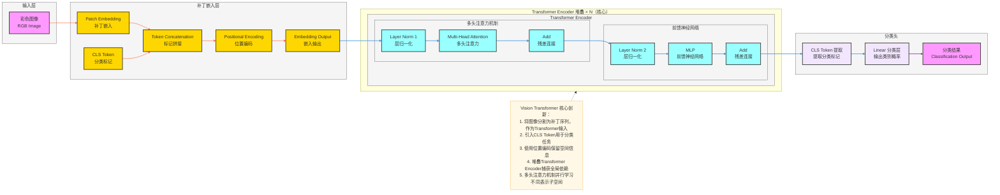

# Vision Transformer (ViT) 完整架构流程图

```mermaid
flowchart LR
    %% 统一样式（和TimesNet风格一致）
    classDef inputStyle fill:#f9f,stroke:#333,stroke-width:2px,rounded:8px
    classDef embedStyle fill:#ffd700,stroke:#333,stroke-width:2px,rounded:8px
    classDef blockStyle fill:#9ff,stroke:#333,stroke-width:2px,rounded:8px
    classDef convStyle fill:#9f9,stroke:#333,stroke-width:2px,rounded:8px
    classDef decompStyle fill:#ff9,stroke:#333,stroke-width:2px,rounded:8px
    classDef headStyle fill:#f2e6ff,stroke:#333,stroke-width:2px,rounded:8px
    classDef subgraphStyle fill:#f5f5f5,stroke:#666,stroke-width:1px,rounded:10px
    classDef coreNoteStyle fill:#fff8e6,stroke:#ffb74d,stroke-width:1px,rounded:8px

    %% 1. 输入层
    subgraph InputLayer["输入层"]
        A["彩色图像<br/>RGB Image"]:::inputStyle
    end
    class InputLayer subgraphStyle

    %% 2. 补丁嵌入层
    subgraph PatchEmbedLayer["补丁嵌入层"]
        B["Patch Embedding<br/>补丁嵌入"]:::embedStyle
        C["CLS Token<br/>分类标记"]:::embedStyle
        D["Token Concatenation<br/>标记拼接"]:::embedStyle
        E["Positional Encoding<br/>位置编码"]:::embedStyle
        F["Embedding Output<br/>嵌入输出"]:::embedStyle
    end
    class PatchEmbedLayer subgraphStyle

    %% 3. 核心：Transformer Encoder 堆叠（N层）
    subgraph TransformerStack["Transformer Encoder 堆叠 × N（核心）"]
        %% 单个Transformer Encoder
        subgraph TransformerEncoder1["Transformer Encoder"]
            %% 多头注意力机制
            subgraph MHA1["多头注意力机制"]
                G[Layer Norm 1<br/>层归一化]:::blockStyle
                H[Multi-Head Attention<br/>多头注意力]:::blockStyle
                I[Add<br/>残差连接]:::blockStyle
            end
            class MHA1 subgraphStyle

            %% 前馈神经网络
            subgraph MLPBlock1["前馈神经网络"]
                J[Layer Norm 2<br/>层归一化]:::blockStyle
                K[MLP<br/>前馈神经网络]:::blockStyle
                L[Add<br/>残差连接]:::blockStyle
            end
            class MLPBlock1 subgraphStyle
        end
        class TransformerEncoder1 subgraphStyle
    end
    class TransformerStack subgraphStyle

    %% 4. 分类输出层
    subgraph OutputLayer["分类头"]
        S["CLS Token 提取<br/>提取分类标记"]:::headStyle
        T["Linear 分类层<br/>输出类别概率"]:::headStyle
        U["分类结果<br/>Classification Output"]:::inputStyle
    end
    class OutputLayer subgraphStyle

    %% 核心注释（ViT创新点）
    Note["Vision Transformer 核心创新：<br/>1. 将图像分割为补丁序列，作为Transformer输入<br/>2. 引入CLS Token用于分类任务<br/>3. 使用位置编码保留空间信息<br/>4. 堆叠Transformer Encoder捕获全局依赖<br/>5. 多头注意力机制并行学习不同表示子空间"]:::coreNoteStyle

    %% 修正后的数据流（移除冗余连接，保证逻辑清晰）
    A --> B
    B --> D
    C --> D
    D --> E
    E --> F
    F --> G
    G --> H
    H --> I
    I --> J
    J --> K
    K --> L
    L --> S
    S --> T
    T --> U

    %% 修正后的连接线样式（按实际连接顺序指定，避免索引越界）
    %% 输入层 → 嵌入层（前5条连接）
    linkStyle 0,1,2,3,4 stroke:#ff7043,stroke-width:1.5px
    %% 嵌入层 → Transformer → 分类头（中间8条连接）
    linkStyle 5,6,7,8,9,10,11,12 stroke:#4299e1,stroke-width:2px
    %% 分类头最终输出（最后1条连接，若需区分可单独指定）
    linkStyle 13 stroke:#9c27b0,stroke-width:2px

    %% 可选：将注释节点定位到合适位置（提升可读性）
    Note -.-> TransformerStack
```

