**详细版 Vision Transformer (ViT) 架构图**（图像分类SOTA模型，完整维度信息标注，严格贴合论文核心：**图像→补丁序列、Transformer编码器、多头注意力**），风格和你之前全套深度学习架构完全统一，可直接用于技术文档/代码实现。

# Vision Transformer (ViT) 完整架构流程图（详细版）

```mermaid
flowchart LR
    %% 统一样式（和Transformer/YOLO/SimCLR风格一致）
    classDef inputStyle fill:#f9f,stroke:#333,stroke-width:2px,rounded:8px
    classDef embedStyle fill:#ffd700,stroke:#333,stroke-width:2px,rounded:8px
    classDef blockStyle fill:#9ff,stroke:#333,stroke-width:2px,rounded:8px
    classDef headStyle fill:#f2e6ff,stroke:#333,stroke-width:2px,rounded:8px
    classDef activeStyle fill:#aaffaa,stroke:#333,stroke-width:2px,rounded:8px
    classDef lossStyle fill:#ff9999,stroke:#333,stroke-width:2px,rounded:8px
    classDef subgraphStyle fill:#f5f5f5,stroke:#666,stroke-width:1px,rounded:10px
    classDef coreNoteStyle fill:#fff8e6,stroke:#ffb74d,stroke-width:1px,rounded:8px

    %% 输入层
    subgraph InputLayer["输入层"]
        A["彩色图像<br/>RGB Image [batch, H, W, 3]"]:::inputStyle
    end
    class InputLayer subgraphStyle

    %% 补丁嵌入层
    subgraph PatchEmbedLayer["补丁嵌入层"]
        B["Patch Partition<br/>图像分块 [batch, N, P²×3]"]:::embedStyle
        C["Linear Projection<br/>线性投影 [batch, N, D]"]:::embedStyle
        D["CLS Token<br/>分类标记 [batch, 1, D]"]:::embedStyle
        E["Token Concatenation<br/>标记拼接 [batch, N+1, D]"]:::embedStyle
        F["Positional Encoding<br/>位置编码 [batch, N+1, D]"]:::embedStyle
        G["Embedding Output<br/>嵌入输出 [batch, N+1, D]"]:::embedStyle
    end
    class PatchEmbedLayer subgraphStyle

    %% Transformer Encoder 堆叠
    subgraph TransformerStack["Transformer Encoder 堆叠 × N（核心）"]
        subgraph TransformerEncoder1["Transformer Encoder"]
            subgraph MHA1["多头注意力机制"]
                H["Layer Norm 1<br/>层归一化 [batch, N+1, D]"]:::blockStyle
                I["Multi-Head Attention<br/>多头注意力 [batch, N+1, D]"]:::blockStyle
                J["Add<br/>残差连接 [batch, N+1, D]"]:::blockStyle
            end
            class MHA1 subgraphStyle
            subgraph MLPBlock1["前馈神经网络"]
                K["Layer Norm 2<br/>层归一化 [batch, N+1, D]"]:::blockStyle
                subgraph MLP["MLP 前馈神经网络（核心）"]
                    L1["Linear 1<br/>升维 [batch, N+1, 4D]"]:::blockStyle
                    L2["GELU<br/>激活函数 [batch, N+1, 4D]"]:::activeStyle
                    L3["Dropout<br/>正则化 [batch, N+1, 4D]"]:::blockStyle
                    L4["Linear 2<br/>降维 [batch, N+1, D]"]:::blockStyle
                    L5["Dropout<br/>正则化 [batch, N+1, D]"]:::blockStyle
                end
                M["Add<br/>残差连接 [batch, N+1, D]"]:::blockStyle
            end
            class MLPBlock1 subgraphStyle
        end
        class TransformerEncoder1 subgraphStyle
    end
    class TransformerStack subgraphStyle

    %% 分类头
    subgraph OutputLayer["分类头"]
        N["CLS Token 提取<br/>CLS Token Extraction [batch, 1, D]"]:::headStyle
        O["Layer Norm 3<br/>层归一化 [batch, 1, D]"]:::headStyle
        P["Linear Classifier<br/>Logits输出 [batch, 1, C]"]:::headStyle
        R["Softmax<br/>概率归一化（推理） [batch, 1, C]"]:::headStyle
        U["Final Prediction<br/>推理结果 [batch, C]"]:::inputStyle
    end
    class OutputLayer subgraphStyle

    %% 核心注释（ViT创新点）
    Note["ViT核心设计：<br/>1. 仅用CLS Token做分类，丢弃所有Patch Token<br/>2. Linear层输出Logits（无激活），Softmax转概率<br/>3. 分类头层归一化提升训练稳定性<br/>4. 位置编码：使用可学习的1D位置嵌入，保留空间信息<br/>5. 层归一化：每个子层前应用，提升训练稳定性和收敛速度<br/><br/>维度说明：batch=批量大小, H=图像高度, W=图像宽度, N=补丁数, P=补丁大小, D=嵌入维度, C=类别数"]:::coreNoteStyle

    %% 数据流
    A --> B --> C --> E
    D --> E --> F --> G --> H --> I --> J --> K --> L1 --> L2 --> L3 --> L4 --> L5 --> M
    M --> N --> O --> P --> R --> U

    %% 连接线样式
    linkStyle 0,1,2,3,4 stroke:#ff7043,stroke-width:1.5px
    linkStyle 5,6,7,8,9,10,11,12,13,14,15,16 stroke:#4299e1,stroke-width:2px
    linkStyle 17,18,19,20 stroke:#9c27b0,stroke-width:2px

    %% 可选：将注释节点定位到合适位置（提升可读性）
    Note -.-> TransformerStack
```

---

# ViT 详细数据流转逻辑

## 输入层
- **输入格式**：彩色图像，形状为 `[batch, H, W, 3]`
  - `batch`：批量大小
  - `H`：图像高度
  - `W`：图像宽度
  - `3`：RGB 通道数
- **输入示例**：ImageNet 数据集的 224×224 彩色图像

## 补丁嵌入层
1. **图像分块（Patch Partition）**
   - 将图像分割成固定大小的补丁
   - 输出形状：`[batch, N, P²×3]`
   - 其中：`N = (H/P) × (W/P)` 为补丁数量，`P` 为补丁大小（如 16）
2. **线性投影（Linear Projection）**
   - 将每个补丁的像素值映射到高维嵌入空间
   - 输出形状：`[batch, N, D]`，`D` 为嵌入维度
3. **CLS Token**
   - 可学习的分类标记
   - 形状：`[batch, 1, D]`
4. **标记拼接（Token Concatenation）**
   - 将 CLS Token 与补丁 Token 拼接
   - 输出形状：`[batch, N+1, D]`
5. **位置编码（Positional Encoding）**
   - 可学习的 1D 位置嵌入
   - 形状：`[batch, N+1, D]`
6. **嵌入输出**
   - 位置编码与 Token 嵌入相加
   - 输出形状：`[batch, N+1, D]`

## Transformer Encoder 核心处理流程（N层堆叠）
### 1. 多头注意力机制
- **层归一化 1**：输入形状 `[batch, N+1, D]`
- **多头注意力**：捕获全局依赖关系，保持维度 `[batch, N+1, D]`
- **残差连接**：与输入相加，形状 `[batch, N+1, D]`

### 2. 前馈神经网络
- **层归一化 2**：输入形状 `[batch, N+1, D]`
- **MLP 内部**：
  - Linear 1：升维 `[batch, N+1, D]` → `[batch, N+1, 4D]`
  - GELU：激活函数，保持维度
  - Dropout：正则化，保持维度
  - Linear 2：降维 `[batch, N+1, 4D]` → `[batch, N+1, D]`
  - Dropout：正则化，保持维度
- **残差连接**：与输入相加，形状 `[batch, N+1, D]`

## 分类头
1. **CLS Token 提取**：仅提取第一个 Token，形状 `[batch, 1, D]`
2. **层归一化 3**：输入形状 `[batch, 1, D]`
3. **线性分类器**：输出 Logits，形状 `[batch, 1, C]`，`C` 为类别数
4. **Softmax**：概率归一化（仅推理时使用），形状 `[batch, 1, C]`
5. **最终预测**：输出分类结果，形状 `[batch, C]`

## 完整数据流转路径（含维度）
输入图像 [batch, H, W, 3] → 图像分块 [batch, N, P²×3] → 线性投影 [batch, N, D] + CLS Token [batch, 1, D] → 标记拼接 [batch, N+1, D] → 位置编码 [batch, N+1, D] → 嵌入输出 [batch, N+1, D] → Transformer Encoder 堆叠（每层保持 [batch, N+1, D]）→ CLS Token 提取 [batch, 1, D] → 层归一化 [batch, 1, D] → 线性分类器 [batch, 1, C] → Softmax [batch, 1, C] → 最终预测 [batch, C]

## 关键技术点
- **补丁序列表示**：将图像视为补丁序列，与 NLP 处理方式统一
- **CLS Token**：专门用于分类任务，避免丢失全局信息
- **位置编码**：保留空间信息，使模型感知补丁的相对位置
- **多头注意力**：并行学习不同表示子空间，捕获多样化的依赖关系
- **层归一化**：Pre-LN 架构，提升训练稳定性和收敛速度

