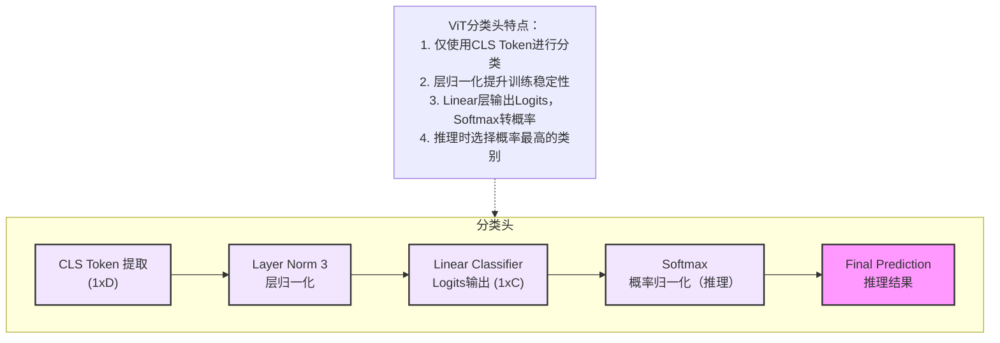

```mermaid
flowchart TB
    classDef inputStyle fill:#f9f,stroke:#333,stroke-width:2px,rounded:8px
    classDef embedStyle fill:#ffd700,stroke:#333,stroke-width:2px,rounded:8px
    classDef blockStyle fill:#9ff,stroke:#333,stroke-width:2px,rounded:8px
    classDef headStyle fill:#f2e6ff,stroke:#333,stroke-width:2px,rounded:8px
    classDef activeStyle fill:#aaffaa,stroke:#333,stroke-width:2px,rounded:8px

    %% 分类头
    subgraph OutputLayer["分类头"]
        N["CLS Token 提取<br/>(1xD)"]:::headStyle
        O["Layer Norm 3<br/>层归一化"]:::headStyle
        P["Linear Classifier<br/>Logits输出 (1xC)"]:::headStyle
        R["Softmax<br/>概率归一化（推理）"]:::headStyle
        U["Final Prediction<br/>推理结果"]:::inputStyle
    end

    %% 核心注释
    Note["ViT分类头特点：<br/>1. 仅使用CLS Token进行分类<br/>2. 层归一化提升训练稳定性<br/>3. Linear层输出Logits，Softmax转概率<br/>4. 推理时选择概率最高的类别"]

    %% 数据流连接线
    N --> O --> P --> R --> U

    %% 注释关联
    Note -.-> OutputLayer

```