**标准 SimCLR 架构图**（简单对比学习框架，严格贴合论文核心：**数据双增强、共享编码器、投影头、NT-Xent 损失**），风格和你之前全套深度学习架构完全统一，可直接用于笔记/PPT。

# SimCLR 完整架构流程图

```mermaid
flowchart LR
    %% 样式定义（沿用历史配色体系，适配SIMCLR模块特性）
    classDef inputStyle fill:#f9f,stroke:#333,stroke-width:2px,rounded:8px
    classDef augStyle fill:#ffd700,stroke:#333,stroke-width:3px,rounded:8px
    classDef encoderStyle fill:#9ff,stroke:#333,stroke-width:2px,rounded:8px
    classDef projectorStyle fill:#9f9,stroke:#333,stroke-width:2px,rounded:8px
    classDef lossStyle fill:#ff9,stroke:#333,stroke-width:2px,rounded:8px
    classDef subgraphStyle fill:#f5f5f5,stroke:#666,stroke-width:1px,rounded:10px
    classDef simclrClusterStyle fill:#e8f4f8,stroke:#4299e1,stroke-width:1.5px,rounded:10px
    classDef ruleNoteStyle fill:#fff8e6,stroke:#ffb74d,stroke-width:1px,rounded:8px

    %% 1. 输入层（原始图像）
    subgraph inputLayer["输入层"]
        A[原始图像<br/>（Single Image）]:::inputStyle
    end
    class inputLayer subgraphStyle

    %% 2. 数据增强层（SIMCLR核心双增强策略）
    subgraph augLayer["数据增强层（SIMCLR双视图增强）"]
        B[增强策略1<br/>（随机裁剪+翻转+颜色失真）]:::augStyle
        C[增强策略2<br/>（随机裁剪+高斯模糊+亮度调整）]:::augStyle
    end
    class augLayer subgraphStyle

    %% 3. SIMCLR核心网络层（Encoder + Projector）
    subgraph simclrCore["SIMCLR核心网络"]
        subgraph encoder["Backbone Encoder<br/>（ResNet系列）"]
            D[卷积层+池化层<br/>（提取基础特征）]:::encoderStyle
            E[全局平均池化<br/>（生成h向量）]:::encoderStyle
        end
        class encoder subgraphStyle

        subgraph projector["Projection Head<br/>（MLP三层结构）"]
            F[线性层1 + ReLU]:::projectorStyle
            G[线性层2 + ReLU]:::projectorStyle
            H[线性层3<br/>（生成z向量）]:::projectorStyle
        end
        class projector subgraphStyle
    end
    class simclrCore simclrClusterStyle

    %% 4. 损失计算层（NT-Xent Loss）
    subgraph lossLayer["对比损失计算层"]
        I[NT-Xent Loss<br/>（归一化温度缩放交叉熵）]:::lossStyle
        J[批次内对比<br/>（正样本对/负样本对）]:::lossStyle
    end
    class lossLayer subgraphStyle

    %% 5. 模型预测层
    subgraph predLayer["模型预测层"]
        K[Softmax归一化<br/>（概率分布）]:::lossStyle
        L[特征相似度匹配<br/>（Feature Similarity Matching）]:::lossStyle
        M[线性分类头<br/>（Linear Classification Head）]:::lossStyle
    end
    class predLayer subgraphStyle

    %% SIMCLR核心规则注释（避免歧义）
    Note[SIMCLR核心规则：<br/>1. 单图像生成2个增强视图（正样本对）<br/>2. 共享Encoder/Projector权重<br/>3. NT-Xent Loss最大化正样本相似度，最小化负样本相似度<br/>4. 预训练特征可用于下游任务]:::ruleNoteStyle

    %% 核心流转逻辑（语义化标签，贴合SIMCLR术语）
    A -->|生成正样本对| B
    A -->|生成正样本对| C

    %% 增强视图流向编码器（共享权重）
    B -->|编码增强视图1| D
    C -->|编码增强视图2| D

    %% 编码器流向投影头
    D -->|提取特征| E
    E -->|生成h向量| F
    F -->|投影变换| G
    G -->|投影变换| H

    %% 投影头输出流向损失计算
    H -->|z1/z2向量输入| I
    I -->|批次内对比学习| J

    %% 模型预测流程
    H -->|投影特征| K
    K -->|概率分布| L
    K -->|特征用于分类| M

    %% 连接线统一样式（区分不同阶段：输入层橙色，编码层蓝色，损失层红色，预测绿色）
    linkStyle 0,1 stroke:#ff7043,stroke-width:1.5px,arrowheadStyle:filled
    linkStyle 2,3 stroke:#4299e1,stroke-width:2px,arrowheadStyle:filled
    linkStyle 4,5,6 stroke:#9c27b0,stroke-width:1.5px,arrowheadStyle:filled
    linkStyle 7,8 stroke:#e53935,stroke-width:2px,arrowheadStyle:filled
    linkStyle 9,10,11 stroke:#4caf50,stroke-width:2px,arrowheadStyle:filled
```

---

# SimCLR 极简核心总结

1. **定位**：**自监督对比学习**框架，用于学习视觉表征
2. **核心Backbone**：**ResNet + MLP投影头**
3. **最大创新**
    - **双视图增强**：单图像生成两个不同增强视图作为正样本对
    - **共享编码器**：两个增强视图共享同一编码器权重
    - **投影头**：通过MLP将特征映射到更高维空间
    - **NT-Xent Loss**：归一化温度缩放交叉熵损失，优化对比学习
4. **结构范式**
输入图像 → 双视图数据增强 → 共享编码器提取特征 → 投影头变换 → 对比损失计算 → 特征学习

---

# SimCLR 数据流转逻辑详解

## 输入层
- **输入格式**：单张图像
  - 形状为 `[3, H, W]`，其中 H、W 为图像尺寸
- **输入示例**：任意RGB图像

## 数据增强层
1. **增强策略1**
   - 随机裁剪
   - 水平翻转
   - 颜色失真（亮度、对比度、饱和度调整）

2. **增强策略2**
   - 随机裁剪
   - 高斯模糊
   - 亮度调整

3. **正样本对生成**
   - 同一图像的两个不同增强视图构成正样本对
   - 批次内其他图像的增强视图作为负样本

## 核心网络层
### 1. Backbone Encoder（ResNet系列）
1. **卷积层+池化层**
   - 通过ResNet提取图像的基础特征
   - 捕获图像的局部和全局信息

2. **全局平均池化**
   - 将特征图转换为固定长度的特征向量 h
   - 输出形状：`[d]`，其中 d 为特征维度

### 2. Projection Head（MLP三层结构）
1. **线性层1 + ReLU**
   - 特征维度变换和非线性激活

2. **线性层2 + ReLU**
   - 进一步特征变换

3. **线性层3**
   - 输出最终的投影特征向量 z
   - 输出形状：`[d_proj]`，其中 d_proj 为投影特征维度

## 损失计算层
1. **NT-Xent Loss（归一化温度缩放交叉熵）**
   - 计算正样本对之间的相似度
   - 计算与批次内其他负样本的相似度
   - 通过温度系数 τ 调整相似度分布
   - 最大化正样本对的相似度，最小化负样本对的相似度

2. **批次内对比**
   - 每个样本有一个正样本和 (2N-2) 个负样本（N为批次大小）
   - 构建对比学习的正负样本对

## 模型预测层
1. **Softmax归一化**
   - 将特征转换为概率分布

2. **特征相似度匹配**
   - 计算不同样本特征之间的相似度
   - 用于聚类或检索任务

3. **线性分类头**
   - 在预训练特征基础上添加线性分类层
   - 用于下游分类任务

## 完整数据流转路径
输入图像 → 双视图数据增强 → 共享ResNet编码器提取特征 → 全局平均池化生成h向量 → MLP投影头生成z向量 → NT-Xent Loss计算 → 模型参数更新 → 学习到的特征用于下游任务

## 关键技术点
- **数据增强**：通过不同增强策略生成多样化的正样本对
- **共享编码器**：保证两个增强视图经过相同的特征提取过程
- **投影头**：将特征映射到更适合对比学习的空间
- **NT-Xent Loss**：有效优化对比学习目标
- **自监督学习**：无需标注数据即可学习高质量视觉表征

---

# SimCLR 应用场景

1. **视觉表征学习**：学习通用的视觉特征表示
2. **迁移学习**：将预训练特征用于下游任务
3. **半监督学习**：结合少量标注数据提升性能
4. **聚类任务**：基于学习到的特征进行图像聚类
5. **检索任务**：利用特征相似度进行图像检索