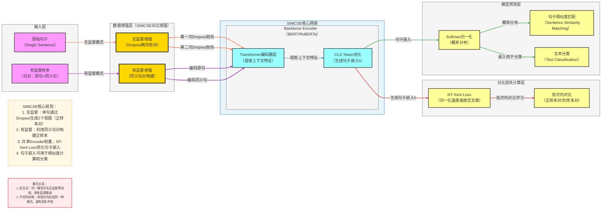

**标准 SimCSE 架构图**（简单对比句子嵌入，严格贴合论文核心：**Dropout增强、共享编码器、NT-Xent 损失、无监督/有监督双模式**），风格和你之前全套深度学习架构完全统一，可直接用于笔记/PPT。

# SimCSE 完整架构流程图

---

# SimCSE 极简核心总结

1. **定位**：**句子嵌入**模型，用于学习高质量的文本表征
2. **核心Backbone**：**BERT/RoBERTa + Dropout增强**
3. **最大创新**
    - **无监督学习**：通过Dropout两次前向传播生成句子的两个不同嵌入作为正样本对
    - **有监督学习**：利用同义句对构建正样本
    - **共享编码器**：使用预训练语言模型作为编码器
    - **NT-Xent Loss**：优化句子嵌入的对比学习目标
4. **结构范式**
输入句子 → 数据增强（无监督：Dropout；有监督：同义句对）→ 预训练编码器提取特征 → CLS Token池化 → 对比损失计算 → 句子嵌入学习

---

# SimCSE 数据流转逻辑详解

## 输入层
- **输入格式**：
  - **无监督模式**：单句文本
  - **有监督模式**：同义句对（原句+同义句）
- **输入示例**：
  - 无监督："The cat sat on the mat"
  - 有监督：("The cat sat on the mat", "A feline rested on the carpet")

## 数据增强层
### 1. 无监督增强（Dropout两次前向）
- **第一次Dropout前向**：在Dropout开启的情况下，将句子输入编码器，得到第一个嵌入
- **第二次Dropout前向**：同样的句子再次输入编码器，由于Dropout的随机性，得到第二个不同的嵌入
- **正样本对**：这两个嵌入构成正样本对

### 2. 有监督增强（同义句对构建）
- **原句编码**：将原句输入编码器，得到嵌入
- **同义句编码**：将同义句输入编码器，得到嵌入
- **正样本对**：原句和同义句的嵌入构成正样本对

## 核心网络层
### Backbone Encoder（BERT/RoBERTa）
1. **Transformer编码器层**
   - 通过预训练语言模型提取句子的上下文特征
   - 捕获词语之间的依赖关系和语义信息

2. **CLS Token池化**
   - 使用 [CLS] token 的表示作为整个句子的嵌入
   - 输出形状：`[d]`，其中 d 为语言模型的隐藏层维度

## 损失计算层
1. **NT-Xent Loss（归一化温度缩放交叉熵）**
   - 计算正样本对之间的相似度
   - 计算与批次内其他负样本的相似度
   - 通过温度系数 τ 调整相似度分布
   - 最大化正样本对的相似度，最小化负样本对的相似度

2. **批次内对比**
   - **无监督模式**：每个样本有一个正样本（自身的另一个嵌入）和 (N-1) 个负样本
   - **有监督模式**：每个样本有一个正样本（同义句）和 (2N-2) 个负样本

## 模型预测层
1. **Softmax归一化**
   - 将嵌入转换为概率分布

2. **句子相似度匹配**
   - 计算不同句子嵌入之间的相似度
   - 用于语义相似度计算、检索等任务

3. **文本分类**
   - 在句子嵌入基础上添加分类层
   - 用于下游分类任务

## 完整数据流转路径
### 无监督模式
输入句子 → 第一次Dropout前向传播 → 编码器提取特征 → CLS Token池化 → 第二次Dropout前向传播 → 编码器提取特征 → CLS Token池化 → NT-Xent Loss计算 → 模型参数更新 → 学习到的句子嵌入

### 有监督模式
输入同义句对 → 原句编码 → 编码器提取特征 → CLS Token池化 → 同义句编码 → 编码器提取特征 → CLS Token池化 → NT-Xent Loss计算 → 模型参数更新 → 学习到的句子嵌入

## 关键技术点
- **Dropout增强**：利用Dropout的随机性生成句子的不同嵌入，实现无监督对比学习
- **预训练编码器**：利用BERT/RoBERTa等预训练语言模型的强大表示能力
- **CLS Token池化**：使用[CLS] token作为句子的整体表示
- **双模式学习**：支持无监督和有监督两种学习方式
- **对比学习**：通过NT-Xent Loss优化句子嵌入的质量

---

# SimCSE 应用场景

1. **语义相似度计算**：计算两个句子之间的语义相似程度
2. **文本检索**：基于语义相似性进行文本检索
3. **文本分类**：利用学习到的句子嵌入进行分类任务
4. **聚类任务**：基于句子嵌入进行文本聚类
5. **问答系统**：匹配问题和答案的语义相关性
6. **情感分析**：分析文本的情感倾向
7. **复述检测**：检测两个句子是否表达相同的意思