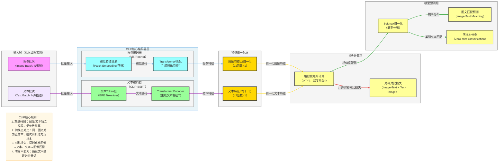

**标准 CLIP 架构图**（对比语言-图像预训练，严格贴合论文核心：**双编码器独立编码、特征归一化、跨模态对比损失、零样本能力**），风格和你之前全套深度学习架构完全统一，可直接用于笔记/PPT。

# CLIP 完整架构流程图

---

# CLIP 极简核心总结

1. **定位**：**跨模态预训练**模型，用于学习图像和文本的联合表征
2. **核心Backbone**：**双编码器架构**（图像编码器 + 文本编码器）
3. **最大创新**
    - **双编码器独立编码**：图像和文本分别通过专用编码器处理
    - **特征归一化**：将图像和文本特征归一化到单位球面
    - **跨模态对比学习**：同一图文对为正样本，批次内其他为负样本
    - **对称损失**：同时优化图像→文本和文本→图像的匹配
    - **零样本能力**：通过文本描述进行分类
4. **结构范式**
图像输入 → 图像编码器提取特征 → 特征归一化
文本输入 → 文本编码器提取特征 → 特征归一化
→ 相似度矩阵计算 → 对称对比损失计算 → 模型参数更新

---

# CLIP 数据流转逻辑详解

## 输入层
- **输入格式**：批次级图文对数据
  - `图像批次`：形状为 `[batch_size, 3, H, W]`，其中 H、W 为图像尺寸
  - `文本批次`：形状为 `[batch_size, seq_len]`，其中 seq_len 为文本序列长度
- **输入示例**：图片及其对应的描述文本

## 核心编码器层
### 1. 图像编码器（ViT/ResNet）
1. **视觉特征提取**
   - **ViT**：通过 Patch Embedding 将图像分割为 patches 并映射到高维空间，然后通过 Transformer 编码器处理
   - **ResNet**：通过卷积层提取多尺度视觉特征

2. **特征池化**
   - **ViT**：使用 CLS token 或全局平均池化生成图像特征
   - **ResNet**：使用全局平均池化生成图像特征
   - 输出形状：`[batch_size, d_vision]`，其中 `d_vision` 为视觉特征维度

### 2. 文本编码器（CLIP-BERT）
1. **文本Token化**
   - 使用 BPE Tokenizer 将文本转换为 token 序列
   - 添加 [CLS] 和 [SEP] 特殊 token

2. **Transformer编码**
   - 通过多层 Transformer Encoder 提取文本上下文特征
   - 使用 [CLS] token 表示作为文本特征
   - 输出形状：`[batch_size, d_text]`，其中 `d_text` 为文本特征维度

## 特征归一化层
1. **图像特征L2归一化**
   - 将图像特征向量归一化到单位球面（L2范数=1）
   - 输出形状：`[batch_size, d_vision]`

2. **文本特征L2归一化**
   - 将文本特征向量归一化到单位球面（L2范数=1）
   - 输出形状：`[batch_size, d_text]`

## 损失计算层
1. **相似度矩阵计算**
   - 计算图像特征和文本特征之间的相似度矩阵
   - 矩阵形状：`[batch_size, batch_size]`，其中 (i, j) 位置的值表示第 i 个图像与第 j 个文本的相似度
   - 使用温度系数 τ 调整相似度分布

2. **对称对比损失**
   - **Image-Text 损失**：以图像为查询，文本为候选，计算对比损失
   - **Text-Image 损失**：以文本为查询，图像为候选，计算对比损失
   - 总损失为两者的平均值

## 模型预测层
1. **Softmax归一化**
   - 将相似度矩阵转换为概率分布
   - 每行表示图像与不同文本的匹配概率，每列表示文本与不同图像的匹配概率

2. **图文匹配预测**
   - 判断图像和文本是否匹配
   - 输出匹配概率

3. **零样本分类**
   - 为每个类别构建描述文本（如 "a photo of a cat"）
   - 计算图像与每个类别描述的相似度
   - 将相似度最高的类别作为预测结果

## 完整数据流转路径
### 训练阶段
图像输入 → 图像编码器提取特征 → 图像特征L2归一化
文本输入 → 文本编码器提取特征 → 文本特征L2归一化
→ 相似度矩阵计算 → 对称对比损失计算 → 模型参数更新

### 推理阶段
图像输入 → 图像编码器提取特征 → 图像特征L2归一化
类别文本输入 → 文本编码器提取特征 → 文本特征L2归一化
→ 相似度计算 → Softmax归一化 → 零样本分类预测

## 关键技术点
- **双编码器架构**：图像和文本分别通过专用编码器处理，保持模态特异性
- **特征归一化**：将特征归一化到单位球面，使相似度计算等同于点积运算
- **跨模态对比学习**：通过批次内对比学习，建立图像和文本之间的语义关联
- **对称损失**：同时优化两个方向的匹配，提升模型性能
- **零样本能力**：通过文本描述进行分类，无需针对特定任务微调

---

# CLIP 应用场景

1. **零样本分类**：无需微调即可对新类别进行分类
2. **图文检索**：基于语义相似性进行图像和文本的相互检索
3. **图像描述**：生成图像的文本描述
4. **视觉问答**：回答关于图像的问题
5. **跨模态迁移**：将文本领域的知识迁移到视觉领域
6. **少样本学习**：仅需少量标注数据即可适应新任务
7. **内容审核**：识别违规内容
8. **图像生成**：作为条件模型指导图像生成