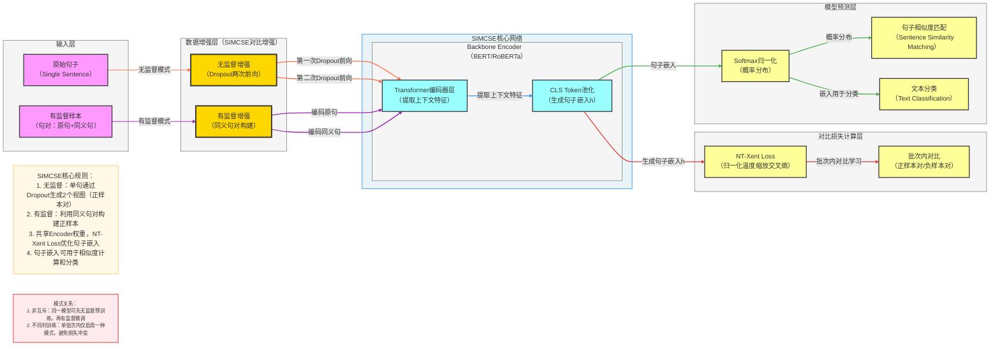
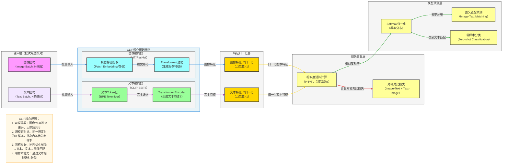

- `SimCLR`（Simple Contrastive Learning Framework，简单对比学习框架）

```mermaid
flowchart LR
    %% 样式定义（沿用历史配色体系，适配SIMCLR模块特性）
    classDef inputStyle fill:#f9f,stroke:#333,stroke-width:2px,rounded:8px
    classDef augStyle fill:#ffd700,stroke:#333,stroke-width:3px,rounded:8px
    classDef encoderStyle fill:#9ff,stroke:#333,stroke-width:2px,rounded:8px
    classDef projectorStyle fill:#9f9,stroke:#333,stroke-width:2px,rounded:8px
    classDef lossStyle fill:#ff9,stroke:#333,stroke-width:2px,rounded:8px
    classDef subgraphStyle fill:#f5f5f5,stroke:#666,stroke-width:1px,rounded:10px
    classDef simclrClusterStyle fill:#e8f4f8,stroke:#4299e1,stroke-width:1.5px,rounded:10px
    classDef ruleNoteStyle fill:#fff8e6,stroke:#ffb74d,stroke-width:1px,rounded:8px

    %% 1. 输入层（原始图像）
    subgraph inputLayer["输入层"]
        A[原始图像<br/>（Single Image）]:::inputStyle
    end
    class inputLayer subgraphStyle

    %% 2. 数据增强层（SIMCLR核心双增强策略）
    subgraph augLayer["数据增强层（SIMCLR双视图增强）"]
        B[增强策略1<br/>（随机裁剪+翻转+颜色失真）]:::augStyle
        C[增强策略2<br/>（随机裁剪+高斯模糊+亮度调整）]:::augStyle
    end
    class augLayer subgraphStyle

    %% 3. SIMCLR核心网络层（Encoder + Projector）
    subgraph simclrCore["SIMCLR核心网络"]
        subgraph encoder["Backbone Encoder<br/>（ResNet系列）"]
            D[卷积层+池化层<br/>（提取基础特征）]:::encoderStyle
            E[全局平均池化<br/>（生成h向量）]:::encoderStyle
        end
        class encoder subgraphStyle

        subgraph projector["Projection Head<br/>（MLP三层结构）"]
            F[线性层1 + ReLU]:::projectorStyle
            G[线性层2 + ReLU]:::projectorStyle
            H[线性层3<br/>（生成z向量）]:::projectorStyle
        end
        class projector subgraphStyle
    end
    class simclrCore simclrClusterStyle

    %% 4. 损失计算层（NT-Xent Loss）
    subgraph lossLayer["对比损失计算层"]
        I[NT-Xent Loss<br/>（归一化温度缩放交叉熵）]:::lossStyle
        J[批次内对比<br/>（正样本对/负样本对）]:::lossStyle
    end
    class lossLayer subgraphStyle

    %% 5. 模型预测层
    subgraph predLayer["模型预测层"]
        K[Softmax归一化<br/>（概率分布）]:::lossStyle
        L[特征相似度匹配<br/>（Feature Similarity Matching）]:::lossStyle
        M[线性分类头<br/>（Linear Classification Head）]:::lossStyle
    end
    class predLayer subgraphStyle

    %% SIMCLR核心规则注释（避免歧义）
    Note[SIMCLR核心规则：<br/>1. 单图像生成2个增强视图（正样本对）<br/>2. 共享Encoder/Projector权重<br/>3. NT-Xent Loss最大化正样本相似度，最小化负样本相似度<br/>4. 预训练特征可用于下游任务]:::ruleNoteStyle

    %% 核心流转逻辑（语义化标签，贴合SIMCLR术语）
    A -->|生成正样本对| B
    A -->|生成正样本对| C

    %% 增强视图流向编码器（共享权重）
    B -->|编码增强视图1| D
    C -->|编码增强视图2| D

    %% 编码器流向投影头
    D -->|提取特征| E
    E -->|生成h向量| F
    F -->|投影变换| G
    G -->|投影变换| H

    %% 投影头输出流向损失计算
    H -->|z1/z2向量输入| I
    I -->|批次内对比学习| J

    %% 模型预测流程
    H -->|投影特征| K
    K -->|概率分布| L
    K -->|特征用于分类| M

    %% 连接线统一样式（区分不同阶段：输入层橙色，编码层蓝色，损失层红色，预测绿色）
    linkStyle 0,1 stroke:#ff7043,stroke-width:1.5px,arrowheadStyle:filled
    linkStyle 2,3 stroke:#4299e1,stroke-width:2px,arrowheadStyle:filled
    linkStyle 4,5,6 stroke:#9c27b0,stroke-width:1.5px,arrowheadStyle:filled
    linkStyle 7,8 stroke:#e53935,stroke-width:2px,arrowheadStyle:filled
    linkStyle 9,10,11 stroke:#4caf50,stroke-width:2px,arrowheadStyle:filled
```

- `SimCSE`（Simple Contrastive Sentence Embedding，简单对比句子嵌入）

```mermaid
flowchart LR
    %% 样式定义（沿用历史配色体系，新增模式说明样式）
    classDef inputStyle fill:#f9f,stroke:#333,stroke-width:2px,rounded:8px
    classDef augStyle fill:#ffd700,stroke:#333,stroke-width:3px,rounded:8px
    classDef encoderStyle fill:#9ff,stroke:#333,stroke-width:2px,rounded:8px
    classDef lossStyle fill:#ff9,stroke:#333,stroke-width:2px,rounded:8px
    classDef subgraphStyle fill:#f5f5f5,stroke:#666,stroke-width:1px,rounded:10px
    classDef simcseClusterStyle fill:#e8f4f8,stroke:#4299e1,stroke-width:1.5px,rounded:10px
    classDef ruleNoteStyle fill:#fff8e6,stroke:#ffb74d,stroke-width:1px,rounded:8px
    classDef modeNoteStyle fill:#ffebee,stroke:#e53935,stroke-width:1.5px,rounded:8px,font-size:12px

    %% 1. 输入层（文本句子）
    subgraph inputLayer["输入层"]
        A[原始句子<br/>（Single Sentence）]:::inputStyle
        A1[有监督样本<br/>（句对：原句+同义句）]:::inputStyle
    end
    class inputLayer subgraphStyle

    %% 2. 数据增强层（SIMCSE核心增强策略）
    subgraph augLayer["数据增强层（SIMCSE对比增强）"]
        B[无监督增强<br/>（Dropout两次前向）]:::augStyle
        C[有监督增强<br/>（同义句对构建）]:::augStyle
    end
    class augLayer subgraphStyle

    %% 3. SIMCSE核心网络层（预训练编码器）
    subgraph simcseCore["SIMCSE核心网络"]
        subgraph encoder["Backbone Encoder<br/>（BERT/RoBERTa）"]
            D[Transformer编码器层<br/>（提取上下文特征）]:::encoderStyle
            E[CLS Token池化<br/>（生成句子嵌入h）]:::encoderStyle
        end
        class encoder subgraphStyle
    end
    class simcseCore simcseClusterStyle

    %% 4. 损失计算层（对比损失）
    subgraph lossLayer["对比损失计算层"]
        F[NT-Xent Loss<br/>（归一化温度缩放交叉熵）]:::lossStyle
        G[批次内对比<br/>（正样本对/负样本对）]:::lossStyle
    end
    class lossLayer subgraphStyle

    %% 5. 模型预测层
    subgraph predLayer["模型预测层"]
        H[Softmax归一化<br/>（概率分布）]:::lossStyle
        I[句子相似度匹配<br/>（Sentence Similarity Matching）]:::lossStyle
        J[文本分类<br/>（Text Classification）]:::lossStyle
    end
    class predLayer subgraphStyle

    %% 核心规则注释（新增模式关系说明）
    Note[SIMCSE核心规则：<br/>1. 无监督：单句通过Dropout生成2个视图（正样本对）<br/>2. 有监督：利用同义句对构建正样本<br/>3. 共享Encoder权重，NT-Xent Loss优化句子嵌入<br/>4. 句子嵌入可用于相似度计算和分类]:::ruleNoteStyle
    ModeNote[模式关系：<br/>1. 非互斥：同一模型可先无监督预训练，再有监督微调<br/>2. 不同时训练：单批次内仅启用一种模式，避免损失冲突]:::modeNoteStyle

    %% 核心流转逻辑（分无监督/有监督分支，语义化标签）
    %% 无监督分支
    A -->|无监督模式| B
    B -->|第一次Dropout前向| D
    B -->|第二次Dropout前向| D

    %% 有监督分支
    A1 -->|有监督模式| C
    C -->|编码原句| D
    C -->|编码同义句| D

    %% 编码器流向损失计算
    D -->|提取上下文特征| E
    E -->|生成句子嵌入h| F
    F -->|批次内对比学习| G

    %% 模型预测流程
    E -->|句子嵌入| H
    H -->|概率分布| I
    H -->|嵌入用于分类| J

    %% 连接线统一样式（区分分支：无监督橙色，有监督紫色，编码层蓝色，损失层红色，预测绿色）
    linkStyle 0 stroke:#ff7043,stroke-width:1.5px,arrowheadStyle:filled
    linkStyle 1,2 stroke:#ff7043,stroke-width:2px,arrowheadStyle:filled
    linkStyle 3 stroke:#9c27b0,stroke-width:1.5px,arrowheadStyle:filled
    linkStyle 4,5 stroke:#9c27b0,stroke-width:2px,arrowheadStyle:filled
    linkStyle 6 stroke:#4299e1,stroke-width:2px,arrowheadStyle:filled
    linkStyle 7,8 stroke:#e53935,stroke-width:2px,arrowheadStyle:filled
    linkStyle 9,10,11 stroke:#4caf50,stroke-width:2px,arrowheadStyle:filled
```

- `CLIP`（Contrastive Language-Image Pre-training，对比语言-图像预训练）

```mermaid
flowchart LR
    %% 样式定义（沿用历史配色体系，适配CLIP跨模态特性）
    classDef inputImgStyle fill:#f9f,stroke:#333,stroke-width:2px,rounded:8px
    classDef inputTextStyle fill:#f2e6ff,stroke:#333,stroke-width:2px,rounded:8px
    classDef encoderImgStyle fill:#9ff,stroke:#333,stroke-width:2px,rounded:8px
    classDef encoderTextStyle fill:#9f9,stroke:#333,stroke-width:2px,rounded:8px
    classDef normStyle fill:#ffd700,stroke:#333,stroke-width:3px,rounded:8px
    classDef lossStyle fill:#ff9,stroke:#333,stroke-width:2px,rounded:8px
    classDef subgraphStyle fill:#f5f5f5,stroke:#666,stroke-width:1px,rounded:10px
    classDef clipClusterStyle fill:#e8f4f8,stroke:#4299e1,stroke-width:1.5px,rounded:10px
    classDef ruleNoteStyle fill:#fff8e6,stroke:#ffb74d,stroke-width:1px,rounded:8px

    %% 1. 输入层（图文对批量输入）
    subgraph inputLayer["输入层（批次级图文对）"]
        A[图像批次<br/>（Image Batch, N张图）]:::inputImgStyle
        B[文本批次<br/>（Text Batch, N条描述）]:::inputTextStyle
    end
    class inputLayer subgraphStyle

    %% 2. CLIP核心编码器层（双编码器独立编码）
    subgraph clipCore["CLIP核心编码器层"]
        subgraph imgEncoder["图像编码器<br/>（ViT/ResNet）"]
            C[视觉特征提取<br/>（Patch Embedding/卷积）]:::encoderImgStyle
            D[Transformer/池化<br/>（生成图像特征I）]:::encoderImgStyle
        end
        class imgEncoder subgraphStyle

        subgraph textEncoder["文本编码器<br/>（CLIP-BERT）"]
            E[文本Token化<br/>（BPE Tokenizer）]:::encoderTextStyle
            F[Transformer Encoder<br/>（生成文本特征T）]:::encoderTextStyle
        end
        class textEncoder subgraphStyle
    end
    class clipCore clipClusterStyle

    %% 3. 特征归一化层（对比学习前置）
    subgraph normLayer["特征归一化层"]
        %% 修复：替换竖线为文字描述，避免语法冲突
        G[图像特征L2归一化<br/>（L2范数=1）]:::normStyle
        H[文本特征L2归一化<br/>（L2范数=1）]:::normStyle
    end
    class normLayer subgraphStyle

    %% 4. 对比损失计算层（跨模态对比）
    subgraph lossLayer["损失计算层"]
        I[相似度矩阵计算<br/>（I×T^T，温度系数τ）]:::lossStyle
        J[对称对比损失<br/>（Image-Text + Text-Image）]:::lossStyle
    end
    class lossLayer subgraphStyle

    %% 5. 模型预测层
    subgraph predLayer["模型预测层"]
        K[Softmax归一化<br/>（概率分布）]:::lossStyle
        L[图文匹配预测<br/>（Image-Text Matching）]:::lossStyle
        M[零样本分类<br/>（Zero-shot Classification）]:::lossStyle
    end
    class predLayer subgraphStyle

    %% CLIP核心规则注释（同步修复特殊字符）
    Note[CLIP核心规则：<br/>1. 双编码器：图像/文本独立编码，无参数共享<br/>2. 跨模态对比：同一图文对为正样本，批次内其他为负样本<br/>3. 对称损失：同时优化图像→文本、文本→图像匹配<br/>4. 零样本能力：通过文本描述进行分类]:::ruleNoteStyle

    %% 核心流转逻辑（语义化标签，贴合CLIP术语）
    %% 图像分支
    A -->|批量输入| C
    C -->|视觉编码| D
    D -->|图像特征| G

    %% 文本分支
    B -->|批量输入| E
    E -->|文本编码| F
    F -->|文本特征| H

    %% 归一化后流向损失计算
    G -->|归一化图像特征| I
    H -->|归一化文本特征| I
    I -->|计算对称对比损失| J

    %% 模型预测流程
    I -->|相似度矩阵| K
    K -->|概率分布| L
    K -->|类别文本匹配| M

    %% 连接线统一样式（区分分支：图像蓝色，文本紫色，归一化黄色，损失红色，预测绿色）
    linkStyle 0,1,2 stroke:#4299e1,stroke-width:2px,arrowheadStyle:filled
    linkStyle 3,4,5 stroke:#9c27b0,stroke-width:2px,arrowheadStyle:filled
    linkStyle 6,7 stroke:#ffd700,stroke-width:1.5px,arrowheadStyle:filled
    linkStyle 8 stroke:#e53935,stroke-width:2px,arrowheadStyle:filled
    linkStyle 9,10,11 stroke:#4caf50,stroke-width:2px,arrowheadStyle:filled
```

