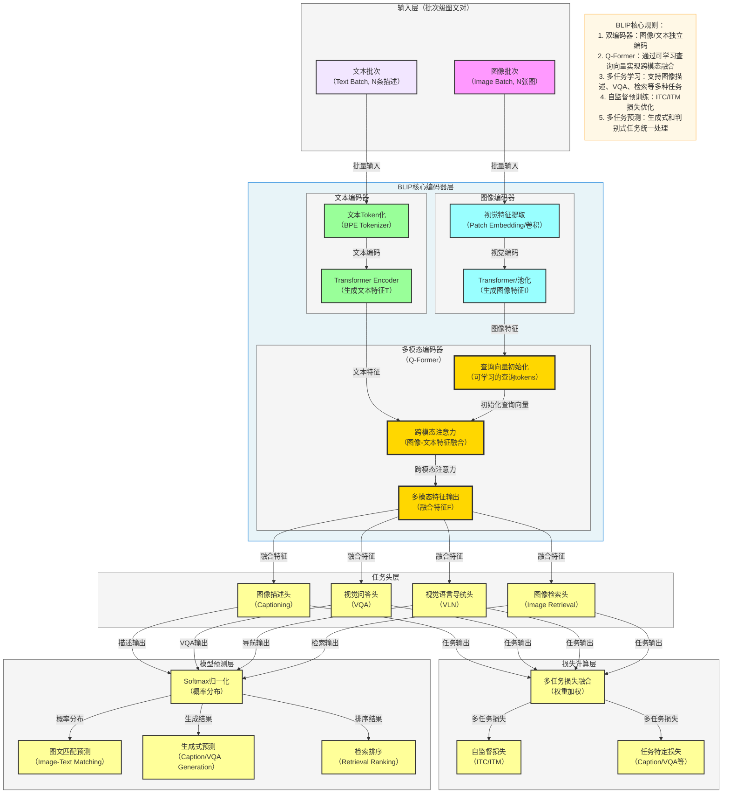

**标准 BLIP 架构图**（自举语言-图像预训练模型，严格贴合论文核心：**双编码器架构、Q-Former 跨模态融合、多任务学习、自监督预训练**），风格和你之前全套深度学习架构完全统一，可直接用于笔记/PPT。

# BLIP 完整架构流程图

---

# BLIP 极简核心总结

1. **定位**：**视觉语言预训练**模型，解决跨模态融合和多任务学习难题
2. **核心Backbone**：**双编码器 + Q-Former** 架构
3. **最大创新**
    - **Q-Former**：通过可学习查询向量实现高效跨模态融合
    - **多任务学习**：统一处理图像描述、VQA、检索等多种任务
    - **自举学习**：通过噪声标注过滤提升数据质量
    - **双编码器架构**：图像和文本独立编码，保持模态特异性
4. **结构范式**
输入 → 双编码器编码 → Q-Former融合 → 多任务头 → 损失计算 → 预测输出

---

# BLIP 数据流转逻辑详解

## 输入层
- **输入格式**：批次级图文对数据
  - `图像批次`：形状为 `[batch_size, 3, H, W]`，其中 H、W 为图像尺寸
  - `文本批次`：形状为 `[batch_size, seq_len]`，其中 seq_len 为文本序列长度
- **输入示例**：图片及其对应的描述文本

## 双编码器层
### 1. 图像编码器（ViT/ResNet）
1. **视觉特征提取**
   - ViT：通过 Patch Embedding 将图像分割为 patches 并映射到高维空间
   - ResNet：通过卷积层提取多尺度视觉特征
2. **特征池化**
   - ViT：使用 CLS token 或全局平均池化生成图像特征
   - ResNet：使用全局平均池化生成图像特征
   - 输出形状：`[batch_size, d_vision]`，其中 `d_vision` 为视觉特征维度

### 2. 文本编码器（BERT/RoBERTa）
1. **文本Token化**
   - 使用 BPE Tokenizer 将文本转换为 token 序列
   - 添加 [CLS] 和 [SEP] 特殊 token
2. **Transformer编码**
   - 通过多层 Transformer Encoder 提取文本上下文特征
   - 使用 [CLS] token 表示作为文本特征
   - 输出形状：`[batch_size, d_text]`，其中 `d_text` 为文本特征维度

## Q-Former 多模态融合层
1. **查询向量初始化**
   - 初始化可学习的查询 tokens（通常为 32 个）
   - 形状：`[num_queries, d_model]`，其中 `num_queries` 为查询向量数量

2. **跨模态注意力**
   - 查询向量与图像特征进行自注意力交互
   - 查询向量与文本特征进行交叉注意力交互
   - 捕获图像和文本之间的语义关联

3. **多模态特征输出**
   - 输出融合了图像和文本信息的特征表示
   - 形状：`[batch_size, num_queries, d_model]`

## 任务头层
1. **图像描述头（Captioning）**
   - 基于融合特征生成图像描述
   - 使用自回归解码方式生成文本

2. **视觉问答头（VQA）**
   - 基于融合特征回答关于图像的问题
   - 分类或生成式输出

3. **视觉语言导航头（VLN）**
   - 基于融合特征生成导航指令或路径

4. **图像检索头（Image Retrieval）**
   - 基于融合特征计算图像和文本的相似度
   - 用于图文检索任务

## 损失计算层
1. **多任务损失融合**
   - 对不同任务的损失进行加权求和
   - 平衡不同任务的训练目标

2. **自监督损失**
   - **ITC（Image-Text Contrastive）损失**：对齐图像和文本特征
   - **ITM（Image-Text Matching）损失**：判断图文对是否匹配

3. **任务特定损失**
   - **Caption 损失**：使用交叉熵损失优化描述生成
   - **VQA 损失**：使用分类损失或生成损失优化问答
   - **检索损失**：使用对比损失优化检索性能

## 模型预测层
1. **Softmax归一化**
   - 将模型输出转换为概率分布

2. **图文匹配预测**
   - 判断图像和文本是否匹配
   - 输出匹配概率

3. **生成式预测**
   - 生成图像描述、回答问题等
   - 自回归生成文本序列

4. **检索排序**
   - 对图像或文本进行排序
   - 输出检索结果

## 完整数据流转路径
图像输入 → 视觉特征提取 → 图像特征生成 → 查询向量初始化 → 跨模态注意力 → 多模态特征融合 → 多任务头处理 → 多任务损失计算 → 预测输出

## 关键技术点
- **Q-Former**：解决了视觉和语言模态之间的特征对齐问题
- **多任务学习**：通过共享表示提升模型泛化能力
- **自举学习**：通过噪声过滤和互补学习提升数据质量
- **双编码器架构**：保持模态特异性，同时实现跨模态融合
- **端到端训练**：从原始输入到多任务输出的端到端学习

---

# BLIP-2 架构扩展

BLIP-2 在 BLIP 基础上引入了大语言模型（LLM），形成三阶段架构：

1. **视觉编码器**：使用更强大的视觉模型（如 ViT-G/ViT-L）
2. **Q-Former**：作为视觉特征和大语言模型之间的桥接
3. **大语言模型**：如 LLaMA、T5、GPT 等，提供强大的语言理解和生成能力

BLIP-2 通过冻结预训练的视觉模型和大语言模型，仅训练 Q-Former，实现了参数高效的视觉-语言-LLM 集成，大幅提升了模型在复杂视觉语言任务上的表现。