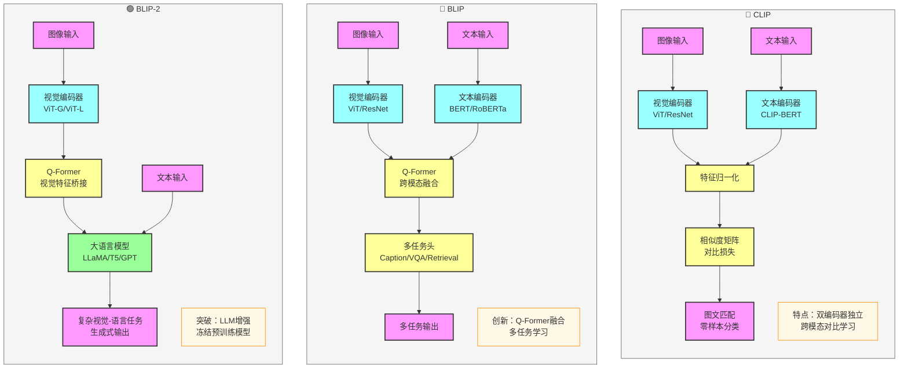

# BLIP 模型比较与进阶应用

## 一、模型对比分析

### 1. 核心架构对比

| 模型 | 核心架构 | 主要创新点 | 适用场景 |
|------|----------|------------|----------|
| CLIP | 双编码器独立架构 | 跨模态对比学习，零样本能力 | 图文检索、零样本分类 |
| BLIP | 双编码器 + Q-Former | Q-Former多模态融合，多任务学习 | 图像描述、VQA、检索 |
| BLIP-2 | 双编码器 + Q-Former + 大语言模型 | 冻结视觉/语言模型，仅训练Q-Former | 复杂视觉语言任务、生成式任务 |

### 2. 技术特点对比

| 模型 | 视觉编码器 | 文本编码器 | 融合方式 | 训练目标 |
|------|------------|------------|----------|----------|
| CLIP | ViT/ResNet | CLIP-BERT | 特征归一化 + 相似度矩阵 | 跨模态对比损失 |
| BLIP | ViT/ResNet | BERT/RoBERTa | Q-Former跨模态融合 | 多任务损失（ITC/ITM/Caption等） |
| BLIP-2 | ViT-G/ViT-L | LLM（LLaMA/T5/GPT） | Q-Former桥接 + LLM推理 | 视觉-语言对齐 + LLM增强 |

### 3. 功能能力对比

| 模型 | 图文检索 | 图像描述 | VQA | 零样本能力 | 生成能力 |
|------|----------|----------|-----|------------|----------|
| CLIP | ✅ 强 | ❌ 弱 | ❌ 弱 | ✅ 强 | ❌ 弱 |
| BLIP | ✅ 强 | ✅ 强 | ✅ 强 | ⚠️ 中等 | ✅ 强 |
| BLIP-2 | ✅ 强 | ✅ 很强 | ✅ 很强 | ✅ 强 | ✅ 很强 |

## 二、视觉语言模型进化路线

### 1. 三大模型架构对比

### 2. 核心思路演变

- **CLIP**：引入跨模态对比学习 → 学习图文语义对齐，获得零样本能力
- **BLIP**：提出Q-Former架构 → 实现深度跨模态融合，支持多任务学习
- **BLIP-2**：结合大语言模型 → 利用LLM的推理能力，实现更复杂的视觉-语言任务

### 3. 模型家族分类

- **基础对比学习**：CLIP（开创跨模态对比学习先河）
- **多任务融合**：BLIP（引入Q-Former实现多任务统一）
- **大模型增强**：BLIP-2（结合LLM实现能力飞跃）

## 三、模型选择指南

### 1. 根据任务需求选择

- **图文检索/零样本分类**：优先选择 CLIP 或 BLIP-2
- **图像描述/VQA**：优先选择 BLIP 或 BLIP-2
- **复杂视觉-语言任务**：优先选择 BLIP-2
- **资源受限场景**：选择 CLIP 或 BLIP

### 2. 根据计算资源选择

- **计算资源丰富**：BLIP-2（性能最强）
- **计算资源中等**：BLIP（平衡性能与资源）
- **计算资源有限**：CLIP（轻量级，效果好）

## 四、关键技术创新

1. **CLIP**：跨模态对比学习框架，通过大规模图文对预训练获得零样本能力
2. **BLIP**：Q-Former架构，通过可学习查询向量实现高效跨模态融合
3. **BLIP-2**：视觉-语言-LLM三阶段架构，冻结预训练模型，仅训练桥接组件

## 五、总结

BLIP系列模型代表了视觉语言预训练的重要发展阶段：
- **CLIP** 开创了跨模态对比学习的先河，奠定了视觉语言预训练的基础
- **BLIP** 通过Q-Former实现了更深度的跨模态融合，支持多任务学习
- **BLIP-2** 结合大语言模型，实现了视觉语言能力的质的飞跃

在实际应用中，应根据具体任务需求、计算资源和性能要求选择合适的模型。BLIP-2作为最新的模型，在大多数视觉语言任务上表现最佳，但也需要更多的计算资源。