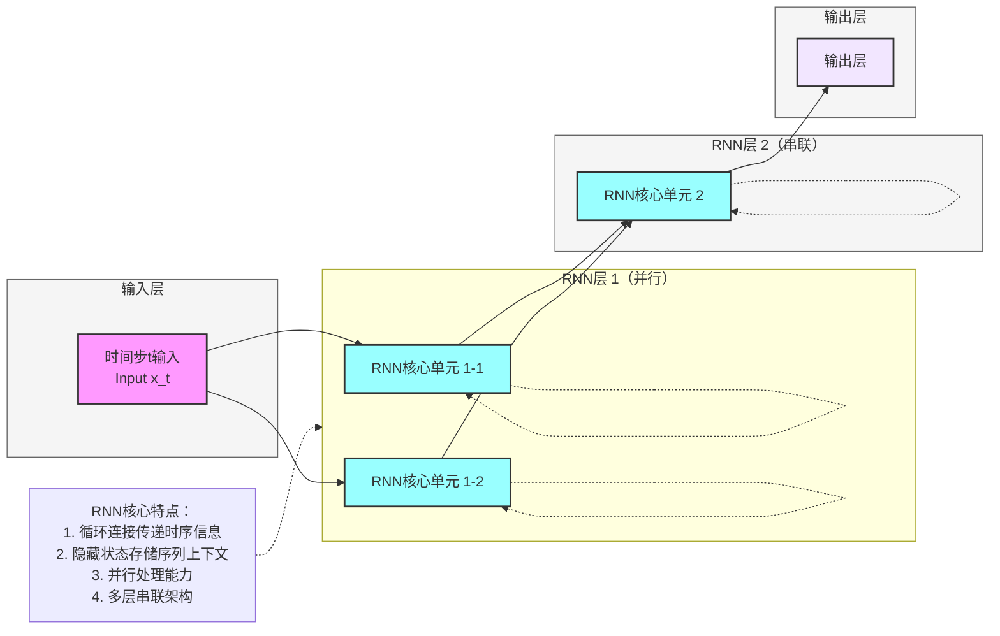

**标准 RNN 模型架构图**（循环神经网络基础版，核心：**循环连接、隐藏状态**），风格和项目全套深度学习架构完全统一，可直接用于笔记/PPT。

# RNN 完整架构流程图（扩展版：并行与串联）

---

# RNN 极简核心总结

1. **定位**：**循环神经网络**基础模型，处理序列数据的经典架构
2. **核心Backbone**：**循环连接机制**，包含输入层、RNN核心单元和输出层，支持并行节点和串联堆叠
3. **最大创新**
    - **循环连接**：隐藏状态的循环更新，传递时序信息
    - **序列建模**：天然捕获序列数据的位置依赖关系
    - **上下文存储**：隐藏状态存储序列的历史上下文信息
    - **参数共享**：所有时间步复用同一套权重参数
    - **结构简洁**：基础架构简单直观，易于理解
    - **并行能力**：同一层内可包含多个RNN节点，并行处理输入信息
    - **串联能力**：可堆叠多层RNN形成深度网络，增强特征提取能力
4. **结构范式**
输入 → 并行RNN节点处理 → 特征拼接 → 串联RNN层处理 → 输出线性层 → Softmax → 预测结果
5. **核心公式**
    - 隐藏状态更新（单节点）：h_t = tanh(W_hh · h_{t-1} + W_hx · x_t + b_h)
    - 隐藏状态更新（多层）：h_t^l = tanh(W_hh^l · h_{t-1}^l + W_hx^l · h_t^{l-1} + b_h^l)
    - 输出计算：y_t = W_oh · h_t^L + b_o
    其中，L表示网络层数