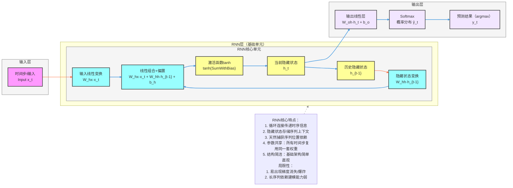

**标准 RNN 模型架构图**（循环神经网络基础版，核心：**循环连接、隐藏状态**），风格和项目全套深度学习架构完全统一，可直接用于笔记/PPT。

# RNN 完整架构流程图（基础版）

---

# RNN 极简核心总结

1. **定位**：**循环神经网络**基础模型，处理序列数据的经典架构
2. **核心Backbone**：**循环连接机制**，包含输入层、RNN核心单元和输出层
3. **最大创新**
    - **循环连接**：隐藏状态的循环更新，传递时序信息
    - **序列建模**：天然捕获序列数据的位置依赖关系
    - **上下文存储**：隐藏状态存储序列的历史上下文信息
    - **参数共享**：所有时间步复用同一套权重参数
    - **结构简洁**：基础架构简单直观，易于理解
4. **结构范式**
输入 → 输入线性变换 → 隐藏状态变换 → 线性组合+偏置 → 激活函数tanh → 当前隐藏状态 → 输出线性层 → Softmax → 预测结果
5. **核心公式**
    - 隐藏状态更新：h_t = tanh(W_hh · h_{t-1} + W_hx · x_t + b_h)
    - 输出计算：y_t = W_oh · h_t + b_o