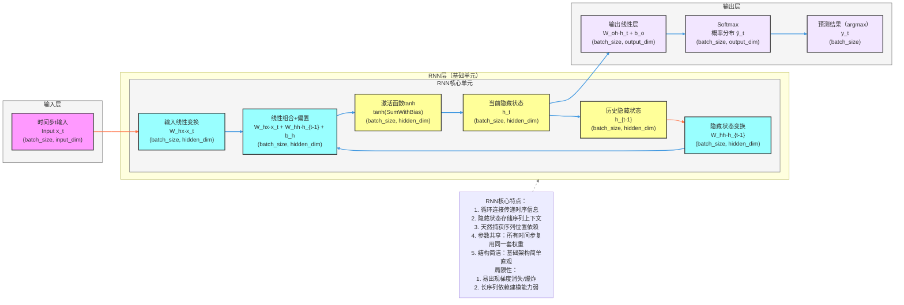

**标准 RNN 模型架构图**（循环神经网络详细版，核心：**循环连接、隐藏状态、维度变换**），风格和项目全套深度学习架构完全统一，可直接用于技术文档和代码实现参考。

# RNN 完整架构流程图（详细版）


---

# RNN 详细技术说明

## 1. 维度定义
- **input_dim**：输入特征维度
- **hidden_dim**：隐藏状态维度
- **output_dim**：输出特征维度
- **batch_size**：批次大小
- **seq_len**：序列长度

## 2. 数据流转路径（含维度变换）

### 步骤1：输入层
- 输入：`x_t`，维度为 `(batch_size, input_dim)`
- 说明：每个时间步的输入向量，包含当前时间步的特征信息

### 步骤2：RNN核心单元
- **输入线性变换**：`W_hx·x_t`
  - 权重：`W_hx`，维度为 `(input_dim, hidden_dim)`
  - 输出：维度为 `(batch_size, hidden_dim)`
- **隐藏状态变换**：`W_hh·h_{t-1}`
  - 权重：`W_hh`，维度为 `(hidden_dim, hidden_dim)`
  - 输出：维度为 `(batch_size, hidden_dim)`
- **线性组合+偏置**：`W_hx·x_t + W_hh·h_{t-1} + b_h`
  - 偏置：`b_h`，维度为 `(hidden_dim)`
  - 输入：两个维度为 `(batch_size, hidden_dim)` 的张量
  - 输出：维度为 `(batch_size, hidden_dim)`
- **激活函数**：tanh
  - 输入：线性组合结果，维度为 `(batch_size, hidden_dim)`
  - 输出：激活后结果，维度为 `(batch_size, hidden_dim)`
- **隐藏状态更新**：
  - 当前隐藏状态 `h_t`，维度为 `(batch_size, hidden_dim)`
  - 历史隐藏状态 `h_{t-1}`，维度为 `(batch_size, hidden_dim)`

### 步骤3：输出层
- **线性层**：`W_oh·h_t + b_o`
  - 权重：`W_oh`，维度为 `(hidden_dim, output_dim)`
  - 偏置：`b_o`，维度为 `(output_dim)`
  - 输出：线性层结果，维度为 `(batch_size, output_dim)`
- **Softmax**：
  - 输入：线性层结果，维度为 `(batch_size, output_dim)`
  - 输出：概率分布 `ŷ_t`，维度为 `(batch_size, output_dim)`
- **预测结果（argmax）**：`y_t`，维度为 `(batch_size)`

## 3. 核心公式

### 隐藏状态更新
```
h_t = tanh(W_hh · h_{t-1} + W_hx · x_t + b_h)
```
- `W_hh`：隐藏状态到隐藏状态的权重矩阵，维度为 `(hidden_dim, hidden_dim)`
- `W_hx`：输入到隐藏状态的权重矩阵，维度为 `(input_dim, hidden_dim)`
- `b_h`：隐藏状态的偏置向量，维度为 `(hidden_dim)`

### 输出计算
```
y_t = softmax(W_oh · h_t + b_o)
```
- `W_oh`：隐藏状态到输出的权重矩阵，维度为 `(hidden_dim, output_dim)`
- `b_o`：输出的偏置向量，维度为 `(output_dim)`

## 4. 模型参数
- **输入层**：无参数
- **RNN核心单元**：`W_hh`、`W_hx` 和 `b_h`，共 `hidden_dim^2 + input_dim * hidden_dim + hidden_dim` 个参数
- **输出层**：`W_oh` 和 `b_o`，共 `hidden_dim * output_dim + output_dim` 个参数

## 5. 时间复杂度分析
- **前向传播**：O(seq_len * (input_dim * hidden_dim + hidden_dim^2 + hidden_dim * output_dim))
- **反向传播**：O(seq_len * (input_dim * hidden_dim + hidden_dim^2 + hidden_dim * output_dim))

## 6. 空间复杂度分析
- **模型参数**：O(input_dim * hidden_dim + hidden_dim^2 + hidden_dim * output_dim)
- **激活值存储**：O(seq_len * batch_size * hidden_dim)（用于反向传播）

## 7. 代码实现要点
- **权重初始化**：通常使用 Xavier 或 He 初始化方法
- **梯度裁剪**：防止梯度爆炸，通常设置阈值为 1.0
- **序列填充**：处理不同长度的序列时需要填充
- **批量处理**：使用批处理提高计算效率
- **隐藏状态初始化**：通常初始化为全零向量

## 8. 示例说明
假设我们有一个词表大小为10000的语言模型：

- 输入：`[32, 10, 10000]` （32个样本，每个样本10个词，每个词是10000维的one-hot向量）
- 输入变换层输出：`[32, 10, 128]` （128维隐藏状态空间）
- RNN层输出（每个时间步）：`[32, 128]` （128维隐藏状态）
- 完整RNN层输出：`[32, 10, 128]` （所有时间步的隐藏状态）
- 线性层输出：`[32, 10, 10000]` （10000维词表空间）
- Softmax输出：`[32, 10, 10000]` （概率分布）
- 预测结果：`[32, 10]` （每个位置预测一个词索引）