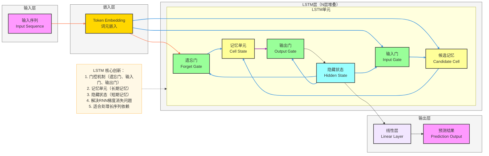
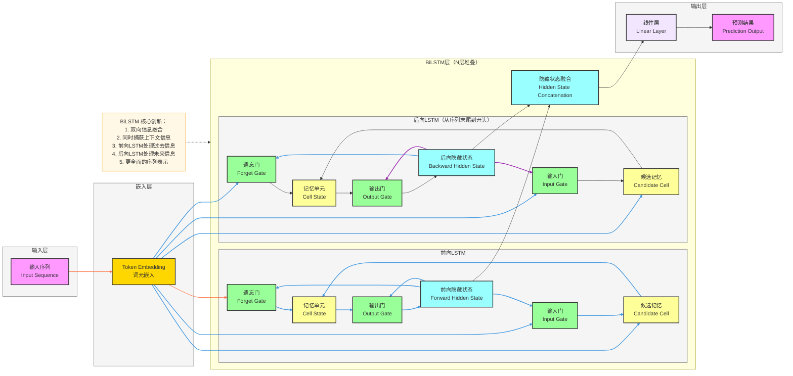

**LSTM和BiLSTM模型架构图**（序列建模经典模型，严格贴合核心机制：**门控机制、记忆单元、双向信息融合**），风格和全套深度学习架构完全统一，可直接用于笔记/PPT。

# LSTM 完整架构流程图（基础版）

# BiLSTM 完整架构流程图（基础版）

---

# LSTM 和 BiLSTM 极简核心总结

## LSTM
1. **定位**：**序列建模**经典模型，解决RNN梯度消失问题
2. **核心Backbone**：**门控机制**结构，包含遗忘门、输入门、输出门
3. **最大创新**
    - **门控机制**：控制信息的流入和流出
    - **记忆单元**：长期记忆存储
    - **隐藏状态**：短期记忆传递
    - **解决梯度消失**：适合处理长序列
4. **结构范式**
输入 → 嵌入 → LSTM单元（门控机制+记忆单元）→ 线性层 → 输出

## BiLSTM
1. **定位**：**双向序列建模**增强版，捕获上下文信息
2. **核心Backbone**：**双向LSTM**结构，包含前向和后向LSTM
3. **最大创新**
    - **双向信息融合**：同时处理过去和未来信息
    - **更全面的上下文**：捕获完整的序列语义
    - **隐藏状态拼接**：丰富特征表示
4. **结构范式**
输入 → 嵌入 → 前向LSTM + 后向LSTM → 隐藏状态融合 → 线性层 → 输出
