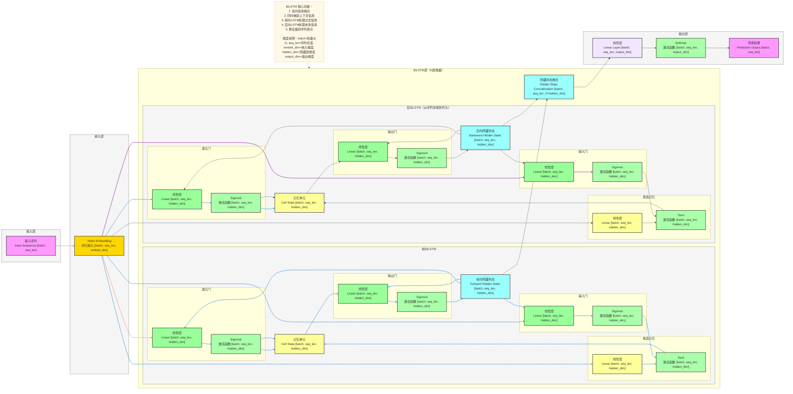

# LSTM 完整架构流程图（详细版）

```mermaid
flowchart LR
    %% 统一样式（和Transformer/TimesNet/YOLO/SimCLR风格一致）
    classDef inputStyle fill:#f9f,stroke:#333,stroke-width:2px,rounded:8px
    classDef embedStyle fill:#ffd700,stroke:#333,stroke-width:2px,rounded:8px
    classDef blockStyle fill:#9ff,stroke:#333,stroke-width:2px,rounded:8px
    classDef gateStyle fill:#9f9,stroke:#333,stroke-width:2px,rounded:8px
    classDef cellStyle fill:#ff9,stroke:#333,stroke-width:2px,rounded:8px
    classDef activeStyle fill:#aaffaa,stroke:#333,stroke-width:2px,rounded:8px
    classDef headStyle fill:#f2e6ff,stroke:#333,stroke-width:2px,rounded:8px
    classDef subgraphStyle fill:#f5f5f5,stroke:#666,stroke-width:1px,rounded:10px
    classDef coreNoteStyle fill:#fff8e6,stroke:#ffb74d,stroke-width:1px,rounded:8px

    %% 1. 输入层
    subgraph InputLayer["输入层"]
        A["输入序列<br/>Input Sequence [batch, seq_len]"]:::inputStyle
    end
    class InputLayer subgraphStyle

    %% 2. 嵌入层
    subgraph EmbedLayer["嵌入层"]
        B["Token Embedding<br/>词元嵌入 [batch, seq_len, embed_dim]"]:::embedStyle
    end
    class EmbedLayer subgraphStyle

    %% 3. LSTM层
    subgraph LSTMLayer["LSTM层（N层堆叠）"]
        %% 单个LSTM单元
        subgraph LSTMCell["LSTM单元"]
            subgraph ForgetGate["遗忘门"]
                C1["线性层<br/>Linear [batch, seq_len, hidden_dim]"]:::gateStyle
                C2["Sigmoid<br/>激活函数 [batch, seq_len, hidden_dim]"]:::activeStyle
            end
            subgraph InputGate["输入门"]
                D1["线性层<br/>Linear [batch, seq_len, hidden_dim]"]:::gateStyle
                D2["Sigmoid<br/>激活函数 [batch, seq_len, hidden_dim]"]:::activeStyle
            end
            subgraph CandidateCell["候选记忆"]
                E1["线性层<br/>Linear [batch, seq_len, hidden_dim]"]:::cellStyle
                E2["Tanh<br/>激活函数 [batch, seq_len, hidden_dim]"]:::activeStyle
            end
            subgraph OutputGate["输出门"]
                F1["线性层<br/>Linear [batch, seq_len, hidden_dim]"]:::gateStyle
                F2["Sigmoid<br/>激活函数 [batch, seq_len, hidden_dim]"]:::activeStyle
            end
            G["记忆单元<br/>Cell State [batch, seq_len, hidden_dim]"]:::cellStyle
            H["隐藏状态<br/>Hidden State [batch, seq_len, hidden_dim]"]:::blockStyle
        end
        class LSTMCell subgraphStyle
    end
    class LSTMLayer subgraphStyle

    %% 4. 输出层
    subgraph OutputLayer["输出层"]
        I["线性层<br/>Linear Layer [batch, seq_len, output_dim]"]:::headStyle
        K["Softmax<br/>激活函数 [batch, seq_len, output_dim]"]:::activeStyle
        J["预测结果<br/>Prediction Output [batch, seq_len]"]:::inputStyle
    end
    class OutputLayer subgraphStyle

    %% 核心注释（LSTM创新点）
    Note["LSTM 核心创新：<br/>1. 门控机制（遗忘门、输入门、输出门）<br/>2. 记忆单元（长期记忆）<br/>3. 隐藏状态（短期记忆）<br/>4. 解决RNN梯度消失问题<br/>5. 适合处理长序列依赖<br/><br/>维度说明：batch=批量大小, seq_len=序列长度, embed_dim=嵌入维度, hidden_dim=隐藏层维度, output_dim=输出维度"]:::coreNoteStyle

    %% 数据流
    A --> B
    B --> C1 --> C2 --> G
    B --> D1 --> D2
    B --> E1 --> E2
    H --> C1
    H --> D1
    H --> F1
    C2 --> G
    D2 --> E2
    E2 --> G
    G --> F1 --> F2 --> H
    H --> I --> K --> J

    %% 连接线样式
    linkStyle 0,1 stroke:#ff7043,stroke-width:1.5px
    linkStyle 2,3,4,5,6,7,8,9,10,11,12 stroke:#4299e1,stroke-width:2px
    linkStyle 13,14 stroke:#9c27b0,stroke-width:2px

    %% 可选：将注释节点定位到合适位置（提升可读性）
    Note -.-> LSTMCell
```

# BiLSTM 完整架构流程图（详细版）

---

# LSTM 和 BiLSTM 详细数据流转逻辑

## LSTM 数据流转

### 输入层
- **输入格式**：`[batch, seq_len]`
  - `batch`：批量大小
  - `seq_len`：序列长度

### 嵌入层
- **词元嵌入**：`[batch, seq_len]` → `[batch, seq_len, embed_dim]`
  - `embed_dim`：嵌入维度

### LSTM层（N层堆叠）
### 单个LSTM单元
1. **遗忘门**
   - 线性层：`[batch, seq_len, embed_dim]` → `[batch, seq_len, hidden_dim]`
   - Sigmoid激活：`[batch, seq_len, hidden_dim]` → `[batch, seq_len, hidden_dim]`
2. **输入门**
   - 线性层：`[batch, seq_len, embed_dim]` → `[batch, seq_len, hidden_dim]`
   - Sigmoid激活：`[batch, seq_len, hidden_dim]` → `[batch, seq_len, hidden_dim]`
3. **候选记忆**
   - 线性层：`[batch, seq_len, embed_dim]` → `[batch, seq_len, hidden_dim]`
   - Tanh激活：`[batch, seq_len, hidden_dim]` → `[batch, seq_len, hidden_dim]`
4. **记忆单元更新**
   - 遗忘门控制旧记忆：`cell_state * forget_gate`
   - 输入门控制新信息：`input_gate * candidate_cell`
   - 新记忆单元：`[batch, seq_len, hidden_dim]`
5. **输出门**
   - 线性层：`[batch, seq_len, embed_dim]` → `[batch, seq_len, hidden_dim]`
   - Sigmoid激活：`[batch, seq_len, hidden_dim]` → `[batch, seq_len, hidden_dim]`
6. **隐藏状态**
   - 输出门控制记忆输出：`output_gate * tanh(cell_state)`
   - 隐藏状态：`[batch, seq_len, hidden_dim]`

### 输出层
- **线性层**：`[batch, seq_len, hidden_dim]` → `[batch, seq_len, output_dim]`
  - `output_dim`：输出维度
- **Softmax激活**：`[batch, seq_len, output_dim]` → `[batch, seq_len, output_dim]`
  - 将线性层输出转换为概率分布
- **预测结果**：`[batch, seq_len, output_dim]` → `[batch, seq_len]`

## BiLSTM 数据流转

### 输入层
- **输入格式**：`[batch, seq_len]`

### 嵌入层
- **词元嵌入**：`[batch, seq_len]` → `[batch, seq_len, embed_dim]`

### BiLSTM层（N层堆叠）
1. **前向LSTM**
   - 处理顺序：从序列开始到结束
   - 输出前向隐藏状态：`[batch, seq_len, hidden_dim]`
2. **后向LSTM**
   - 处理顺序：从序列结束到开始
   - 输出后向隐藏状态：`[batch, seq_len, hidden_dim]`
3. **隐藏状态融合**
   - 拼接前向和后向隐藏状态：`[batch, seq_len, 2×hidden_dim]`

### 输出层
- **线性层**：`[batch, seq_len, 2×hidden_dim]` → `[batch, seq_len, output_dim]`
- **Softmax激活**：`[batch, seq_len, output_dim]` → `[batch, seq_len, output_dim]`
  - 将线性层输出转换为概率分布
- **预测结果**：`[batch, seq_len, output_dim]` → `[batch, seq_len]`

---

### 快速预览（一行式）

#### LSTM
输入序列 [batch, seq_len] → 词元嵌入 [batch, seq_len, embed_dim] → LSTM单元（门控机制+记忆单元）[batch, seq_len, hidden_dim] → 线性层 [batch, seq_len, output_dim] → Softmax激活 [batch, seq_len, output_dim] → 预测 [batch, seq_len]

#### BiLSTM
输入序列 [batch, seq_len] → 词元嵌入 [batch, seq_len, embed_dim] → 前向LSTM [batch, seq_len, hidden_dim] + 后向LSTM [batch, seq_len, hidden_dim] → 隐藏状态融合 [batch, seq_len, 2×hidden_dim] → 线性层 [batch, seq_len, output_dim] → Softmax激活 [batch, seq_len, output_dim] → 预测 [batch, seq_len]

## 关键技术点

### LSTM
- **门控机制**：遗忘门、输入门、输出门控制信息流动
- **记忆单元**：长期记忆存储，解决梯度消失问题
- **隐藏状态**：短期记忆传递，捕获序列信息
- **适合长序列**：相比RNN能够建模更长的依赖关系

### BiLSTM
- **双向信息**：同时捕获过去和未来的上下文信息
- **特征融合**：拼接前向和后向隐藏状态，获得更丰富的特征表示
- **上下文理解**：在NLP任务中表现优异，如情感分析、命名实体识别
- **参数增加**：相比LSTM参数量翻倍，但性能提升显著