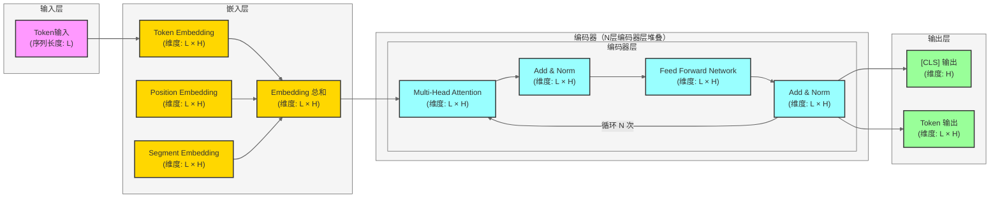

# BERT 模型架构图基础版

## 📝 基础版架构概览

### 核心组件

### 关键节点说明

1. **输入层**：接收token序列，长度为L
2. **嵌入层**：
   - Token Embedding：将token映射到高维空间
   - Position Embedding：编码位置信息
   - Segment Embedding：区分不同句子
   - 三者相加得到最终嵌入表示
3. **Transformer Encoder**：
   - 堆叠N层（BERT-base: 12层，BERT-large: 24层）
   - 每层包含Multi-Head Attention和Feed Forward Network
   - 每层都有Add & Norm操作
4. **输出层**：
   - [CLS]位置输出：用于分类任务
   - 所有token输出：用于序列标注等任务

### 关键参数
- **隐藏层维度 (H)**：BERT-base: 768，BERT-large: 1024
- **注意力头数**：BERT-base: 12，BERT-large: 16
- **序列长度 (L)**：最大512
- **层数 (N)**：BERT-base: 12，BERT-large: 24