**详细版 BERT 模型架构图**（NLP SOTA预训练模型，完整维度信息标注，严格贴合论文核心：**双向注意力、Masked Language Model、Next Sentence Prediction**），风格和你之前全套深度学习架构完全统一，可直接用于技术文档/代码实现。

# BERT 完整架构流程图（详细版）

```mermaid
flowchart LR
    %% 统一样式（和Transformer/TimesNet/YOLO/SimCLR风格一致）
    classDef inputStyle fill:#f9f,stroke:#333,stroke-width:2px,rounded:8px
    classDef embedStyle fill:#ffd700,stroke:#333,stroke-width:2px,rounded:8px
    classDef blockStyle fill:#9ff,stroke:#333,stroke-width:2px,rounded:8px
    classDef attnStyle fill:#9f9,stroke:#333,stroke-width:2px,rounded:8px
    classDef ffStyle fill:#ff9,stroke:#333,stroke-width:2px,rounded:8px
    classDef headStyle fill:#f2e6ff,stroke:#333,stroke-width:2px,rounded:8px
    classDef activeStyle fill:#aaffaa,stroke:#333,stroke-width:2px,rounded:8px
    classDef subgraphStyle fill:#f5f5f5,stroke:#666,stroke-width:1px,rounded:10px
    classDef coreNoteStyle fill:#fff8e6,stroke:#ffb74d,stroke-width:1px,rounded:8px

    %% 1. 输入层
    subgraph InputLayer["输入层"]
        A["Token输入<br/>Token Input [batch, seq_len]"]:::inputStyle
    end
    class InputLayer subgraphStyle

    %% 2. 嵌入层
    subgraph EmbedLayer["嵌入层"]
        B["Token Embedding<br/>词元嵌入 [batch, seq_len, H]"]:::embedStyle
        C["Position Embedding<br/>位置编码 [batch, seq_len, H]"]:::embedStyle
        D["Segment Embedding<br/>段落编码 [batch, seq_len, H]"]:::embedStyle
        E["Embedding Sum<br/>特征融合 [batch, seq_len, H]"]:::embedStyle
        F["Layer Norm<br/>层归一化 [batch, seq_len, H]"]:::blockStyle
    end
    class EmbedLayer subgraphStyle

    %% 3. Transformer Encoder 层
    subgraph EncoderStack["编码器堆叠（N层）"]
        %% 单个编码器层
        subgraph EncoderLayer["编码器层"]
            G1["多头自注意力<br/>Multi-Head Self-Attention [batch, seq_len, H]"]:::attnStyle
            H1["Add & Norm<br/>残差连接+层归一化 [batch, seq_len, H]"]:::blockStyle
            subgraph EncoderFF1["前馈网络（核心）"]
                I11["Linear 1<br/>升维 [batch, seq_len, 4×H]"]:::ffStyle
                I12["GELU<br/>激活函数 [batch, seq_len, 4×H]"]:::activeStyle
                I13["Linear 2<br/>降维 [batch, seq_len, H]"]:::ffStyle
            end
            J1["Add & Norm<br/>残差连接+层归一化 [batch, seq_len, H]"]:::blockStyle
        end
        class EncoderLayer subgraphStyle
    end
    class EncoderStack subgraphStyle

    %% 4. 输出层
    subgraph OutputLayer["输出层"]
        O["[CLS] 输出<br/>[CLS] Output [batch, H]"]:::headStyle
        P["Token 输出<br/>Token Output [batch, seq_len, H]"]:::headStyle
    end
    class OutputLayer subgraphStyle

    %% 核心注释（BERT创新点）
    Note["BERT 核心创新：<br/>1. 双向注意力捕获完整上下文<br/>2. Masked Language Model预训练<br/>3. Next Sentence Prediction任务<br/>4. 多头注意力学习多维度特征<br/>5. 层归一化+残差连接提升训练稳定性<br/><br/>维度说明：batch=批量大小, seq_len=序列长度, H=隐藏层维度, V=词表大小"]:::coreNoteStyle

    %% 数据流
    A --> B --> E
    A --> C --> E
    A --> D --> E
    E --> F --> G1 --> H1 --> I11 --> I12 --> I13 --> J1
    J1 -->|最终输出| O
    J1 -->|最终输出| P

    %% 连接线样式
    linkStyle 0,1,2,3,4,5,6,7,8,9,10,11,12,13,14 stroke:#4299e1,stroke-width:2px

    %% 可选：将注释节点定位到合适位置（提升可读性）
    Note -.-> EncoderStack
```



---

# BERT 详细数据流转逻辑

## 输入层
- **输入格式**：单个序列输入
  - Token输入：`[batch, seq_len]`
  - `batch`：批量大小
  - `seq_len`：序列长度（最大512）
- **输入示例**：包含[CLS]、[SEP]等特殊标记的分词序列

## 嵌入层
1. **Token Embedding（词元嵌入）**
   - 将词索引映射到高维嵌入空间
   - 输出形状：`[batch, seq_len, H]`
   - `H`：隐藏层维度（BERT-base: 768, BERT-large: 1024）
2. **Position Embedding（位置编码）**
   - 显式注入序列位置信息
   - 输出形状：`[batch, seq_len, H]`
   - 使用正弦余弦函数生成
3. **Segment Embedding（段落编码）**
   - 用于区分不同句子（如句对任务）
   - 输出形状：`[batch, seq_len, H]`
4. **特征融合（Embedding Sum）**
   - 三种嵌入按位相加
   - 输出形状：`[batch, seq_len, H]`
5. **Layer Norm（层归一化）**
   - 对融合后的嵌入进行层归一化
   - 输出形状：`[batch, seq_len, H]`

## 编码器（N层堆叠）
### 单个编码器层
1. **多头自注意力（Multi-Head Self-Attention）**
   - 捕获序列内部的依赖关系
   - 输出形状：`[batch, seq_len, H]`
   - 头数：BERT-base: 12头，BERT-large: 16头
2. **残差连接 + 层归一化**
   - 与输入相加后应用层归一化
   - 输出形状：`[batch, seq_len, H]`
3. **前馈网络（Feed Forward Network）**
   - Linear 1：升维 `[batch, seq_len, H]` → `[batch, seq_len, 4×H]`
   - GELU：激活函数，保持维度
   - Linear 2：降维 `[batch, seq_len, 4×H]` → `[batch, seq_len, H]`
4. **残差连接 + 层归一化**
   - 与输入相加后应用层归一化
   - 输出形状：`[batch, seq_len, H]`

## 输出层
1. **[CLS] 输出**
   - 对应输入序列中第一个标记[CLS]的输出
   - 输出形状：`[batch, H]`
   - 用于分类任务
2. **Token 输出**
   - 所有token的输出
   - 输出形状：`[batch, seq_len, H]`
   - 用于序列标注、命名实体识别等任务

## 完整数据流转路径（含维度）

### 1. 完整路径
```
Token输入 [batch, seq_len]
    ↓
Token Embedding [batch, seq_len, H] + Position Embedding [batch, seq_len, H] + Segment Embedding [batch, seq_len, H]
    ↓
特征融合 [batch, seq_len, H]
    ↓
Layer Norm [batch, seq_len, H]
    ↓
编码器层（N层堆叠，每层保持 [batch, seq_len, H]）
    ↓
最终编码器输出 [batch, seq_len, H]
    ↓
[CLS] 输出 [batch, H] + Token 输出 [batch, seq_len, H]
```

### 示例说明
假设使用 BERT-base 模型：

- 输入序列：`[32, 128]` （32个样本，每个样本128个token）
- Token Embedding输出：`[32, 128, 768]` （768维隐藏层）
- Position Embedding输出：`[32, 128, 768]`
- Segment Embedding输出：`[32, 128, 768]`
- 特征融合输出：`[32, 128, 768]`
- 编码器层输出：`[32, 128, 768]` （每层保持768维）
- [CLS] 输出：`[32, 768]` （用于分类任务）
- Token 输出：`[32, 128, 768]` （用于序列任务）

这样，模型就能完成从输入序列到特征表示的转换，其中H是模型内部的核心维度，用于后续的各种下游任务。

---

### 快速预览（一行式）
Token输入 [batch, seq_len] → 三种嵌入融合 [batch, seq_len, H] → Layer Norm → 编码器堆叠 [batch, seq_len, H] → [CLS] 输出 [batch, H] + Token 输出 [batch, seq_len, H]

## 关键技术点
- **双向注意力**：BERT采用双向Transformer，能够同时考虑左右上下文
- **Masked Language Model**：训练时随机掩盖部分token，预测被掩盖的token
- **Next Sentence Prediction**：训练模型判断两个句子是否为连续的
- **多头注意力**：并行学习多维度特征表示
- **层归一化**：在每个子层的输入处使用Layer Norm
- **残差连接**：每个子层都有残差连接，缓解梯度消失问题
- **GELU激活函数**：在FFN中使用GELU而非ReLU，提高模型性能

## 核心参数详解

| 参数 | BERT-base | BERT-large | 说明 |
|------|-----------|------------|------|
| 隐藏层维度 (H) | 768 | 1024 | 每个token的向量表示维度 |
| 注意力头数 (h) | 12 | 16 | 多头注意力的头数 |
| 层数 (N) | 12 | 24 | Transformer Encoder的堆叠层数 |
| 前馈网络隐藏层维度 | 3072 (4×768) | 4096 (4×1024) | FFN中间层维度 |
| 最大序列长度 (seq_len) | 512 | 512 | 输入序列的最大长度 |
| 词汇表大小 (V) | 30522 | 30522 | 模型使用的词汇表大小 |