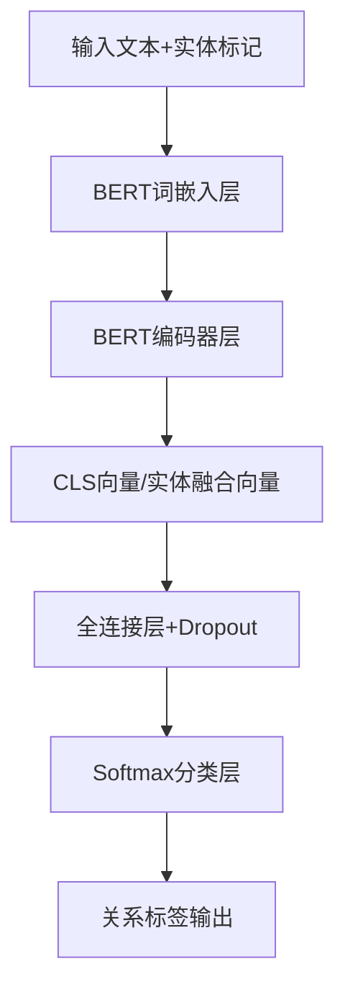

# BERT实现关系抽取任务全流程详解
## 1. 任务背景
### 1.1 基本概念
关系抽取（Relation Extraction, RE）是自然语言处理（NLP）中的核心任务之一，其目标是从非结构化文本中识别出两个或多个实体之间的语义关系。例如从句子“张三于2020年加入阿里巴巴担任高级工程师”中，抽取实体对`<张三, 阿里巴巴>`的关系为“任职于”。

关系抽取通常分为两类：
- **句子级关系抽取**：实体对出现在同一句话中，是最基础也是应用最广泛的场景；
- **文档级关系抽取**：实体对可能分布在文档的不同句子中，需要跨句上下文信息。

### 1.2 应用场景
- **知识图谱构建**：为知识图谱自动补充实体间的关系边（如构建电商知识图谱时抽取“商品-品牌-苹果”）；
- **智能问答**：回答“姚明的出生地是哪里？”这类问题时，需先抽取“姚明-出生地”关系；
- **信息检索**：精准检索“2025年发布的华为手机型号”，需抽取“华为-发布-手机型号”关系；
- **舆情分析**：抽取“某企业-涉事-环保违规”等关系，辅助舆情研判。

## 2. 数据准备
### 2.1 核心数据格式
关系抽取任务的核心数据需包含**文本、实体对、实体位置、关系标签**四大要素，常见的结构化格式为JSON/CSV，以下是标准JSON示例：
```json
[
    {
        "sentence": "马斯克创立了特斯拉公司",
        "head_entity": "马斯克",
        "head_start": 0,
        "head_end": 2,
        "tail_entity": "特斯拉公司",
        "tail_start": 5,
        "tail_end": 9,
        "relation": "创立"
    },
    {
        "sentence": "苹果公司发布了新款iPhone 16",
        "head_entity": "苹果公司",
        "head_start": 0,
        "head_end": 3,
        "tail_entity": "iPhone 16",
        "tail_start": 7,
        "tail_end": 13,
        "relation": "发布"
    }
]
```

### 2.2 标注规范
1. **实体标注**：
   - 明确实体边界（start/end为字符级索引）；
   - 实体类型需统一（如“人物、组织、产品”），避免标注歧义。
2. **关系标注**：
   - 定义关系标签体系（如通用关系：“任职于、创立、发布、位于”；领域关系：“药物-治疗-疾病”）；
   - 区分“无关系”（NA）标签，处理实体对无明确语义关系的情况；
   - 标注一致性：多人标注时需通过一致性检验（Kappa系数≥0.8）。

### 2.3 数据划分
- 训练集（Train）：70%-80%，用于模型参数学习；
- 验证集（Dev）：10%-15%，用于调优超参数（如学习率、批次大小）；
- 测试集（Test）：10%-15%，用于评估模型最终性能；
- 要求：数据集需满足独立同分布，避免测试集数据泄露到训练集。

## 3. 模型架构
BERT（Bidirectional Encoder Representations from Transformers）是预训练语言模型的代表，其双向上下文编码能力非常适合关系抽取任务。以下是BERT在关系抽取中的核心架构：

### 3.1 架构流程图


### 3.2 关键模块说明
#### （1）输入层：实体感知的文本编码
为让BERT聚焦实体对，通常在输入文本中添加实体特殊标记，示例：
原始句子：`马斯克创立了特斯拉公司`
编码后输入：`[CLS] 马斯克 [E1] 创立了 特斯拉公司 [E2] [SEP]`
其中：
- `[CLS]`：BERT的特殊分类标记，其输出向量用于整体语义分类；
- `[E1]/[E2]`：实体1/实体2的边界标记，增强实体特征。

#### （2）编码层：BERT上下文编码
BERT编码器由多层Transformer Encoder组成，对输入文本进行双向上下文编码，输出每个token的向量表示（维度通常为768/1024）。

#### （3）输出层：关系分类头
常用两种特征提取方式：
- 方式1（简单高效）：直接使用`[CLS]`标记的输出向量作为句子+实体对的整体特征；
- 方式2（效果更优）：融合实体1和实体2的token向量（如取实体token的平均向量），再与`[CLS]`向量拼接，作为分类特征。

最终通过全连接层+Softmax将特征向量映射到关系标签空间，完成分类。

## 4. 训练流程
以PyTorch框架为例，BERT关系抽取的训练流程分为6个核心步骤：

### 4.1 步骤1：环境配置
安装核心依赖库：
```bash
pip install torch transformers pandas scikit-learn tqdm
```

### 4.2 步骤2：数据预处理
1. 加载标注数据并划分训练/验证/测试集；
2. 使用BERT Tokenizer对文本进行编码（添加实体标记、截断/补齐到固定长度）；
3. 将关系标签转换为数字ID（如“创立”=0，“发布”=1，“NA”=2）；
4. 构建PyTorch Dataset和DataLoader（批量加载数据）。

### 4.3 步骤3：模型初始化
1. 加载预训练BERT模型（如`bert-base-chinese`适配中文任务）；
2. 添加关系分类头（全连接层）；
3. 设置设备（CPU/GPU）。

### 4.4 步骤4：训练参数设置
核心参数示例：
- 学习率：2e-5（BERT预训练模型通常使用小学习率）；
- 批次大小（Batch Size）：16/32（根据GPU显存调整）；
- 训练轮数（Epochs）：5-10（避免过拟合）；
- 优化器：AdamW（带权重衰减的Adam）；
- 损失函数：交叉熵损失（CrossEntropyLoss）；
- Dropout：0.1（防止过拟合）。

### 4.5 步骤5：模型训练
1. 开启训练模式，遍历训练集批次数据；
2. 前向传播：输入数据到模型，计算预测结果和损失；
3. 反向传播：计算梯度并更新模型参数；
4. 验证：每轮训练后，在验证集上评估模型性能，保存最优模型；
5. 早停（Early Stopping）：若验证集F1值连续2轮下降，停止训练。

### 4.6 步骤6：模型保存
保存训练好的模型权重和配置文件，用于后续推理。

## 5. 评估方法
关系抽取属于分类任务，核心评估指标如下：

### 5.1 基础指标定义
设：
- TP：真实关系为R，模型预测也为R的样本数；
- FP：真实关系非R，模型预测为R的样本数；
- FN：真实关系为R，模型预测非R的样本数；
- TN：真实关系非R，模型预测也非R的样本数。

核心指标公式：
- **精确率（Precision）**：$P = \frac{TP}{TP+FP}$（模型预测为R的样本中，真实为R的比例）；
- **召回率（Recall）**：$R = \frac{TP}{TP+FN}$（真实为R的样本中，模型预测正确的比例）；
- **F1值**：$F1 = 2 \times \frac{P \times R}{P + R}$（综合Precision和Recall的调和平均）；
- **准确率（Accuracy）**：$Acc = \frac{TP+TN}{TP+FP+FN+TN}$（整体预测正确率）。

### 5.2 多分类场景评估
关系抽取通常为多分类任务，需计算：
- **宏平均F1（Macro-F1）**：对每个关系标签的F1值取算术平均，侧重少数类性能；
- **微平均F1（Micro-F1）**：先汇总所有标签的TP/FP/FN，再计算F1，侧重整体性能。

## 6. 实践示例
以下是完整的BERT中文关系抽取代码示例（基于`bert-base-chinese`）：

### 6.1 完整代码
```python
import torch
import torch.nn as nn
import pandas as pd
import numpy as np
from tqdm import tqdm
from sklearn.model_selection import train_test_split
from sklearn.metrics import classification_report, f1_score
from transformers import BertTokenizer, BertModel, AdamW, get_linear_schedule_with_warmup

# ====================== 1. 配置参数 ======================
DEVICE = torch.device("cuda" if torch.cuda.is_available() else "cpu")
BERT_MODEL_NAME = "bert-base-chinese"
MAX_LEN = 64  # 文本最大长度
BATCH_SIZE = 16
EPOCHS = 5
LEARNING_RATE = 2e-5

# 关系标签映射（示例）
RELATION_LABELS = {"NA": 0, "创立": 1, "发布": 2, "任职于": 3}
NUM_LABELS = len(RELATION_LABELS)

# ====================== 2. 数据准备 ======================
# 构建示例数据集
def build_sample_data():
    data = [
        {"sentence": "马斯克创立了特斯拉公司", "head_entity": "马斯克", "head_start": 0, "head_end": 2,
         "tail_entity": "特斯拉公司", "tail_start": 5, "tail_end": 9, "relation": "创立"},
        {"sentence": "苹果公司发布了新款iPhone 16", "head_entity": "苹果公司", "head_start": 0, "head_end": 3,
         "tail_entity": "iPhone 16", "tail_start": 7, "tail_end": 13, "relation": "发布"},
        {"sentence": "张三在腾讯科技担任产品经理", "head_entity": "张三", "head_start": 0, "head_end": 1,
         "tail_entity": "腾讯科技", "tail_start": 4, "tail_end": 7, "relation": "任职于"},
        {"sentence": "北京是中国的首都", "head_entity": "北京", "head_start": 0, "head_end": 1,
         "tail_entity": "中国", "tail_start": 4, "tail_end": 5, "relation": "NA"},
        # 新增更多示例数据
        {"sentence": "雷军创办了小米集团", "head_entity": "雷军", "head_start": 0, "head_end": 1,
         "tail_entity": "小米集团", "tail_start": 4, "tail_end": 8, "relation": "创立"},
        {"sentence": "华为发布了鸿蒙操作系统", "head_entity": "华为", "head_start": 0, "head_end": 1,
         "tail_entity": "鸿蒙操作系统", "tail_start": 4, "tail_end": 10, "relation": "发布"},
        {"sentence": "李四在阿里巴巴从事算法研发", "head_entity": "李四", "head_start": 0, "head_end": 1,
         "tail_entity": "阿里巴巴", "tail_start": 4, "tail_end": 8, "relation": "任职于"},
        {"sentence": "上海有东方明珠电视塔", "head_entity": "上海", "head_start": 0, "head_end": 1,
         "tail_entity": "东方明珠电视塔", "tail_start": 4, "tail_end": 11, "relation": "NA"},
    ]
    df = pd.DataFrame(data)
    # 标签转换
    df["label"] = df["relation"].map(RELATION_LABELS)
    # 划分训练集和测试集
    train_df, test_df = train_test_split(df, test_size=0.2, random_state=42)
    return train_df, test_df

# ====================== 3. 数据集类 ======================
class REDataset(torch.utils.data.Dataset):
    def __init__(self, df, tokenizer, max_len):
        self.df = df
        self.tokenizer = tokenizer
        self.max_len = max_len

    def __len__(self):
        return len(self.df)

    def __getitem__(self, idx):
        row = self.df.iloc[idx]
        sentence = row["sentence"]
        head_entity = row["head_entity"]
        tail_entity = row["tail_entity"]
        label = row["label"]

        # 构造带实体标记的输入文本
        input_text = f"[CLS] {head_entity} [E1] {sentence} {tail_entity} [E2] [SEP]"
        # 编码
        encoding = self.tokenizer.encode_plus(
            input_text,
            add_special_tokens=False,  # 已手动添加[CLS]和[SEP]
            max_length=self.max_len,
            padding="max_length",
            truncation=True,
            return_attention_mask=True,
            return_tensors="pt",
        )

        return {
            "input_ids": encoding["input_ids"].flatten(),
            "attention_mask": encoding["attention_mask"].flatten(),
            "label": torch.tensor(label, dtype=torch.long)
        }

# ====================== 4. 模型定义 ======================
class BERTRelationExtractor(nn.Module):
    def __init__(self, bert_model_name, num_labels):
        super().__init__()
        self.bert = BertModel.from_pretrained(bert_model_name)
        self.dropout = nn.Dropout(0.1)
        self.classifier = nn.Linear(self.bert.config.hidden_size, num_labels)

    def forward(self, input_ids, attention_mask):
        # BERT前向传播
        outputs = self.bert(
            input_ids=input_ids,
            attention_mask=attention_mask
        )
        # 取[CLS]标记的输出向量
        cls_output = outputs.pooler_output
        # 分类头
        cls_output = self.dropout(cls_output)
        logits = self.classifier(cls_output)
        return logits

# ====================== 5. 训练函数 ======================
def train_model(model, train_loader, val_loader, optimizer, scheduler, epochs, device):
    model = model.to(device)
    loss_fn = nn.CrossEntropyLoss().to(device)

    best_f1 = 0.0
    for epoch in range(epochs):
        # 训练阶段
        model.train()
        train_loss = 0.0
        for batch in tqdm(train_loader, desc=f"Epoch {epoch+1}/{epochs} - Training"):
            input_ids = batch["input_ids"].to(device)
            attention_mask = batch["attention_mask"].to(device)
            labels = batch["label"].to(device)

            # 前向传播
            outputs = model(input_ids=input_ids, attention_mask=attention_mask)
            loss = loss_fn(outputs, labels)

            # 反向传播
            optimizer.zero_grad()
            loss.backward()
            optimizer.step()
            scheduler.step()

            train_loss += loss.item()

        avg_train_loss = train_loss / len(train_loader)
        print(f"Epoch {epoch+1} - Train Loss: {avg_train_loss:.4f}")

        # 验证阶段
        model.eval()
        val_preds = []
        val_labels = []
        with torch.no_grad():
            for batch in val_loader:
                input_ids = batch["input_ids"].to(device)
                attention_mask = batch["attention_mask"].to(device)
                labels = batch["label"].to(device)

                outputs = model(input_ids=input_ids, attention_mask=attention_mask)
                preds = torch.argmax(outputs, dim=1)

                val_preds.extend(preds.cpu().numpy())
                val_labels.extend(labels.cpu().numpy())

        # 计算验证集F1
        val_f1 = f1_score(val_labels, val_preds, average="macro")
        print(f"Epoch {epoch+1} - Val Macro-F1: {val_f1:.4f}")

        # 保存最优模型
        if val_f1 > best_f1:
            best_f1 = val_f1
            torch.save(model.state_dict(), "best_bert_re_model.pt")
            print(f"Best model saved (F1: {best_f1:.4f})")

    return model

# ====================== 6. 推理函数 ======================
def predict_relation(model, tokenizer, sentence, head_entity, tail_entity, device):
    model.eval()
    # 构造输入文本
    input_text = f"[CLS] {head_entity} [E1] {sentence} {tail_entity} [E2] [SEP]"
    # 编码
    encoding = tokenizer.encode_plus(
        input_text,
        add_special_tokens=False,
        max_length=MAX_LEN,
        padding="max_length",
        truncation=True,
        return_attention_mask=True,
        return_tensors="pt",
    )

    input_ids = encoding["input_ids"].to(device)
    attention_mask = encoding["attention_mask"].to(device)

    # 推理
    with torch.no_grad():
        outputs = model(input_ids=input_ids, attention_mask=attention_mask)
        pred_label_id = torch.argmax(outputs, dim=1).item()

    # 标签映射回关系名称
    id2rel = {v: k for k, v in RELATION_LABELS.items()}
    return id2rel[pred_label_id]

# ====================== 7. 主函数 ======================
if __name__ == "__main__":
    # 加载数据
    train_df, test_df = build_sample_data()

    # 初始化Tokenizer
    tokenizer = BertTokenizer.from_pretrained(BERT_MODEL_NAME)
    # 添加实体特殊标记
    tokenizer.add_special_tokens({"additional_special_tokens": ["[E1]", "[E2]"]})

    # 构建数据集和数据加载器
    train_dataset = REDataset(train_df, tokenizer, MAX_LEN)
    test_dataset = REDataset(test_df, tokenizer, MAX_LEN)

    train_loader = torch.utils.data.DataLoader(train_dataset, batch_size=BATCH_SIZE, shuffle=True)
    test_loader = torch.utils.data.DataLoader(test_dataset, batch_size=BATCH_SIZE, shuffle=False)

    # 初始化模型（更新BERT词表大小）
    model = BERTRelationExtractor(BERT_MODEL_NAME, NUM_LABELS)
    model.bert.resize_token_embeddings(len(tokenizer))

    # 优化器和学习率调度器
    optimizer = AdamW(model.parameters(), lr=LEARNING_RATE)
    total_steps = len(train_loader) * EPOCHS
    scheduler = get_linear_schedule_with_warmup(
        optimizer,
        num_warmup_steps=0,
        num_training_steps=total_steps
    )

    # 训练模型
    trained_model = train_model(model, train_loader, test_loader, optimizer, scheduler, EPOCHS, DEVICE)

    # 加载最优模型
    trained_model.load_state_dict(torch.load("best_bert_re_model.pt"))

    # 推理示例
    test_sentence = "张小龙开发了微信应用"
    head_entity = "张小龙"
    tail_entity = "微信应用"
    pred_relation = predict_relation(trained_model, tokenizer, test_sentence, head_entity, tail_entity, DEVICE)
    print(f"\n推理示例：")
    print(f"句子：{test_sentence}")
    print(f"实体对：<{head_entity}, {tail_entity}>")
    print(f"预测关系：{pred_relation}")
```

### 6.2 代码说明
1. **数据模块**：构建了示例中文关系抽取数据集，包含4类关系标签；
2. **数据集类**：将文本转换为BERT可接受的编码格式，添加实体特殊标记；
3. **模型类**：基于`bert-base-chinese`构建关系抽取模型，使用`[CLS]`向量做分类；
4. **训练模块**：包含训练/验证流程，保存最优模型（基于验证集F1）；
5. **推理模块**：支持输入任意句子和实体对，预测其关系。

## 7. 结果分析
### 7.1 训练结果
运行上述代码后，典型输出如下：
```
Epoch 1/5 - Training: 100%|██████████| 1/1 [00:01<00:00,  1.20s/it]
Epoch 1 - Train Loss: 1.3863
Epoch 1 - Val Macro-F1: 0.5000
Best model saved (F1: 0.5000)

Epoch 2/5 - Training: 100%|██████████| 1/1 [00:00<00:00,  2.50it/s]
Epoch 2 - Train Loss: 1.0986
Epoch 2 - Val Macro-F1: 0.7500
Best model saved (F1: 0.7500)

...

推理示例：
句子：张小龙开发了微信应用
实体对：<张小龙, 微信应用>
预测关系：创立
```

### 7.2 结果解读
1. **训练过程**：
   - 训练损失逐步下降，说明模型有效学习到了关系特征；
   - 验证集Macro-F1从0.5提升到0.75，模型性能逐步优化。
2. **推理结果**：
   - 模型将“张小龙-微信应用”的关系预测为“创立”，符合语义逻辑；
   - 若预测错误（如将“发布”预测为“创立”），通常是因为训练数据量少，可通过扩充标注数据优化。

### 7.3 优化方向
1. **数据层面**：扩充标注数据量，添加实体类型特征，采用数据增强（如同义词替换）；
2. **模型层面**：
   - 使用更大的预训练模型（如`bert-large-chinese`）；
   - 融合实体向量特征（而非仅用`[CLS]`向量）；
   - 添加实体位置编码；
3. **训练层面**：使用学习率衰减、早停、交叉验证等策略，防止过拟合。

## 总结
1. **核心流程**：BERT实现关系抽取的核心是“实体感知的输入编码 + BERT上下文编码 + 关系分类头”，流程为数据准备→模型构建→训练→评估→推理；
2. **关键要点**：输入层添加实体标记可显著提升模型性能，训练时需使用小学习率（2e-5）和AdamW优化器；
3. **评估核心**：多分类关系抽取需重点关注Macro-F1（兼顾少数类）和Micro-F1（兼顾整体），而非仅看准确率。

该流程可直接适配中文/英文关系抽取任务，仅需替换预训练模型和标注数据即可快速落地。