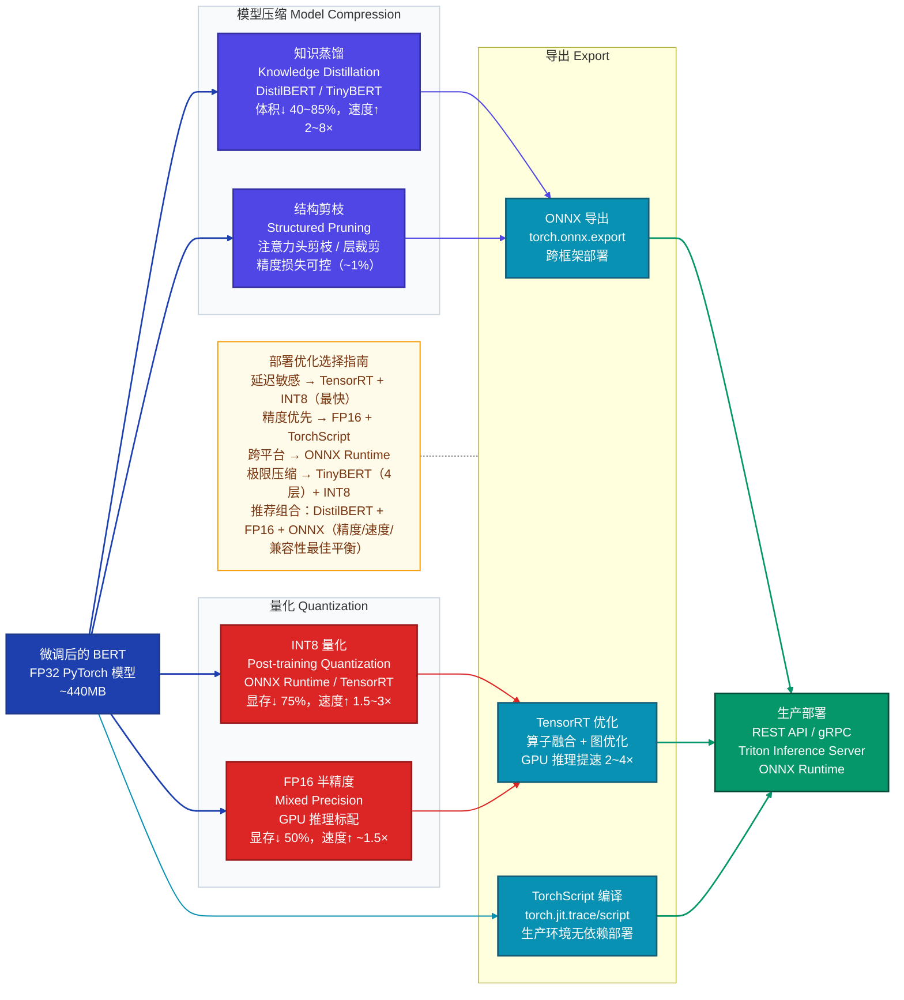

# BERT 技术分析文档

> **模型全称**：Bidirectional Encoder Representations from Transformers
> **发表时间**：2018 年 10 月（arXiv）| **正式发表**：NAACL 2019
> **作者**：Jacob Devlin, Ming-Wei Chang, Kenton Lee, Kristina Toutanova
> **机构**：Google AI Language

---

## 1. 模型定位

BERT 是 NLP 领域**预训练-微调（Pre-train → Fine-tune）范式**的奠基性工作：在海量无监督文本上以**掩码语言模型（MLM）** 和**下一句预测（NSP）** 两个自监督任务预训练深层双向 Transformer 编码器，学到通用语言语义表示，再以极少任务标注数据微调即可在文本分类、序列标注、问答抽取等几乎所有 NLP 下游任务上达到当时最优性能。

**核心创新**：相较于 GPT（单向因果注意力，只能看左侧上下文）和 ELMo（浅层双向拼接，分别训练左右模型再合并），BERT 通过 MLM 预训练任务实现了**单模型内的真正深度双向注意力**——每个词元在每一层均可同时关注其左右完整上下文，从而习得更丰富的语境感知表示。

---

## 2. 整体架构

### 2.1 三层 ASCII 架构树

```
BERT 模型
├── 输入层 Input Layer                              # 构建多维融合嵌入表示
│   ├── 词元嵌入 Token Embedding                    # 词汇语义：Token ID → D 维稠密向量
│   ├── 位置嵌入 Position Embedding                 # 位置感知：序列位置 0~511（全量可学习，非正弦）
│   ├── 段落嵌入 Segment Embedding                  # 段落区分：句 A 全 0，句 B 全 1
│   └── [+] 三路逐元素相加 → Dropout → LayerNorm    # 融合三路 → 稳定训练
│
├── Transformer 编码器栈 Encoder Stack              # 双向上下文建模核心（串行堆叠）
│   └── Transformer Block × L（Base=12, Large=24） # 单层编码单元，逐层串行
│       ├── 多头自注意力 Multi-Head Self-Attention   # 全序列全局依赖捕获（无因果掩码）
│       │   ├── Q / K / V 线性投影（×h 组并行）      # 可学习权重 W_Q / W_K / W_V
│       │   ├── 缩放点积注意力 Scaled Dot-Product    # 每头独立计算注意力分布
│       │   └── 多头拼接 + 输出投影 W_O             # Concat(head_1..head_h) @ W_O
│       ├── 残差连接 + 层归一化 Add & LayerNorm      # Post-LN 风格，保留原始特征
│       ├── 前馈网络 Feed-Forward Network            # 非线性变换：D → 4D → D（GELU 激活）
│       │   ├── Linear(D, 4D) + GELU               # 扩展维度，增强非线性表达能力
│       │   └── Linear(4D, D)                      # 压缩回原始维度
│       └── 残差连接 + 层归一化 Add & LayerNorm      # 同上
│
└── 输出层 Output Layer                             # 提取任务所需表示
    ├── [CLS] Token 表示 → 池化层 Pooler            # 句子级语义（Linear + Tanh）
    ├── 全序列 Token 表示                           # 词元级语义（每位置均输出）
    └── 任务专属头 Task-Specific Head（微调时添加）
        ├── 文本分类头：Linear([B,D]→[B,C])         # 接 [CLS] Pooler 输出
        ├── 序列标注头：Linear([B,L,D]→[B,L,C])     # 接全序列 Token 输出
        └── 问答跨度头：Linear([B,L,D]→[B,L,2])     # 预测答案起始/终止位置
```

**模块间连接方式说明**：

| 连接路径 | 连接方式 | 说明 |
|---|---|---|
| 输入层 → 编码器第 1 层 | 串行 | 嵌入表示作为 Block₀ 的输入 |
| Block_i → Block_{i+1} | 串行 | 前一层全序列输出喂入下一层 |
| MHSA 内 Q/K/V 三路 | 并行 | 同一输入同时生成三路投影 |
| 编码器末层 → 多任务头 | 跨模块特征复用 | [CLS] 表示和 Token 表示共享同一编码器输出 |

### 2.2 模型整体架构图

```mermaid
flowchart LR
    %% ── 配色主题 ──────────────────────────────────────────────────
    classDef inputStyle    fill:#1e40af,stroke:#1e3a8a,stroke-width:2px,color:#fff
    classDef embedStyle    fill:#4f46e5,stroke:#3730a3,stroke-width:2px,color:#fff
    classDef encoderStyle  fill:#0891b2,stroke:#155e75,stroke-width:2px,color:#fff
    classDef attnStyle     fill:#dc2626,stroke:#991b1b,stroke-width:2.5px,color:#fff
    classDef ffnStyle      fill:#d97706,stroke:#92400e,stroke-width:2px,color:#fff
    classDef headStyle     fill:#059669,stroke:#064e3b,stroke-width:2px,color:#fff
    classDef noteStyle     fill:#fffbeb,stroke:#f59e0b,stroke-width:1.5px,color:#78350f
    classDef layerStyle    fill:#f8fafc,stroke:#cbd5e0,stroke-width:1.5px

    INPUT["输入序列<br>[CLS]+句子A+[SEP]+句子B+[SEP]<br>Token IDs [B, L]"]:::inputStyle

    %% ── 功能模块一：嵌入层 ──────────────────────────────────────
    subgraph EMBED["嵌入层 Embedding（功能模块：构建多维融合输入表示）"]
        direction LR
        subgraph EMB_SUB["① 三路嵌入叠加（子模块：融合词义、位置、段落信息）"]
            direction LR
            TOK_EMB["词元嵌入<br>Token Embedding<br>[B, L, 768]"]:::embedStyle
            POS_EMB["位置嵌入<br>Position Embedding<br>[1, L, 768]"]:::embedStyle
            SEG_EMB["段落嵌入<br>Segment Embedding<br>[B, L, 768]"]:::embedStyle
            ADD["逐元素相加<br>Element-wise Add<br>[B, L, 768]"]:::encoderStyle
            LN0["层归一化<br>LayerNorm<br>[B, L, 768]"]:::encoderStyle
        end
    end
    class EMBED layerStyle

    %% ── 功能模块二：编码器 ──────────────────────────────────────
    subgraph ENCODER["Transformer 编码器 Encoder（功能模块：双向上下文建模）"]
        direction TB
        subgraph ENC_LAYER["② Transformer Block ×L（子模块：捕获全局依赖与特征变换）"]
            direction LR
            ATTN["多头自注意力<br>Multi-Head Self-Attention<br>[B, L, 768]"]:::attnStyle
            LN1["残差连接 + 层归一化<br>Add & LayerNorm<br>[B, L, 768]"]:::encoderStyle
            FFN["前馈网络<br>FFN: Linear→GELU→Linear<br>[B, L, 768→3072→768]"]:::ffnStyle
            LN2["残差连接 + 层归一化<br>Add & LayerNorm<br>[B, L, 768]"]:::encoderStyle
        end
    end
    class ENCODER layerStyle

    %% ── 功能模块三：输出与任务头 ────────────────────────────────
    subgraph OUTPUT["输出层 Output（功能模块：提取任务所需表示）"]
        direction TB
        subgraph OUT_SUB["③ 表示提取与任务适配（子模块：句子级/词元级语义）"]
            direction LR
            CLS_REP["[CLS] Token 表示<br>句子级语义<br>[B, 768]"]:::headStyle
            TOK_REP["全序列 Token 表示<br>词元级语义<br>[B, L, 768]"]:::headStyle
            POOLER["池化层<br>Pooler: Linear+Tanh<br>[B, 768]"]:::headStyle
            CLS_HEAD["分类头<br>Classification Head<br>[B, num_classes]"]:::headStyle
            NER_HEAD["序列标注头<br>Token Classification<br>[B, L, num_labels]"]:::headStyle
            QA_HEAD["问答跨度头<br>QA Span Head<br>[B, L, 2]"]:::headStyle
        end
    end
    class OUTPUT layerStyle

    %% ── 数据流 ──────────────────────────────────────────────────
    INPUT   --> TOK_EMB
    TOK_EMB --> ADD
    POS_EMB --> ADD
    SEG_EMB --> ADD
    ADD     --> LN0
    LN0     -->|"[B, L, 768]"| ATTN
    ATTN    --> LN1
    LN1     --> FFN
    FFN     --> LN2
    LN2     -.->|"×(L-1) 层循环"| ATTN
    LN2     --> CLS_REP
    LN2     --> TOK_REP
    CLS_REP --> POOLER
    POOLER  -->|"[B, 768]"| CLS_HEAD
    TOK_REP --> NER_HEAD
    TOK_REP --> QA_HEAD

    %% ── 设计注记 ────────────────────────────────────────────────
    NOTE["设计要点<br>① 双向注意力：无因果掩码，每词可关注完整上下文（区别于 GPT 单向）<br>② 三路嵌入相加：词义+位置+段落信息融合，维度始终保持 768<br>③ [CLS] 汇聚句子级语义；全序列 Token 表示用于词元级任务<br>④ BERT-Base：L=12，H=768，A=12，~110M 参数<br>⑤ BERT-Large：L=24，H=1024，A=16，~340M 参数"]:::noteStyle
    NOTE -.- ENCODER

    %% 边索引：0-15，共 16 条；NOTE -.- 为边 16
    linkStyle 0     stroke:#1e40af,stroke-width:2px
    linkStyle 1,2,3 stroke:#4f46e5,stroke-width:1.5px
    linkStyle 4,5   stroke:#4f46e5,stroke-width:2px
    linkStyle 6,7,8 stroke:#0891b2,stroke-width:2px
    linkStyle 9     stroke:#dc2626,stroke-width:1.5px,stroke-dasharray:4 3
    linkStyle 10,11 stroke:#0891b2,stroke-width:2px
    linkStyle 12,13 stroke:#059669,stroke-width:2px
    linkStyle 14,15 stroke:#059669,stroke-width:2px
```



---

## 3. 数据直觉

以一条情感分类任务样例为主线，完整追踪数据在 BERT 各阶段的形态变化。

> **输入句子**："The movie was absolutely fantastic, I loved every moment of it!"
> **任务**：情感分类（正面 / 负面）

---

### 阶段 0：原始输入

```
The movie was absolutely fantastic, I loved every moment of it!
```

一段普通的英文评论文本，长度 13 个词，标点 2 处。人类一眼即可判断为正面情绪，但模型只认数字——所有内容都需要被转换为数值张量。

---

### 阶段 1：WordPiece Tokenization（预处理后）

```
[CLS]  The  movie  was  absolutely  fantastic  ,  I  loved  every  moment  of  it  !  [SEP]
  0     1    2      3       4            5       6  7   8       9      10     11  12  13   14
```

**发生了什么**：
- 前后插入特殊词元 `[CLS]`（位置 0）和 `[SEP]`（位置 14），序列总长 **L = 15**
- WordPiece 对常见词直接保留（`movie`、`fantastic`），对低频词拆解为子词（如 `absolutely` → `absolute` + `##ly`）
- 每个词元映射为词表中的整数 ID（词表大小 30,522）

**Token ID 序列**（示意）：
```
[101, 1996, 3185, 2001, 7078, 10392, 1010, 1045, 3866, 2296, 3256, 1997, 2009, 999, 102]
```

---

### 阶段 2：三路嵌入叠加（Embedding 层）

每个 Token ID 经过三路嵌入矩阵查表后逐元素相加，生成 `[1, 15, 768]` 的浮点张量：

| 嵌入类型 | 直觉含义 | 示例（位置 0 的 [CLS] token） |
|---|---|---|
| **Token Embedding** | "这个词本身语义是什么？" | `[CLS]` 的初始嵌入向量，训练初期随机，训练后编码「我是分类标志位」的语义 |
| **Position Embedding** | "这个词在句子的哪里？" | 位置 0 对应的可学习向量，区分「第 1 个词」与「第 7 个词」 |
| **Segment Embedding** | "这个词属于句 A 还是句 B？" | 单句任务全为 A（0），向量全为同一套参数 |

叠加后经 LayerNorm，每个词元都变成一个 **768 维向量**，同时携带「是什么词」「在哪里」「属于哪句」三重信息。

---

### 阶段 3：Transformer Block 内部（关键中间表示）

**第 1 层（浅层）的注意力分布**：

```
              [CLS]  The  movie  was  absolutely  fantastic  ,  I  loved  every  moment  of  it  !  [SEP]
"fantastic" →  0.02  0.03  0.08  0.02    0.05       0.41    0.02 0.02  0.07    0.03    0.04  0.02 0.03 0.08  0.08
```

此时 `fantastic` 的注意力集中在**自身**和**相邻词** `absolutely`、`movie` 上——浅层注意力捕获的是**局部句法关系**（修饰与被修饰）。

**第 6 层（中间层）的注意力分布**：

```
              [CLS]  The  movie  was  absolutely  fantastic  ,  I  loved  every  moment  of  it  !  [SEP]
"[CLS]"   →  0.25   0.02  0.04  0.01    0.03       0.18    0.01 0.04  0.15    0.02    0.03  0.01 0.03 0.12  0.06
```

`[CLS]` 开始积极关注情感词 `fantastic`（0.18）和 `loved`（0.15）——中间层已在**聚合语义极性信息**。

**第 12 层（深层）的 [CLS] 向量**：

```
h_[CLS] ∈ ℝ^768
# 这个 768 维向量已不再是孤立的词义，而是"综合考虑了整个句子所有词的双向上下文后，
# 对整句语义的压缩表示"。通过下游任务微调，它的几何空间中
# 正面评价句子会聚集在一个方向，负面评价句子聚集在另一个方向。
```

---

### 阶段 4：Pooler 层输出

```
[CLS] 向量 [B, 768] → Linear(768, 768) + Tanh → Pooler 输出 [B, 768]
```

**这一步在做什么**：Pooler 层的 Linear+Tanh 是针对 NSP 预训练任务专门训练的投影，将 `[CLS]` 的原始隐状态变换到一个更适合句子级二分类的特征空间。值域被压缩到 (-1, 1)。

---

### 阶段 5：模型输出与后处理

**原始输出（预训练阶段末端 or 微调任务头）**：

```python
logits = Linear(768, 2)(pooler_output)  # [B, 2]
# logits = [[-1.23, 3.87]]   # 第 0 维=负面得分，第 1 维=正面得分
```

**后处理结果**：

```python
probs = softmax(logits) = [[0.027, 0.973]]   # 正面概率 97.3%
pred_label = argmax(probs) = 1               # → "Positive"
```

**最终答案**：正面情感，置信度 97.3%。

---

## 4. 核心数据流

### 4.1 前向传播 / 张量流图

```mermaid
flowchart LR
    %% ── 配色主题 ──────────────────────────────────────────────────
    classDef inputStyle    fill:#1e40af,stroke:#1e3a8a,stroke-width:2px,color:#fff
    classDef embedStyle    fill:#4f46e5,stroke:#3730a3,stroke-width:2px,color:#fff
    classDef procStyle     fill:#0891b2,stroke:#155e75,stroke-width:2px,color:#fff
    classDef attnStyle     fill:#dc2626,stroke:#991b1b,stroke-width:2.5px,color:#fff
    classDef headStyle     fill:#059669,stroke:#064e3b,stroke-width:2px,color:#fff
    classDef noteStyle     fill:#fffbeb,stroke:#f59e0b,stroke-width:1.5px,color:#78350f
    classDef layerStyle    fill:#f8fafc,stroke:#cbd5e0,stroke-width:1.5px

    INPUT["Token IDs<br>[B, L]"]:::inputStyle

    %% ── 嵌入层 ──────────────────────────────────────────────────
    subgraph EMB["嵌入层 Embedding Layer"]
        direction LR
        TOK["词元嵌入<br>Token Embedding<br>[B, L, D]"]:::embedStyle
        POS["位置嵌入<br>Position Embedding<br>[1, L, D]"]:::embedStyle
        SEG["段落嵌入<br>Segment Embedding<br>[B, L, D]"]:::embedStyle
        SUM["三路相加<br>Element-wise Add"]:::procStyle
        LN0["层归一化<br>LayerNorm<br>[B, L, D]"]:::procStyle
    end
    class EMB layerStyle

    %% ── Transformer Block ───────────────────────────────────────
    subgraph BLOCK["Transformer Block ×L（逐层堆叠，Base L=12，Large L=24）"]
        direction LR
        ATTN["多头自注意力<br>Multi-Head Self-Attention<br>[B, L, D] → [B, L, D]"]:::attnStyle
        LN1["残差连接 + 层归一化<br>Add & LayerNorm<br>[B, L, D]"]:::procStyle
        FFN["前馈网络<br>FFN: Linear→GELU→Linear<br>[B, L, D→4D→D]"]:::procStyle
        LN2["残差连接 + 层归一化<br>Add & LayerNorm<br>[B, L, D]"]:::procStyle
    end
    class BLOCK layerStyle

    %% ── 特征提取 ─────────────────────────────────────────────────
    subgraph POOL["特征提取 Feature Extraction"]
        direction LR
        CLS["取 [CLS] Token<br>[B, D]"]:::headStyle
        POOLER["池化层<br>Pooler: Linear+Tanh<br>[B, D]"]:::headStyle
    end
    class POOL layerStyle

    OUT["下游任务头<br>Downstream Task Head<br>[B, num_classes] / [B, L, C]"]:::headStyle

    %% ── 数据流 ──────────────────────────────────────────────────
    INPUT --> TOK
    TOK   --> SUM
    POS   --> SUM
    SEG   --> SUM
    SUM   --> LN0
    LN0   -->|"[B, L, D]  D=768(Base)/1024(Large)"| ATTN
    ATTN  --> LN1
    LN1   --> FFN
    FFN   --> LN2
    LN2   -.->|"×(L-1) 层循环"| ATTN
    LN2   --> CLS
    CLS   --> POOLER
    POOLER -->|"[B, D]"| OUT

    %% ── 设计注记 ─────────────────────────────────────────────────
    NOTE["张量流要点<br>① 三路嵌入维度均为 D=768，相加后维度不变<br>② FFN 内部先扩展 4×（D→4D=3072），再压缩回 D，增强非线性<br>③ 每层 Block 输入输出维度均为 [B, L, D]，形状不变<br>④ Base 参数：D=768，A=12头，d_k=64（768÷12）<br>⑤ [CLS] 在预训练时用于 NSP 二分类，微调时用于下游分类"]:::noteStyle
    NOTE -.- BLOCK

    %% 边索引：0-12，共 13 条；NOTE -.- 为边 13
    linkStyle 0     stroke:#1e40af,stroke-width:2px
    linkStyle 1,2,3 stroke:#4f46e5,stroke-width:1.5px
    linkStyle 4,5   stroke:#4f46e5,stroke-width:2px
    linkStyle 6,7,8 stroke:#0891b2,stroke-width:2px
    linkStyle 9     stroke:#dc2626,stroke-width:1.5px,stroke-dasharray:4 3
    linkStyle 10,11 stroke:#059669,stroke-width:2px
    linkStyle 12    stroke:#059669,stroke-width:2.5px
```



### 4.2 关键张量维度变化汇总

| 节点 | 张量形状 | 维度说明 |
|---|---|---|
| 输入 Token IDs | `[B, L]` | B=批次大小，L=序列长（≤512） |
| Token/Pos/Seg Embedding | `[B, L, 768]` | 查表后得到浮点向量 |
| 三路叠加后 | `[B, L, 768]` | 维度不变，信息叠加 |
| Q/K/V 投影（每头） | `[B, h, L, 64]` | h=12头，d_k=768÷12=64 |
| 注意力权重矩阵 | `[B, h, L, L]` | L×L 全序列注意力 |
| 注意力输出 | `[B, L, 768]` | 多头拼接后维度恢复 |
| FFN 中间层 | `[B, L, 3072]` | 4×扩展，3072=768×4 |
| FFN 输出 | `[B, L, 768]` | 压缩回原维度 |
| [CLS] 提取 | `[B, 768]` | 去掉序列维度 |
| Pooler 输出 | `[B, 768]` | Linear+Tanh 变换 |
| 分类 Logits | `[B, C]` | C=类别数 |

---

## 5. 关键组件

### 5.1 多头自注意力（Multi-Head Self-Attention）

**直觉**：想象你在理解「The animal didn't cross the street because **it** was too tired」中的 `it` 指代什么——你的大脑会同时扫描整个句子，找到与 `it` 最相关的词（`animal`）。MHSA 做的正是这件事：对序列中每一个词，学一个「与哪些词相关、相关多少」的分布，再按此分布加权聚合所有词的信息。「多头」意味着同时从 12 个不同的「相关性视角」（句法依存、指代、语义角色等）来做这件事。

#### 5.1.1 内部计算原理

**Step 1：线性投影生成 Q、K、V**

给定输入 $X \in \mathbb{R}^{B \times L \times D}$，通过三组可学习矩阵投影：

$$Q = X W_Q, \quad K = X W_K, \quad V = X W_V$$

其中 $W_Q, W_K, W_V \in \mathbb{R}^{D \times D}$。

**Step 2：多头拆分**

将 Q、K、V 按头数 $h$ 拆分：

$$Q \rightarrow [B, h, L, d_k], \quad d_k = D / h = 768 / 12 = 64$$

**Step 3：缩放点积注意力（每头独立计算）**

$$\text{Attention}(Q_i, K_i, V_i) = \text{Softmax}\!\left(\frac{Q_i K_i^T}{\sqrt{d_k}}\right) V_i$$

- $Q_i K_i^T \in \mathbb{R}^{B \times L \times L}$：计算所有词对之间的相似度得分
- 除以 $\sqrt{d_k} = 8$：防止点积值过大导致 Softmax 梯度消失（**缩放的意义**：当 $d_k$ 较大时，点积值方差约为 $d_k$，缩放后将其拉回单位方差区域）
- Softmax：将相似度分布归一化为概率，保证各权重之和为 1
- 乘以 $V_i$：按注意力权重加权聚合值向量

**Step 4：多头拼接 + 输出投影**

$$\text{MultiHead}(Q, K, V) = \text{Concat}(\text{head}_1, \ldots, \text{head}_h) W_O$$

其中 $W_O \in \mathbb{R}^{D \times D}$，输出形状恢复为 $[B, L, D]$。

**Step 5：残差连接 + LayerNorm（Post-LN 风格）**

$$\text{Output} = \text{LayerNorm}(X + \text{MultiHead}(X, X, X))$$

**时间复杂度**：$O(L^2 \cdot D)$，注意力矩阵 $[B, h, L, L]$ 是序列长度的瓶颈，当 $L=512$ 时不构成问题，但长文本（$L>2048$）需要改进（如 Longformer 稀疏注意力）。

### 5.2 MHSA 模块内部结构图

```mermaid
flowchart LR
    %% ── 配色主题 ──────────────────────────────────────────────────
    classDef inputStyle    fill:#1e40af,stroke:#1e3a8a,stroke-width:2px,color:#fff
    classDef projStyle     fill:#4f46e5,stroke:#3730a3,stroke-width:2px,color:#fff
    classDef splitStyle    fill:#0891b2,stroke:#155e75,stroke-width:2px,color:#fff
    classDef attnStyle     fill:#dc2626,stroke:#991b1b,stroke-width:2.5px,color:#fff
    classDef mergeStyle    fill:#d97706,stroke:#92400e,stroke-width:2px,color:#fff
    classDef outputStyle   fill:#059669,stroke:#064e3b,stroke-width:2px,color:#fff
    classDef noteStyle     fill:#fffbeb,stroke:#f59e0b,stroke-width:1.5px,color:#78350f
    classDef layerStyle    fill:#f8fafc,stroke:#cbd5e0,stroke-width:1.5px

    IN["输入 X<br>[B, L, D=768]"]:::inputStyle

    %% ── 三路线性投影 ─────────────────────────────────────────────
    subgraph PROJ["线性投影层（可学习参数 W_Q / W_K / W_V ∈ ℝ^{768×768}）"]
        direction LR
        WQ["W_Q 投影<br>[B, L, 768] → [B, L, 768]"]:::projStyle
        WK["W_K 投影<br>[B, L, 768] → [B, L, 768]"]:::projStyle
        WV["W_V 投影<br>[B, L, 768] → [B, L, 768]"]:::projStyle
    end
    class PROJ layerStyle

    %% ── 多头拆分 ─────────────────────────────────────────────────
    subgraph SPLIT["多头拆分 Reshape + Transpose"]
        direction LR
        SQ["Q: [B, 12, L, 64]"]:::splitStyle
        SK["K: [B, 12, L, 64]"]:::splitStyle
        SV["V: [B, 12, L, 64]"]:::splitStyle
    end
    class SPLIT layerStyle

    %% ── 缩放点积注意力 ───────────────────────────────────────────
    subgraph SDPA["缩放点积注意力 Scaled Dot-Product Attention（×12 头并行）"]
        direction LR
        MATMUL1["矩阵乘法 Q·K^T<br>Query-Key MatMul<br>[B, 12, L, L]"]:::attnStyle
        SCALE["缩放防数值溢出<br>Scale ÷ √d_k = ÷8"]:::attnStyle
        SOFTMAX["注意力权重归一化<br>Softmax（行归一化）<br>[B, 12, L, L]"]:::attnStyle
        MATMUL2["加权求和<br>Attn-Weight × V<br>[B, 12, L, 64]"]:::attnStyle
    end
    class SDPA layerStyle

    CONCAT["拼接多头 + 重塑<br>Concat 12 Heads → Reshape<br>[B, L, 768]"]:::mergeStyle
    WO["输出线性投影<br>W_O ∈ ℝ^{768×768}<br>[B, L, 768] → [B, L, 768]"]:::outputStyle
    OUT["输出（送入 Add&LayerNorm）<br>[B, L, 768]"]:::outputStyle

    %% ── 数据流 ──────────────────────────────────────────────────
    IN      --> WQ
    IN      --> WK
    IN      --> WV
    WQ      --> SQ
    WK      --> SK
    WV      --> SV
    SQ      --> MATMUL1
    SK      --> MATMUL1
    MATMUL1 --> SCALE
    SCALE   --> SOFTMAX
    SOFTMAX --> MATMUL2
    SV      --> MATMUL2
    MATMUL2 --> CONCAT
    CONCAT  --> WO
    WO      --> OUT

    %% ── 设计注记 ─────────────────────────────────────────────────
    NOTE["关键参数与复杂度（BERT-Base）<br>D=768, h=12, d_k=64（D=h×d_k）<br>时间复杂度：O(L²·D)（注意力矩阵是瓶颈）<br>空间：注意力矩阵 [B,12,L,L] 随 L² 增长<br>BERT 无因果掩码：全双向，区别于 GPT 的 Masked MHSA"]:::noteStyle
    NOTE -.- SDPA

    %% 边索引：0-14，共 15 条；NOTE -.- 为边 15
    linkStyle 0,1,2   stroke:#1e40af,stroke-width:2px
    linkStyle 3,4,5   stroke:#4f46e5,stroke-width:1.5px
    linkStyle 6,7     stroke:#0891b2,stroke-width:2px
    linkStyle 8,9,10  stroke:#dc2626,stroke-width:2px
    linkStyle 11      stroke:#0891b2,stroke-width:1.5px
    linkStyle 12,13   stroke:#d97706,stroke-width:2px
    linkStyle 14      stroke:#059669,stroke-width:2.5px
```



---

### 5.3 掩码语言模型（Masked Language Model，MLM）

**直觉**：MLM 本质上是一道「完形填空」题——随机遮住句子中某些词，要求模型根据上下文把被遮词猜出来。关键在于：被遮的词需要同时参考**左侧和右侧**的上下文才能答对，这就迫使模型学习双向表示。例如「`[MASK]` was too tired to cross the street」，只看左侧不够，还需看右侧的 `tired` 才能猜出「The animal」。

#### 5.3.1 MLM 选词与替换策略

从输入序列中随机选取 **15%** 的 Token 位置参与预测，对这些被选中的 Token 按如下 **80/10/10** 策略处理：

| 处理方式 | 比例 | 原因 |
|---|---|---|
| 替换为 `[MASK]` | 80% | 主要预训练信号，让模型恢复被遮词 |
| 替换为随机词 | 10% | 防止模型只对 `[MASK]` 位置有响应，迫使模型对**所有词**保持语境感知 |
| 保持原词不变 | 10% | 消除预训练与微调的分布差异（微调时无 `[MASK]` 词元） |

**为什么不全部替换为 [MASK]**：如果只用 `[MASK]`，模型在微调时从未见过这种特殊词元，会产生预训练-微调不匹配（pre-training/fine-tuning discrepancy）。80/10/10 策略使模型需要对所有位置保持「可能需要预测」的警觉状态。

#### 5.3.2 MLM 损失函数

仅对被选中（遮掩）的位置计算 Cross-Entropy 损失，未遮掩位置不参与：

$$\mathcal{L}_{\text{MLM}} = -\frac{1}{|\mathcal{M}|} \sum_{i \in \mathcal{M}} \log P(x_i \mid \tilde{x})$$

其中 $\mathcal{M}$ 是被遮位置的集合，$\tilde{x}$ 是被遮后的输入序列，$P(x_i \mid \tilde{x})$ 由末层 Token 表示经 Linear + Softmax 计算。

---

### 5.4 输入嵌入层（三路融合嵌入）

**直觉**：BERT 的输入不只是词向量，而是三个维度信息的叠加——「这个词是什么」+「它在哪个位置」+「它属于第几句话」，三路信息在维度空间中叠加，让模型从一开始就能感知结构。

#### 5.4.1 三路嵌入的设计决策

**位置嵌入（可学习 vs 正弦）**：

原始 Transformer 使用固定的正弦/余弦位置编码：

$$PE_{(pos, 2i)} = \sin\left(\frac{pos}{10000^{2i/D}}\right), \quad PE_{(pos, 2i+1)} = \cos\left(\frac{pos}{10000^{2i/D}}\right)$$

BERT 改为**全量可学习的位置嵌入**（512 个位置 × 768 维矩阵），理由：
1. 对 512 以内的序列，可学习嵌入通常比固定正弦编码性能更好
2. 模型可以学习任务所需的位置感知方式，而非被固定编码约束

**代价**：最大序列长度被限制为 512（超出的位置没有对应嵌入）。

**段落嵌入（Segment Embedding）**：

专为句对任务（NSP、问答、自然语言推断）设计，只有两种向量：$E_A$（全零初始化）和 $E_B$，分别标记两句话的归属。单句任务时全部使用 $E_A$。

---

## 6. 训练策略

### 6.1 预训练阶段

BERT 的预训练包含两个并行的自监督任务：

**任务一：掩码语言模型（MLM）**

如 5.3 节所述，对 15% 被遮位置预测原词，使用 Cross-Entropy 损失。

**任务二：下一句预测（Next Sentence Prediction，NSP）**

从语料中采样句对：50% 为真实相邻句对（标签 IsNext），50% 为随机拼接的句对（标签 NotNext）。取 `[CLS]` 表示经过 Pooler 层后接二分类头：

$$\mathcal{L}_{\text{NSP}} = -[y \log p + (1-y) \log (1-p)]$$

**总损失**：

$$\mathcal{L} = \mathcal{L}_{\text{MLM}} + \mathcal{L}_{\text{NSP}}$$

**数据规模**：
- BooksCorpus（约 8 亿词）+ 英文 Wikipedia（约 25 亿词）
- 总计约 33 亿词，约 160 GB 原始文本

### 6.2 优化器与学习率调度

| 配置项 | BERT-Base / Large |
|---|---|
| 优化器 | Adam（$\beta_1=0.9, \beta_2=0.999, \epsilon=10^{-6}$） |
| 学习率峰值 | $1 \times 10^{-4}$ |
| Warmup 步数 | 10,000 步（线性预热） |
| 衰减方式 | 线性衰减至 0 |
| 权重衰减 | L2 正则化，系数 0.01 |
| Dropout | 0.1（所有层） |
| 训练步数 | 1,000,000 步 |
| Batch Size | 256（序列） |
| 最大序列长 | 128 步（前 90%）+ 512 步（后 10%） |

**训练技巧——两阶段序列长度**：前 90% 步使用 128 长度训练（计算量小，快速收敛），最后 10% 步使用 512 长度（学习长距离依赖和位置嵌入）。这一策略将训练速度提升约 4×，而最终性能损失极小。

### 6.3 微调阶段

微调时只需在预训练模型末端添加任务头，全参数微调（不冻结底层）：

| 微调配置 | 典型值 |
|---|---|
| 学习率 | $2 \times 10^{-5}$ ~ $5 \times 10^{-5}$ |
| Epoch 数 | 2 ~ 4 |
| Batch Size | 16 / 32 |
| Warmup 比例 | 训练步数的 6% ~ 10% |

**为什么全参数微调**：BERT 的预训练表示是通用的，从第一层到最后一层都包含有用的语言知识，冻结底层会损失大量信息，而 NLP 任务通常标注数据少，全参数微调加 Warmup 已足够防止灾难性遗忘。

### 6.4 预训练训练流程图

```mermaid
flowchart LR
    %% ── 配色主题 ──────────────────────────────────────────────────
    classDef dataStyle     fill:#1e40af,stroke:#1e3a8a,stroke-width:2px,color:#fff
    classDef forwardStyle  fill:#0891b2,stroke:#155e75,stroke-width:2px,color:#fff
    classDef lossStyle     fill:#dc2626,stroke:#991b1b,stroke-width:2.5px,color:#fff
    classDef backwardStyle fill:#d97706,stroke:#92400e,stroke-width:2px,color:#fff
    classDef optStyle      fill:#7c3aed,stroke:#4c1d95,stroke-width:2px,color:#fff
    classDef evalStyle     fill:#059669,stroke:#064e3b,stroke-width:2px,color:#fff
    classDef ctrlStyle     fill:#374151,stroke:#111827,stroke-width:2px,color:#fff
    classDef noteStyle     fill:#fffbeb,stroke:#f59e0b,stroke-width:1.5px,color:#78350f
    classDef layerStyle    fill:#f8fafc,stroke:#cbd5e0,stroke-width:1.5px

    DATASET[("语料库<br>BooksCorpus + Wikipedia<br>~33B tokens")]:::dataStyle

    %% ── 数据准备 ─────────────────────────────────────────────────
    subgraph LOADER["数据准备 Data Preparation"]
        direction LR
        DL["数据加载器<br>DataLoader<br>采样 + 批次化"]:::dataStyle
        MLM_AUG["MLM 掩码构造<br>随机遮掩 15% Tokens<br>80/10/10 策略"]:::dataStyle
        NSP_AUG["NSP 句对采样<br>50% 真实相邻 / 50% 随机拼接<br>IsNext / NotNext 标签"]:::dataStyle
    end
    class LOADER layerStyle

    %% ── 前向传播 ─────────────────────────────────────────────────
    subgraph FORWARD["前向传播 Forward Pass"]
        direction LR
        FW["BERT 前向<br>Model Forward<br>[B, L, D]"]:::forwardStyle
        MLM_PRED["MLM 预测头<br>Token Logits<br>[B, L, V=30522]"]:::forwardStyle
        NSP_PRED["NSP 预测头<br>Sentence Logits<br>[B, 2]"]:::forwardStyle
    end
    class FORWARD layerStyle

    %% ── 损失计算 ─────────────────────────────────────────────────
    subgraph LOSSES["损失计算 Loss Computation"]
        direction LR
        MLM_LOSS["MLM 损失<br>Cross-Entropy（仅遮掩位置）<br>L_MLM"]:::lossStyle
        NSP_LOSS["NSP 损失<br>Binary Cross-Entropy<br>L_NSP"]:::lossStyle
        TOTAL_LOSS["总损失<br>L = L_MLM + L_NSP"]:::lossStyle
    end
    class LOSSES layerStyle

    %% ── 反向传播 ─────────────────────────────────────────────────
    subgraph BACKWARD["反向传播 Backward Pass"]
        direction LR
        BW["loss.backward()<br>计算梯度"]:::backwardStyle
        CLIP["梯度裁剪<br>Gradient Clip<br>max_norm=1.0"]:::backwardStyle
    end
    class BACKWARD layerStyle

    %% ── 参数更新 ─────────────────────────────────────────────────
    subgraph OPTIM["参数更新 Optimization"]
        direction LR
        OPT["optimizer.step()<br>Adam (β1=0.9, β2=0.999)"]:::optStyle
        LRS["scheduler.step()<br>线性预热 10k 步→线性衰减"]:::optStyle
        ZERO["optimizer.zero_grad()<br>清零梯度"]:::optStyle
    end
    class OPTIM layerStyle

    DONE["预训练完成<br>保存检查点<br>供微调使用"]:::ctrlStyle

    %% ── 数据流 ──────────────────────────────────────────────────
    DATASET    --> DL
    DL         --> MLM_AUG
    DL         --> NSP_AUG
    MLM_AUG    -->|"Masked Batch [B, L]"| FW
    NSP_AUG    --> FW
    FW         --> MLM_PRED
    FW         --> NSP_PRED
    MLM_PRED   --> MLM_LOSS
    NSP_PRED   --> NSP_LOSS
    MLM_LOSS   --> TOTAL_LOSS
    NSP_LOSS   --> TOTAL_LOSS
    TOTAL_LOSS --> BW
    BW         --> CLIP
    CLIP       --> OPT
    OPT        --> LRS
    LRS        --> ZERO
    ZERO       -.->|"下一个 Batch（共 1M 步）"| DL
    OPT        -->|"每 50k 步保存"| DONE

    %% ── 设计注记 ─────────────────────────────────────────────────
    NOTE["预训练策略要点<br>① 前 90% 步用序列长 128，后 10% 步用 512（节省计算）<br>② Adam 学习率 1e-4，线性预热 10k 步防止早期训练发散<br>③ 混合精度（FP16）训练可节省约 50% 显存<br>④ 训练硬件：BERT-Base 用 16 块 TPU v3，BERT-Large 用 64 块<br>⑤ BERT-Large 预训练约需 4 天（TPU）"]:::noteStyle
    NOTE -.- OPTIM

    %% 边索引：0-17，共 18 条；NOTE -.- 为边 18
    linkStyle 0,1,2   stroke:#1e40af,stroke-width:2px
    linkStyle 3,4     stroke:#1e40af,stroke-width:1.5px
    linkStyle 5,6     stroke:#0891b2,stroke-width:2px
    linkStyle 7,8     stroke:#dc2626,stroke-width:2px
    linkStyle 9,10    stroke:#dc2626,stroke-width:1.5px
    linkStyle 11,12   stroke:#d97706,stroke-width:2px
    linkStyle 13,14   stroke:#7c3aed,stroke-width:2px
    linkStyle 15      stroke:#7c3aed,stroke-width:1.5px
    linkStyle 16      stroke:#7c3aed,stroke-width:1.5px,stroke-dasharray:4 3
    linkStyle 17      stroke:#059669,stroke-width:2px
```



---

## 7. 评估指标与性能对比

### 7.1 主要评估指标

| 评估指标 | 任务类型 | 含义与选用原因 |
|---|---|---|
| **Accuracy** | 分类（GLUE） | 预测正确率，适用于类别均衡的基准测试 |
| **F1 Score** | NER、QA | 精确率与召回率的调和平均，对类别不平衡鲁棒 |
| **Exact Match (EM)** | SQuAD 问答 | 预测答案与标准答案完全匹配的比例，衡量精确抽取能力 |
| **Matthews Correlation（MCC）** | CoLA 语言接受性 | 考虑 TP/TN/FP/FN 的相关系数，比 Acc 更能反映不平衡分类质量 |
| **Spearman Correlation** | STS-B 语义相似度 | 衡量预测相似度分数与人工标注分数的秩相关性 |

### 7.2 核心 Benchmark 性能对比

**GLUE 测试集（平均分）**

| 模型 | GLUE Avg |
|---|---|
| OpenAI GPT（2018 年 SOTA 基线） | 72.8 |
| **BERT-Base** | 79.6 |
| **BERT-Large** | 82.1 |
| RoBERTa-Large（2019） | 88.5 |

**SQuAD 1.1（问答 F1）**

| 模型 | Dev F1 | Test F1 |
|---|---|---|
| 人类表现 | — | 91.2 |
| ELMo + BiDAF（2018 基线） | — | 85.6 |
| **BERT-Base** | 88.5 | — |
| **BERT-Large** | 91.0 | 93.2 |

**CoNLL-2003 命名实体识别（F1）**

| 模型 | Test F1 |
|---|---|
| ELMo fine-tuning | 92.2 |
| **BERT-Large** | **92.8** |

### 7.3 关键消融实验（论文 Table 5）

> 基于 BERT-Base 规模，在 SQuAD 和 MNLI 上验证各组件的贡献

| 模型配置 | MNLI-m | SQuAD v1.1 F1 | 分析 |
|---|---|---|---|
| BERT-Base（完整） | 84.4 | 88.5 | 基准 |
| 去掉 NSP（仅 MLM） | 83.9 | 88.4 | NSP 贡献约 0.5~1% |
| LTR + 去掉 MLM（类 GPT 单向） | 82.1 | 85.8 | 双向带来约 2.3% MNLI 提升 |
| LTR + 无 NSP + 仅左侧上下文 | 77.9 | 77.8 | 单向无预训练任务劣化最大 |

**核心结论**：双向性（MLM）是 BERT 最重要的贡献，NSP 有少量但稳定的帮助（后续 RoBERTa 等工作发现 NSP 设计有缺陷，去掉反而更好）。

### 7.4 效率指标

| 模型 | 参数量 | 推理延迟（A100，batch=1） | 显存占用（推理） |
|---|---|---|---|
| BERT-Base | ~110M | ~4ms/seq（seq=128） | ~440MB |
| BERT-Large | ~340M | ~12ms/seq（seq=128） | ~1.35GB |
| DistilBERT | ~66M（BERT-Base 的 60%） | ~2ms/seq | ~260MB |
| TinyBERT | ~14.5M | <1ms/seq | ~60MB |

---

## 8. 推理与部署

### 8.1 推理阶段与训练阶段的差异

| 差异点 | 训练阶段 | 推理阶段 |
|---|---|---|
| **Dropout** | 开启（0.1） | 关闭（`model.eval()`） |
| **[MASK] 词元** | 大量出现（MLM 任务） | 不出现（无遮掩操作） |
| **NSP 任务头** | 参与训练 | 微调任务中替换为下游任务头 |
| **梯度计算** | 开启 | 关闭（`torch.no_grad()`） |
| **Batch Normalization** | 无（BERT 用 LayerNorm，不受影响） | 无 |
| **随机种子** | 无所谓 | 固定（保证可重复推理） |

### 8.2 输出后处理流程

**文本分类**：Softmax → argmax → 标签映射

```
Logits [B, C] → Softmax → Probs [B, C] → argmax → 类别索引 → 标签字典
```

**命名实体识别（Token-level）**：逐 Token 分类 + BIO 解码

```
Token Logits [B, L, C] → argmax per token → BIO 标签序列 → 实体片段抽取
例：["O", "B-PER", "I-PER", "O", "B-ORG"] → {人名: "Jacob Devlin", 机构: "Google"}
```

**抽取式问答（SQuAD）**：预测起止位置 + 答案抽取

```
Span Logits [B, L, 2] → start_logits [B, L], end_logits [B, L]
→ 找 score = start_score[i] + end_score[j]（j≥i）最大的 (i,j)
→ tokens[i:j+1] → detokenize → 答案文本
```

### 8.3 部署优化手段



---

## 9. 数据处理流水线

### 9.1 NLP 数据处理流水线图（预训练）

```mermaid
flowchart LR
    %% ── 配色主题 ──────────────────────────────────────────────────
    classDef rawStyle      fill:#374151,stroke:#111827,stroke-width:2px,color:#fff
    classDef prepStyle     fill:#4f46e5,stroke:#3730a3,stroke-width:2px,color:#fff
    classDef augStyle      fill:#d97706,stroke:#92400e,stroke-width:2px,color:#fff
    classDef batchStyle    fill:#0891b2,stroke:#155e75,stroke-width:2px,color:#fff
    classDef outputStyle   fill:#059669,stroke:#064e3b,stroke-width:2px,color:#fff
    classDef storeStyle    fill:#ea580c,stroke:#7c2d12,stroke-width:2px,color:#fff
    classDef noteStyle     fill:#fffbeb,stroke:#f59e0b,stroke-width:1.5px,color:#78350f
    classDef layerStyle    fill:#f8fafc,stroke:#cbd5e0,stroke-width:1.5px

    %% ── 原始数据 ─────────────────────────────────────────────────
    subgraph RAW["原始数据 Raw Data"]
        direction LR
        CORPUS[("文本语料库<br>BooksCorpus / Wikipedia<br>UTF-8 纯文本")]:::rawStyle
        SENT_DB[("句子数据库<br>按文档切分的句子列表")]:::rawStyle
    end
    class RAW layerStyle

    %% ── 离线预处理 ───────────────────────────────────────────────
    subgraph PREPROCESS["离线预处理（一次性执行）"]
        direction LR
        SENT_SPLIT["句子切分<br>Sentence Splitter<br>NLTK / SpaCy"]:::prepStyle
        WORDPIECE["WordPiece 分词<br>WordPiece Tokenizer<br>词表大小 30,522"]:::prepStyle
        NSP_SAMPLE["NSP 句对采样<br>50% IsNext + 50% NotNext<br>最大长度 512"]:::prepStyle
        CACHE[("TFRecord / HDF5 缓存<br>序列化存储<br>加速后续训练读取")]:::storeStyle
    end
    class PREPROCESS layerStyle

    %% ── 在线增强（每个训练步） ────────────────────────────────────
    subgraph AUGMENT["在线数据增强（每步执行，训练时）"]
        direction LR
        ADD_SPECIAL["添加特殊词元<br>插入 [CLS] 和 [SEP]<br>[CLS]+sentA+[SEP]+sentB+[SEP]"]:::augStyle
        MLM_MASK["MLM 掩码采样<br>随机选 15% Tokens<br>80% [MASK] / 10% 随机 / 10% 原词"]:::augStyle
        SEG_LABEL["构造段落标签<br>Segment IDs<br>句 A=0，句 B=1"]:::augStyle
        ATTN_MASK["构造注意力掩码<br>Attention Mask<br>真实词=1，填充位=0"]:::augStyle
    end
    class AUGMENT layerStyle

    %% ── 批次化 ───────────────────────────────────────────────────
    subgraph BATCH["批次化 Batching"]
        direction LR
        PAD["动态填充<br>Padding to Max Len<br>同 Batch 内对齐"]:::batchStyle
        COLLATE["Collate Function<br>拼装 5 路输入张量"]:::batchStyle
        PIN["Pin Memory<br>加速 CPU→GPU 传输"]:::batchStyle
    end
    class BATCH layerStyle

    MODEL["模型输入（5 路张量）<br>input_ids [B,L]<br>attention_mask [B,L]<br>token_type_ids [B,L]<br>masked_lm_labels [B,L]<br>next_sentence_label [B]"]:::outputStyle

    %% ── 数据流 ──────────────────────────────────────────────────
    CORPUS    --> SENT_SPLIT
    SENT_SPLIT --> SENT_DB
    SENT_DB   --> WORDPIECE
    WORDPIECE --> NSP_SAMPLE
    NSP_SAMPLE --> CACHE
    CACHE     --> ADD_SPECIAL
    ADD_SPECIAL --> MLM_MASK
    MLM_MASK  --> SEG_LABEL
    SEG_LABEL --> ATTN_MASK
    ATTN_MASK --> PAD
    PAD       --> COLLATE
    COLLATE   --> PIN
    PIN       -->|"GPU 异步传输"| MODEL

    NOTE["工程优化要点<br>① 离线预处理后缓存 TFRecord，避免每 Epoch 重复 Tokenize<br>② 动态 Padding（同 Batch 内对齐最长序列）节省无效计算<br>③ 训练时 MLM 遮掩在线随机生成（保证多样性）<br>④ num_workers=4~8 多进程加载，pin_memory=True 加速传输<br>⑤ 微调时：去掉 MLM_MASK 和 NSP_SAMPLE，仅保留 Tokenize+Padding"]:::noteStyle
    NOTE -.- AUGMENT

    %% 边索引：0-12，共 13 条；NOTE -.- 为边 13
    linkStyle 0,1     stroke:#374151,stroke-width:2px
    linkStyle 2,3,4   stroke:#4f46e5,stroke-width:2px
    linkStyle 5,6,7,8 stroke:#d97706,stroke-width:2px
    linkStyle 9       stroke:#d97706,stroke-width:1.5px
    linkStyle 10,11   stroke:#0891b2,stroke-width:2px
    linkStyle 12      stroke:#059669,stroke-width:2.5px
```



---

## 10. FAQ（常见问题解答）

### 基本原理类

**Q1：BERT 的双向性是如何实现的？为什么 GPT 不是双向的？**

GPT 采用**因果语言模型**（Causal LM）：预测第 $t$ 个词时只能看到位置 $1, \ldots, t-1$ 的词（通过注意力掩码屏蔽未来词），这是自回归生成的必要条件，但代价是编码时每个词无法看到自己右侧的上下文。

BERT 采用**掩码语言模型（MLM）**：对随机遮掩的词进行预测，预测时可以参考整个序列（被遮掩的词除外）。注意力层**不加因果掩码**，因此每个词在计算注意力时自由地与左右所有词交互。这种双向性是通过**改变预训练任务**实现的，而非改变注意力结构本身——自注意力天然支持全注意力，只要不加掩码即可。

**代价**：BERT 无法直接用于自回归文本生成（预测下一个词时不能看到未来词），这是 BERT 与 GPT 的根本应用场景分野。

---

**Q2：掩码语言模型（MLM）与传统语言模型有何本质不同？**

| 维度 | 传统语言模型（LM） | 掩码语言模型（MLM） |
|---|---|---|
| 训练目标 | $P(x_t \mid x_{<t})$：预测下一个词 | $P(x_i \mid x_{\setminus \mathcal{M}})$：根据上下文恢复被遮词 |
| 注意力方向 | 单向（只看左侧） | 双向（看完整上下文） |
| 训练效率 | 每个词都参与预测 | 仅 15% 被遮词参与预测（收敛慢约 1-2×） |
| 应用适配 | 直接生成 | 需要微调任务头 |

MLM 的训练效率问题（每步只有 15% 的词产生学习信号）被 ELECTRA 改进——ELECTRA 用一个小生成器替换词，然后训练判别器判断每个词是否被替换（100% 词都参与学习），效率显著提升。

---

**Q3：下一句预测（NSP）任务的设计原理与局限性是什么？**

**设计原理**：NSP 任务旨在让 BERT 学习句对关系，为自然语言推断（NLI）、问答（QA）等需要理解两句话关系的任务奠基。构造方式简单：50% 从同一文档相邻段落采样（IsNext），50% 从不同文档随机采样（NotNext）。

**局限性**：后续研究（RoBERTa，2019）发现 NSP 任务过于简单：随机采样的「NotNext」句对来自不同主题，仅通过话题一致性就能判断，模型无需真正理解句间逻辑关系。消融实验表明，去掉 NSP 反而让 RoBERTa 在多个任务上性能更好。

**替代方案**：
- RoBERTa：完全去掉 NSP，改用更长序列 MLM
- ALBERT：用句子顺序预测（SOP，预测两句顺序是否被交换）替代 NSP
- SpanBERT：去掉 NSP，改用 Span 级别遮掩，专注文本理解

---

**Q4：BERT 的位置嵌入为什么选择可学习方式而非正弦编码？**

原始 Transformer 的正弦编码是**固定的确定性函数**，可以外推到任意长度（理论上），且相对位置信息编码在内积中可以被分解出来。

BERT 选择**可学习位置嵌入**的原因：
1. 对于固定最大长度（512），可学习嵌入通常比正弦编码性能略好——模型可以学到对任务最有用的位置感知模式
2. 实现简单（就是一个 $512 \times 768$ 的嵌入矩阵）
3. 在 BERT 的实验规模（最大 512 位置）内，外推能力不是优先考量

**代价**：超过 512 的序列无法直接处理（无对应位置嵌入），这成为 BERT 处理长文本的主要瓶颈。后续工作（Longformer、BigBird）通过稀疏注意力 + 相对位置编码解决此问题。

---

### 设计决策类

**Q5：MLM 为什么选择 15% 的遮掩比例？80/10/10 策略的必要性是什么？**

**15% 比例的权衡**：
- 比例过低（如 5%）：每步学习信号稀少，收敛极慢
- 比例过高（如 40%）：序列上下文残缺严重，被遮词难以根据剩余信息准确预测，梯度信号噪声大
- 15% 是经验上下文完整性与学习效率的平衡点（BERT 论文消融未系统验证，后续 SpanBERT 等工作调整至更高遮掩率）

**80/10/10 策略的必要性**：

若全部替换为 `[MASK]`，会产生**预训练-微调不匹配**（discrepancy）：预训练时 `[MASK]` 词元大量出现，而微调时从未出现，导致模型对真实词元的表示学习不足。80/10/10 策略的设计意图：
- 10% 替换为随机词：迫使模型对**每个位置**都保持「此处可能是错误词」的警觉，而非只关注 `[MASK]` 位置
- 10% 保持原词：使模型在所有位置都能学到合理的上下文表示，即使该词未被遮掩

---

**Q6：[CLS] Token 为什么放在句首？Pooler 层的设计逻辑是什么？**

**[CLS] 放句首的原因**：
- `[CLS]` 是一个**无语义内容的「聚合标志位」**，由于双向注意力，它在整个编码过程中可以自由地与序列中每个词交互，最终的隐状态天然成为全序列语义的压缩表示
- 放在句首（位置 0）而非句尾，是为了使所有序列位置的位置嵌入一致（如果放句尾，`[CLS]` 在不同序列中的位置会随序列长度变化，位置嵌入混乱）

**Pooler 层的设计逻辑**：

BERT 在 `[CLS]` 输出后加了一层 `Linear(768, 768) + Tanh`，称为 Pooler。这层是**专为 NSP 预训练任务**训练的，它将 `[CLS]` 的原始表示变换到 NSP 二分类所需的特征空间。

注意：后续研究（Sentence-BERT 等）发现，直接使用 `[CLS]` 原始向量（不经 Pooler）有时对下游任务更好，因为 Pooler 层的参数优化目标是 NSP 任务，可能在其他任务上引入偏差。

---

**Q7：BERT 为什么用 WordPiece 而非 BPE（字节对编码）或字符级分词？**

| 分词方法 | 词表构建 | 优势 | 劣势 |
|---|---|---|---|
| 词级（Word-level） | 固定词表 | 直觉自然 | OOV 问题严重 |
| 字符级（Char-level） | 26 字符 | 无 OOV | 序列过长，语义粒度粗 |
| **WordPiece**（BERT） | 从字符出发，按最大似然合并 | 平衡词表大小与 OOV 覆盖 | 分词不直觉（`##` 前缀） |
| BPE（GPT/RoBERTa） | 按频率合并字节对 | 压缩效率高 | 对形态学语言不如 WordPiece |

WordPiece 与 BPE 的核心区别：BPE 按**合并频率**选择合并对；WordPiece 按**合并后对训练数据似然的提升**选择合并对，倾向于保留高频完整词、拆分低频词。

对于 BERT 的英文应用，WordPiece 30,522 的词表在未知词覆盖和序列长度之间取得了较好平衡。

---

**Q8：BERT 为什么用 GELU 激活函数而非 ReLU？**

ReLU 的问题：在 $x < 0$ 区间输出恒为 0，神经元可能「死亡」（梯度为 0），且在 $x = 0$ 处不可微。

**GELU（Gaussian Error Linear Unit）** 的公式：

$$\text{GELU}(x) = x \cdot \Phi(x) = x \cdot \frac{1}{2}\left[1 + \text{erf}\!\left(\frac{x}{\sqrt{2}}\right)\right]$$

其中 $\Phi(x)$ 是标准正态分布的累积分布函数。实践中常用近似：

$$\text{GELU}(x) \approx 0.5x\left(1 + \tanh\!\left[\sqrt{\frac{2}{\pi}}\left(x + 0.044715x^3\right)\right]\right)$$

**为什么 GELU 更适合 BERT**：
1. GELU 在整个实数域上**光滑可微**，梯度传播更稳定
2. 负值区域有**非零输出**（但被压制），保留了一定负值信息
3. GELU 对应一种「根据输入数值大小决定是否通过」的随机正则化解释，与 Dropout + ReLU 有理论联系
4. 在 NLP 预训练任务中，实验表明 GELU 一致优于 ReLU 约 0.1~0.5%

---

### 实现细节类

**Q9：BERT 的微调如何适配不同类型的下游任务？**

BERT 以「冻结主干 + 任务头」或「全量微调」两种方式适配：

**① 文本分类（如情感分析、自然语言推断）**

```
输入：[CLS] 句子 [SEP]（单句）或 [CLS] 句A [SEP] 句B [SEP]（句对）
提取：[CLS] Pooler 输出 → [B, 768]
任务头：Linear(768, C) → Softmax
损失：Cross-Entropy
```

**② 序列标注（如命名实体识别、词性标注）**

```
输入：[CLS] w1 w2 ... wL [SEP]
提取：全序列 Token 表示 → [B, L, 768]
任务头：Linear(768, C) for each token → [B, L, C]
损失：Token-level Cross-Entropy（忽略 [CLS] 和 [SEP]）
```

**③ 抽取式问答（如 SQuAD）**

```
输入：[CLS] 问题 [SEP] 文章段落 [SEP]
提取：全序列 Token 表示 → [B, L, 768]
任务头：Linear(768, 2) → start_logits [B, L] 和 end_logits [B, L]
推理：找 score[i][j] = start[i] + end[j]（j≥i）最大的答案跨度 (i,j)
```

**④ 多项选择（如 SWAG）**

```
输入：对每个候选答案构造 [CLS] 问题 [SEP] 答案k [SEP]
提取：各候选的 [CLS] Pooler 输出 → 拼接为 [B, K, 768]
任务头：Linear(768, 1) → [B, K] → Softmax 选最可能的答案
```

---

**Q10：BERT 预训练为什么要先用序列长 128、后用 512？**

这是一个**计算效率与性能质量的平衡策略**，基于以下分析：

**计算量与序列长度的关系**：

自注意力计算量为 $O(L^2 \cdot D)$，FFN 计算量为 $O(L \cdot D^2)$，总计算量大致与 $L$ 成正比（当 $D \gg L$ 时 FFN 主导）。从 $L=128$ 到 $L=512$，计算量增加约 4 倍。

**两阶段策略**：
- **前 90% 步（约 900K 步），$L=128$**：大量低成本训练步快速建立语言的词法、句法、语义表示。大多数 NLP 语义可以在短序列中学到
- **后 10% 步（约 100K 步），$L=512$**：补充学习长距离依赖和位置嵌入后半段（位置 129~511）的有效表示

**效果**：整体节省约 75% 计算量，长文本性能下降约 0.1~0.5%（可接受）。

---

### 性能优化类

**Q11：如何对 BERT 进行压缩以实现高效部署？**

**方案一：知识蒸馏（Knowledge Distillation）**

代表工作：DistilBERT（6 层，66M 参数，保留 97% 性能，速度 60% 提升）、TinyBERT（4 层，14.5M 参数，速度 9.4×）。

蒸馏训练目标同时最小化：
$$\mathcal{L}_{\text{distill}} = \alpha \mathcal{L}_{\text{hard}} + (1-\alpha) \mathcal{L}_{\text{soft}}$$

其中 $\mathcal{L}_{\text{soft}}$ 是对 teacher 的软标签（带温度的 Softmax 输出）做 KL 散度，$\mathcal{L}_{\text{hard}}$ 是对真实标签的 Cross-Entropy。

TinyBERT 进一步蒸馏中间层注意力矩阵和隐层表示，获得更好压缩比。

**方案二：INT8 量化（Post-Training Quantization）**

使用 ONNX Runtime 或 HuggingFace Optimum：

```python
from optimum.onnxruntime import ORTQuantizer, AutoQuantizationConfig
quantizer = ORTQuantizer.from_pretrained(model)
dqconfig = AutoQuantizationConfig.arm64(is_static=False, per_channel=False)
quantizer.quantize(save_dir="./bert-int8", quantization_config=dqconfig)
```

INT8 量化将权重从 FP32（4 字节）压缩到 INT8（1 字节），显存减少 75%，推理速度在 CPU 上提升 2~4×，在支持 INT8 Tensor Core 的 GPU 上提升 1.5~2×，精度损失通常 <1%。

**方案三：注意力头剪枝**

Michel et al. (2019) 发现 BERT 大量注意力头是冗余的，去掉 40% 的头后精度几乎无损。结构剪枝后可直接减少计算量，无需量化感知训练。

---

**Q12：BERT 的计算复杂度瓶颈在哪里？长文本如何处理？**

**瓶颈定量分析**（BERT-Base，$L$ 为序列长，$D=768$，$h=12$）：

| 操作 | 计算量 | 显存 |
|---|---|---|
| 自注意力（Q·K^T） | $O(L^2 \cdot D)$ | $O(L^2 \cdot h)$（注意力矩阵） |
| FFN | $O(L \cdot D^2)$ | $O(L \cdot D)$ |

当 $L=512$，$L^2=262144$，$D^2=589824$，FFN 计算量更大；但注意力矩阵 $[B, 12, 512, 512]$ 的**显存**随 $L^2$ 增长，成为显存瓶颈（而非计算量瓶颈）。

**处理超过 512 长度文本的常见策略**：

| 策略 | 原理 | 适用场景 |
|---|---|---|
| 截断（Truncation） | 只取前 512 Token | 答案在文档开头 |
| 滑动窗口（Sliding Window） | 以步长 $s$ 分段，重叠部分取均值 | QA 任务长文档 |
| Longformer 稀疏注意力 | 局部窗口 + 全局 [CLS] 注意力 | 长文档分类/QA |
| Hierarchical BERT | 先句子级编码，再段落级编码 | 文档分类 |
| BigBird 随机+局部+全局注意力 | 三种注意力模式组合 | 通用长序列 |

---

**Q13：RoBERTa 为什么比 BERT 性能更好？NSP 任务真的有问题吗？**

RoBERTa（Robustly Optimized BERT Pretraining Approach, 2019）对 BERT 做了 4 项关键改进：

1. **去掉 NSP 任务，改用更长序列连续文本**：实验证明 NSP 对大多数任务帮助有限甚至有害（因为 NSP 随机负样本过于简单，模型通过话题判断就能达到 90%+ 准确率，无需学习真正的句间逻辑）
2. **更大 Batch Size**：从 256 增加到 8192，训练更稳定，收敛更快
3. **更多数据**：160GB → 160GB + CC-News + OpenWebText + Stories，共约 10× 数据量
4. **动态 MLM 遮掩**：BERT 使用静态遮掩（预处理时固定），RoBERTa 每次输入时重新随机遮掩，减少遮掩模式重复

**结论**：BERT 被「undertrained」——相同架构更多数据 + 更大 Batch + 去掉 NSP，GLUE 从 82.1 提升到 88.5。这说明 BERT 原始论文中 NSP 的设计和训练量均有提升空间。

---

**Q14：BERT 有哪些已知局限性？**

| 局限性 | 具体表现 | 后续改进工作 |
|---|---|---|
| **最大序列长 512** | 无法直接处理长文档 | Longformer、BigBird |
| **MLM 效率低** | 每步只有 15% Token 参与学习 | ELECTRA（替换词检测，100% Token 参与） |
| **预训练-微调不匹配** | `[MASK]` 在微调时不出现 | XLNet（全排列语言模型，无 MASK） |
| **语义相似度能力弱** | 直接余弦相似 `[CLS]` 向量效果差 | Sentence-BERT（对比学习微调） |
| **单语言** | 原始 BERT 仅支持英语 | mBERT（104 语言）、XLM-R |
| **无法生成文本** | Encoder-only 架构不支持自回归生成 | BERT-gen、UniLM（混合训练模式） |
| **NSP 任务设计缺陷** | 随机负样本过于简单 | ALBERT（SOP 任务）、RoBERTa（去掉 NSP） |
| **计算成本高** | 110M~340M 参数，推理较慢 | DistilBERT、TinyBERT、MobileBERT |

---

**Q15：BERT 处理长文本（超 512 Token）的最佳实践是什么？**

**场景一：文档分类任务**

推荐「首段截断 + 末段拼接」策略：取前 128 + 后 382 Token，保留文档首尾的摘要性内容：

```python
tokens = tokenizer(text, max_length=512, truncation=True)
# 或更精细：
first_tokens = tokens[:128]
last_tokens = tokens[-382:]
combined = first_tokens + last_tokens  # 共 510 Token + [CLS][SEP]
```

实验表明此策略在 IMDb 等长文本分类上优于直接截断前 512 Token。

**场景二：长文档问答（如 TriviaQA）**

滑动窗口策略：将文档以步长 $s$（如 128）分割为多个 512 长的窗口，每个窗口独立预测答案跨度分数，取分数最高的答案：

```python
for start in range(0, doc_length, stride):
    window = doc_tokens[start: start + max_seq_len]
    start_logits, end_logits = model([CLS] + question + [SEP] + window + [SEP])
    score = max_start + max_end  # 选全局最高分
```

**场景三：直接使用 Longformer/BigBird**

对于超长文档（4096~16384 Token），直接换用 Longformer（稀疏注意力，$O(L)$ 而非 $O(L^2)$），提供与 BERT 相同的使用接口：

```python
from transformers import LongformerForSequenceClassification
model = LongformerForSequenceClassification.from_pretrained("allenai/longformer-base-4096")
```

---

**Q16：Pre-LayerNorm（Pre-LN）与 Post-LayerNorm（Post-LN）的区别是什么？BERT 用哪种？**

**BERT 使用 Post-LN**（原始 Transformer 风格），即 LayerNorm 在残差相加**之后**：

$$\text{Post-LN: } y = \text{LayerNorm}(x + \text{Sublayer}(x))$$

**Pre-LN** 是后续现代大模型（GPT-2、GPT-3、LLaMA）的主流选择，LayerNorm 在子层**之前**：

$$\text{Pre-LN: } y = x + \text{Sublayer}(\text{LayerNorm}(x))$$

| 对比维度 | Post-LN（BERT） | Pre-LN（GPT-2 / LLaMA） |
|---|---|---|
| **训练稳定性** | 深层模型（>20层）梯度消失风险高，需要精心调 lr | 梯度流更稳定，无需 Warmup 也能训练 |
| **峰值性能** | 相同参数量下通常略优（规范化更激进） | 略逊于 Post-LN，但差距很小 |
| **超大模型适配** | 需要更长 Warmup 和更小 lr | 可直接扩展到数千层 |
| **代表模型** | BERT、T5（早期）、原始 Transformer | GPT-2/3、LLaMA、PaLM |

**为什么 BERT 的 Post-LN 能训练**：BERT 只有 12/24 层，深度相对适中；加上 Warmup 调度（学习率线性预热），使得梯度在训练初期保持稳定，避免了 Post-LN 的不稳定问题。

---

**Q17：BERT 的词元嵌入矩阵与最后线性分类层的权重是否共享？**

在 BERT 的**MLM 预训练头**中，存在**权重绑定（weight tying）**：

```python
# MLM 预测头的输出线性层与 Token Embedding 矩阵共享权重
mlm_logits = hidden_state @ token_embedding_matrix.T + bias  # [B, L, V]
```

**原因**：
1. 减少参数量：Token Embedding 矩阵 $\in \mathbb{R}^{V \times D}$（30522 × 768 ≈ 23M 参数），若独立设一个输出投影则翻倍
2. 语义一致性：输入嵌入和输出嵌入都在同一语义空间中，共享权重让两者对齐，实验表明共享通常比独立效果更好

注意：这仅适用于**MLM 预测头**，下游微调时添加的分类头通常是独立的线性层。

---

**Q18：BERT 在中文任务上的表现如何？中文 BERT 是如何处理中文的？**

Google 发布的原版 **Chinese BERT** 使用**字符级（Character-level）分词**：

```
输入：今天的电影非常精彩
Token: [今][天][的][电][影][非][常][精][彩]
```

每个汉字对应一个 Token，词表大小约 21,128（汉字 + 标点 + 特殊符号）。

**优势**：简单直接，无需中文分词工具（避免分词错误传播）；**劣势**：无法利用词语边界信息，「中国」「国家」「家庭」三词的「国」「家」在词粒度上有不同语义但在字粒度上看起来相同。

**改进版本**：
- **BERT-wwm（Whole Word Masking）**：哈工大讯飞联合推出，MLM 遮掩以词为单位（遮掩一个词的所有字），而非随机遮掩字符，效果显著提升
- **MacBERT**：进一步改进，用语义相近的词替换被遮词而非 `[MASK]`，减少预训练-微调差异
- **RoBERTa-wwm-ext**：RoBERTa 训练策略 + 全词遮掩 + 更大中文语料，是目前许多中文任务的强基线

---

*文档完*

---

> **参考文献**
> 1. Devlin, J., Chang, M. W., Lee, K., & Toutanova, K. (2019). BERT: Pre-training of deep bidirectional transformers for language understanding. *NAACL 2019*.
> 2. Liu, Y., et al. (2019). RoBERTa: A robustly optimized BERT pretraining approach. *arXiv:1907.11692*.
> 3. Sanh, V., et al. (2019). DistilBERT, a distilled version of BERT. *arXiv:1910.01108*.
> 4. Jiao, X., et al. (2020). TinyBERT: Distilling BERT for natural language understanding. *EMNLP 2020*.
> 5. Clark, K., et al. (2020). ELECTRA: Pre-training text encoders as discriminators rather than generators. *ICLR 2020*.
> 6. Lan, Z., et al. (2020). ALBERT: A lite BERT for self-supervised learning of language representations. *ICLR 2020*.
