**标准 GPT1 架构图**（NLP自回归SOTA模型，基于Transformer解码器，核心：**掩码自注意力机制、自回归生成、位置编码、多头注意力**），风格和之前全套深度学习架构完全统一，可直接用于笔记/PPT。

# GPT1 完整架构流程图（基础版）

```mermaid
flowchart LR
    %% 统一样式（和TimesNet/YOLO/SimCLR风格一致）
    classDef inputStyle fill:#f9f,stroke:#333,stroke-width:2px,rounded:8px
    classDef embedStyle fill:#ffd700,stroke:#333,stroke-width:2px,rounded:8px
    classDef blockStyle fill:#9ff,stroke:#333,stroke-width:2px,rounded:8px
    classDef attnStyle fill:#9f9,stroke:#333,stroke-width:2px,rounded:8px
    classDef ffStyle fill:#ff9,stroke:#333,stroke-width:2px,rounded:8px
    classDef headStyle fill:#f2e6ff,stroke:#333,stroke-width:2px,rounded:8px
    classDef subgraphStyle fill:#f5f5f5,stroke:#666,stroke-width:1px,rounded:10px
    classDef coreNoteStyle fill:#fff8e6,stroke:#ffb74d,stroke-width:1px,rounded:8px

    %% 1. 输入层
    subgraph InputLayer["输入层"]
        A["输入序列<br/>Input Sequence"]:::inputStyle
    end
    class InputLayer subgraphStyle

    %% 2. 嵌入层
    subgraph EmbedLayer["嵌入层"]
        subgraph InputEmbed["输入序列嵌入"]
            C["Token Embedding<br/>词元嵌入"]:::embedStyle
            D["Positional Embedding<br/>位置编码"]:::embedStyle
            E["Embedding Sum<br/>特征融合"]:::embedStyle
        end
        class InputEmbed subgraphStyle
    end
    class EmbedLayer subgraphStyle

    %% 3. 解码器（N层堆叠）
    subgraph Decoder["解码器（N层解码器层堆叠）"]
        %% 单个解码器层
        subgraph DecoderLayer["解码器层"]
            M["掩码多头自注意力<br/>Masked Multi-Head Self-Attention"]:::attnStyle
            N["Add & Norm<br/>残差连接+层归一化"]:::blockStyle
            Q["前馈网络<br/>Feed Forward Network"]:::ffStyle
            R["Add & Norm<br/>残差连接+层归一化"]:::blockStyle
        end
        class DecoderLayer subgraphStyle
    end
    class Decoder subgraphStyle

    %% 4. 输出层
    subgraph OutputLayer["输出层"]
        S["线性层<br/>Linear Layer"]:::headStyle
        T["Softmax<br/>概率分布"]:::headStyle
        U["预测结果<br/>Prediction Output"]:::inputStyle
    end
    class OutputLayer subgraphStyle

    %% 核心注释（GPT1创新点）
    Note["GPT1 核心创新：<br/>1. 基于Transformer解码器的自回归模型<br/>2. 掩码自注意力防止未来信息泄露<br/>3. 大规模预训练+微调范式<br/>4. 并行计算提高训练速度<br/>5. 自回归生成能力"]:::coreNoteStyle

    %% 数据流（逐行标注索引，共11条核心连接+1条注释连接）
    A --> C         
    C --> E         
    A --> D         
    D --> E         
    E --> M         
    M --> N         
    N --> Q         
    Q --> R         
    R --> S         
    S --> T         
    T --> U         

    %% 注释连接（索引11）
    Note -.-> Decoder  

    %% 连接线样式（精准匹配索引，无越界）
 
    linkStyle 0,1,2,3 stroke:#ff7043,stroke-width:1.5px
 
    linkStyle 4,5,6,7 stroke:#4299e1,stroke-width:2px
 
    linkStyle 8,9,10 stroke:#9c27b0,stroke-width:2px

    linkStyle 11 stroke:#888,stroke-width:1px,stroke-dasharray:5,5
```

---

# GPT1 极简核心总结

1. **定位**：**自回归语言模型** SOTA 模型，解决自然语言生成任务
2. **核心Backbone**：**Transformer解码器**结构，每层包含掩码自注意力和前馈网络
3. **最大创新**
    - **基于Transformer解码器**：专注于自回归生成任务
    - **掩码自注意力**：防止解码器看到未来的位置信息
    - **大规模预训练+微调**：两阶段训练范式
    - **并行计算**：摆脱RNN的顺序计算限制
4. **结构范式**
输入 → 嵌入+位置编码 → 解码器（掩码自注意力+前馈）→ 线性层+Softmax → 输出