**详细版 GPT1 架构图**（NLP自回归SOTA模型，完整维度信息标注，严格贴合论文核心：**掩码自注意力机制、自回归生成、位置编码、多头注意力**），风格和之前全套深度学习架构完全统一，可直接用于技术文档/代码实现。

# GPT1 完整架构流程图（详细版）

```mermaid
flowchart LR
    %% 统一样式（和TimesNet/YOLO/SimCLR风格一致）
    classDef inputStyle fill:#f9f,stroke:#333,stroke-width:2px,rounded:8px
    classDef embedStyle fill:#ffd700,stroke:#333,stroke-width:2px,rounded:8px
    classDef blockStyle fill:#9ff,stroke:#333,stroke-width:2px,rounded:8px
    classDef attnStyle fill:#9f9,stroke:#333,stroke-width:2px,rounded:8px
    classDef ffStyle fill:#ff9,stroke:#333,stroke-width:2px,rounded:8px
    classDef headStyle fill:#f2e6ff,stroke:#333,stroke-width:2px,rounded:8px
    classDef activeStyle fill:#aaffaa,stroke:#333,stroke-width:2px,rounded:8px
    classDef subgraphStyle fill:#f5f5f5,stroke:#666,stroke-width:1px,rounded:10px
    classDef coreNoteStyle fill:#fff8e6,stroke:#ffb74d,stroke-width:1px,rounded:8px

    %% 1. 输入层
    subgraph InputLayer["输入层"]
        A["输入序列<br/>Input Sequence [batch, seq_len]"]:::inputStyle
    end
    class InputLayer subgraphStyle

    %% 2. 嵌入层
    subgraph EmbedLayer["嵌入层"]
        subgraph InputEmbed["输入序列嵌入"]
            C["Token Embedding<br/>词元嵌入 [batch, seq_len, d_model]"]:::embedStyle
            D["Positional Encoding<br/>位置编码 [batch, seq_len, d_model]"]:::embedStyle
            E["Embedding Sum<br/>特征融合 [batch, seq_len, d_model]"]:::embedStyle
        end
        class InputEmbed subgraphStyle
    end
    class EmbedLayer subgraphStyle

    %% 3. 解码器（N层堆叠）
    subgraph Decoder["解码器（N层解码器层堆叠）"]
        %% 单个解码器层
        subgraph DecoderLayer["解码器层"]
            M["掩码多头自注意力<br/>Masked Multi-Head Self-Attention [batch, seq_len, d_model]"]:::attnStyle
            N["Add & Norm<br/>残差连接+层归一化 [batch, seq_len, d_model]"]:::blockStyle
            subgraph DecoderFF["前馈网络（核心）"]
                Q1["Linear 1<br/>升维 [batch, seq_len, 4×d_model]"]:::ffStyle
                Q2["ReLU<br/>激活函数 [batch, seq_len, 4×d_model]"]:::activeStyle
                Q3["Linear 2<br/>降维 [batch, seq_len, d_model]"]:::ffStyle
            end
            R["Add & Norm<br/>残差连接+层归一化 [batch, seq_len, d_model]"]:::blockStyle
        end
        class DecoderLayer subgraphStyle
    end
    class Decoder subgraphStyle

    %% 4. 输出层
    subgraph OutputLayer["输出层"]
        S["线性层<br/>Linear Layer [batch, seq_len, vocab_size]"]:::headStyle
        T["Softmax<br/>概率分布 [batch, seq_len, vocab_size]"]:::headStyle
        U["预测结果<br/>Prediction Output [batch, seq_len]"]:::inputStyle
    end
    class OutputLayer subgraphStyle

    %% 核心注释（GPT1创新点）
    Note["GPT1 核心创新：<br/>1. 基于Transformer解码器的自回归模型<br/>2. 掩码自注意力防止未来信息泄露<br/>3. 大规模预训练+微调范式<br/>4. 并行计算提高训练速度<br/>5. 自回归生成能力<br/><br/>维度说明：batch=批量大小, seq_len=序列长度, d_model=模型维度, vocab_size=词表大小"]:::coreNoteStyle
    
    %% 损失函数注释
    Note1["损失函数：<br/>使用交叉熵损失函数"]:::coreNoteStyle

    %% 数据流（逐行标注索引，共14条核心连接+2条注释连接）
    A --> C         
    C --> E         
    A --> D         
    D --> E         
    E --> M         
    M --> N         
    N --> Q1        
    Q1 --> Q2      
    Q2 --> Q3      
    Q3 --> R        
    R --> S        
    S --> T         
    T --> U         

    %% 注释连接
    Note -.-> Decoder  
    Note1 -.-> OutputLayer

    %% 连接线样式（精准匹配索引，无越界）
 
    linkStyle 0,1,2,3 stroke:#ff7043,stroke-width:1.5px
    linkStyle 4,5,6,7,8,9 stroke:#4299e1,stroke-width:2px
    linkStyle 10,11,12 stroke:#9c27b0,stroke-width:2px
    linkStyle 13,14 stroke:#888,stroke-width:1px,stroke-dasharray:5,5
```


---

# GPT1 详细数据流转逻辑

## 输入层
- **输入格式**：单个序列输入
  - 输入序列：`[batch, seq_len]`
  - `batch`：批量大小
  - `seq_len`：序列长度
- **输入示例**：自然语言文本序列

## 嵌入层
### 输入序列嵌入
1. **词元嵌入（Token Embedding）**
   - 将词索引映射到高维嵌入空间
   - 输出形状：`[batch, seq_len, d_model]`
   - `d_model`：模型维度（如 768）
2. **位置编码（Positional Encoding）**
   - 显式注入序列位置信息
   - 输出形状：`[batch, seq_len, d_model]`
3. **特征融合（Embedding Sum）**
   - 词元嵌入与位置编码相加
   - 输出形状：`[batch, seq_len, d_model]`

## 解码器（N层堆叠）
### 单个解码器层
1. **掩码多头自注意力（Masked Multi-Head Self-Attention）**
   - 捕获序列内部的依赖关系，掩码防止未来信息泄露
   - 输出形状：`[batch, seq_len, d_model]`
2. **残差连接 + 层归一化**
   - 与输入相加后应用层归一化
   - 输出形状：`[batch, seq_len, d_model]`
3. **前馈网络（Feed Forward Network）**
   - Linear 1：升维 `[batch, seq_len, d_model]` → `[batch, seq_len, 4×d_model]`
   - ReLU：激活函数，保持维度
   - Linear 2：降维 `[batch, seq_len, 4×d_model]` → `[batch, seq_len, d_model]`
4. **残差连接 + 层归一化**
   - 与输入相加后应用层归一化
   - 输出形状：`[batch, seq_len, d_model]`

## 输出层
1. **线性层（Linear Layer）**
   - 将隐藏状态映射到词表大小
   - 输出形状：`[batch, seq_len, vocab_size]`
   - `vocab_size`：词表大小
2. **Softmax**
   - 概率归一化（推理时使用）
   - 输出形状：`[batch, seq_len, vocab_size]`
3. **预测结果**
   - 输出最终预测的词索引
   - 输出形状：`[batch, seq_len]`

4. **损失函数**
   - **交叉熵损失**：计算预测分布与真实分布的差异
   - **计算公式**：`损失 = -Σy_true * log(y_pred)`
   - **参数说明**：
     - `y_true`：真实词的one-hot编码，形状为 `[batch, seq_len, vocab_size]`
     - `y_pred`：模型预测的概率分布，形状为 `[batch, seq_len, vocab_size]`
   - **计算过程**：
     1. 对每个位置的预测概率取对数
     2. 与真实标签的one-hot编码相乘
     3. 求和并取负号
     4. 对整个批次取平均值
   - **作用**：引导模型学习生成正确的词序列，最小化预测错误
   - **与分类模型的关系**：从技术角度看，GPT在每个位置的预测都可以看作是一个多分类问题 - 在大小为vocab_size的词表中选择一个词。因此，使用交叉熵损失函数是非常合适的，就像在图像分类等传统分类任务中一样。不同之处在于，GPT是自回归的，当前位置的预测依赖于之前所有位置的输出。

## 完整数据流转路径（含维度）

### 1. 完整路径
```
输入序列 [batch, seq_len]
    ↓
词元嵌入 [batch, seq_len, d_model] + 位置编码 [batch, seq_len, d_model]
    ↓
特征融合 [batch, seq_len, d_model]
    ↓
解码器层（N层堆叠，每层保持 [batch, seq_len, d_model]）
    ├─ 掩码自注意力 [batch, seq_len, d_model]
    └─ 前馈网络 [batch, seq_len, d_model]
    ↓
解码器输出 [batch, seq_len, d_model]
    ↓
线性层 [batch, seq_len, vocab_size]
    ↓
Softmax [batch, seq_len, vocab_size]
    ↓
预测结果 [batch, seq_len]
```

### 示例说明
假设我们有一个词表大小为50257的模型：

- 输入序列：`[32, 128]` （32个样本，每个样本128个词）
- 嵌入层输出：`[32, 128, 768]` （768维模型维度）
- 解码器输出：`[32, 128, 768]` （保持768维模型维度）
- 线性层输出：`[32, 128, 50257]` （50257维词表空间）
- Softmax输出：`[32, 128, 50257]` （概率分布）
- 预测结果：`[32, 128]` （每个位置预测一个词索引）

这样，模型就能完成自回归语言生成任务，其中d_model是模型内部的核心维度，vocab_size是连接模型内部表示和最终词预测的关键维度。

---

### 快速预览（一行式）
输入序列 [batch, seq_len] → 嵌入 [batch, seq_len, d_model] → 解码器 [batch, seq_len, d_model] → 线性层 [batch, seq_len, vocab_size] → 预测 [batch, seq_len]

## 关键技术点
- **掩码自注意力**：防止解码器看到未来的位置信息
- **自回归生成**：逐词生成，当前预测依赖于之前的输出
- **多头注意力**：并行学习多维度特征表示
- **位置编码**：显式注入序列位置信息
- **残差连接 + 层归一化**：Pre-LN架构，提升训练稳定性
- **并行计算**：摆脱RNN的顺序计算限制
- **大规模预训练+微调**：两阶段训练范式，提升模型性能