# YOLO 系列模型比较与演进

## 一、模型对比分析

### 1. YOLO 系列各版本特性对比

| 模型 | 发布年份 | 核心架构 | 核心创新 | 精度(COCO mAP) | 速度(FPS) | 适用场景 |
|------|----------|----------|----------|----------------|-----------|----------|
| YOLOv1 | 2016 | GoogLeNet变种 | 单阶段检测，端到端 | 63.4% | 45 | 快速检测，低精度要求 |
| YOLOv2 | 2017 | Darknet-19 | BatchNorm、锚框、高分辨率 | 76.8% | 67 | 平衡精度与速度 |
| YOLOv3 | 2018 | Darknet-53 | 多尺度检测、FPN、残差连接 | 79.6% | 62 | 通用目标检测 |
| YOLOv4 | 2020 | CSPDarknet53 | CSP结构、Mosaic、CIoU | 89.2% | 65 | 高精度通用检测 |
| YOLOv5 | 2020 | CSPDarknet | Focus模块、PANet、自适应锚框 | 89.1% | 136 | 工程化、部署友好 |
| YOLOv6 | 2022 | EfficientRep | 重参化、解耦头、工业级 | 88.5% | 1234 | 工业端侧部署 |
| YOLOv7 | 2022 | ELAN | ELAN模块、MPConv、动态标签分配 | 91.0% | 161 | 高精度旗舰版 |
| YOLOv8 | 2023 | CSPDarknet | 无锚框、解耦头、Anchor-free | 91.2% | 143 | 最新通用检测 |

### 2. 计算复杂度与参数量对比

| 模型 | 参数量(M) | FLOPs(G) | 输入尺寸 | 主要目标 |
|------|-----------|----------|----------|----------|
| YOLOv1 | 67.3 | 85.2 | 448×448 | 开创性单阶段检测 |
| YOLOv2 | 67.0 | 34.9 | 416×416 | 平衡精度速度 |
| YOLOv3 | 61.5 | 65.9 | 416×416 | 多尺度通用检测 |
| YOLOv4 | 64.0 | 60.3 | 608×608 | 高精度通用检测 |
| YOLOv5s | 7.2 | 16.5 | 640×640 | 轻量部署 |
| YOLOv5m | 21.2 | 49.0 | 640×640 | 平衡版本 |
| YOLOv5l | 46.5 | 109.1 | 640×640 | 高精度版本 |
| YOLOv5x | 86.7 | 205.7 | 640×640 | 超大精度版本 |
| YOLOv6n | 4.3 | 11.1 | 640×640 | 超轻量端侧 |
| YOLOv6s | 17.2 | 44.2 | 640×640 | 轻量工业级 |
| YOLOv7 | 37.2 | 104.7 | 640×640 | 旗舰高精度 |
| YOLOv7-X | 71.3 | 189.9 | 640×640 | 超大旗舰版 |
| YOLOv8n | 3.2 | 8.7 | 640×640 | 最新超轻量 |
| YOLOv8s | 11.2 | 28.6 | 640×640 | 最新轻量 |
| YOLOv8m | 25.9 | 78.9 | 640×640 | 最新平衡 |
| YOLOv8l | 43.7 | 165.2 | 640×640 | 最新高精度 |
| YOLOv8x | 68.2 | 257.8 | 640×640 | 最新超大 |

### 3. 性能对比（COCO数据集）

| 模型 | mAP@0.5 | mAP@0.5:0.95 | 参数量(M) | FPS(V100) |
|------|---------|--------------|-----------|-----------|
| YOLOv3 | 87.3% | 55.3% | 61.5 | 62 |
| YOLOv4 | 91.5% | 65.7% | 64.0 | 65 |
| YOLOv5s | 81.5% | 56.8% | 7.2 | 136 |
| YOLOv5m | 87.1% | 63.9% | 21.2 | 106 |
| YOLOv5l | 89.9% | 67.2% | 46.5 | 84 |
| YOLOv5x | 92.0% | 68.9% | 86.7 | 64 |
| YOLOv6s | 85.6% | 63.1% | 17.2 | 1234 |
| YOLOv6m | 89.2% | 68.3% | 34.3 | 495 |
| YOLOv6l | 91.4% | 72.0% | 59.6 | 282 |
| YOLOv7 | 91.3% | 71.3% | 37.2 | 161 |
| YOLOv7-X | 92.5% | 73.1% | 71.3 | 114 |
| YOLOv8n | 80.2% | 50.4% | 3.2 | 804 |
| YOLOv8s | 85.1% | 60.7% | 11.2 | 544 |
| YOLOv8m | 89.0% | 68.3% | 25.9 | 366 |
| YOLOv8l | 90.9% | 72.1% | 43.7 | 254 |
| YOLOv8x | 92.2% | 74.6% | 68.2 | 183 |

## 二、YOLO 系列进化路线

### 1. 各代架构对比

```mermaid
flowchart TB
    %% 统一样式（与TimesNet保持一致）
    classDef io fill:#f9f,stroke:#333,stroke-width:2px,rounded:6px
    classDef core fill:#9ff,stroke:#333,stroke-width:2px,rounded:6px
    classDef attn fill:#ff9,stroke:#333,stroke-width:2px,rounded:6px
    classDef conv fill:#9f9,stroke:#333,stroke-width:2px,rounded:6px
    classDef box fill:#f5f5f5,stroke:#666,stroke-width:1px,rounded:10px
    classDef tip fill:#fff8e6,stroke:#ff8c00,stroke-width:1px,rounded:8px

    %% 1. YOLOv1
    subgraph V1 ["🔴 YOLOv1 (2016)"]
        direction TB
        In1[图像输入]:::io --> CNN1[GoogLeNet变种]:::conv
        CNN1 --> FC1[全连接层]:::core
        FC1 --> Out1[S×S网格预测]:::io
        
        Note1["开创：单阶段检测<br/>问题：小目标差"]:::tip
    end
    class V1 box

    %% 2. YOLOv2
    subgraph V2 ["🟠 YOLOv2 (2017)"]
        direction TB
        In2[图像输入]:::io --> Dark19[Darknet-19]:::conv
        Dark19 --> Anchor2[锚框机制]:::core
        Anchor2 --> BN2[BatchNorm]:::core
        BN2 --> Out2[高精度预测]:::io
        
        Note2["改进：锚框+BN<br/>提升：精度速度"]:::tip
    end
    class V2 box

    %% 3. YOLOv3
    subgraph V3 ["🟡 YOLOv3 (2018)"]
        direction TB
        In3[图像输入]:::io --> Dark53[Darknet-53]:::conv
        Dark53 --> FPN3[FPN多尺度]:::core
        FPN3 --> Res3[残差连接]:::core
        Res3 --> Out3[多尺度检测]:::io
        
        Note3["核心：FPN+残差<br/>通用：目标检测"]:::tip
    end
    class V3 box

    %% 4. YOLOv4
    subgraph V4 ["🟢 YOLOv4 (2020)"]
        direction TB
        In4[图像输入]:::io --> CSP4[CSPDarknet53]:::conv
        CSP4 --> Mosaic4[Mosaic增强]:::core
        Mosaic4 --> CIoU4[CIoU损失]:::core
        CIoU4 --> Out4[高精度检测]:::io
        
        Note4["创新：CSP+Mosaic<br/>精度：大幅提升"]:::tip
    end
    class V4 box

    %% 5. YOLOv5
    subgraph V5 ["🔵 YOLOv5 (2020)"]
        direction TB
        In5[图像输入]:::io --> Focus5[Focus模块]:::conv
        Focus5 --> CSP5[CSPDarknet]:::conv
        CSP5 --> PAN5[PANet+自适应锚框]:::core
        PAN5 --> Out5[工程化部署]:::io
        
        Note5["工程：PyTorch实现<br/>优势：部署友好"]:::tip
    end
    class V5 box

    %% 6. YOLOv6
    subgraph V6 ["🟤 YOLOv6 (2022)"]
        direction TB
        In6[图像输入]:::io --> EffRep6[EfficientRep骨干]:::conv
        EffRep6 --> RepConv6[重参化卷积]:::conv
        RepConv6 --> Decouple6[解耦检测头]:::core
        Decouple6 --> Out6[工业级端侧部署]:::io
        
        Note6["工业：重参化+解耦头<br/>优势：端侧极速"]:::tip
    end
    class V6 box

    %% 7. YOLOv7
    subgraph V7 ["🟣 YOLOv7 (2022)"]
        direction TB
        In7[图像输入]:::io --> ELAN7[ELAN模块]:::conv
        ELAN7 --> MP7[MPConv下采样]:::conv
        MP7 --> SPPCSPC7[SPPCSPC模块]:::core
        SPPCSPC7 --> Rep7[RepConv重参化]:::core
        Rep7 --> Out7[旗舰高精度]:::io
        
        Note7["旗舰：ELAN+RepConv<br/>性能：SOTA"]:::tip
    end
    class V7 box

    %% 8. YOLOv8
    subgraph V8 ["⚫ YOLOv8 (2023)"]
        direction TB
        In8[图像输入]:::io --> CSP8[CSPDarknet新]:::conv
        CSP8 --> Decouple8[解耦检测头]:::core
        Decouple8 --> AnchorFree8[无锚框检测]:::core
        AnchorFree8 --> Out8[最新通用检测]:::io
        
        Note8["最新：无锚框+解耦头<br/>全能：检测/分割/姿态"]:::tip
    end
    class V8 box

    %% 进化箭头
    V1 -->|改进锚框BN| V2
    V2 -->|增加FPN残差| V3
    V3 -->|引入CSP Mosaic| V4
    V4 -->|工程化 PyTorch| V5
    V5 -->|工业级 重参化| V6
    V5 -->|旗舰 ELAN| V7
    V6 -->|最新 无锚框| V8
    V7 -->|最新 无锚框| V8
```

### 2. 核心思路演变

- **YOLOv1**：开创性单阶段检测 → 端到端，无区域建议，但小目标检测差
- **YOLOv2**：引入锚框机制 + BatchNorm + 高分辨率训练 → 大幅提升精度和速度
- **YOLOv3**：Darknet-53骨干 + FPN多尺度 + 残差连接 → 通用目标检测标杆
- **YOLOv4**：CSP结构 + Mosaic数据增强 + CIoU损失 → 高精度通用检测
- **YOLOv5**：Focus模块 + PANet + 自适应锚框 + PyTorch工程化 → 部署最友好
- **YOLOv6**：重参化卷积 + 解耦头 + 工业级优化 → 端侧极速部署
- **YOLOv7**：ELAN高效层聚合 + MPConv + 动态标签分配 → 旗舰级高精度
- **YOLOv8**：无锚框检测 + 解耦头 + 全能架构 → 最新通用检测

### 3. 模型家族分类

- **经典系列**：YOLOv1 → YOLOv2 → YOLOv3 → YOLOv4（Darknet原生）
- **工程化系列**：YOLOv5（Ultralytics，PyTorch实现）
- **工业级系列**：YOLOv6（美团，端侧优化）
- **旗舰级系列**：YOLOv7（原YOLOv4团队，性能最强）
- **最新全能系列**：YOLOv8（Ultralytics，无锚框+全能）

## 三、模型选择指南

### 1. 根据应用场景选择

- **快速原型/学习**：YOLOv3 或 YOLOv5s
- **高精度通用检测**：YOLOv7 或 YOLOv8
- **边缘设备/移动端部署**：YOLOv5n/s 或 YOLOv6n/s 或 YOLOv8n/s
- **云端高性能检测**：YOLOv7-X 或 YOLOv8x
- **工业级量产部署**：YOLOv6 或 YOLOv5
- **最新技术研究**：YOLOv8

### 2. 根据精度要求选择

- **入门级(mAP 50-60%)**：YOLOv3、YOLOv5s
- **标准级(mAP 60-70%)**：YOLOv5m/l、YOLOv6m/l
- **高精度(mAP 70-75%)**：YOLOv7、YOLOv8m/l
- **旗舰级(mAP 75%+)**：YOLOv7-X、YOLOv8x

### 3. 根据计算资源选择

| 资源级别 | 推荐模型 | 参数量 | FPS |
|----------|----------|--------|-----|
| 极低资源 | YOLOv8n、YOLOv5n | 3-7M | 500-1000 |
| 低资源 | YOLOv8s、YOLOv5s、YOLOv6s | 11-17M | 300-500 |
| 中等资源 | YOLOv8m、YOLOv5m、YOLOv6m | 21-34M | 200-300 |
| 高资源 | YOLOv8l、YOLOv5l、YOLOv7 | 37-46M | 100-200 |
| 极高资源 | YOLOv8x、YOLOv5x、YOLOv7-X | 68-87M | 60-150 |

## 四、关键技术创新

1. **YOLOv1**：单阶段检测范式，将目标检测转化为回归问题，S×S网格预测
2. **YOLOv2**：锚框机制、BatchNorm、高分辨率预训练、维度聚类
3. **YOLOv3**：Darknet-53骨干网络、FPN特征金字塔、多尺度预测、残差连接
4. **YOLOv4**：CSP跨阶段局部网络、Mosaic数据增强、CIoU损失函数、SAM模块
5. **YOLOv5**：Focus模块、PANet路径聚合、自适应锚框计算、PyTorch工程化、模型缩放
6. **YOLOv6**：重参化卷积(RepVGG)、解耦检测头、SiLU激活、工业级优化
7. **YOLOv7**：ELAN高效层聚合网络、MPConv混合下采样、SPPCSPC模块、动态标签分配、RepConv重参化
8. **YOLOv8**：无锚框检测、解耦头设计、Anchor-free范式、全能架构(检测/分割/姿态)、新的损失函数

## 五、总结

YOLO 系列经过多年发展，从最初的开创性单阶段检测，逐步演进为现在的全能架构。各版本特点鲜明：
- **YOLOv3** 是最经典、应用最广的版本
- **YOLOv5** 是工程化最好、部署最友好的版本
- **YOLOv7** 是性能最强的旗舰版本
- **YOLOv8** 是最新、功能最全的版本

在实际应用中，应根据具体任务的精度要求、计算资源和部署环境选择合适的模型。对于大多数通用场景，YOLOv5、YOLOv7 和 YOLOv8 是目前的主流选择。
